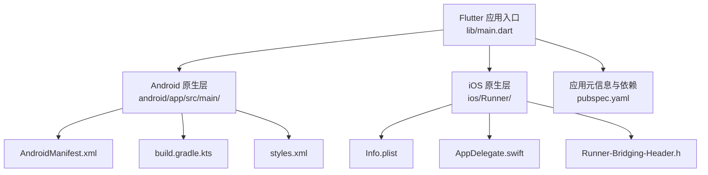
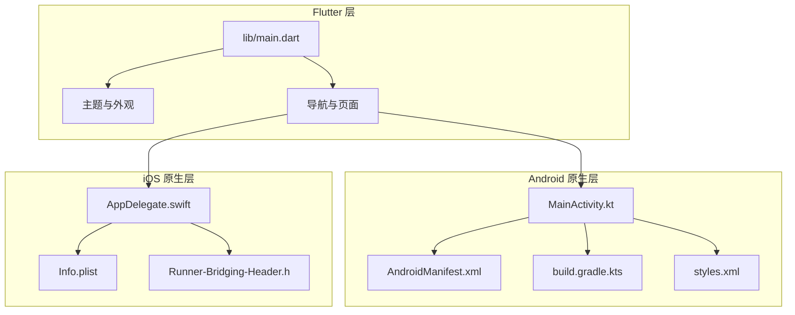
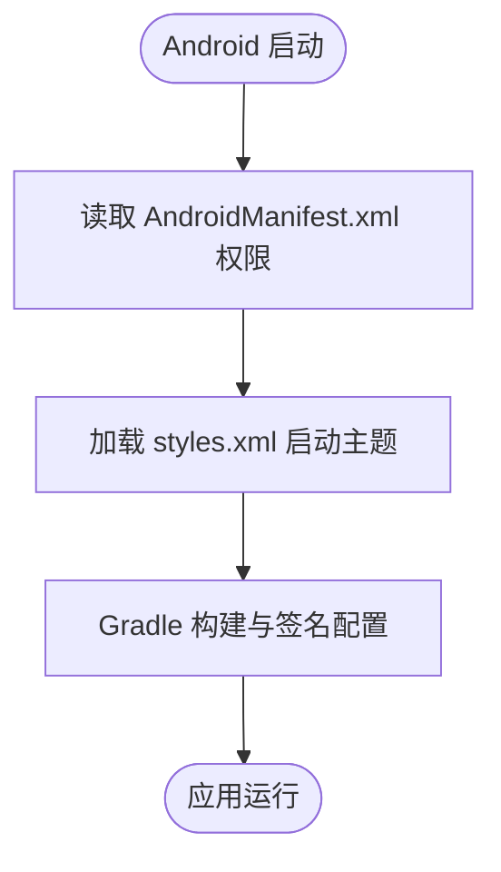
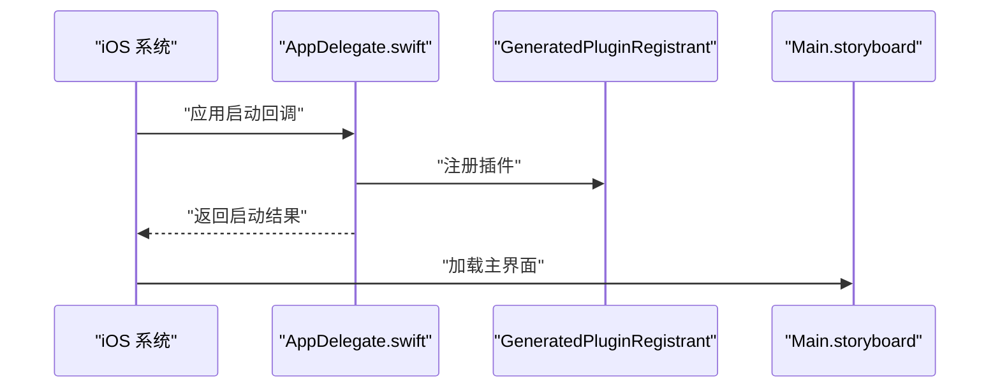
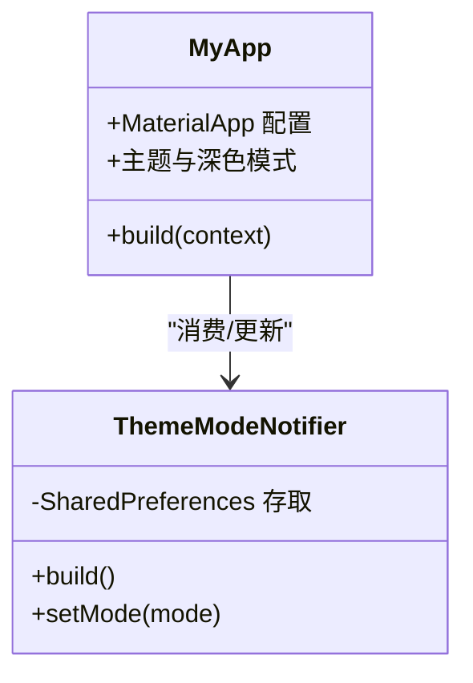
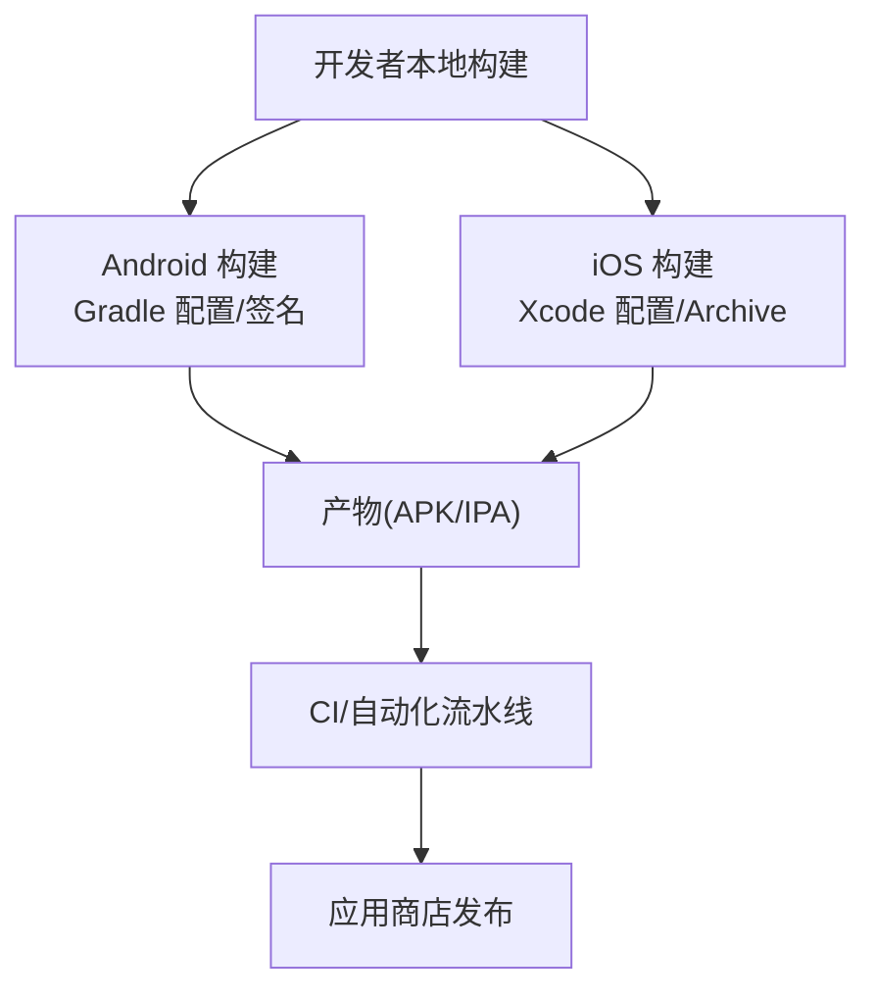
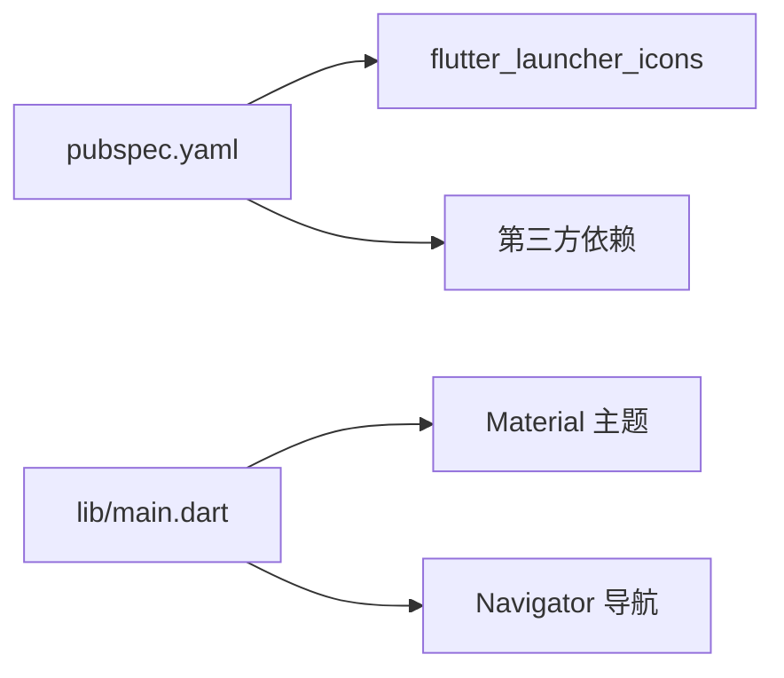

# 平台适配

<cite>
**本文引用的文件**
- [pubspec.yaml](file://tan_rss_mobile/pubspec.yaml)
- [main.dart](file://tan_rss_mobile/lib/main.dart)
- [styles.xml](file://tan_rss_mobile/android/app/src/main/res/values/styles.xml)
- [AndroidManifest.xml](file://tan_rss_mobile/android/app/src/main/AndroidManifest.xml)
- [build.gradle.kts](file://tan_rss_mobile/android/app/build.gradle.kts)
- [gradle.properties](file://tan_rss_mobile/android/gradle.properties)
- [Info.plist](file://tan_rss_mobile/ios/Runner/Info.plist)
- [AppDelegate.swift](file://tan_rss_mobile/ios/Runner/AppDelegate.swift)
- [Runner-Bridging-Header.h](file://tan_rss_mobile/ios/Runner/Runner-Bridging-Header.h)
- [MainActivity.kt](file://tan_rss_mobile/android/app/src/main/kotlin/com/chronoai/tanrss/tan_rss_mobile/MainActivity.kt)
- [flutter_ci.yml](file://.github/workflows/flutter_ci.yml)
- [build_apk.sh](file://build_apk.sh)
</cite>

## 目录
1. [简介](#简介)
2. [项目结构](#项目结构)
3. [核心组件](#核心组件)
4. [架构总览](#架构总览)
5. [详细组件分析](#详细组件分析)
6. [依赖关系分析](#依赖关系分析)
7. [性能考量](#性能考量)
8. [故障排查指南](#故障排查指南)
9. [结论](#结论)
10. [附录](#附录)

## 简介
本文件面向 Tan RSS Reader 移动端（Flutter）在 Android 与 iOS 平台的适配与发布，聚焦以下主题：
- 差异化处理策略：Android 与 iOS 在权限、清单配置、启动主题、构建与签名上的差异
- 原生功能集成：相机访问、文件系统、推送通知、生物识别（通过插件与平台通道实现）
- 平台 UI 规范：Material Design 应用与 iOS 风格元素的融合
- 构建配置、签名设置与应用商店发布流程
- 跨平台数据同步、权限管理与用户体验一致性保障
- 最佳实践、兼容性测试与性能优化建议

## 项目结构
移动端工程位于 tan_rss_mobile，采用 Flutter 多平台统一代码，平台差异通过 Android/iOS 原生层与资源/清单文件体现。

图表来源
- [main.dart:1-153](file://tan_rss_mobile/lib/main.dart#L1-L153)
- [AndroidManifest.xml:1-50](file://tan_rss_mobile/android/app/src/main/AndroidManifest.xml#L1-L50)
- [build.gradle.kts:1-45](file://tan_rss_mobile/android/app/build.gradle.kts#L1-L45)
- [styles.xml:1-19](file://tan_rss_mobile/android/app/src/main/res/values/styles.xml#L1-L19)
- [Info.plist:1-71](file://tan_rss_mobile/ios/Runner/Info.plist#L1-L71)
- [AppDelegate.swift:1-17](file://tan_rss_mobile/ios/Runner/AppDelegate.swift#L1-L17)
- [Runner-Bridging-Header.h:1-2](file://tan_rss_mobile/ios/Runner/Runner-Bridging-Header.h#L1-L2)
- [pubspec.yaml:1-112](file://tan_rss_mobile/pubspec.yaml#L1-L112)

章节来源
- [pubspec.yaml:1-112](file://tan_rss_mobile/pubspec.yaml#L1-L112)
- [main.dart:1-153](file://tan_rss_mobile/lib/main.dart#L1-L153)

## 核心组件
- 主题与外观：基于 Riverpod 的主题模式与动态色方案，支持浅色/深色/跟随系统，并可选 OLED 黑暗模式。
- 启动与导航：MaterialApp 包裹，根据认证状态决定首页；使用 Navigator 进行页面跳转。
- 权限与网络：Android 清单声明网络权限；iOS Info.plist 定义场景与方向等系统级能力。
- 构建与打包：Gradle 配置 Android 打包参数；CI/脚本辅助构建 APK。

章节来源
- [main.dart:11-38](file://tan_rss_mobile/lib/main.dart#L11-L38)
- [main.dart:124-152](file://tan_rss_mobile/lib/main.dart#L124-L152)
- [AndroidManifest.xml:2-3](file://tan_rss_mobile/android/app/src/main/AndroidManifest.xml#L2-L3)
- [Info.plist:27-68](file://tan_rss_mobile/ios/Runner/Info.plist#L27-L68)

## 架构总览
Flutter 应用通过原生桥接访问平台能力，同时共享业务逻辑与 UI 组件。

图表来源
- [main.dart:1-153](file://tan_rss_mobile/lib/main.dart#L1-L153)
- [MainActivity.kt:1-6](file://tan_rss_mobile/android/app/src/main/kotlin/com/chronoai/tanrss/tan_rss_mobile/MainActivity.kt#L1-L6)
- [AndroidManifest.xml:1-50](file://tan_rss_mobile/android/app/src/main/AndroidManifest.xml#L1-L50)
- [build.gradle.kts:1-45](file://tan_rss_mobile/android/app/build.gradle.kts#L1-L45)
- [styles.xml:1-19](file://tan_rss_mobile/android/app/src/main/res/values/styles.xml#L1-L19)
- [AppDelegate.swift:1-17](file://tan_rss_mobile/ios/Runner/AppDelegate.swift#L1-L17)
- [Info.plist:1-71](file://tan_rss_mobile/ios/Runner/Info.plist#L1-L71)
- [Runner-Bridging-Header.h:1-2](file://tan_rss_mobile/ios/Runner/Runner-Bridging-Header.h#L1-L2)

## 详细组件分析

### Android 平台适配
- 权限与网络
  - 清单中声明网络与网络状态权限，满足 RSS 拉取与在线功能。
  - 支持明文流量（用于开发或特定后端），生产环境建议关闭。
- 启动主题与窗口
  - 使用轻量启动主题与 NormalTheme，确保首帧渲染与过渡体验一致。
- 构建与签名
  - Gradle 配置 compile/target/min SDK、JVM 版本与 NDK。
  - release 类型默认使用 debug 签名配置以便调试运行；生产需替换为正式签名。
- 构建参数
  - gradle.properties 开启 AndroidX，提升兼容性。

图表来源
- [AndroidManifest.xml:1-50](file://tan_rss_mobile/android/app/src/main/AndroidManifest.xml#L1-L50)
- [styles.xml:1-19](file://tan_rss_mobile/android/app/src/main/res/values/styles.xml#L1-L19)
- [build.gradle.kts:8-40](file://tan_rss_mobile/android/app/build.gradle.kts#L8-L40)
- [gradle.properties:1-3](file://tan_rss_mobile/android/gradle.properties#L1-L3)

章节来源
- [AndroidManifest.xml:2-3](file://tan_rss_mobile/android/app/src/main/AndroidManifest.xml#L2-L3)
- [styles.xml:3-17](file://tan_rss_mobile/android/app/src/main/res/values/styles.xml#L3-L17)
- [build.gradle.kts:22-39](file://tan_rss_mobile/android/app/build.gradle.kts#L22-L39)
- [gradle.properties:2](file://tan_rss_mobile/android/gradle.properties#L2)

### iOS 平台适配
- 应用场景与方向
  - Info.plist 定义场景、多窗口支持、主界面 Storyboard、支持的方向集合。
- 启动与生命周期
  - AppDelegate.swift 重写应用启动回调，注册插件以启用平台通道。
- 桥接头文件
  - Runner-Bridging-Header.h 引入 GeneratedPluginRegistrant，确保插件可用。

图表来源
- [AppDelegate.swift:6-15](file://tan_rss_mobile/ios/Runner/AppDelegate.swift#L6-L15)
- [Runner-Bridging-Header.h:1-2](file://tan_rss_mobile/ios/Runner/Runner-Bridging-Header.h#L1-L2)
- [Info.plist:29-49](file://tan_rss_mobile/ios/Runner/Info.plist#L29-L49)

章节来源
- [Info.plist:27-68](file://tan_rss_mobile/ios/Runner/Info.plist#L27-L68)
- [AppDelegate.swift:5-16](file://tan_rss_mobile/ios/Runner/AppDelegate.swift#L5-L16)
- [Runner-Bridging-Header.h:1](file://tan_rss_mobile/ios/Runner/Runner-Bridging-Header.h#L1)

### 主题与 UI 设计
- Material Design 应用
  - pubspec.yaml 启用 Material Icons 字体，统一图标体系。
- 动态色彩与深色模式
  - main.dart 中通过 ColorScheme.fromSeed 生成动态色系，支持浅色/深色/AMOLED 黑暗模式。
- 导航与页面
  - 使用 Navigator 推入新页面，保持一致的路由行为。

图表来源
- [main.dart:57-152](file://tan_rss_mobile/lib/main.dart#L57-L152)
- [main.dart:11-38](file://tan_rss_mobile/lib/main.dart#L11-L38)
- [pubspec.yaml:76-81](file://tan_rss_mobile/pubspec.yaml#L76-L81)

章节来源
- [pubspec.yaml:76-81](file://tan_rss_mobile/pubspec.yaml#L76-L81)
- [main.dart:98-122](file://tan_rss_mobile/lib/main.dart#L98-L122)
- [main.dart:124-152](file://tan_rss_mobile/lib/main.dart#L124-L152)

### 原生功能集成（相机、文件系统、推送、生物识别）
说明：当前仓库未直接包含相机、文件选择、推送与生物识别的具体实现代码。以下为基于依赖与平台通道的通用适配策略与最佳实践，便于在现有工程中扩展。

- 相机访问
  - Android：在 AndroidManifest.xml 声明相机权限；在页面请求运行时权限；通过平台通道调用相机插件。
  - iOS：在 Info.plist 添加相机使用说明与隐私权限键；同上通过插件与通道实现。
- 文件系统与文件选择
  - 使用 file_picker 插件进行跨平台文件选择；注意处理权限与路径差异。
- 推送通知
  - 使用推送插件（如 firebase_messaging 或类似）；分别在 Android（AndroidManifest.xml、服务类）与 iOS（Info.plist、AppDelegate.swift）配置必要项。
- 生物识别
  - 使用生物识别插件（如 local_auth），在 Android/iOS 分别配置权限与提示文案；通过平台通道调用指纹/面容识别。

[本节为概念性说明，不直接分析具体源码文件]

### 构建配置、签名与发布流程
- Android
  - Gradle 配置：compileSdk/targetSdk/minSdk、Java/Kotlin 版本、NDK 版本、签名配置。
  - 当前 release 使用 debug 签名以便调试；生产需替换为正式签名。
  - 可配合 CI 或脚本自动化构建。
- iOS
  - Xcode 工程配置：Bundle ID、版本号、目标设备、场景配置等。
  - 通过 Xcode Archive 与应用提交器导出 IPA 并上传至 App Store Connect。
- CI/自动化
  - .github/workflows/flutter_ci.yml 可作为 CI 流程参考，结合构建脚本与签名密钥进行自动化构建与分发。

图表来源
- [build.gradle.kts:22-39](file://tan_rss_mobile/android/app/build.gradle.kts#L22-L39)
- [gradle.properties:2](file://tan_rss_mobile/android/gradle.properties#L2)
- [flutter_ci.yml](file://.github/workflows/flutter_ci.yml)
- [build_apk.sh](file://build_apk.sh)

章节来源
- [build.gradle.kts:33-39](file://tan_rss_mobile/android/app/build.gradle.kts#L33-L39)
- [gradle.properties:2](file://tan_rss_mobile/android/gradle.properties#L2)
- [flutter_ci.yml](file://.github/workflows/flutter_ci.yml)
- [build_apk.sh](file://build_apk.sh)

### 数据同步、权限管理与一致性
- 数据同步
  - 通过 API 客户端集中管理后端接口；登录态失效时统一触发登出与重定向。
- 权限管理
  - Android/iOS 分别在清单与 Info.plist 中声明所需权限；运行时请求敏感权限。
- 用户体验一致性
  - Material 主题与动态色系统一视觉语言；导航与页面跳转使用 Navigator 保持交互一致。

章节来源
- [main.dart:68-72](file://tan_rss_mobile/lib/main.dart#L68-L72)
- [AndroidManifest.xml:2-3](file://tan_rss_mobile/android/app/src/main/AndroidManifest.xml#L2-L3)
- [Info.plist:27-68](file://tan_rss_mobile/ios/Runner/Info.plist#L27-L68)

## 依赖关系分析
- 依赖声明与图标生成
  - pubspec.yaml 声明 Flutter、第三方依赖与图标生成工具；flutter_launcher_icons 同时为 Android/iOS 生成图标。
- Flutter 渲染与主题
  - uses-material-design: true 启用 Material 图标字体；main.dart 中定义主题与深色模式。

图表来源
- [pubspec.yaml:30-71](file://tan_rss_mobile/pubspec.yaml#L30-L71)
- [pubspec.yaml:76-81](file://tan_rss_mobile/pubspec.yaml#L76-L81)
- [main.dart:124-152](file://tan_rss_mobile/lib/main.dart#L124-L152)

章节来源
- [pubspec.yaml:30-71](file://tan_rss_mobile/pubspec.yaml#L30-L71)
- [pubspec.yaml:76-81](file://tan_rss_mobile/pubspec.yaml#L76-L81)
- [main.dart:124-152](file://tan_rss_mobile/lib/main.dart#L124-L152)

## 性能考量
- 启动与渲染
  - Android 启动主题与 NormalTheme 减少首屏白屏时间；避免在首帧前执行重任务。
- 构建参数
  - Gradle JVM 参数与 AndroidX 开关影响编译与运行时性能；按需调整。
- UI 与导航
  - 使用稳定的主题与颜色方案，减少重建开销；合理使用 Navigator 与页面缓存。

章节来源
- [styles.xml:3-17](file://tan_rss_mobile/android/app/src/main/res/values/styles.xml#L3-L17)
- [gradle.properties:1-3](file://tan_rss_mobile/android/gradle.properties#L1-L3)

## 故障排查指南
- Android
  - 网络权限缺失导致无法拉取 RSS：检查 AndroidManifest.xml 权限声明。
  - 启动黑屏或主题异常：检查 styles.xml 与启动主题资源。
  - 构建失败：核对 Gradle 配置、Java/Kotlin 版本与 NDK 版本。
- iOS
  - 应用启动无响应：检查 Info.plist 场景配置与 AppDelegate 注册。
  - 插件不可用：确认 Runner-Bridging-Header.h 引入 GeneratedPluginRegistrant。
- 通用
  - 登录态失效：关注 main.dart 中的未授权回调与自动登出逻辑。

章节来源
- [AndroidManifest.xml:2-3](file://tan_rss_mobile/android/app/src/main/AndroidManifest.xml#L2-L3)
- [styles.xml:3-17](file://tan_rss_mobile/android/app/src/main/res/values/styles.xml#L3-L17)
- [build.gradle.kts:13-20](file://tan_rss_mobile/android/app/build.gradle.kts#L13-L20)
- [Info.plist:29-49](file://tan_rss_mobile/ios/Runner/Info.plist#L29-L49)
- [AppDelegate.swift:13-15](file://tan_rss_mobile/ios/Runner/AppDelegate.swift#L13-L15)
- [Runner-Bridging-Header.h:1](file://tan_rss_mobile/ios/Runner/Runner-Bridging-Header.h#L1)
- [main.dart:68-72](file://tan_rss_mobile/lib/main.dart#L68-L72)

## 结论
本项目在 Flutter 统一代码基础上，通过 Android 与 iOS 原生层与资源/清单文件实现了平台差异化适配。Android 侧重权限与构建签名，iOS 侧重场景与生命周期配置。主题与导航在两端保持一致体验。后续可在现有依赖与通道机制上扩展相机、文件系统、推送与生物识别等原生能力，并完善 CI/签名与发布流程以支撑稳定交付。

## 附录
- 关键入口与配置
  - Flutter 入口与主题：[main.dart:1-153](file://tan_rss_mobile/lib/main.dart#L1-L153)
  - Android 清单与样式：[AndroidManifest.xml:1-50](file://tan_rss_mobile/android/app/src/main/AndroidManifest.xml#L1-L50)、[styles.xml:1-19](file://tan_rss_mobile/android/app/src/main/res/values/styles.xml#L1-L19)
  - Android 构建与签名：[build.gradle.kts:1-45](file://tan_rss_mobile/android/app/build.gradle.kts#L1-L45)、[gradle.properties:1-3](file://tan_rss_mobile/android/gradle.properties#L1-L3)
  - iOS 配置与桥接：[Info.plist:1-71](file://tan_rss_mobile/ios/Runner/Info.plist#L1-L71)、[AppDelegate.swift:1-17](file://tan_rss_mobile/ios/Runner/AppDelegate.swift#L1-L17)、[Runner-Bridging-Header.h:1-2](file://tan_rss_mobile/ios/Runner/Runner-Bridging-Header.h#L1-L2)
  - 依赖与图标：[pubspec.yaml:1-112](file://tan_rss_mobile/pubspec.yaml#L1-L112)
  - CI/脚本：[flutter_ci.yml](file://.github/workflows/flutter_ci.yml)、[build_apk.sh](file://build_apk.sh)