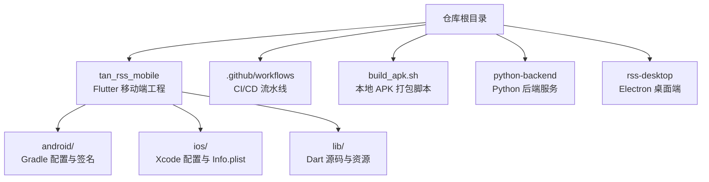
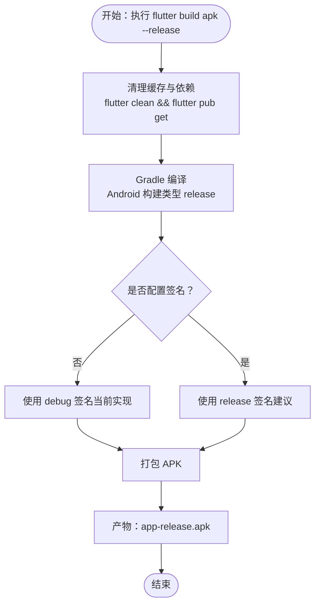
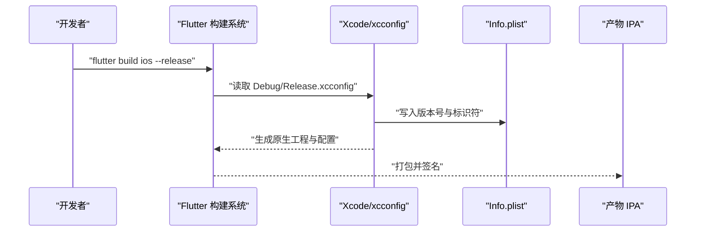
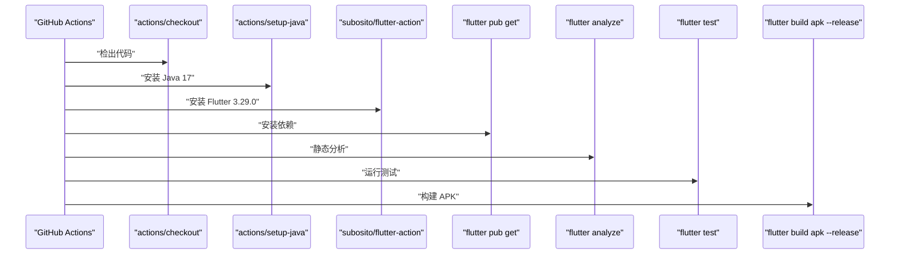
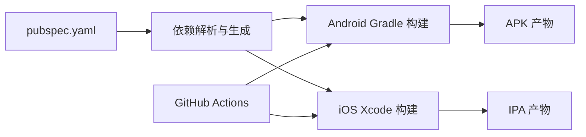

# 构建与部署

<cite>
**本文引用的文件**
- [pubspec.yaml](file://tan_rss_mobile/pubspec.yaml)
- [flutter_ci.yml](file://.github/workflows/flutter_ci.yml)
- [build_apk.sh](file://build_apk.sh)
- [build.gradle.kts（app）](file://tan_rss_mobile/android/app/build.gradle.kts)
- [build.gradle.kts（根工程）](file://tan_rss_mobile/android/build.gradle.kts)
- [gradle.properties](file://tan_rss_mobile/android/gradle.properties)
- [local.properties](file://tan_rss_mobile/android/local.properties)
- [Info.plist（iOS）](file://tan_rss_mobile/ios/Runner/Info.plist)
- [Debug.xcconfig（iOS）](file://tan_rss_mobile/ios/Flutter/Debug.xcconfig)
- [Release.xcconfig（iOS）](file://tan_rss_mobile/ios/Flutter/Release.xcconfig)
- [DebugProfile.entitlements（macOS）](file://tan_rss_mobile/macos/Runner/DebugProfile.entitlements)
- [Release.entitlements（macOS）](file://tan_rss_mobile/macos/Runner/Release.entitlements)
- [analysis_options.yaml](file://tan_rss_mobile/analysis_options.yaml)
</cite>

## 目录
1. [简介](#简介)
2. [项目结构](#项目结构)
3. [核心组件](#核心组件)
4. [架构总览](#架构总览)
5. [详细组件分析](#详细组件分析)
6. [依赖关系分析](#依赖关系分析)
7. [性能考量](#性能考量)
8. [故障排查指南](#故障排查指南)
9. [结论](#结论)
10. [附录](#附录)

## 简介
本文件面向 Tan RSS Reader 的 Flutter 移动端（Android/iOS）构建与部署，系统性梳理从本地开发到 CI/CD 自动化、从 Debug 到 Release 的差异、代码混淆与资源优化、APK/AAB 打包、应用签名与证书管理、商店发布准备、性能与稳定性保障，以及多渠道与版本管理策略。文档同时提供可操作的步骤指引与可视化图示，帮助开发者快速落地。

## 项目结构
Tan RSS Reader 采用多平台仓库组织方式：Flutter 移动端位于 tan_rss_mobile，iOS 与 Android 工程由 Flutter 生成并托管于各自平台目录；CI/CD 使用 GitHub Actions；另有独立的 Python 后端与桌面端 Electron 项目。

- 关键目录与职责
  - tan_rss_mobile：Flutter 移动端工程，包含 Android/iOS 平台构建配置、资源与入口代码
  - .github/workflows：CI/CD 流水线定义
  - build_apk.sh：本地一键构建 APK 的 Bash 脚本
  - python-backend：Python 后端服务（Celery、FastAPI 等）
  - rss-desktop：Electron 桌面端（非本文重点）



**章节来源**
- [pubspec.yaml:1-112](file://tan_rss_mobile/pubspec.yaml#L1-L112)
- [.github/workflows/flutter_ci.yml:1-43](file://.github/workflows/flutter_ci.yml#L1-L43)
- [build_apk.sh:1-71](file://build_apk.sh#L1-L71)

## 核心组件
- Flutter 工程配置与版本管理
  - 版本号与构建号：通过 pubspec.yaml 的 version 字段统一管理，Android/iOS 对应 versionName/versionCode/CFBundleShortVersionString/CFBundleVersion
  - 依赖与图标：flutter_launcher_icons 自动生成平台图标，assets 中声明图标资源
- Android 构建配置
  - Gradle 插件与编译选项：compileSdk/targetSdk/minSdk、Java/Kotlin 版本、构建类型与签名配置
  - 全局构建目录与清理任务：统一 build 目录位置，便于缓存与清理
- iOS 构建配置
  - Info.plist 版本字段绑定 FLUTTER_BUILD_NAME/FLUTTER_BUILD_NUMBER
  - Debug/Release xcconfig 包含 Generated.xcconfig，确保 Flutter 生成配置生效
- macOS 权限配置
  - DebugProfile.entitlements 与 Release.entitlements 分别启用沙箱与网络权限
- CI/CD 与本地脚本
  - GitHub Actions：安装 Java/Flutter、依赖安装、静态分析、单元测试、APK 构建
  - 本地脚本：清理缓存、依赖安装、Release 构建、产物复制与重命名

**章节来源**
- [pubspec.yaml:19-112](file://tan_rss_mobile/pubspec.yaml#L19-L112)
- [build.gradle.kts（app）:1-45](file://tan_rss_mobile/android/app/build.gradle.kts#L1-L45)
- [build.gradle.kts（根工程）:1-25](file://tan_rss_mobile/android/build.gradle.kts#L1-L25)
- [gradle.properties:1-3](file://tan_rss_mobile/android/gradle.properties#L1-L3)
- [local.properties:1-5](file://tan_rss_mobile/android/local.properties#L1-L5)
- [Info.plist（iOS）:1-71](file://tan_rss_mobile/ios/Runner/Info.plist#L1-L71)
- [Debug.xcconfig（iOS）:1-2](file://tan_rss_mobile/ios/Flutter/Debug.xcconfig#L1-L2)
- [Release.xcconfig（iOS）:1-2](file://tan_rss_mobile/ios/Flutter/Release.xcconfig#L1-L2)
- [DebugProfile.entitlements（macOS）:1-13](file://tan_rss_mobile/macos/Runner/DebugProfile.entitlements#L1-L13)
- [Release.entitlements（macOS）:1-9](file://tan_rss_mobile/macos/Runner/Release.entitlements#L1-L9)
- [flutter_ci.yml:1-43](file://.github/workflows/flutter_ci.yml#L1-L43)
- [build_apk.sh:1-71](file://build_apk.sh#L1-L71)

## 架构总览
下图展示从源码到产物的关键路径：Flutter 工程经 Gradle（Android）或 Xcode（iOS）生成原生二进制，再打包为 APK/AAB 或 IPA，并通过 CI/CD 完成自动化测试与发布。

```mermaid
graph TB
Dev["开发者"] --> Lint["静态分析<br/>flutter analyze"]
Dev --> Test["单元测试<br/>flutter test"]
Dev --> BuildA["构建 APK<br/>flutter build apk --release"]
Dev --> BuildI["构建 IPA<br/>xcodebuild archive/sign"]
CI["GitHub Actions"] --> Lint
CI --> Test
CI --> BuildA
CI --> Artifacts["制品归档"]
BuildA --> APK["app-release.apk"]
BuildI --> IPA["App.ipa"]
Store["应用商店/分发平台"] <- --> APK
Store <- --> IPA
```

**图表来源**
- [flutter_ci.yml:32-42](file://.github/workflows/flutter_ci.yml#L32-L42)
- [build_apk.sh:38-48](file://build_apk.sh#L38-L48)

## 详细组件分析

### Flutter 工程与版本管理
- 版本与构建号
  - version 字段决定 Android 的 versionName 与 iOS 的 CFBundleShortVersionString；构建号对应 versionCode/CFBundleVersion
  - Android/iOS 构建配置均通过 Flutter 导入的变量进行映射
- 图标与资源
  - 通过 flutter_launcher_icons 自动生成平台图标，并在 flutter 配置中声明资源路径
- 分析与规范
  - analysis_options.yaml 引入 Flutter 推荐规则，保证代码质量

**章节来源**
- [pubspec.yaml:19-112](file://tan_rss_mobile/pubspec.yaml#L19-L112)
- [analysis_options.yaml:8-29](file://tan_rss_mobile/analysis_options.yaml#L8-L29)

### Android 构建流程与签名配置
- Gradle 插件与编译目标
  - 应用插件、Kotlin 插件与 Flutter Gradle 插件顺序严格遵循 Flutter 文档要求
  - compileSdk/targetSdk/minSdk 与 Java/Kotlin 版本在 Gradle 层统一设置
- 构建类型与签名
  - 当前 release 构建使用 debug 签名配置以满足调试需求；生产发布需替换为正式签名配置
- 构建目录与清理
  - 根工程统一指定 build 目录，子工程继承，便于缓存与清理



**图表来源**
- [build_apk.sh:34-48](file://build_apk.sh#L34-L48)
- [build.gradle.kts（app）:33-39](file://tan_rss_mobile/android/app/build.gradle.kts#L33-L39)

**章节来源**
- [build.gradle.kts（app）:1-45](file://tan_rss_mobile/android/app/build.gradle.kts#L1-L45)
- [build.gradle.kts（根工程）:8-24](file://tan_rss_mobile/android/build.gradle.kts#L8-L24)
- [gradle.properties:1-3](file://tan_rss_mobile/android/gradle.properties#L1-L3)
- [local.properties:1-5](file://tan_rss_mobile/android/local.properties#L1-L5)

### iOS 构建流程与元数据
- 版本字段绑定
  - Info.plist 中的 CFBundleShortVersionString/CFBundleVersion 绑定 FLUTTER_BUILD_NAME/FLUTTER_BUILD_NUMBER
- 构建配置
  - Debug/Release xcconfig 均包含 Generated.xcconfig，确保 Flutter 生成的配置生效
- Entitlements
  - macOS 的 DebugProfile.entitlements 与 Release.entitlements 控制沙箱与网络能力



**图表来源**
- [Info.plist（iOS）:21-26](file://tan_rss_mobile/ios/Runner/Info.plist#L21-L26)
- [Debug.xcconfig（iOS）:1-2](file://tan_rss_mobile/ios/Flutter/Debug.xcconfig#L1-L2)
- [Release.xcconfig（iOS）:1-2](file://tan_rss_mobile/ios/Flutter/Release.xcconfig#L1-L2)

**章节来源**
- [Info.plist（iOS）:1-71](file://tan_rss_mobile/ios/Runner/Info.plist#L1-L71)
- [DebugProfile.entitlements（macOS）:1-13](file://tan_rss_mobile/macos/Runner/DebugProfile.entitlements#L1-L13)
- [Release.entitlements（macOS）:1-9](file://tan_rss_mobile/macos/Runner/Release.entitlements#L1-L9)

### CI/CD 流水线（GitHub Actions）
- 触发条件：push/pull_request 到 main 分支
- 步骤概览：设置 Java/Flutter、安装依赖、静态分析、单元测试、构建 APK
- 产物：APK 在流水线中可作为工件归档，供后续分发或发布



**图表来源**
- [.github/workflows/flutter_ci.yml:13-42](file://.github/workflows/flutter_ci.yml#L13-L42)

**章节来源**
- [.github/workflows/flutter_ci.yml:1-43](file://.github/workflows/flutter_ci.yml#L1-L43)

### 本地一键打包脚本
- 功能：清理缓存、安装依赖、构建 Release APK、复制并重命名产物到 release 目录
- 产物命名：包含版本号与时间戳，便于追溯与分发
- 错误处理：对构建失败与产物缺失进行提示与退出

**章节来源**
- [build_apk.sh:1-71](file://build_apk.sh#L1-L71)

## 依赖关系分析
- Flutter 工程依赖
  - 通过 pubspec.yaml 管理依赖与版本，analysis_options.yaml 约束编码规范
- Android 依赖
  - Google/Maven 仓库、Gradle 插件链、Java/Kotlin 编译目标
- iOS 依赖
  - Xcode 工程、xcconfig、Info.plist、Entitlements
- CI/CD 依赖
  - GitHub Actions、Java/Flutter 环境、Flutter 工程工作目录



**图表来源**
- [pubspec.yaml:30-64](file://tan_rss_mobile/pubspec.yaml#L30-L64)
- [build.gradle.kts（app）:1-6](file://tan_rss_mobile/android/app/build.gradle.kts#L1-L6)
- [flutter_ci.yml:28-42](file://.github/workflows/flutter_ci.yml#L28-L42)

**章节来源**
- [pubspec.yaml:30-112](file://tan_rss_mobile/pubspec.yaml#L30-L112)
- [build.gradle.kts（app）:1-45](file://tan_rss_mobile/android/app/build.gradle.kts#L1-L45)
- [flutter_ci.yml:28-42](file://.github/workflows/flutter_ci.yml#L28-L42)

## 性能考量
- 构建性能
  - Gradle JVM 参数与缓存：通过 gradle.properties 设置堆与元空间大小，提升大工程编译稳定性
  - 构建目录统一：根工程集中管理 build 目录，减少重复构建与缓存碎片
- 代码质量与分析
  - 使用 analysis_options.yaml 启用推荐规则，降低潜在性能与安全风险
- 发布前质量门禁
  - CI 中包含静态分析与测试，建议在本地同样执行，确保问题尽早暴露

**章节来源**
- [gradle.properties:1-3](file://tan_rss_mobile/android/gradle.properties#L1-L3)
- [build.gradle.kts（根工程）:8-24](file://tan_rss_mobile/android/build.gradle.kts#L8-L24)
- [analysis_options.yaml:8-29](file://tan_rss_mobile/analysis_options.yaml#L8-L29)
- [flutter_ci.yml:32-38](file://.github/workflows/flutter_ci.yml#L32-L38)

## 故障排查指南
- 构建失败
  - 检查 Gradle 插件顺序与 Java/Kotlin 版本是否匹配
  - 确认签名配置是否正确（当前 release 使用 debug 签名，生产需替换）
- 产物缺失
  - 确认构建命令与工作目录正确，产物路径与脚本预期一致
- CI 失败
  - 查看 Actions 日志中的依赖安装、分析与测试阶段输出，定位具体失败步骤
- 版本不一致
  - 核对 pubspec.yaml 与 iOS Info.plist 的版本字段绑定关系

**章节来源**
- [build.gradle.kts（app）:33-39](file://tan_rss_mobile/android/app/build.gradle.kts#L33-L39)
- [build_apk.sh:43-48](file://build_apk.sh#L43-L48)
- [flutter_ci.yml:13-42](file://.github/workflows/flutter_ci.yml#L13-L42)
- [Info.plist（iOS）:21-26](file://tan_rss_mobile/ios/Runner/Info.plist#L21-L26)

## 结论
本文件基于现有仓库配置，系统梳理了 Tan RSS Reader 的 Flutter 构建与部署要点。当前仓库已具备完整的 CI/CD 流水线与本地打包脚本，Android 与 iOS 的版本与资源配置清晰。建议在生产发布前完善签名配置、引入代码混淆与资源压缩，并建立完善的商店发布与监控体系，以进一步提升安全性与可维护性。

## 附录

### Debug 与 Release 版本区别
- 构建类型
  - Debug：默认开启调试符号与未优化，便于本地调试
  - Release：默认启用优化与压缩，适合分发与发布
- 签名与权限
  - Debug：使用调试密钥与沙箱权限
  - Release：使用正式签名与最小权限原则

**章节来源**
- [build.gradle.kts（app）:33-39](file://tan_rss_mobile/android/app/build.gradle.kts#L33-L39)
- [DebugProfile.entitlements（macOS）:1-13](file://tan_rss_mobile/macos/Runner/DebugProfile.entitlements#L1-L13)
- [Release.entitlements（macOS）:1-9](file://tan_rss_mobile/macos/Runner/Release.entitlements#L1-L9)

### 代码混淆、资源压缩与 APK/AAB 打包
- 代码混淆
  - Android：建议在 Gradle 中启用 R8 混淆与压缩，配合 proguard 规则
  - iOS：建议启用 Bitcode 与 strip 符号，减少二进制体积
- 资源压缩
  - PNG/WebP 压缩、WebP 替代 JPEG、移除冗余资源
- 打包
  - APK：适用于 Android 分发与侧载
  - AAB：适用于 Google Play 等平台，由平台进行二次优化与按需下发

**章节来源**
- [build.gradle.kts（app）:13-20](file://tan_rss_mobile/android/app/build.gradle.kts#L13-L20)

### 应用签名配置与证书管理
- Android
  - 在 release 构建类型中配置正式签名，避免使用 debug 签名
  - 将密钥库与密码纳入受控环境变量，避免提交到仓库
- iOS
  - 使用 Apple Developer 账户生成 Distribution 证书与 Provisioning Profile
  - 在 CI 中通过环境变量注入证书与描述文件

**章节来源**
- [build.gradle.kts（app）:33-39](file://tan_rss_mobile/android/app/build.gradle.kts#L33-L39)

### CI/CD 集成、自动化测试与持续部署
- 触发与步骤
  - 基于 GitHub Actions 的稳定通道，包含依赖安装、分析、测试与构建
- 持续部署
  - 建议在构建成功后上传工件，结合发布分支策略与商店 API 实现自动化上架

**章节来源**
- [.github/workflows/flutter_ci.yml:1-43](file://.github/workflows/flutter_ci.yml#L1-L43)

### 应用商店发布准备、元数据配置与审核注意事项
- 元数据
  - 应用名称、截图、关键词、隐私政策链接等在商店后台配置
- 审核注意事项
  - 遵循平台指南，避免敏感权限滥用与不合规内容
  - 确保版本号与变更日志清晰

**章节来源**
- [Info.plist（iOS）:9-18](file://tan_rss_mobile/ios/Runner/Info.plist#L9-L18)

### 性能分析、内存泄漏检测与崩溃日志收集
- 性能分析
  - 使用 Flutter DevTools、Android Studio Profiler、Instruments
- 内存泄漏检测
  - 使用 Heap 分析与弱引用监控，定期回归测试
- 崩溃日志
  - 集成崩溃上报 SDK（如 Firebase Crashlytics），收集堆栈与设备信息

**章节来源**
- [analysis_options.yaml:8-29](file://tan_rss_mobile/analysis_options.yaml#L8-L29)

### 多渠道打包、版本管理与热更新策略
- 多渠道
  - 通过 Gradle flavor 或 Xcode scheme 区分渠道包，统一版本号与构建号
- 版本管理
  - 采用语义化版本，主版本号用于重大变更，次版本号用于功能新增，修订号用于修复
- 热更新
  - 建议采用可控的热更新方案（如 CodePush/自研方案），并制定回滚策略

**章节来源**
- [pubspec.yaml:19-19](file://tan_rss_mobile/pubspec.yaml#L19-L19)