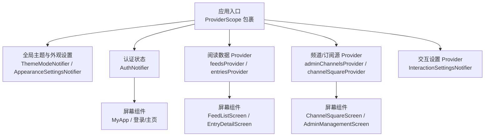
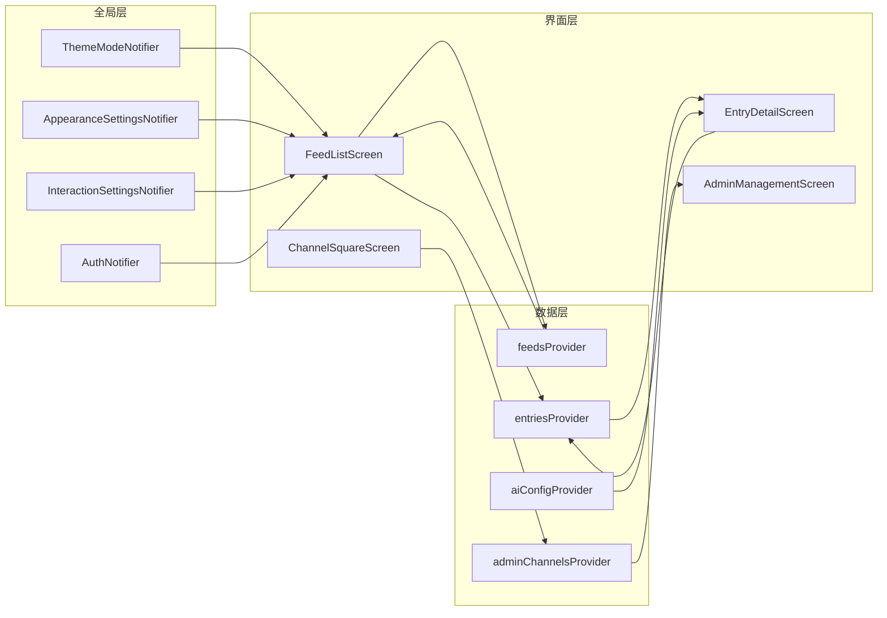
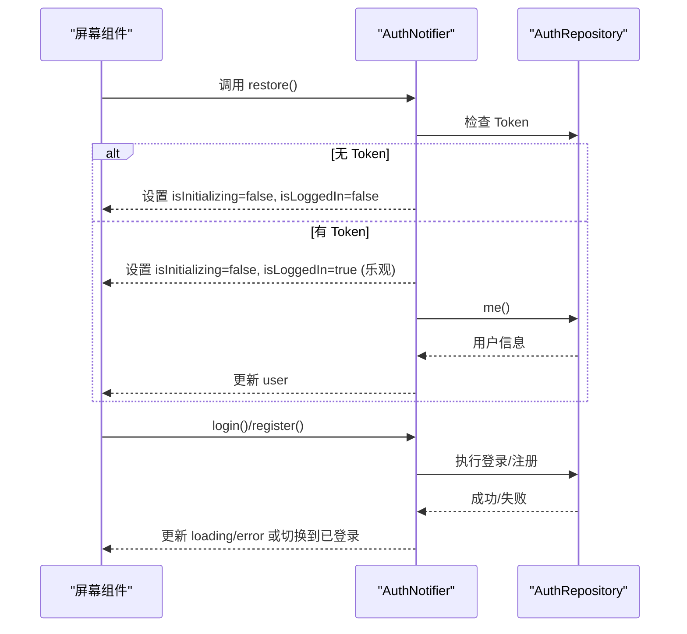
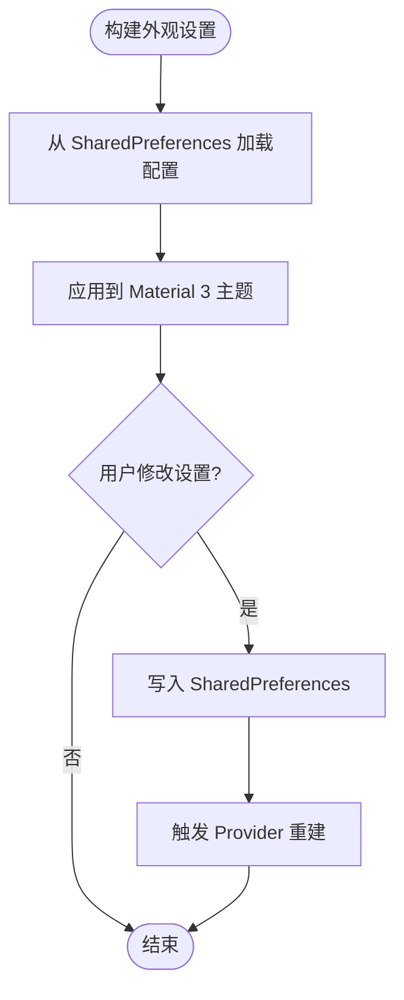
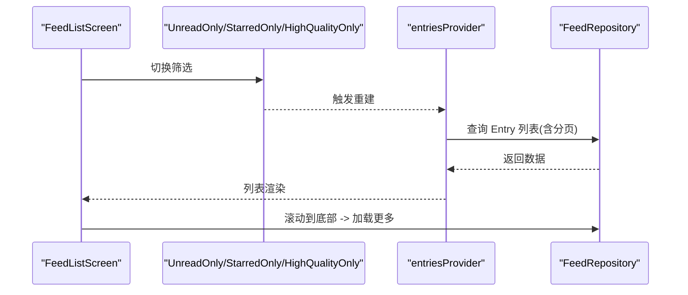
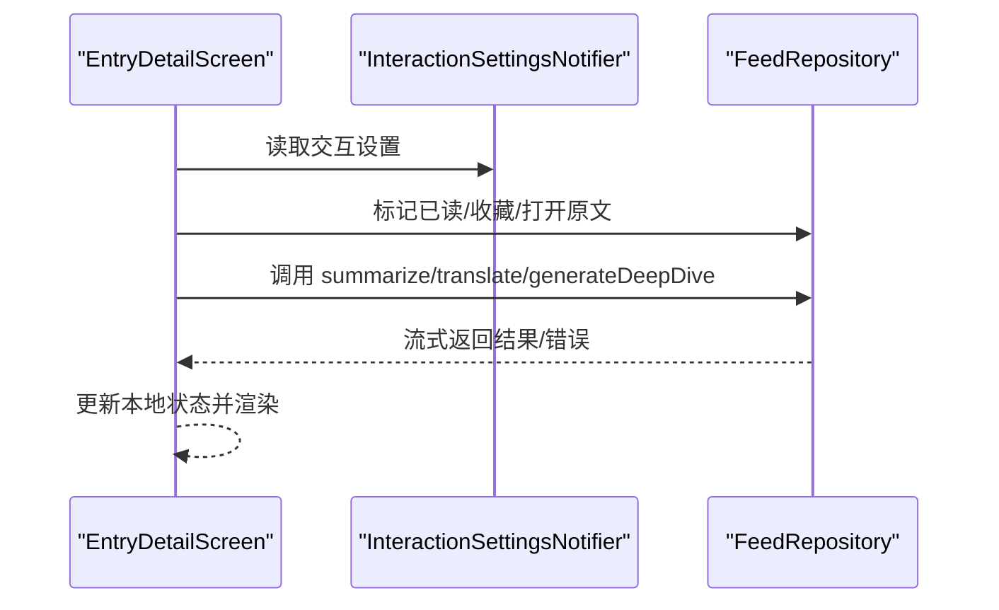
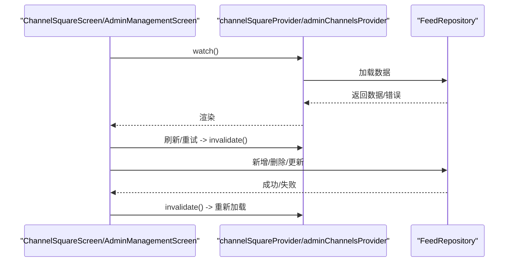
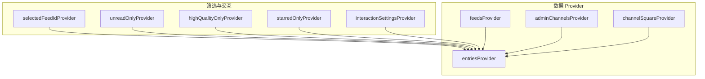

# 状态管理

<cite>
**本文引用的文件**
- [main.dart](file://tan_rss_mobile/lib/main.dart)
- [auth_providers.dart](file://tan_rss_mobile/lib/features/auth/presentation/auth_providers.dart)
- [feed_providers.dart](file://tan_rss_mobile/lib/features/feed/presentation/feed_providers.dart)
- [admin_channels_screen.dart](file://tan_rss_mobile/lib/features/feed/presentation/admin_channels_screen.dart)
- [entry_detail_screen.dart](file://tan_rss_mobile/lib/features/feed/presentation/entry_detail_screen.dart)
- [channel_square_screen.dart](file://tan_rss_mobile/lib/features/feed/presentation/channel_square_screen.dart)
- [feed_list_screen.dart](file://tan_rss_mobile/lib/features/feed/presentation/feed_list_screen.dart)
- [channel_synthesis_screen.dart](file://tan_rss_mobile/lib/features/feed/presentation/channel_synthesis_screen.dart)
- [admin_management_screen.dart](file://tan_rss_mobile/lib/features/feed/presentation/admin_management_screen.dart)
</cite>

## 目录
1. [简介](#简介)
2. [项目结构](#项目结构)
3. [核心组件](#核心组件)
4. [架构总览](#架构总览)
5. [详细组件分析](#详细组件分析)
6. [依赖关系分析](#依赖关系分析)
7. [性能考量](#性能考量)
8. [故障排查指南](#故障排查指南)
9. [结论](#结论)
10. [附录](#附录)

## 简介
本文件系统性梳理 Tan RSS Reader 在移动端（Flutter）采用的 Riverpod 状态管理方案，覆盖 Provider 体系结构、状态提升与组件通信、与“本地状态”和“异步状态”的协同、持久化与恢复、性能优化与重建控制、最佳实践与常见陷阱等。文档同时给出与现有代码实现相映射的图示与来源标注，帮助读者快速定位到具体实现位置。

## 项目结构
- 应用入口通过 ProviderScope 包裹，确保全局 Provider 的作用域与生命周期可控。
- 认证状态由 NotifierProvider 管理，配合 SharedPreferences 实现主题与交互设置的持久化。
- 阅读列表、频道、订阅源、AI 功能等均以 Provider 为核心组织数据流，配合 FutureProvider 处理异步加载与错误处理。
- 屏幕组件通过 Consumer/ConsumerState/ConsumerWidget 使用 ref.watch/ref.read/ref.listen/ref.invalidate 等 API 完成状态读取、副作用触发与缓存失效。

图表来源
- [main.dart:40-55](file://tan_rss_mobile/lib/main.dart#L40-L55)
- [main.dart:11-38](file://tan_rss_mobile/lib/main.dart#L11-L38)
- [auth_providers.dart:47-123](file://tan_rss_mobile/lib/features/auth/presentation/auth_providers.dart#L47-L123)
- [feed_providers.dart:167-254](file://tan_rss_mobile/lib/features/feed/presentation/feed_providers.dart#L167-L254)

章节来源
- [main.dart:40-55](file://tan_rss_mobile/lib/main.dart#L40-L55)
- [auth_providers.dart:47-123](file://tan_rss_mobile/lib/features/auth/presentation/auth_providers.dart#L47-L123)
- [feed_providers.dart:167-254](file://tan_rss_mobile/lib/features/feed/presentation/feed_providers.dart#L167-L254)

## 核心组件
- 全局主题与外观设置
  - ThemeModeNotifier：负责主题模式与动态色的持久化与切换。
  - AppearanceSettingsNotifier：负责视图模式、主题色、夜间模式等外观配置的持久化与读取。
- 认证状态
  - AuthNotifier：封装登录、注册、登出、初始化恢复流程，支持乐观登录与后台静默刷新。
- 阅读与频道数据
  - feedsProvider、entriesProvider、adminChannelsProvider 等：以 FutureProvider 封装异步数据加载与错误处理。
  - 交互设置与筛选条件：UnreadOnly/HighQualityOnly/StarredOnly、分页大小、滑动标记已读等。
- 屏幕级状态
  - FeedListScreen、EntryDetailScreen、ChannelSquareScreen 等：在局部状态与 Provider 状态之间平衡，按需使用 setState 与 ref.invalidate。

章节来源
- [main.dart:11-38](file://tan_rss_mobile/lib/main.dart#L11-L38)
- [feed_providers.dart:167-254](file://tan_rss_mobile/lib/features/feed/presentation/feed_providers.dart#L167-L254)
- [auth_providers.dart:47-123](file://tan_rss_mobile/lib/features/auth/presentation/auth_providers.dart#L47-L123)

## 架构总览
Riverpod 在本项目中的定位：
- 全局状态：Theme/Appearance/Auth/交互设置等。
- 屏幕级状态：列表滚动、搜索、过滤、批量操作等。
- 异步状态：远程数据加载、AI 摘要/翻译/深度解读等。
- 组件通信：通过 Provider 读写与 ref.listen 监听变化，避免深层回调与复杂 props 传递。

图表来源
- [feed_providers.dart:167-254](file://tan_rss_mobile/lib/features/feed/presentation/feed_providers.dart#L167-L254)
- [auth_providers.dart:47-123](file://tan_rss_mobile/lib/features/auth/presentation/auth_providers.dart#L47-L123)
- [feed_list_screen.dart:19-450](file://tan_rss_mobile/lib/features/feed/presentation/feed_list_screen.dart#L19-L450)
- [entry_detail_screen.dart:11-574](file://tan_rss_mobile/lib/features/feed/presentation/entry_detail_screen.dart#L11-L574)
- [channel_square_screen.dart:53-503](file://tan_rss_mobile/lib/features/feed/presentation/channel_square_screen.dart#L53-L503)
- [admin_management_screen.dart:9-800](file://tan_rss_mobile/lib/features/feed/presentation/admin_management_screen.dart#L9-L800)

## 详细组件分析

### 认证状态管理（AuthNotifier）
- 设计要点
  - Notifier+copyWith：不可变状态更新，便于调试与追踪。
  - 乐观登录：本地存在 Token 即刻进入主页，后台再刷新用户信息。
  - 错误隔离：登录/注册异常只影响当前状态字段，不影响全局主题与外观。
- 关键行为
  - 初始化：restore() 判断是否已登录并乐观进入。
  - 登录/注册：设置 loading/error，成功后拉取用户信息。
  - 登出：清空状态并调用仓库层清理 Token。

图表来源
- [auth_providers.dart:47-123](file://tan_rss_mobile/lib/features/auth/presentation/auth_providers.dart#L47-L123)

章节来源
- [auth_providers.dart:47-123](file://tan_rss_mobile/lib/features/auth/presentation/auth_providers.dart#L47-L123)

### 主题与外观设置（ThemeModeNotifier/AppearanceSettingsNotifier）
- 设计要点
  - Notifier 负责状态与持久化；屏幕根据 Provider 值渲染主题与配色。
  - AppearanceSettingsNotifier 从 SharedPreferences 加载默认值，支持运行时修改并持久化。
- 关键行为
  - 构建阶段加载持久化配置。
  - 修改时写入 SharedPreferences 并触发重建。

图表来源
- [main.dart:11-38](file://tan_rss_mobile/lib/main.dart#L11-L38)
- [feed_providers.dart:144-165](file://tan_rss_mobile/lib/features/feed/presentation/feed_providers.dart#L144-L165)

章节来源
- [main.dart:11-38](file://tan_rss_mobile/lib/main.dart#L11-L38)
- [feed_providers.dart:144-165](file://tan_rss_mobile/lib/features/feed/presentation/feed_providers.dart#L144-L165)

### 阅读列表与筛选（entriesProvider、FeedListScreen）
- 设计要点
  - entriesProvider 依赖多个筛选条件（未读/精选/收藏/分页），统一查询入口。
  - FeedListScreen 负责滚动加载、批量操作、长按选择、滑动标记已读等本地状态。
- 关键行为
  - 切换筛选条件时通过 ref.read(notifier).setValue 切换 Provider 内部状态，触发 entriesProvider 重新计算。
  - 滚动到底部时增量加载，避免一次性加载大量数据。

图表来源
- [feed_providers.dart:190-205](file://tan_rss_mobile/lib/features/feed/presentation/feed_providers.dart#L190-L205)
- [feed_list_screen.dart:50-151](file://tan_rss_mobile/lib/features/feed/presentation/feed_list_screen.dart#L50-L151)

章节来源
- [feed_providers.dart:190-205](file://tan_rss_mobile/lib/features/feed/presentation/feed_providers.dart#L190-L205)
- [feed_list_screen.dart:50-151](file://tan_rss_mobile/lib/features/feed/presentation/feed_list_screen.dart#L50-L151)

### 文章详情与 AI 能力（EntryDetailScreen、channel_synthesis_screen）
- 设计要点
  - EntryDetailScreen 通过 ref.watch 获取交互设置，控制滑动切换、外部浏览器、沉浸式阅读等。
  - 支持 AI 摘要、标题/正文翻译、深度解读，使用流式更新 UI。
- 关键行为
  - 首次打开文章时自动标记已读，并在收藏时触发深度解读。
  - 翻译与摘要失败时展示错误提示，支持重试。

图表来源
- [entry_detail_screen.dart:11-574](file://tan_rss_mobile/lib/features/feed/presentation/entry_detail_screen.dart#L11-L574)
- [channel_synthesis_screen.dart:1-338](file://tan_rss_mobile/lib/features/feed/presentation/channel_synthesis_screen.dart#L1-L338)

章节来源
- [entry_detail_screen.dart:11-574](file://tan_rss_mobile/lib/features/feed/presentation/entry_detail_screen.dart#L11-L574)
- [channel_synthesis_screen.dart:1-338](file://tan_rss_mobile/lib/features/feed/presentation/channel_synthesis_screen.dart#L1-L338)

### 频道与订阅源管理（ChannelSquareScreen/AdminManagementScreen）
- 设计要点
  - ChannelSquareScreen 通过 ref.watch 三个 FutureProvider 获取频道、分类、订阅列表，支持搜索与分类筛选。
  - AdminManagementScreen 提供频道/订阅源的增删改与批量操作，使用 ref.invalidate 触发缓存失效。
- 关键行为
  - 刷新与重试：使用 RefreshIndicator 或按钮触发 ref.invalidate。
  - 对话框与底部弹窗：通过 show*Dialog/showModalBottomSheet 与 Provider 协作，完成后刷新列表。

图表来源
- [channel_square_screen.dart:140-280](file://tan_rss_mobile/lib/features/feed/presentation/channel_square_screen.dart#L140-L280)
- [admin_channels_screen.dart:14-106](file://tan_rss_mobile/lib/features/feed/presentation/admin_channels_screen.dart#L14-L106)
- [admin_management_screen.dart:69-800](file://tan_rss_mobile/lib/features/feed/presentation/admin_management_screen.dart#L69-L800)

章节来源
- [channel_square_screen.dart:140-280](file://tan_rss_mobile/lib/features/feed/presentation/channel_square_screen.dart#L140-L280)
- [admin_channels_screen.dart:14-106](file://tan_rss_mobile/lib/features/feed/presentation/admin_channels_screen.dart#L14-L106)
- [admin_management_screen.dart:69-800](file://tan_rss_mobile/lib/features/feed/presentation/admin_management_screen.dart#L69-L800)

## 依赖关系分析
- Provider 间依赖
  - entriesProvider 依赖 selectedFeedIdProvider、unreadOnlyProvider、highQualityOnlyProvider、starredOnlyProvider、interactionSettingsProvider。
  - adminChannelsProvider、channelSquareProvider、mySubscriptionsProvider、publicPacksProvider 等依赖 feedRepositoryProvider。
- 组件对 Provider 的使用
  - Consumer/ConsumerState/ConsumerWidget 通过 ref.watch/ref.read/ref.listen/ref.invalidate 实现读取、触发副作用与缓存失效。
- 潜在耦合点
  - 屏幕组件与 Provider 的耦合度较高，但通过明确的 Provider 边界与职责划分，整体仍保持清晰。

图表来源
- [feed_providers.dart:167-254](file://tan_rss_mobile/lib/features/feed/presentation/feed_providers.dart#L167-L254)

章节来源
- [feed_providers.dart:167-254](file://tan_rss_mobile/lib/features/feed/presentation/feed_providers.dart#L167-L254)

## 性能考量
- 重建控制
  - 使用 Notifier 的不可变 copyWith 更新状态，减少不必要的重建。
  - 屏幕内局部状态（如 FeedListScreen 的 selectedIds、loadingMore）尽量使用 setState，避免污染 Provider。
- 异步加载优化
  - 使用 FutureProvider 管理加载/错误/数据三态，配合 RefreshIndicator 与分页加载，避免一次性加载过多数据。
  - 滑动标记已读：基于像素估算，降低频繁网络请求。
- 缓存与失效
  - 通过 ref.invalidate 精准失效相关 Provider，避免全量重建。
- 图片与渲染
  - 使用 CachedNetworkImage 与合理的占位/错误渲染，减少 UI 抖动。
- 最佳实践
  - 将“屏幕内临时 UI 状态”与“业务状态”分离，前者用 setState，后者用 Provider。
  - 对高频交互（筛选、分页）使用本地状态，对跨页面共享的数据使用 Provider。

[本节为通用指导，无需列出具体文件来源]

## 故障排查指南
- 认证相关
  - 现象：登录后仍停留在登录页或白屏。
  - 排查：检查 AuthNotifier.restore() 是否正确读取 Token 并设置 isInitializing=false；确认拦截器触发 logout() 的路径。
- 数据加载失败
  - 现象：频道/订阅源/文章列表显示错误。
  - 排查：查看对应 FutureProvider 的 when(error) 分支；确认 ref.invalidate 是否被调用；检查网络层返回。
- 设置未生效
  - 现象：切换主题/颜色后重启应用未生效。
  - 排查：确认 AppearanceSettingsNotifier._load() 是否从 SharedPreferences 读取；确认 setMode/setValue 是否写入。
- 性能问题
  - 现象：滚动卡顿、频繁重建。
  - 排查：检查是否在高频事件中误用 Provider；确认是否将屏幕内临时状态放入 Provider；评估分页与懒加载策略。

章节来源
- [auth_providers.dart:47-123](file://tan_rss_mobile/lib/features/auth/presentation/auth_providers.dart#L47-L123)
- [feed_providers.dart:167-254](file://tan_rss_mobile/lib/features/feed/presentation/feed_providers.dart#L167-L254)
- [feed_list_screen.dart:50-151](file://tan_rss_mobile/lib/features/feed/presentation/feed_list_screen.dart#L50-L151)

## 结论
本项目以 Riverpod 为核心，构建了清晰的全局状态、屏幕内状态与异步数据流。通过 Notifier 的不可变更新、FutureProvider 的三态管理、以及精准的缓存失效策略，实现了良好的可维护性与性能表现。建议在后续迭代中进一步细化 Provider 的边界与职责，持续优化高频交互的重建成本，并完善错误恢复与日志埋点。

[本节为总结性内容，无需列出具体文件来源]

## 附录
- 状态持久化清单
  - 主题模式：SharedPreferences 键名参考 ThemeModeNotifier。
  - 外观设置：appearance_* 键名集合来自 AppearanceSettingsNotifier。
  - 交互设置：interaction_* 键名集合来自 InteractionSettingsNotifier。
- 常见键名参考
  - 主题模式：theme_mode
  - 主题色：appearance_theme_color
  - 夜间模式：appearance_amoled_black
  - 分页大小：interaction_page_size
  - 默认启动标签页：default_startup_tab

章节来源
- [main.dart:11-38](file://tan_rss_mobile/lib/main.dart#L11-L38)
- [feed_providers.dart:144-165](file://tan_rss_mobile/lib/features/feed/presentation/feed_providers.dart#L144-L165)
- [feed_providers.dart:102-126](file://tan_rss_mobile/lib/features/feed/presentation/feed_providers.dart#L102-L126)
- [feed_providers.dart:6-30](file://tan_rss_mobile/lib/features/feed/presentation/feed_providers.dart#L6-L30)