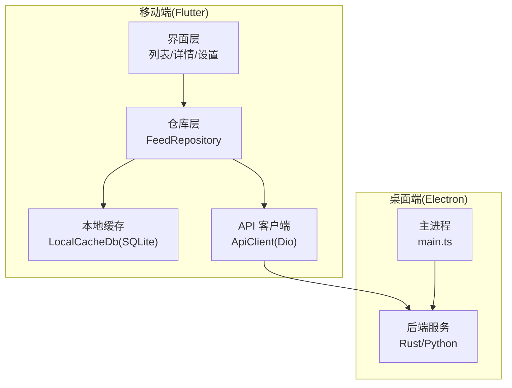
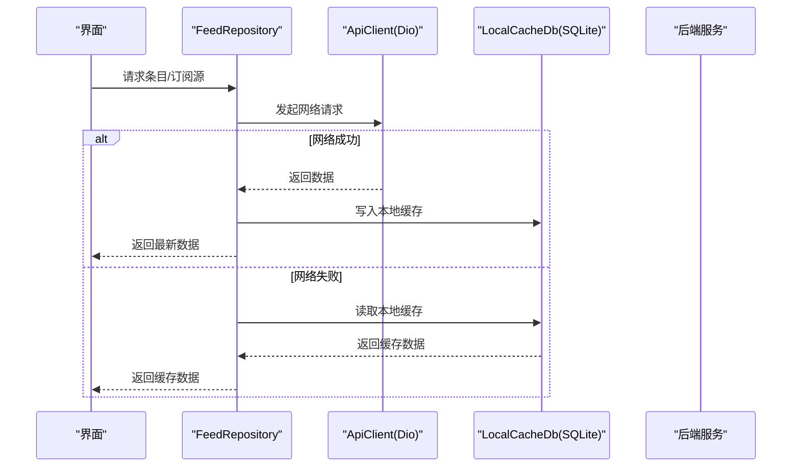
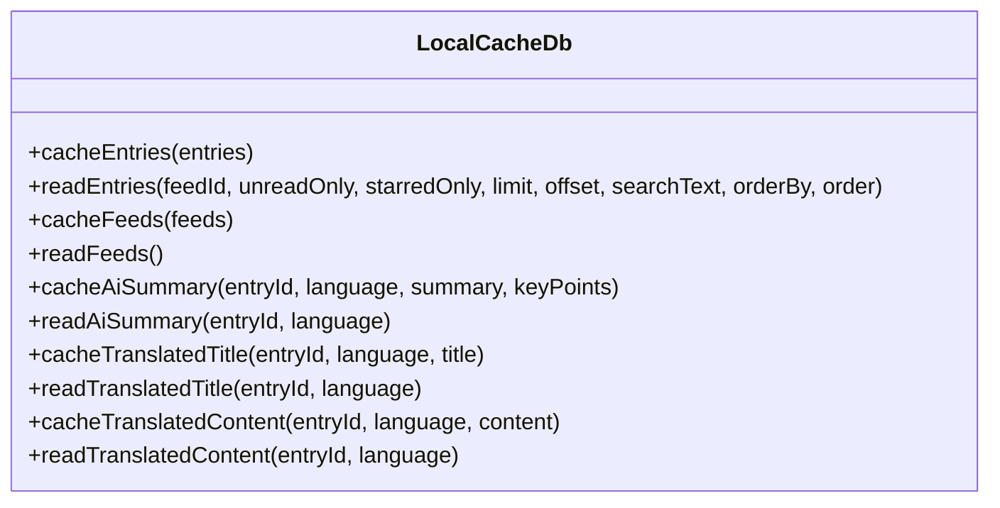
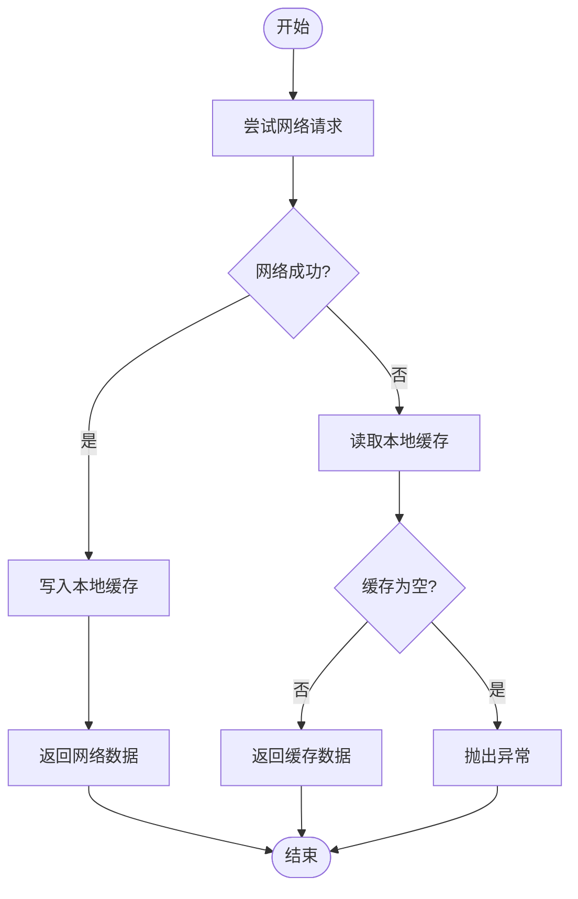
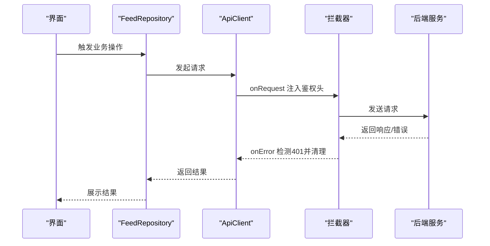
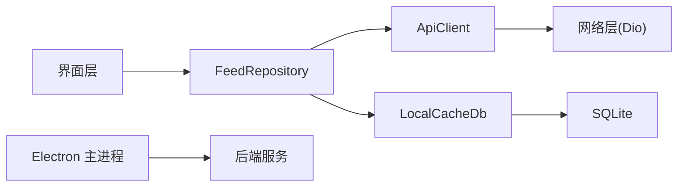

# 离线功能与数据同步

<cite>
**本文引用的文件**
- [local_cache_db.dart](file://tan_rss_mobile/lib/core/storage/local_cache_db.dart)
- [feed_repository.dart](file://tan_rss_mobile/lib/features/feed/data/feed_repository.dart)
- [api_client.dart](file://tan_rss_mobile/lib/core/api/api_client.dart)
- [models.dart](file://tan_rss_mobile/lib/core/models/models.dart)
- [sync_settings_screen.dart](file://tan_rss_mobile/lib/features/feed/presentation/sync_settings_screen.dart)
- [channel_square_screen.dart](file://tan_rss_mobile/lib/features/feed/presentation/channel_square_screen.dart)
- [main.ts](file://rss-desktop/electron/main.ts)
- [translation.ts](file://rss-desktop/src/constants/translation.ts)
</cite>

## 目录
1. [简介](#简介)
2. [项目结构](#项目结构)
3. [核心组件](#核心组件)
4. [架构总览](#架构总览)
5. [详细组件分析](#详细组件分析)
6. [依赖关系分析](#依赖关系分析)
7. [性能考量](#性能考量)
8. [故障排查指南](#故障排查指南)
9. [结论](#结论)
10. [附录](#附录)

## 简介
本文件围绕 Tan RSS Reader 的离线能力与数据同步展开，重点覆盖移动端 SQLite 本地缓存、离线读取策略、离线优先的用户体验、基于网络状态的智能并发控制、以及与桌面端 Electron 后端的健康检查与启动流程。文档同时给出关键流程图与时序图，帮助读者快速理解从请求到落库、从缓存读取到离线展示的完整链路。

## 项目结构
本项目采用多端架构：移动端（Flutter）负责 UI 与本地缓存；桌面端（Electron + Rust 后端）负责服务端能力与健康检查；后端 Python 服务提供 API 能力。与离线与同步相关的关键模块如下：
- 移动端
  - 本地缓存：SQLite 数据库（entries_cache、feeds_cache、entry_ai_cache）
  - 仓库层：统一调用 API 并在成功后写入本地缓存
  - API 客户端：统一拦截器、鉴权与超时配置
  - 模型定义：Entry、Feed、AI 相关实体
  - 同步设置界面：用户可配置同步行为
- 桌面端
  - Electron 主进程：后端健康检查与启动流程
  - 前端常量：基于网络连接信息的并发控制参数

**图表来源**
- [feed_repository.dart](file://tan_rss_mobile/lib/features/feed/data/feed_repository.dart)
- [local_cache_db.dart](file://tan_rss_mobile/lib/core/storage/local_cache_db.dart)
- [api_client.dart](file://tan_rss_mobile/lib/core/api/api_client.dart)
- [main.ts](file://rss-desktop/electron/main.ts)

**章节来源**
- [feed_repository.dart](file://tan_rss_mobile/lib/features/feed/data/feed_repository.dart)
- [local_cache_db.dart](file://tan_rss_mobile/lib/core/storage/local_cache_db.dart)
- [api_client.dart](file://tan_rss_mobile/lib/core/api/api_client.dart)
- [main.ts](file://rss-desktop/electron/main.ts)

## 核心组件
- 本地缓存数据库（LocalCacheDb）
  - 表结构：entries_cache、feeds_cache、entry_ai_cache
  - 写入策略：批量插入、冲突替换
  - 读取策略：条件查询、全文检索、排序与分页
- 仓库层（FeedRepository）
  - 先网络后缓存的读取策略
  - 成功后写入本地缓存
  - 针对 AI 总结与翻译提供独立缓存接口
- API 客户端（ApiClient）
  - 统一超时、鉴权头注入、401 清理会话
- 模型定义（models.dart）
  - Entry、Feed、AI 相关实体，支撑缓存与展示
- 同步设置界面（sync_settings_screen.dart）
  - 用户交互入口，触发保存与重试逻辑
- 桌面端健康检查（main.ts）
  - 后端健康检查与启动流程，保障离线可用性

**章节来源**
- [local_cache_db.dart](file://tan_rss_mobile/lib/core/storage/local_cache_db.dart)
- [feed_repository.dart](file://tan_rss_mobile/lib/features/feed/data/feed_repository.dart)
- [api_client.dart](file://tan_rss_mobile/lib/core/api/api_client.dart)
- [models.dart](file://tan_rss_mobile/lib/core/models/models.dart)
- [sync_settings_screen.dart](file://tan_rss_mobile/lib/features/feed/presentation/sync_settings_screen.dart)
- [main.ts](file://rss-desktop/electron/main.ts)

## 架构总览
移动端通过仓库层统一调度网络与本地缓存，遵循“网络优先、失败回退至缓存”的策略。AI 总结与翻译具备独立缓存表，支持离线读取与增量更新。桌面端负责后端健康检查与启动，确保服务可用性。

**图表来源**
- [feed_repository.dart](file://tan_rss_mobile/lib/features/feed/data/feed_repository.dart)
- [local_cache_db.dart](file://tan_rss_mobile/lib/core/storage/local_cache_db.dart)
- [api_client.dart](file://tan_rss_mobile/lib/core/api/api_client.dart)

## 详细组件分析

### 本地缓存数据库（LocalCacheDb）
- 表结构与用途
  - entries_cache：条目离线缓存，含阅读/收藏标记、发布时间、插入时间等
  - feeds_cache：订阅源离线缓存，含未读计数
  - entry_ai_cache：AI 总结/要点/翻译标题/翻译内容的多语言缓存
- 写入策略
  - 批量写入（batch），提升吞吐
  - 冲突替换（ConflictAlgorithm.replace），保证幂等
- 读取策略
  - 条件过滤：按 feedId、未读、收藏、搜索关键词
  - 排序与分页：支持按发布时间或插入时间倒序
  - AI 缓存：按 entryId+language 查询，缺失则返回空
- 复杂度
  - 写入：单条写入 O(1)，批量写入 O(n)
  - 查询：无索引条件下，LIKE 全表扫描；建议在高频字段建立索引以优化

**图表来源**
- [local_cache_db.dart](file://tan_rss_mobile/lib/core/storage/local_cache_db.dart)

**章节来源**
- [local_cache_db.dart](file://tan_rss_mobile/lib/core/storage/local_cache_db.dart)

### 仓库层（FeedRepository）
- 网络优先策略
  - 获取订阅源/条目时，优先调用后端接口
  - 成功后将结果写入本地缓存
- 失败回退策略
  - 网络异常时，回退到本地缓存读取
  - 若缓存为空，则抛出异常
- AI 功能缓存
  - 总结与翻译成功后写入 entry_ai_cache
  - 失败时尝试读取缓存，若无则抛出异常
- 搜索增强
  - 当网络返回数据后，若搜索词非空，可在内存中二次过滤

**图表来源**
- [feed_repository.dart](file://tan_rss_mobile/lib/features/feed/data/feed_repository.dart)

**章节来源**
- [feed_repository.dart](file://tan_rss_mobile/lib/features/feed/data/feed_repository.dart)

### API 客户端（ApiClient）
- 统一配置
  - 基础地址、连接/接收超时
  - 鉴权头自动注入（Authorization: Bearer token）
- 错误处理
  - 401 清理会话并触发未授权回调
- 会话持久化
  - 使用安全存储与共享偏好保存 token 与登录态标志

**图表来源**
- [api_client.dart](file://tan_rss_mobile/lib/core/api/api_client.dart)

**章节来源**
- [api_client.dart](file://tan_rss_mobile/lib/core/api/api_client.dart)

### 模型定义（models.dart）
- 关键实体
  - Entry：条目基础信息与辅助属性（如缩略图提取）
  - Feed：订阅源信息
  - AI 相关：AiSummaryData、SynthesisReference、AIDailyDigest 等
- 作用
  - 支撑仓库层的数据转换与缓存映射
  - 为 UI 提供稳定的结构化数据

**章节来源**
- [models.dart](file://tan_rss_mobile/lib/core/models/models.dart)

### 同步设置界面（sync_settings_screen.dart）
- 功能点
  - 加载/保存同步设置
  - 失败时提供重试按钮
- 价值
  - 为用户提供可控的同步行为入口，便于在弱网或离线场景下维持体验

**章节来源**
- [sync_settings_screen.dart](file://tan_rss_mobile/lib/features/feed/presentation/sync_settings_screen.dart)

### 桌面端健康检查（main.ts）
- 后端健康检查
  - 指定健康检查路径与超时/间隔参数
  - 统一延长超时时间，适配慢盘/首次初始化
- 启动流程
  - 通过健康检查确认后端可用后再进行后续操作

**章节来源**
- [main.ts](file://rss-desktop/electron/main.ts)

### 网络状态感知与并发控制（translation.ts）
- 目标
  - 基于浏览器网络连接信息（downlink/effectiveType）动态调整并发数
- 实现
  - 不同带宽阈值对应不同并发上限
  - 提供默认值与边界裁剪函数
- 价值
  - 在弱网环境下降低并发，减少资源消耗与失败率，提升稳定性

**章节来源**
- [translation.ts](file://rss-desktop/src/constants/translation.ts)

## 依赖关系分析
- 低耦合高内聚
  - 仓库层仅依赖 API 客户端与本地缓存，职责清晰
  - 本地缓存封装 SQLite 访问，对外暴露简洁接口
- 外部依赖
  - 移动端：sqflite、dio、flutter_secure_storage、shared_preferences
  - 桌面端：Electron、后端服务（Rust/Python）

**图表来源**
- [feed_repository.dart](file://tan_rss_mobile/lib/features/feed/data/feed_repository.dart)
- [local_cache_db.dart](file://tan_rss_mobile/lib/core/storage/local_cache_db.dart)
- [api_client.dart](file://tan_rss_mobile/lib/core/api/api_client.dart)
- [main.ts](file://rss-desktop/electron/main.ts)

**章节来源**
- [feed_repository.dart](file://tan_rss_mobile/lib/features/feed/data/feed_repository.dart)
- [local_cache_db.dart](file://tan_rss_mobile/lib/core/storage/local_cache_db.dart)
- [api_client.dart](file://tan_rss_mobile/lib/core/api/api_client.dart)
- [main.ts](file://rss-desktop/electron/main.ts)

## 性能考量
- 本地缓存写入
  - 使用批量写入（batch）提升吞吐，避免逐条提交带来的开销
  - 冲突替换（replace）保证幂等，简化重复写入逻辑
- 查询优化
  - 对高频查询字段（如 feed_id、is_read、is_starred、cached_at）建议建立索引
  - LIKE 全表扫描成本较高，建议在搜索场景引入更高效的全文检索方案
- 网络与并发
  - 基于网络连接信息动态调整并发，避免弱网环境下的拥塞与失败
  - 合理设置超时与重试策略，平衡用户体验与资源消耗
- 离线优先
  - 将本地缓存作为兜底，缩短首屏加载时间，提升弱网体验

[本节为通用性能建议，不直接分析具体文件]

## 故障排查指南
- 网络异常
  - 现象：请求失败，界面提示错误
  - 处理：仓库层会回退到本地缓存；若缓存为空则抛出异常
  - 建议：在 UI 中提供“重试”按钮，触发重新拉取或刷新缓存
- 401 未授权
  - 现象：拦截器检测到 401，清理本地 token
  - 处理：引导用户重新登录，并在登录成功后恢复会话
- 缓存为空
  - 现象：首次启动或缓存被清空
  - 处理：等待网络恢复后重试；或手动触发同步设置中的保存/重试
- 搜索无结果
  - 现象：网络返回数据但本地未命中
  - 处理：确认搜索关键词与大小写；必要时在网络成功后进行内存二次过滤

**章节来源**
- [feed_repository.dart](file://tan_rss_mobile/lib/features/feed/data/feed_repository.dart)
- [api_client.dart](file://tan_rss_mobile/lib/core/api/api_client.dart)
- [channel_square_screen.dart](file://tan_rss_mobile/lib/features/feed/presentation/channel_square_screen.dart)

## 结论
Tan RSS Reader 的离线与同步体系以“网络优先、失败回退至缓存”为核心策略，结合 SQLite 本地缓存与 AI 独立缓存表，实现了稳定、可扩展的离线体验。移动端通过仓库层统一封装网络与缓存，桌面端通过健康检查保障后端可用性。配合基于网络状态的并发控制，整体在弱网与离线场景下具备良好的鲁棒性与用户体验。

[本节为总结性内容，不直接分析具体文件]

## 附录
- 术语
  - 本地缓存：指移动端 SQLite 存储的离线数据
  - 网络优先：优先尝试网络请求，失败再回退缓存
  - 并发控制：根据网络状况动态调整并发数
- 参考文件
  - [local_cache_db.dart](file://tan_rss_mobile/lib/core/storage/local_cache_db.dart)
  - [feed_repository.dart](file://tan_rss_mobile/lib/features/feed/data/feed_repository.dart)
  - [api_client.dart](file://tan_rss_mobile/lib/core/api/api_client.dart)
  - [models.dart](file://tan_rss_mobile/lib/core/models/models.dart)
  - [sync_settings_screen.dart](file://tan_rss_mobile/lib/features/feed/presentation/sync_settings_screen.dart)
  - [main.ts](file://rss-desktop/electron/main.ts)
  - [translation.ts](file://rss-desktop/src/constants/translation.ts)