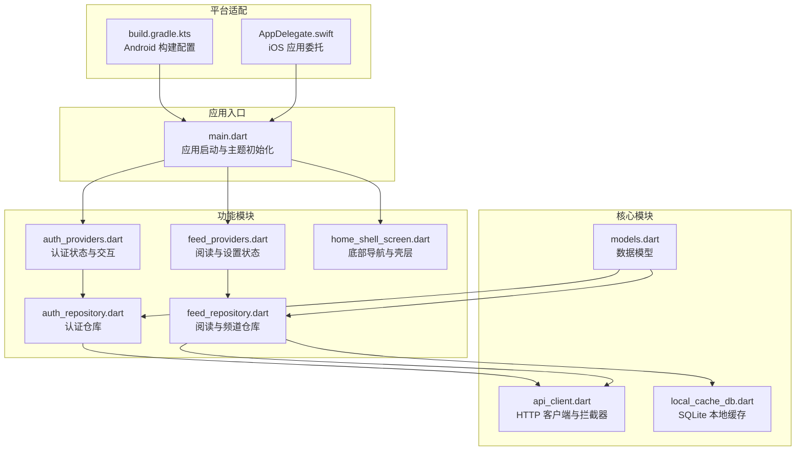
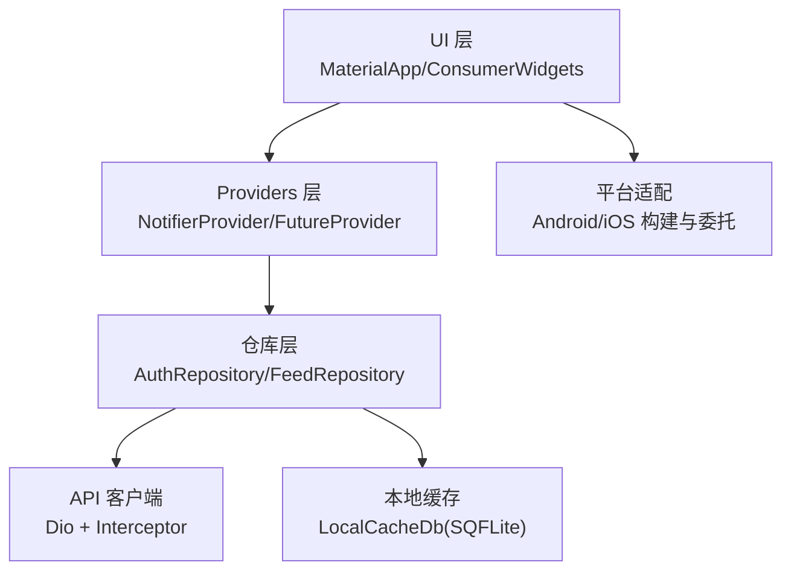
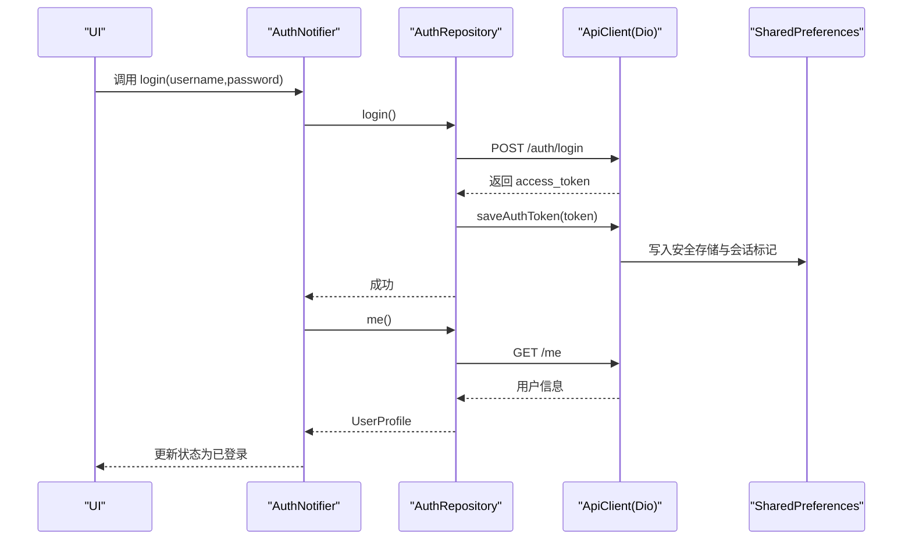
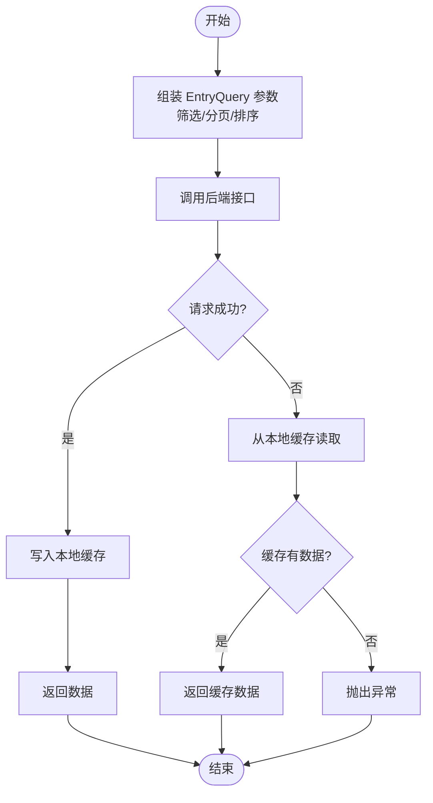
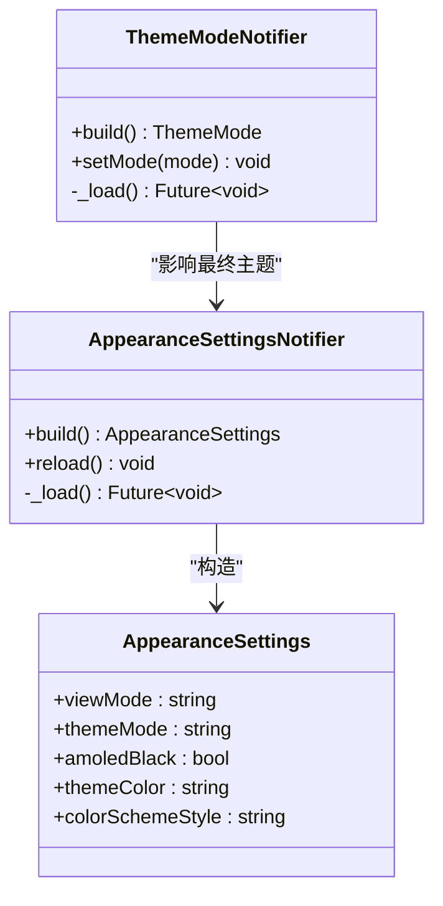
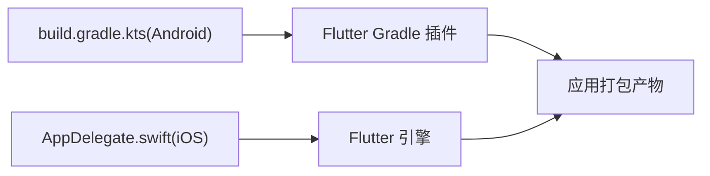
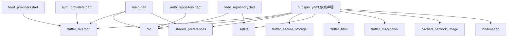

# 移动端应用

<cite>
**本文引用的文件**   
- [pubspec.yaml](file://tan_rss_mobile/pubspec.yaml)
- [main.dart](file://tan_rss_mobile/lib/main.dart)
- [api_client.dart](file://tan_rss_mobile/lib/core/api/api_client.dart)
- [local_cache_db.dart](file://tan_rss_mobile/lib/core/storage/local_cache_db.dart)
- [models.dart](file://tan_rss_mobile/lib/core/models/models.dart)
- [auth_providers.dart](file://tan_rss_mobile/lib/features/auth/presentation/auth_providers.dart)
- [auth_repository.dart](file://tan_rss_mobile/lib/features/auth/data/auth_repository.dart)
- [feed_providers.dart](file://tan_rss_mobile/lib/features/feed/presentation/feed_providers.dart)
- [feed_repository.dart](file://tan_rss_mobile/lib/features/feed/data/feed_repository.dart)
- [home_shell_screen.dart](file://tan_rss_mobile/lib/features/home/presentation/home_shell_screen.dart)
- [build.gradle.kts](file://tan_rss_mobile/android/app/build.gradle.kts)
- [AppDelegate.swift](file://tan_rss_mobile/ios/Runner/AppDelegate.swift)
- [README.md](file://tan_rss_mobile/README.md)
</cite>

## 目录
1. [简介](#简介)
2. [项目结构](#项目结构)
3. [核心组件](#核心组件)
4. [架构总览](#架构总览)
5. [详细组件分析](#详细组件分析)
6. [依赖关系分析](#依赖关系分析)
7. [性能考虑](#性能考虑)
8. [故障排查指南](#故障排查指南)
9. [结论](#结论)
10. [附录](#附录)

## 简介
本项目为 Tan RSS Reader 的移动端应用，基于 Flutter 构建，采用 Riverpod 进行状态管理，结合 BLoC 风格的 Notifier 设计与 ProviderScope 提供的响应式状态流，实现认证、阅读列表、频道订阅、AI 辅助摘要与翻译、离线缓存等核心能力。应用同时支持 Android 与 iOS 平台，并通过统一的 UI 主题系统与 Material Design 实现一致的跨平台体验。

## 项目结构
应用采用按特性分层的目录组织方式：
- 根入口与主题：lib/main.dart 负责应用启动、主题与国际化初始化、根路由选择。
- 核心模块：core 下包含 API 客户端、本地缓存数据库、模型定义与工具。
- 功能模块：features 下按领域拆分，如 auth（认证）、feed（阅读与频道）、home（壳层导航）等。
- 平台适配：android 与 ios 目录分别包含各自平台的构建与原生桥接配置。



**图表来源**
- [main.dart:40-55](file://tan_rss_mobile/lib/main.dart#L40-L55)
- [api_client.dart:5-42](file://tan_rss_mobile/lib/core/api/api_client.dart#L5-L42)
- [local_cache_db.dart:5-79](file://tan_rss_mobile/lib/core/storage/local_cache_db.dart#L5-L79)
- [models.dart:1-81](file://tan_rss_mobile/lib/core/models/models.dart#L1-L81)
- [auth_providers.dart:47-120](file://tan_rss_mobile/lib/features/auth/presentation/auth_providers.dart#L47-L120)
- [auth_repository.dart:10-101](file://tan_rss_mobile/lib/features/auth/data/auth_repository.dart#L10-L101)
- [feed_providers.dart:6-173](file://tan_rss_mobile/lib/features/feed/presentation/feed_providers.dart#L6-L173)
- [feed_repository.dart:38-162](file://tan_rss_mobile/lib/features/feed/data/feed_repository.dart#L38-L162)
- [home_shell_screen.dart:13-61](file://tan_rss_mobile/lib/features/home/presentation/home_shell_screen.dart#L13-L61)
- [build.gradle.kts:8-40](file://tan_rss_mobile/android/app/build.gradle.kts#L8-L40)
- [AppDelegate.swift:4-16](file://tan_rss_mobile/ios/Runner/AppDelegate.swift#L4-L16)

**章节来源**
- [README.md:1-18](file://tan_rss_mobile/README.md#L1-L18)
- [pubspec.yaml:30-71](file://tan_rss_mobile/pubspec.yaml#L30-L71)

## 核心组件
- 应用入口与主题系统
  - 入口在 main.dart 中完成初始化：SharedPreferences 读取基础地址、设置语言本地化、ProviderScope 包裹根组件。
  - 主题模式与颜色方案通过 NotifierProvider 管理，支持浅色/深色/系统模式与多种动态色系；深色可选纯黑 AMOLED 效果。
- 认证与会话
  - 使用 Dio 搭配拦截器自动注入 Authorization 头；401 自动清理令牌并触发登出。
  - 认证状态使用 Riverpod Notifier，支持“乐观登录”与后台静默刷新用户信息。
- 数据与缓存
  - 通过 FeedRepository 统一调用后端接口，成功后写入本地 SQLite 缓存；失败时回退到本地缓存。
  - 本地缓存包含条目、订阅源、AI 摘要与翻译结果，支持条件查询与全文检索。
- 阅读与设置
  - 以 NotifierProvider 管理首页标签、筛选条件（未读/加星/高质量）、交互设置（分页大小、手势等）与外观设置（视图模式、主题色等）。
- 平台适配
  - Android 使用 Gradle/Kotlin 插件与 Flutter Gradle 插件组合；iOS 使用 Swift 应用委托与插件注册。

**章节来源**
- [main.dart:11-38](file://tan_rss_mobile/lib/main.dart#L11-L38)
- [main.dart:40-153](file://tan_rss_mobile/lib/main.dart#L40-L153)
- [api_client.dart:5-70](file://tan_rss_mobile/lib/core/api/api_client.dart#L5-L70)
- [auth_providers.dart:47-120](file://tan_rss_mobile/lib/features/auth/presentation/auth_providers.dart#L47-L120)
- [feed_providers.dart:6-173](file://tan_rss_mobile/lib/features/feed/presentation/feed_providers.dart#L6-L173)
- [local_cache_db.dart:5-79](file://tan_rss_mobile/lib/core/storage/local_cache_db.dart#L5-L79)
- [feed_repository.dart:44-162](file://tan_rss_mobile/lib/features/feed/data/feed_repository.dart#L44-L162)
- [build.gradle.kts:1-45](file://tan_rss_mobile/android/app/build.gradle.kts#L1-L45)
- [AppDelegate.swift:1-17](file://tan_rss_mobile/ios/Runner/AppDelegate.swift#L1-L17)

## 架构总览
应用采用“表现层（UI + Providers）—仓库层（Repository）—核心服务（API/缓存）—平台适配”的分层架构。UI 层通过 Riverpod 响应式地消费状态；仓库层负责与后端交互与本地缓存协调；核心服务封装网络与存储细节；平台层提供构建与原生桥接。



**图表来源**
- [main.dart:57-153](file://tan_rss_mobile/lib/main.dart#L57-L153)
- [auth_providers.dart:1-123](file://tan_rss_mobile/lib/features/auth/presentation/auth_providers.dart#L1-L123)
- [feed_providers.dart:1-254](file://tan_rss_mobile/lib/features/feed/presentation/feed_providers.dart#L1-L254)
- [api_client.dart:5-70](file://tan_rss_mobile/lib/core/api/api_client.dart#L5-L70)
- [local_cache_db.dart:5-79](file://tan_rss_mobile/lib/core/storage/local_cache_db.dart#L5-L79)
- [feed_repository.dart:38-162](file://tan_rss_mobile/lib/features/feed/data/feed_repository.dart#L38-L162)

## 详细组件分析

### 认证与会话（Riverpod + BLoC 风格）
- 认证状态模型与 Notifier
  - 使用 Notifier<AuthState> 管理初始化、登录态、加载与错误；支持复制更新与 isAdmin 判断。
- 乐观登录与后台刷新
  - 若本地存在有效令牌，UI 立即进入主页；随后静默拉取用户信息，异常时由拦截器触发登出。
- 登录/注册/退出
  - 登录成功保存令牌；注册后自动登录并获取用户信息；退出清除令牌并回到初始状态。



**图表来源**
- [auth_providers.dart:74-92](file://tan_rss_mobile/lib/features/auth/presentation/auth_providers.dart#L74-L92)
- [auth_repository.dart:15-63](file://tan_rss_mobile/lib/features/auth/data/auth_repository.dart#L15-L63)
- [api_client.dart:50-64](file://tan_rss_mobile/lib/core/api/api_client.dart#L50-L64)

**章节来源**
- [auth_providers.dart:47-120](file://tan_rss_mobile/lib/features/auth/presentation/auth_providers.dart#L47-L120)
- [auth_repository.dart:10-101](file://tan_rss_mobile/lib/features/auth/data/auth_repository.dart#L10-L101)
- [api_client.dart:5-70](file://tan_rss_mobile/lib/core/api/api_client.dart#L5-L70)

### 阅读与频道（状态管理与数据流）
- 状态与筛选
  - 使用多个 Notifier 管理首页标签、未读/加星/高质量筛选、交互设置与外观设置；默认值来自 SharedPreferences。
- 数据提供者
  - 通过 FutureProvider 按需拉取订阅源、条目列表、频道条目、公开分类、公开/我的资源包等；根据筛选条件动态组装查询参数。
- 本地缓存与回退
  - 成功拉取后写入本地缓存；网络异常时优先返回缓存数据，保证可用性。



**图表来源**
- [feed_providers.dart:190-205](file://tan_rss_mobile/lib/features/feed/presentation/feed_providers.dart#L190-L205)
- [feed_repository.dart:108-162](file://tan_rss_mobile/lib/features/feed/data/feed_repository.dart#L108-L162)
- [local_cache_db.dart:81-107](file://tan_rss_mobile/lib/core/storage/local_cache_db.dart#L81-L107)

**章节来源**
- [feed_providers.dart:6-173](file://tan_rss_mobile/lib/features/feed/presentation/feed_providers.dart#L6-L173)
- [feed_repository.dart:38-162](file://tan_rss_mobile/lib/features/feed/data/feed_repository.dart#L38-L162)
- [local_cache_db.dart:81-164](file://tan_rss_mobile/lib/core/storage/local_cache_db.dart#L81-L164)

### 主题与外观（动态色与深色模式）
- 主题模式与颜色
  - 支持系统/浅色/深色三模式；动态色支持多色系；深色可启用纯黑背景。
- 外观设置持久化
  - 视图模式、主题色、AMOLED 黑色开关等通过 Notifier 读写 SharedPreferences。



**图表来源**
- [main.dart:11-38](file://tan_rss_mobile/lib/main.dart#L11-L38)
- [feed_providers.dart:128-165](file://tan_rss_mobile/lib/features/feed/presentation/feed_providers.dart#L128-L165)

**章节来源**
- [main.dart:74-153](file://tan_rss_mobile/lib/main.dart#L74-L153)
- [feed_providers.dart:128-165](file://tan_rss_mobile/lib/features/feed/presentation/feed_providers.dart#L128-L165)

### 平台适配（Android 与 iOS）
- Android
  - Gradle 配置使用 Flutter Gradle 插件与 Kotlin；最小 SDK、目标 SDK、版本号与签名配置位于构建脚本中。
- iOS
  - AppDelegate 集成 Flutter 引擎与插件注册，确保原生与 Flutter 协同工作。



**图表来源**
- [build.gradle.kts:1-45](file://tan_rss_mobile/android/app/build.gradle.kts#L1-L45)
- [AppDelegate.swift:4-16](file://tan_rss_mobile/ios/Runner/AppDelegate.swift#L4-L16)

**章节来源**
- [build.gradle.kts:8-40](file://tan_rss_mobile/android/app/build.gradle.kts#L8-L40)
- [AppDelegate.swift:1-17](file://tan_rss_mobile/ios/Runner/AppDelegate.swift#L1-L17)

### 离线功能、数据同步与缓存策略
- 离线可用性
  - 网络请求失败时优先返回本地缓存；成功后覆盖写入，保证后续访问的实时性与稳定性。
- 缓存表结构
  - 条目缓存、订阅源缓存、AI 摘要与翻译缓存；支持按 feedId、未读/加星、关键词检索、时间排序等查询。
- 同步机制
  - 通过 Provider 的 invalidate 与 future 结合，实现手动刷新与懒加载；仓库层在成功后写入缓存。

```mermaid
erDiagram
ENTRIES_CACHE {
text id PK
text feed_id
text feed_title
text title
text url
text author
text summary
text content
text published_at
text inserted_at
int is_read
int is_starred
int cached_at
}
FEEDS_CACHE {
text id PK
text url
text title
text favicon
int unread_count
int cached_at
}
ENTRY_AI_CACHE {
text entry_id
text language
text summary
text key_points_json
text translated_title
text translated_content
int updated_at
PK entry_id, language
}
```

**图表来源**
- [local_cache_db.dart:21-59](file://tan_rss_mobile/lib/core/storage/local_cache_db.dart#L21-L59)

**章节来源**
- [feed_repository.dart:44-162](file://tan_rss_mobile/lib/features/feed/data/feed_repository.dart#L44-L162)
- [local_cache_db.dart:81-352](file://tan_rss_mobile/lib/core/storage/local_cache_db.dart#L81-L352)

### 推送通知、深链处理与应用内购买
- 当前仓库未包含推送通知、深链与应用内购买相关实现。
- 建议扩展方向
  - 推送通知：在 Android 使用 Firebase Cloud Messaging，在 iOS 使用 APNs，结合平台通道与消息路由。
  - 深链处理：在 Android 与 iOS 分别配置 Intent/URL Scheme 与 Universal Links，解析后交由路由处理。
  - 应用内购买：在 Android 使用 Billing Library，在 iOS 使用 StoreKit，结合后端验证与本地记录。

[本节为概念性建议，不直接分析具体文件，故不附“章节来源”]

## 依赖关系分析
- 依赖清单与图标生成
  - pubspec.yaml 声明了 Flutter SDK、Riverpod、Dio、共享偏好、安全存储、sqflite、HTML 渲染、Markdown、图片缓存、国际化等依赖；并配置了应用图标自动生成。
- 依赖导入关系
  - main.dart 导入 API 客户端与 Providers；各 Feature 层通过 Provider 依赖核心 API 与本地缓存。



**图表来源**
- [pubspec.yaml:30-71](file://tan_rss_mobile/pubspec.yaml#L30-L71)
- [main.dart:1-11](file://tan_rss_mobile/lib/main.dart#L1-L11)
- [feed_providers.dart:1-5](file://tan_rss_mobile/lib/features/feed/presentation/feed_providers.dart#L1-L5)
- [feed_repository.dart:1-9](file://tan_rss_mobile/lib/features/feed/data/feed_repository.dart#L1-L9)
- [auth_providers.dart:1-4](file://tan_rss_mobile/lib/features/auth/presentation/auth_providers.dart#L1-L4)
- [auth_repository.dart:1-7](file://tan_rss_mobile/lib/features/auth/data/auth_repository.dart#L1-L7)

**章节来源**
- [pubspec.yaml:30-71](file://tan_rss_mobile/pubspec.yaml#L30-L71)
- [main.dart:1-11](file://tan_rss_mobile/lib/main.dart#L1-L11)

## 性能考虑
- 状态粒度与重建范围
  - 将筛选、分页、外观等状态拆分为独立 Notifier，避免无关 UI 重建。
- 批量写入与事务
  - 本地缓存使用批量插入与事务提交，降低 IO 开销。
- 网络超时与拦截器
  - 合理设置连接与接收超时；401 自动清理令牌，避免无效重试。
- 图片与渲染
  - 使用缓存网络图片与 Markdown/HTML 渲染组件，减少重复解码与布局压力。
- 主题与颜色
  - 动态色方案一次性计算，避免频繁重建 ColorScheme。

[本节提供通用指导，不直接分析具体文件，故不附“章节来源”]

## 故障排查指南
- 401 未授权
  - 现象：请求返回 401。
  - 处理：拦截器自动清理令牌并触发登出；检查令牌有效期与服务端鉴权。
- 网络异常导致数据为空
  - 现象：接口失败，页面空白。
  - 处理：确认本地缓存是否可用；检查网络权限与代理设置。
- 主题切换无效
  - 现象：切换主题后未生效。
  - 处理：确认 SharedPreferences 中的主题键值；检查 Notifier 状态更新与 MaterialApp themeMode。
- Android 构建签名问题
  - 现象：release 构建无法签名。
  - 处理：检查签名配置与密钥库路径；确保 Gradle 中签名配置正确。
- iOS 启动白屏或崩溃
  - 现象：应用启动异常。
  - 处理：检查 AppDelegate 注册与 Flutter 引擎初始化；核对 Info.plist 与 entitlements。

**章节来源**
- [api_client.dart:34-41](file://tan_rss_mobile/lib/core/api/api_client.dart#L34-L41)
- [auth_providers.dart:64-72](file://tan_rss_mobile/lib/features/auth/presentation/auth_providers.dart#L64-L72)
- [feed_repository.dart:146-161](file://tan_rss_mobile/lib/features/feed/data/feed_repository.dart#L146-L161)
- [local_cache_db.dart:81-107](file://tan_rss_mobile/lib/core/storage/local_cache_db.dart#L81-L107)
- [build.gradle.kts:33-39](file://tan_rss_mobile/android/app/build.gradle.kts#L33-L39)
- [AppDelegate.swift:13-15](file://tan_rss_mobile/ios/Runner/AppDelegate.swift#L13-L15)

## 结论
该移动端应用以 Flutter 为核心，结合 Riverpod 的响应式状态管理与 BLoC 风格的 Notifier，实现了认证、阅读、频道、AI 辅助与离线缓存等完整功能。通过清晰的分层架构与本地缓存策略，应用在弱网环境下仍具备良好的可用性。未来可在推送通知、深链与应用内购买方面进一步扩展，以完善移动端生态能力。

## 附录
- 构建与发布
  - Android：在 Gradle 中配置签名与版本信息，使用 Flutter Gradle 插件进行打包。
  - iOS：在 Xcode 工作区中配置签名与证书，确保插件注册与引擎初始化。
- 代码混淆与签名
  - Android 可在 release 构建中启用混淆与对齐；iOS 使用 Xcode 的编译与签名流程。
- 应用商店发布
  - 准备应用图标、截图与元数据；遵循各平台商店审核规范。

[本节为通用流程说明，不直接分析具体文件，故不附“章节来源”]