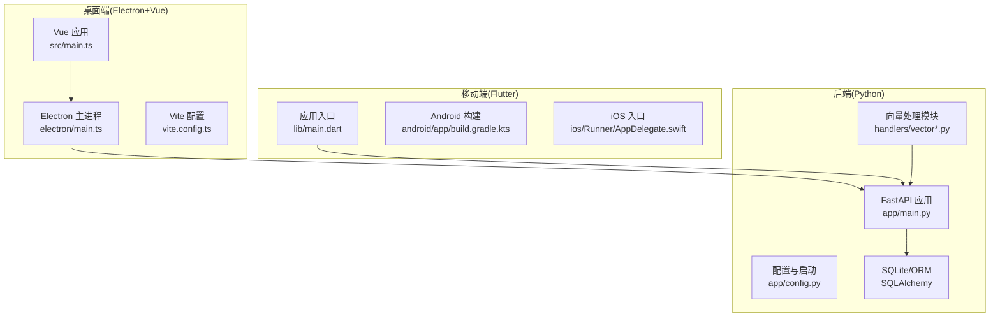
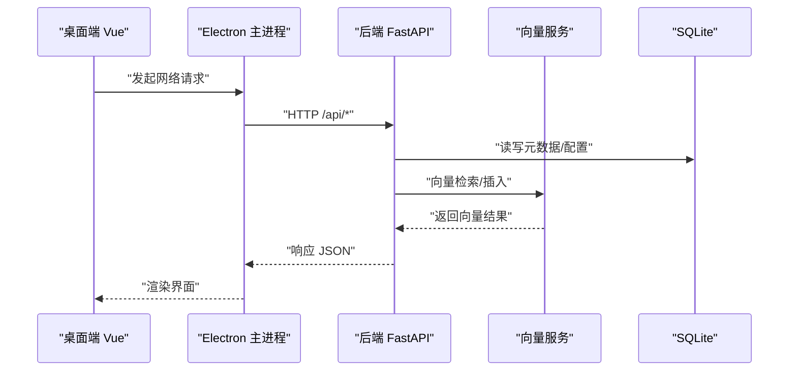
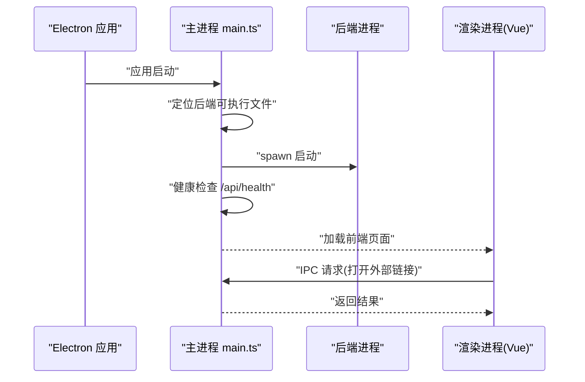
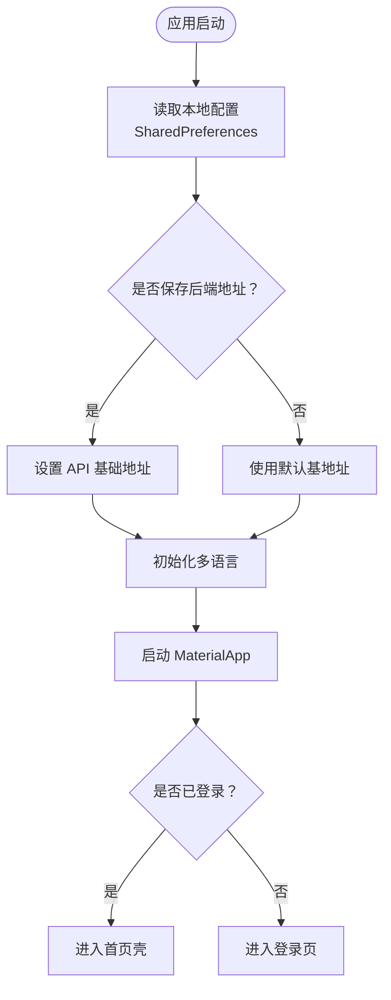
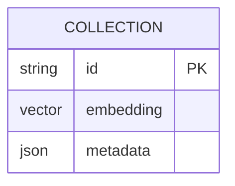
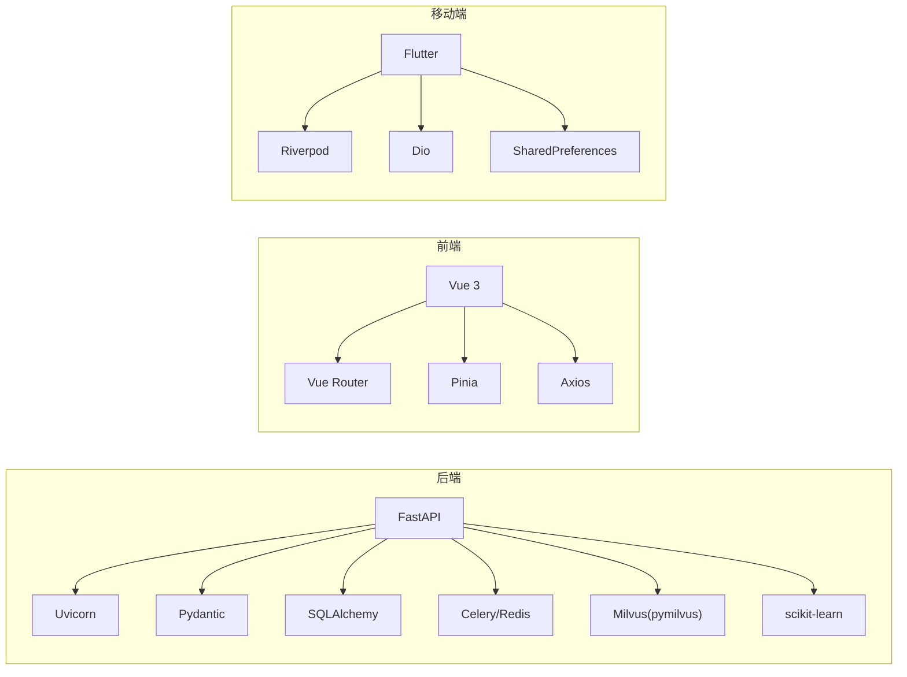

# 技术栈详解

<cite>
**本文引用的文件**
- [python-backend/requirements.txt](file://python-backend/requirements.txt)
- [python-backend/app/main.py](file://python-backend/app/main.py)
- [python-backend/app/config.py](file://python-backend/app/config.py)
- [python-backend/app/handlers/vector.py](file://python-backend/app/handlers/vector.py)
- [python-backend/app/handlers/vector_store.py](file://python-backend/app/handlers/vector_store.py)
- [python-backend/scripts/vectorize_history.py](file://python-backend/scripts/vectorize_history.py)
- [python-backend/tests/test_vector_system.py](file://python-backend/tests/test_vector_system.py)
- [rss-desktop/package.json](file://rss-desktop/package.json)
- [rss-desktop/src/main.ts](file://rss-desktop/src/main.ts)
- [rss-desktop/electron/main.ts](file://rss-desktop/electron/main.ts)
- [rss-desktop/vite.config.ts](file://rss-desktop/vite.config.ts)
- [tan_rss_mobile/pubspec.yaml](file://tan_rss_mobile/pubspec.yaml)
- [tan_rss_mobile/lib/main.dart](file://tan_rss_mobile/lib/main.dart)
- [tan_rss_mobile/android/app/build.gradle.kts](file://tan_rss_mobile/android/app/build.gradle.kts)
- [tan_rss_mobile/ios/Runner/AppDelegate.swift](file://tan_rss_mobile/ios/Runner/AppDelegate.swift)
- [VIP_ARCHITECTURE.md](file://VIP_ARCHITECTURE.md)
- [PROJECT_PLAN.md](file://PROJECT_PLAN.md)
</cite>

## 目录
1. [简介](#简介)
2. [项目结构](#项目结构)
3. [核心组件](#核心组件)
4. [架构总览](#架构总览)
5. [详细组件分析](#详细组件分析)
6. [依赖分析](#依赖分析)
7. [性能考虑](#性能考虑)
8. [故障排查指南](#故障排查指南)
9. [结论](#结论)
10. [附录](#附录)

## 简介
本文件面向 Tan RSS Reader 的技术栈进行系统化解读，覆盖后端 Python FastAPI、桌面端 Electron+Vue、移动端 Flutter、以及向量数据库 Milvus 的技术选型与协同方式。文档重点包括：
- 各层技术版本要求与核心依赖的作用
- 技术栈组合如何实现跨平台统一开发与一致体验
- 性能与用户体验保障策略
- 技术栈对比表、依赖关系图与版本兼容性矩阵
- 最佳实践建议

## 项目结构
项目采用“多端一核”的架构：后端提供统一 API；桌面端与移动端分别消费后端能力，形成统一的数据与业务逻辑。

图表来源
- [python-backend/app/main.py:1-103](file://python-backend/app/main.py#L1-L103)
- [rss-desktop/src/main.ts:1-9](file://rss-desktop/src/main.ts#L1-L9)
- [rss-desktop/electron/main.ts:1-548](file://rss-desktop/electron/main.ts#L1-L548)
- [rss-desktop/vite.config.ts:1-55](file://rss-desktop/vite.config.ts#L1-L55)
- [tan_rss_mobile/lib/main.dart:1-153](file://tan_rss_mobile/lib/main.dart#L1-L153)
- [tan_rss_mobile/android/app/build.gradle.kts:1-45](file://tan_rss_mobile/android/app/build.gradle.kts#L1-L45)
- [tan_rss_mobile/ios/Runner/AppDelegate.swift:1-17](file://tan_rss_mobile/ios/Runner/AppDelegate.swift#L1-L17)

章节来源
- [python-backend/app/main.py:1-103](file://python-backend/app/main.py#L1-L103)
- [rss-desktop/src/main.ts:1-9](file://rss-desktop/src/main.ts#L1-L9)
- [rss-desktop/electron/main.ts:1-548](file://rss-desktop/electron/main.ts#L1-L548)
- [rss-desktop/vite.config.ts:1-55](file://rss-desktop/vite.config.ts#L1-L55)
- [tan_rss_mobile/lib/main.dart:1-153](file://tan_rss_mobile/lib/main.dart#L1-L153)
- [tan_rss_mobile/android/app/build.gradle.kts:1-45](file://tan_rss_mobile/android/app/build.gradle.kts#L1-L45)
- [tan_rss_mobile/ios/Runner/AppDelegate.swift:1-17](file://tan_rss_mobile/ios/Runner/AppDelegate.swift#L1-L17)

## 核心组件
- 后端：基于 FastAPI 的 REST API，统一提供认证、订阅、条目、AI、向量检索、任务调度等能力；使用 SQLAlchemy 管理 SQLite 数据库；Celery + Redis 作为异步任务承载。
- 桌面端：Vue 3 + Vite 构建前端，Electron 管理主进程与原生能力；通过 Vite 插件与代理对接后端 API。
- 移动端：Flutter 跨平台 UI 框架，Riverpod 状态管理，Dio 网络请求，共享首选项持久化；Android 使用 Gradle/Kotlin，iOS 使用 Swift。
- 向量数据库：Milvus 作为向量检索基础设施，配合 scikit-learn 与向量化脚本构建语义检索能力。

章节来源
- [python-backend/requirements.txt:1-18](file://python-backend/requirements.txt#L1-L18)
- [python-backend/app/main.py:1-103](file://python-backend/app/main.py#L1-L103)
- [rss-desktop/package.json:1-81](file://rss-desktop/package.json#L1-L81)
- [rss-desktop/vite.config.ts:1-55](file://rss-desktop/vite.config.ts#L1-L55)
- [tan_rss_mobile/pubspec.yaml:1-112](file://tan_rss_mobile/pubspec.yaml#L1-L112)
- [tan_rss_mobile/lib/main.dart:1-153](file://tan_rss_mobile/lib/main.dart#L1-L153)

## 架构总览
后端通过 FastAPI 暴露统一 API，桌面端与移动端均以 HTTP 客户端消费后端接口；向量检索通过 Milvus 实现语义搜索，结合本地 SQLite 存储元数据与缓存。

图表来源
- [rss-desktop/src/main.ts:1-9](file://rss-desktop/src/main.ts#L1-L9)
- [rss-desktop/electron/main.ts:1-548](file://rss-desktop/electron/main.ts#L1-L548)
- [python-backend/app/main.py:1-103](file://python-backend/app/main.py#L1-L103)
- [python-backend/app/handlers/vector.py](file://python-backend/app/handlers/vector.py)

章节来源
- [python-backend/app/main.py:1-103](file://python-backend/app/main.py#L1-L103)
- [rss-desktop/electron/main.ts:1-548](file://rss-desktop/electron/main.ts#L1-L548)

## 详细组件分析

### 后端：FastAPI 技术选型与优势
- 优势
  - 异步高性能：基于 Starlette，适合高并发与长连接场景。
  - 自动生成 OpenAPI 文档：降低前后端协作成本。
  - Pydantic 验证与序列化：强类型输入输出，提升稳定性。
  - 中间件灵活：CORS、GZip、限流等可插拔扩展。
- 核心依赖与作用
  - fastapi：Web 框架与路由
  - uvicorn：ASGI 服务器
  - pydantic / pydantic-settings：模型与配置
  - SQLAlchemy / aiosqlite：ORM 与异步 SQLite
  - httpx：HTTP 客户端
  - APScheduler：定时任务
  - PyJWT / passlib：认证与加密
  - celery + redis：异步任务队列
  - pymilvus + scikit-learn：向量检索与特征工程
- 版本要求与兼容性
  - fastapi >= 0.115.0，uvicorn[standard] >= 0.30.0，pydantic >= 2.6.3，SQLAlchemy >= 2.0.0，aiosqlite >= 0.20.0，httpx >= 0.27.0，PyJWT >= 2.9.0，passlib[bcrypt] >= 1.7.4，pymilvus >= 2.4.0，scikit-learn >= 1.4.0，celery >= 5.3.6，redis >= 5.0.1

章节来源
- [python-backend/requirements.txt:1-18](file://python-backend/requirements.txt#L1-L18)
- [python-backend/app/main.py:1-103](file://python-backend/app/main.py#L1-L103)

### 桌面端：Electron + Vue 技术考量
- 技术选型
  - Electron：统一桌面原生能力（菜单、对话框、托盘、系统通知），隔离后端进程并提供沙箱与日志管理。
  - Vue 3 + Vite：现代前端开发体验，热更新与构建优化；Pinia 状态管理，Vue Router 路由。
  - Vite 插件：electron-plugin 与 electron-renderer 插件，支持开发模式下的主进程与渲染进程联动。
- 核心流程
  - 主进程负责启动/停止后端进程、健康检查、日志落盘、窗口生命周期管理。
  - 渲染进程通过 axios 或原生 fetch 调用 /api/*；开发模式下通过 Vite 代理转发至后端。
- 版本要求与兼容性
  - Node >= 18.0.0，pnpm >= 8.0.0；electron >= 39.2.2；vue >= 3.4.21；vite >= 5.1.6；typescript >= 5.2.2

图表来源
- [rss-desktop/electron/main.ts:1-548](file://rss-desktop/electron/main.ts#L1-L548)
- [rss-desktop/vite.config.ts:1-55](file://rss-desktop/vite.config.ts#L1-L55)

章节来源
- [rss-desktop/package.json:1-81](file://rss-desktop/package.json#L1-L81)
- [rss-desktop/src/main.ts:1-9](file://rss-desktop/src/main.ts#L1-L9)
- [rss-desktop/electron/main.ts:1-548](file://rss-desktop/electron/main.ts#L1-L548)
- [rss-desktop/vite.config.ts:1-55](file://rss-desktop/vite.config.ts#L1-L55)

### 移动端：Flutter 商业价值
- 技术选型
  - Flutter：一套代码多端发布，UI 一致性与性能表现稳定；Material Design 主题与动态配色。
  - Riverpod：轻量、可测试的状态管理；SharedPreferences 持久化用户偏好。
  - Dio：简洁的 HTTP 客户端；sqflite 本地数据库；url_launcher 打开外部链接。
- 平台配置
  - Android：Java 17 目标兼容；Gradle 插件与 Flutter Gradle Plugin 协同。
  - iOS：Swift 入口与插件注册；Xcode 工作区与资源管理。
- 版本要求与兼容性
  - Flutter SDK ^3.11.3；Android minSdk 21；iOS 与 Android 均通过 pubspec 管理依赖。

图表来源
- [tan_rss_mobile/lib/main.dart:1-153](file://tan_rss_mobile/lib/main.dart#L1-L153)
- [tan_rss_mobile/android/app/build.gradle.kts:1-45](file://tan_rss_mobile/android/app/build.gradle.kts#L1-L45)
- [tan_rss_mobile/ios/Runner/AppDelegate.swift:1-17](file://tan_rss_mobile/ios/Runner/AppDelegate.swift#L1-L17)

章节来源
- [tan_rss_mobile/pubspec.yaml:1-112](file://tan_rss_mobile/pubspec.yaml#L1-L112)
- [tan_rss_mobile/lib/main.dart:1-153](file://tan_rss_mobile/lib/main.dart#L1-L153)
- [tan_rss_mobile/android/app/build.gradle.kts:1-45](file://tan_rss_mobile/android/app/build.gradle.kts#L1-L45)
- [tan_rss_mobile/ios/Runner/AppDelegate.swift:1-17](file://tan_rss_mobile/ios/Runner/AppDelegate.swift#L1-L17)

### 向量数据库：Milvus 性能优势
- 选型理由
  - 高维向量检索：支持 IVF_FLAT 等索引与余弦距离，适合大规模语义相似度计算。
  - 与 scikit-learn 配合：便于特征工程与向量化流水线。
  - 与 FastAPI 集成：pymilvus 提供 Python 客户端，易于在后端封装检索接口。
- 关键实现点
  - 向量处理器与向量存储模块：封装 Milvus 连接、集合管理、插入与检索。
  - 历史数据补向量化脚本：批量处理历史文章，补齐向量库。
  - 测试用例：验证向量系统正确性与性能边界。
- 版本要求与兼容性
  - pymilvus >= 2.4.0；scikit-learn >= 1.4.0

图表来源
- [python-backend/app/handlers/vector.py](file://python-backend/app/handlers/vector.py)
- [python-backend/app/handlers/vector_store.py](file://python-backend/app/handlers/vector_store.py)
- [python-backend/scripts/vectorize_history.py](file://python-backend/scripts/vectorize_history.py)
- [python-backend/tests/test_vector_system.py](file://python-backend/tests/test_vector_system.py)

章节来源
- [python-backend/requirements.txt:14-15](file://python-backend/requirements.txt#L14-L15)
- [python-backend/app/handlers/vector.py](file://python-backend/app/handlers/vector.py)
- [python-backend/app/handlers/vector_store.py](file://python-backend/app/handlers/vector_store.py)
- [python-backend/scripts/vectorize_history.py](file://python-backend/scripts/vectorize_history.py)
- [python-backend/tests/test_vector_system.py](file://python-backend/tests/test_vector_system.py)

## 依赖分析
- 后端依赖关系
  - FastAPI 依赖 Uvicorn、Pydantic、SQLAlchemy、Celery、Redis、PyJWT、Passlib、Feedparser、APScheduler、Milvus、Scikit-learn。
  - 向量模块依赖 Milvus 与 sklearn；任务模块依赖 Celery 与 Redis。
- 前端依赖关系
  - Vue 3 依赖 Vue Router、Pinia、Axios、Chart.js、Day.js、DOMPurify、Readability。
  - Vite 与 Electron 插件在开发模式下协同。
- 移动端依赖关系
  - Flutter 依赖 Riverpod、Dio、Shared Preferences、Timeago、HTML 渲染、URL Launcher、安全存储、SQLite 等。

图表来源
- [python-backend/requirements.txt:1-18](file://python-backend/requirements.txt#L1-L18)
- [rss-desktop/package.json:55-77](file://rss-desktop/package.json#L55-L77)
- [tan_rss_mobile/pubspec.yaml:30-52](file://tan_rss_mobile/pubspec.yaml#L30-L52)

章节来源
- [python-backend/requirements.txt:1-18](file://python-backend/requirements.txt#L1-L18)
- [rss-desktop/package.json:55-77](file://rss-desktop/package.json#L55-L77)
- [tan_rss_mobile/pubspec.yaml:30-52](file://tan_rss_mobile/pubspec.yaml#L30-L52)

## 性能考虑
- 后端
  - 异步 I/O 与连接池：FastAPI + SQLAlchemy AsyncIO + aiosqlite，降低 IO 阻塞。
  - 任务解耦：Celery + Redis 异步生成摘要、向量化等耗时操作。
  - 向量检索：Milvus 索引与批量插入，结合缓存与分页，避免全表扫描。
- 桌面端
  - 主进程与渲染进程分离，IPC 通信最小化；健康检查与日志落盘避免卡顿。
  - Vite 热更新与代理，缩短开发迭代周期。
- 移动端
  - Riverpod 精准状态更新，避免全局重绘；Dio 缓存与超时控制，提升弱网体验。
  - Flutter 渲染管线稳定，Material 主题与动态配色减少 UI 重排。

## 故障排查指南
- 后端
  - 启动失败：检查数据库初始化与表结构变更；确认 /api/health 健康检查可达。
  - 向量检索异常：确认 Milvus 服务可用、集合存在、索引构建完成。
- 桌面端
  - 后端未就绪：确认 Electron 主进程已找到并启动后端可执行文件；查看日志文件路径。
  - 开发代理：确认 Vite 代理指向正确的后端端口。
- 移动端
  - 登录态失效：检查 SharedPreferences 中的 base URL 与认证回调。
  - 平台构建：Android minSdk 与 Java 目标版本需匹配 Gradle 配置。

章节来源
- [rss-desktop/electron/main.ts:93-132](file://rss-desktop/electron/main.ts#L93-L132)
- [rss-desktop/vite.config.ts:46-52](file://rss-desktop/vite.config.ts#L46-L52)
- [tan_rss_mobile/lib/main.dart:68-72](file://tan_rss_mobile/lib/main.dart#L68-L72)

## 结论
Tan RSS Reader 的技术栈通过“后端统一 API + 多端消费”的方式，实现了跨平台的一致体验与高可维护性。后端以 FastAPI 为核心，结合 Celery/Redis、Milvus、SQLite，满足高性能与可扩展需求；桌面端 Electron+Vue 提供原生能力与现代前端体验；移动端 Flutter 实现跨平台 UI 与稳定性能；向量数据库 Milvus 则为语义检索提供底层支撑。整体架构在开发效率、用户体验与商业拓展之间取得平衡。

## 附录

### 技术栈对比表
- 后端：FastAPI（高性能、强类型、自动生成文档）、Celery/Redis（异步任务）、Milvus（向量检索）、SQLite（轻量存储）
- 桌面端：Electron（原生能力）、Vue 3（组件化）、Vite（构建与热更新）
- 移动端：Flutter（跨平台 UI）、Riverpod（状态管理）、Dio（网络）

### 版本兼容性矩阵（节选）
- 后端
  - fastapi >= 0.115.0
  - uvicorn[standard] >= 0.30.0
  - pydantic >= 2.6.3
  - SQLAlchemy >= 2.0.0
  - aiosqlite >= 0.20.0
  - httpx >= 0.27.0
  - PyJWT >= 2.9.0
  - passlib[bcrypt] >= 1.7.4
  - pymilvus >= 2.4.0
  - scikit-learn >= 1.4.0
  - celery >= 5.3.6
  - redis >= 5.0.1
- 桌面端
  - node >= 18.0.0
  - pnpm >= 8.0.0
  - electron >= 39.2.2
  - vue >= 3.4.21
  - vite >= 5.1.6
  - typescript >= 5.2.2
- 移动端
  - Flutter SDK ^3.11.3
  - Android minSdk 21

章节来源
- [python-backend/requirements.txt:1-18](file://python-backend/requirements.txt#L1-L18)
- [rss-desktop/package.json:37-40](file://rss-desktop/package.json#L37-L40)
- [tan_rss_mobile/pubspec.yaml:21-22](file://tan_rss_mobile/pubspec.yaml#L21-L22)

### 最佳实践建议
- 后端
  - 明确接口幂等与错误码；对敏感字段进行脱敏与最小暴露。
  - 使用 Pydantic 设置严格的数据校验与默认值；对向量入库进行批量化与重试。
- 桌面端
  - 主进程职责单一：只做进程管理与 IPC；渲染进程专注 UI。
  - 健康检查与日志分级，便于问题定位。
- 移动端
  - 使用 Riverpod 的 Provider 分层，避免深层依赖；对网络请求设置超时与重试。
  - 本地持久化与云端同步策略清晰，避免冲突。
- 向量检索
  - 建立索引与查询阈值的监控；定期评估召回率与延迟指标。