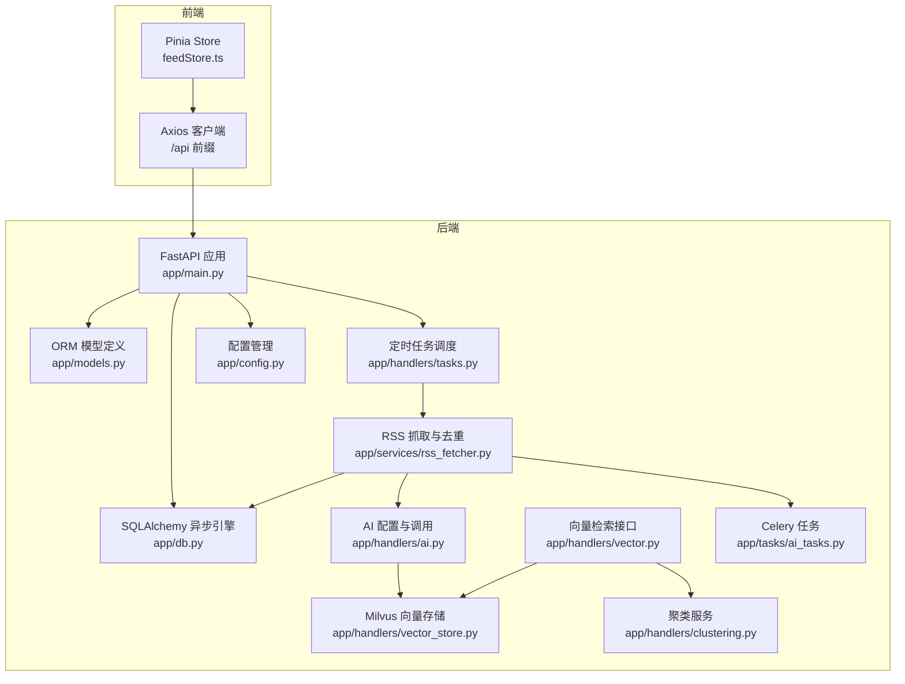
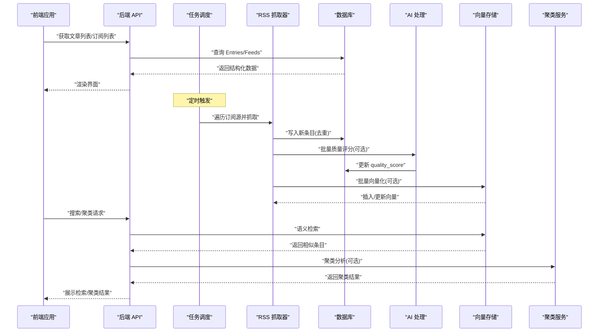
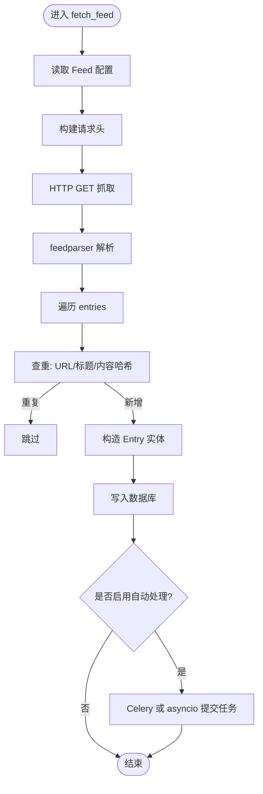
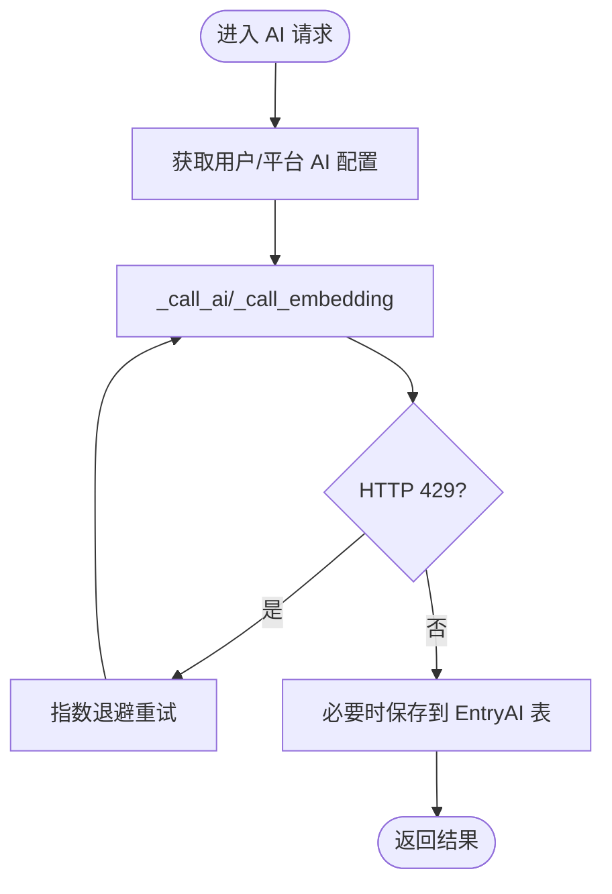
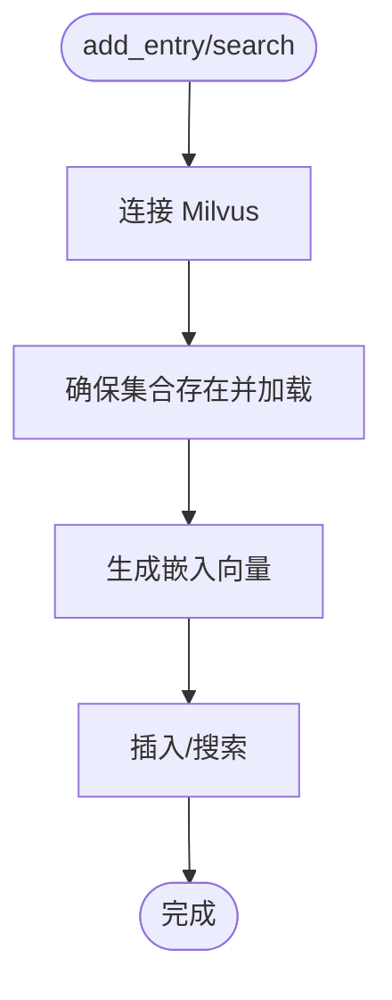
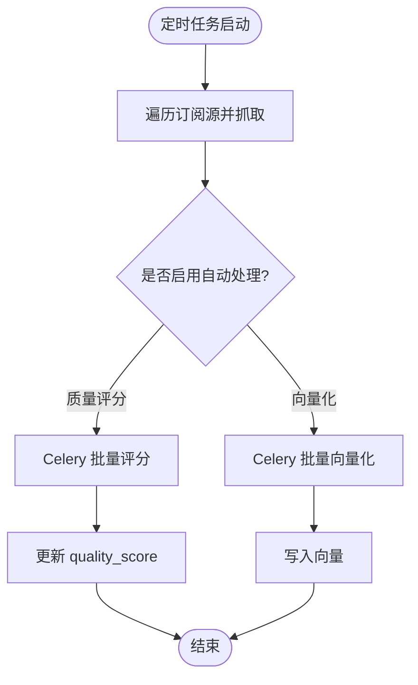
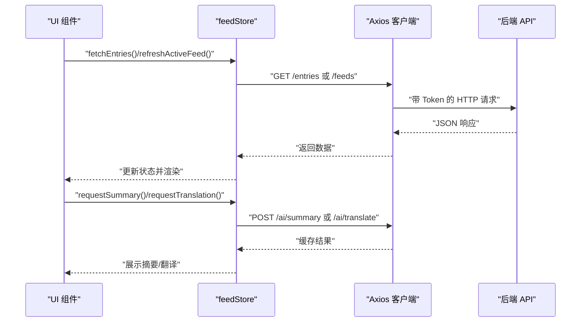
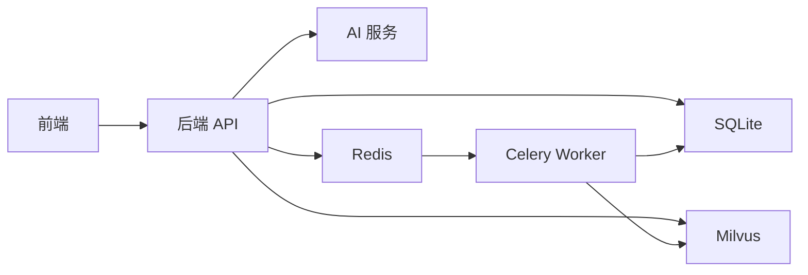

# 数据流设计

<cite>
**本文引用的文件**
- [python-backend/app/main.py](file://python-backend/app/main.py)
- [python-backend/app/db.py](file://python-backend/app/db.py)
- [python-backend/app/models.py](file://python-backend/app/models.py)
- [python-backend/app/services/rss_fetcher.py](file://python-backend/app/services/rss_fetcher.py)
- [python-backend/app/handlers/tasks.py](file://python-backend/app/handlers/tasks.py)
- [python-backend/app/handlers/ai.py](file://python-backend/app/handlers/ai.py)
- [python-backend/app/handlers/vector.py](file://python-backend/app/handlers/vector.py)
- [python-backend/app/handlers/vector_store.py](file://python-backend/app/handlers/vector_store.py)
- [python-backend/app/handlers/clustering.py](file://python-backend/app/handlers/clustering.py)
- [python-backend/app/tasks/ai_tasks.py](file://python-backend/app/tasks/ai_tasks.py)
- [python-backend/app/celery_app.py](file://python-backend/app/celery_app.py)
- [python-backend/app/config.py](file://python-backend/app/config.py)
- [rss-desktop/src/api/client.ts](file://rss-desktop/src/api/client.ts)
- [rss-desktop/src/stores/feedStore.ts](file://rss-desktop/src/stores/feedStore.ts)
</cite>

## 目录
1. [引言](#引言)
2. [项目结构](#项目结构)
3. [核心组件](#核心组件)
4. [架构总览](#架构总览)
5. [详细组件分析](#详细组件分析)
6. [依赖分析](#依赖分析)
7. [性能考虑](#性能考虑)
8. [故障排查指南](#故障排查指南)
9. [结论](#结论)
10. [附录](#附录)

## 引言
本设计文档围绕 Tan RSS Reader 的数据流进行系统化梳理，覆盖从 RSS 订阅源抓取、后端解析与去重、AI 智能处理、向量数据库存储，到前端展示的完整链路。文档同时解释数据转换过程（原始 RSS → 结构化数据 → 向量化表示 → 语义检索结果），并给出缓存策略、一致性保障、错误处理与监控调试方法。

## 项目结构
后端采用 FastAPI + SQLAlchemy 异步 ORM + Celery 异步任务队列；前端使用 Vue 3 + Pinia + Axios。数据流贯穿“订阅源 → 抓取解析 → 去重入库 → AI 批处理 → 向量索引 → 查询检索 → 前端展示”。

图表来源
- [python-backend/app/main.py:1-103](file://python-backend/app/main.py#L1-L103)
- [python-backend/app/db.py:1-27](file://python-backend/app/db.py#L1-L27)
- [python-backend/app/models.py:1-228](file://python-backend/app/models.py#L1-L228)
- [python-backend/app/services/rss_fetcher.py:1-312](file://python-backend/app/services/rss_fetcher.py#L1-L312)
- [python-backend/app/handlers/tasks.py:1-276](file://python-backend/app/handlers/tasks.py#L1-L276)
- [python-backend/app/handlers/ai.py:1-800](file://python-backend/app/handlers/ai.py#L1-L800)
- [python-backend/app/handlers/vector.py:1-158](file://python-backend/app/handlers/vector.py#L1-L158)
- [python-backend/app/handlers/vector_store.py:1-197](file://python-backend/app/handlers/vector_store.py#L1-L197)
- [python-backend/app/handlers/clustering.py:1-142](file://python-backend/app/handlers/clustering.py#L1-L142)
- [python-backend/app/tasks/ai_tasks.py:1-87](file://python-backend/app/tasks/ai_tasks.py#L1-L87)
- [python-backend/app/config.py:1-75](file://python-backend/app/config.py#L1-L75)
- [rss-desktop/src/api/client.ts:1-29](file://rss-desktop/src/api/client.ts#L1-L29)
- [rss-desktop/src/stores/feedStore.ts:1-642](file://rss-desktop/src/stores/feedStore.ts#L1-L642)

章节来源
- [python-backend/app/main.py:1-103](file://python-backend/app/main.py#L1-L103)
- [rss-desktop/src/api/client.ts:1-29](file://rss-desktop/src/api/client.ts#L1-L29)
- [rss-desktop/src/stores/feedStore.ts:1-642](file://rss-desktop/src/stores/feedStore.ts#L1-L642)

## 核心组件
- 数据库与模型：SQLite 异步引擎 + SQLAlchemy ORM，定义 Feed、Entry、EntryAI、AIConfigRow 等表，支撑持久化与查询。
- RSS 抓取与去重：异步抓取、解析、去重（URL/标题/内容哈希组合键）、质量评分、批量向量化与质量打分的后台任务。
- AI 智能处理：摘要生成、翻译、嵌入生成、趋势分析、聚类分析。
- 向量检索：Milvus（含本地 Lite 支持）向量存储，支持按 feed 过滤的相似度检索。
- 任务调度：APScheduler 定时刷新订阅源；Celery 异步执行向量化与质量评分。
- 前端交互：Axios 客户端封装 /api 前缀；Pinia Store 缓存摘要/翻译结果，发起请求并驱动 UI 更新。

章节来源
- [python-backend/app/db.py:1-27](file://python-backend/app/db.py#L1-L27)
- [python-backend/app/models.py:1-228](file://python-backend/app/models.py#L1-L228)
- [python-backend/app/services/rss_fetcher.py:1-312](file://python-backend/app/services/rss_fetcher.py#L1-L312)
- [python-backend/app/handlers/ai.py:1-800](file://python-backend/app/handlers/ai.py#L1-L800)
- [python-backend/app/handlers/vector_store.py:1-197](file://python-backend/app/handlers/vector_store.py#L1-L197)
- [python-backend/app/handlers/tasks.py:1-276](file://python-backend/app/handlers/tasks.py#L1-L276)
- [python-backend/app/tasks/ai_tasks.py:1-87](file://python-backend/app/tasks/ai_tasks.py#L1-L87)
- [rss-desktop/src/api/client.ts:1-29](file://rss-desktop/src/api/client.ts#L1-L29)
- [rss-desktop/src/stores/feedStore.ts:1-642](file://rss-desktop/src/stores/feedStore.ts#L1-L642)

## 架构总览
下图展示从订阅源到前端展示的端到端数据流，标注关键节点与数据形态转换。

图表来源
- [python-backend/app/services/rss_fetcher.py:104-312](file://python-backend/app/services/rss_fetcher.py#L104-L312)
- [python-backend/app/handlers/tasks.py:77-97](file://python-backend/app/handlers/tasks.py#L77-L97)
- [python-backend/app/handlers/ai.py:348-504](file://python-backend/app/handlers/ai.py#L348-L504)
- [python-backend/app/handlers/vector_store.py:92-178](file://python-backend/app/handlers/vector_store.py#L92-L178)
- [python-backend/app/handlers/clustering.py:14-139](file://python-backend/app/handlers/clustering.py#L14-L139)
- [rss-desktop/src/stores/feedStore.ts:332-403](file://rss-desktop/src/stores/feedStore.ts#L332-L403)

## 详细组件分析

### 组件A：RSS 抓取与去重（rss_fetcher）
- 功能要点
  - 异步抓取订阅源，解析 feedparser，构造 Entry 实体并写入数据库。
  - 去重策略：URL 规范化 + 标题前缀 + 内容 MD5 截断拼接，再对整体做 SHA256 取固定长度作为 dedup_key，避免重复入库。
  - 质量评分：基于字数与标题长度的启发式评分，写入 quality_score。
  - 自动化后续处理：根据开关选择 Celery 或 asyncio 触发向量化与质量评分任务。
- 关键流程（简化）

图表来源
- [python-backend/app/services/rss_fetcher.py:104-312](file://python-backend/app/services/rss_fetcher.py#L104-L312)

章节来源
- [python-backend/app/services/rss_fetcher.py:13-27](file://python-backend/app/services/rss_fetcher.py#L13-L27)
- [python-backend/app/services/rss_fetcher.py:104-312](file://python-backend/app/services/rss_fetcher.py#L104-L312)

### 组件B：AI 智能处理（ai）
- 功能要点
  - 统一配置中心：从环境变量与数据库默认配置合并，支持用户级覆盖与会员配额记录。
  - 文本处理：摘要生成、翻译（标题/正文）、嵌入生成、趋势分析。
  - 错误处理：HTTP 限流重试、超时控制、降级输出。
- 关键流程（简化）

图表来源
- [python-backend/app/handlers/ai.py:348-504](file://python-backend/app/handlers/ai.py#L348-L504)
- [python-backend/app/handlers/ai.py:173-228](file://python-backend/app/handlers/ai.py#L173-L228)
- [python-backend/app/handlers/ai.py:313-345](file://python-backend/app/handlers/ai.py#L313-L345)

章节来源
- [python-backend/app/handlers/ai.py:1-800](file://python-backend/app/handlers/ai.py#L1-L800)

### 组件C：向量数据库与检索（vector_store）
- 功能要点
  - 连接 Milvus（支持本地 Lite），自动建集合与索引（IVF_FLAT/COSINE）。
  - 插入/更新：先按 entry_id 查询并删除旧向量，再插入新向量。
  - 搜索：生成查询向量，按 COSINE 距离检索，支持 feed_id 过滤。
- 关键流程（简化）

图表来源
- [python-backend/app/handlers/vector_store.py:18-197](file://python-backend/app/handlers/vector_store.py#L18-L197)

章节来源
- [python-backend/app/handlers/vector_store.py:1-197](file://python-backend/app/handlers/vector_store.py#L1-L197)

### 组件D：任务调度与后台处理（tasks + celery）
- 功能要点
  - APScheduler 定时刷新订阅源，周期由应用设置决定。
  - Celery 异步执行批量质量评分与向量化，降低主流程阻塞。
- 关键流程（简化）

图表来源
- [python-backend/app/handlers/tasks.py:77-97](file://python-backend/app/handlers/tasks.py#L77-L97)
- [python-backend/app/tasks/ai_tasks.py:16-51](file://python-backend/app/tasks/ai_tasks.py#L16-L51)
- [python-backend/app/tasks/ai_tasks.py:53-86](file://python-backend/app/tasks/ai_tasks.py#L53-L86)

章节来源
- [python-backend/app/handlers/tasks.py:1-276](file://python-backend/app/handlers/tasks.py#L1-L276)
- [python-backend/app/tasks/ai_tasks.py:1-87](file://python-backend/app/tasks/ai_tasks.py#L1-L87)
- [python-backend/app/celery_app.py:1-23](file://python-backend/app/celery_app.py#L1-L23)

### 组件E：前端数据流与缓存（feedStore + client）
- 功能要点
  - Axios 客户端统一拦截器注入 Authorization，开发环境代理到 /api。
  - Pinia Store 维护 feeds/entries 状态，提供刷新、筛选、标记已读/收藏等操作。
  - 缓存策略：摘要/翻译结果缓存于内存，避免重复请求；分组折叠状态持久化至 localStorage。
- 关键流程（简化）

图表来源
- [rss-desktop/src/stores/feedStore.ts:332-403](file://rss-desktop/src/stores/feedStore.ts#L332-L403)
- [rss-desktop/src/stores/feedStore.ts:448-505](file://rss-desktop/src/stores/feedStore.ts#L448-L505)
- [rss-desktop/src/api/client.ts:1-29](file://rss-desktop/src/api/client.ts#L1-L29)

章节来源
- [rss-desktop/src/stores/feedStore.ts:1-642](file://rss-desktop/src/stores/feedStore.ts#L1-L642)
- [rss-desktop/src/api/client.ts:1-29](file://rss-desktop/src/api/client.ts#L1-L29)

## 依赖分析
- 组件耦合
  - rss_fetcher 依赖数据库与 AI 配置，可选依赖 Celery；与 vector_store 通过任务解耦。
  - vector 接口依赖 vector_store；clustering 依赖 vector_store 查询向量并进行 DBSCAN 聚类。
  - 前端通过 axios 与后端 API 解耦，Pinia Store 仅关注状态与缓存。
- 外部依赖
  - 数据库：SQLite（异步）。
  - 向量库：Milvus（远程或本地 Lite）。
  - 任务队列：Redis（Celery）。
  - AI 服务：通过配置项指向本地或远端推理服务。

图表来源
- [python-backend/app/db.py:1-27](file://python-backend/app/db.py#L1-L27)
- [python-backend/app/handlers/vector_store.py:18-197](file://python-backend/app/handlers/vector_store.py#L18-L197)
- [python-backend/app/celery_app.py:1-23](file://python-backend/app/celery_app.py#L1-L23)
- [rss-desktop/src/api/client.ts:1-29](file://rss-desktop/src/api/client.ts#L1-L29)

章节来源
- [python-backend/app/db.py:1-27](file://python-backend/app/db.py#L1-L27)
- [python-backend/app/handlers/vector_store.py:18-197](file://python-backend/app/handlers/vector_store.py#L18-L197)
- [python-backend/app/celery_app.py:1-23](file://python-backend/app/celery_app.py#L1-L23)

## 性能考虑
- 异步 I/O 与并发
  - 使用 httpx.AsyncClient 与 feedparser 异步抓取，减少阻塞。
  - APScheduler + Celery 并行化处理，避免主线程阻塞。
- 向量检索优化
  - Milvus IVF_FLAT 索引 + COSINE 距离，nprobe 参数可调；按 feed_id 过滤缩小搜索空间。
  - 插入前按 entry_id 查询并删除旧向量，避免重复与碎片。
- 缓存与去重
  - 前端对摘要/翻译结果进行内存缓存；数据库 dedup_key 避免重复入库。
  - RSS 层面去重（同一批次内 dedup_keys_in_batch）进一步降低重复。
- 资源限制
  - 文本截断（如 8000 字符）与分页（如最近 100 条）控制上下文大小与查询负载。
- 配置与弹性
  - AI 服务限流重试、超时控制；Milvus 连接失败降级处理。

[本节为通用性能建议，无需特定文件引用]

## 故障排查指南
- 订阅源抓取失败
  - 检查网络错误与 HTTP 状态码，确认 feed.url 与 referer 头；查看 Feed.last_status 与 error_count。
  - 参考：[rss_fetcher 抓取与错误处理:126-144](file://python-backend/app/services/rss_fetcher.py#L126-L144)
- 向量检索异常
  - 确认 Milvus 连接参数与集合存在；检查 embedding 维度是否匹配；查看日志中的连接/插入/查询错误。
  - 参考：[vector_store 连接与查询:23-193](file://python-backend/app/handlers/vector_store.py#L23-L193)
- AI 调用失败
  - 检查 AI 配置（base_url、api_key、model）与限流；查看重试与降级输出。
  - 参考：[AI 配置与调用:348-504](file://python-backend/app/handlers/ai.py#L348-L504)
- 任务调度与 Celery
  - 确认 Redis 可达；查看任务队列与 worker 日志；检查 APScheduler 是否运行。
  - 参考：[任务调度与 Celery:143-176](file://python-backend/app/handlers/tasks.py#L143-L176), [celery_app:1-23](file://python-backend/app/celery_app.py#L1-L23)
- 前端鉴权与请求
  - 检查本地 Token 注入与 401 事件派发；确认 /api 前缀与跨域配置。
  - 参考：[client 拦截器:8-26](file://rss-desktop/src/api/client.ts#L8-L26)

章节来源
- [python-backend/app/services/rss_fetcher.py:126-144](file://python-backend/app/services/rss_fetcher.py#L126-L144)
- [python-backend/app/handlers/vector_store.py:23-193](file://python-backend/app/handlers/vector_store.py#L23-L193)
- [python-backend/app/handlers/ai.py:348-504](file://python-backend/app/handlers/ai.py#L348-L504)
- [python-backend/app/handlers/tasks.py:143-176](file://python-backend/app/handlers/tasks.py#L143-L176)
- [python-backend/app/celery_app.py:1-23](file://python-backend/app/celery_app.py#L1-L23)
- [rss-desktop/src/api/client.ts:8-26](file://rss-desktop/src/api/client.ts#L8-L26)

## 结论
Tan RSS Reader 的数据流以“异步抓取 + 去重入库 + AI 批处理 + 向量检索”为核心，通过 SQLite 持久化、Milvus 向量索引与前端 Pinia 缓存实现高效可用的信息检索与展示。任务调度与 Celery 保证了后台处理的可扩展性；配置中心与限流重试提升了系统的鲁棒性。建议持续优化 Milvus 索引参数与上下文截断策略，完善监控埋点与告警，以支撑更大规模的数据增长。

[本节为总结性内容，无需特定文件引用]

## 附录
- 数据转换过程
  - 原始 RSS → 结构化数据（Entry/Feed）→ 向量化表示（Embedding）→ 语义检索结果（TopK）
- 缓存策略
  - 内存缓存：前端摘要/翻译缓存；向量存储：Milvus 索引与集合。
  - 数据库持久化：Entry/EntryAI/AIConfigRow 等模型持久化结构化数据与配置。
- 一致性与错误处理
  - 去重键与事务提交保证入库一致性；AI 与向量处理失败不影响主流程；前端对 401 进行统一处理。
- 监控与调试
  - 后端日志与任务历史；Milvus 连接状态；前端请求拦截与错误提示。

[本节为概念性汇总，无需特定文件引用]