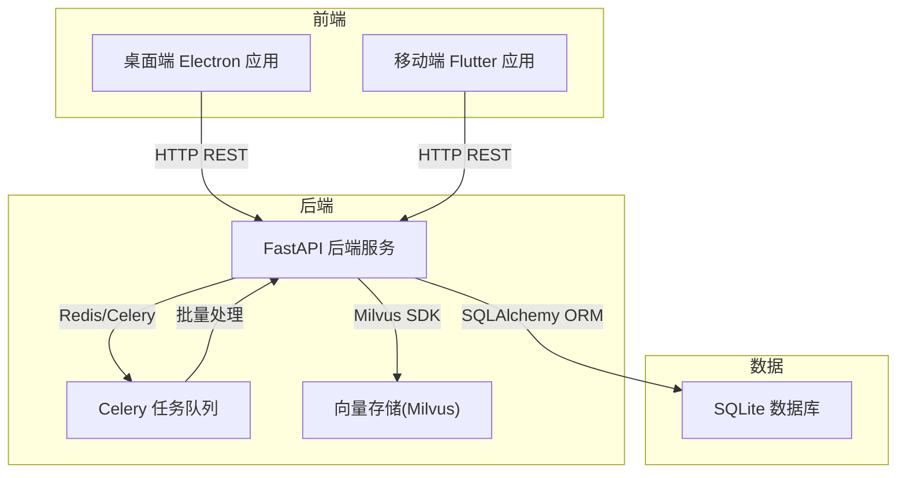
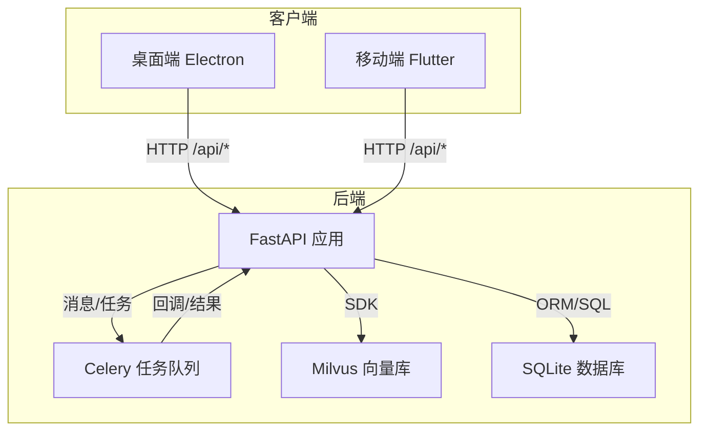
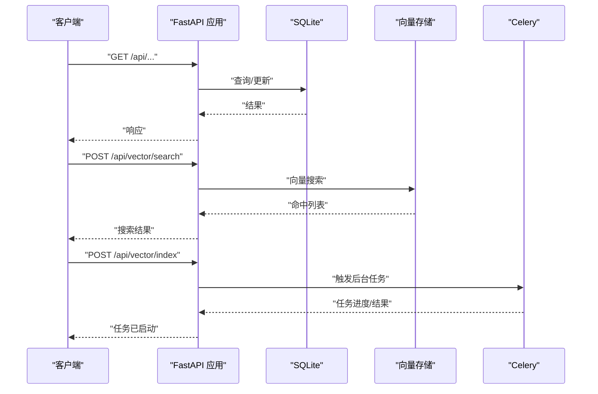
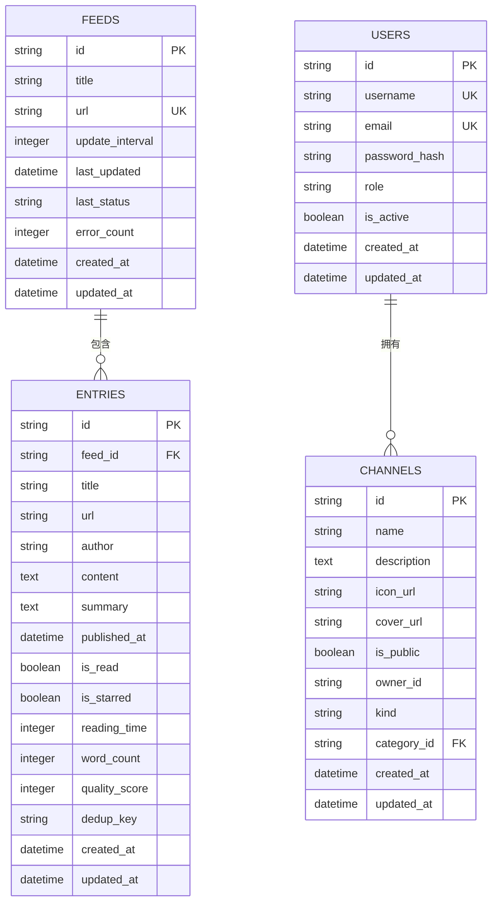
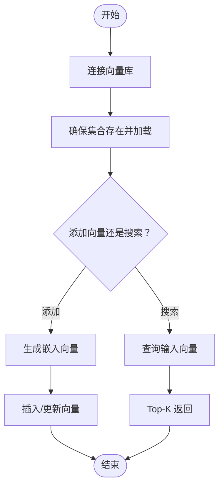
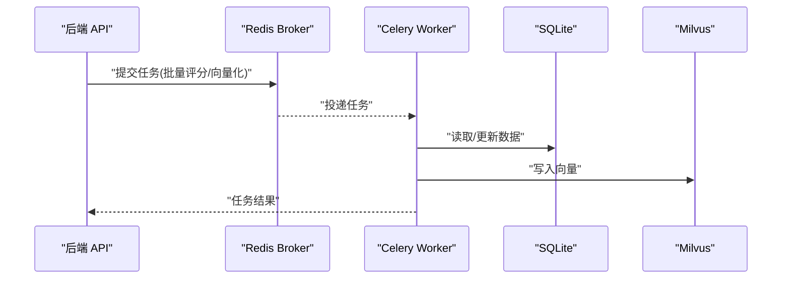
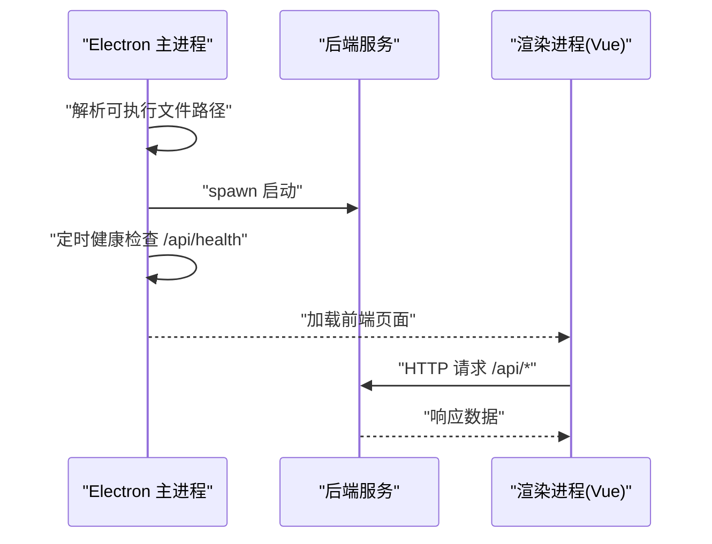
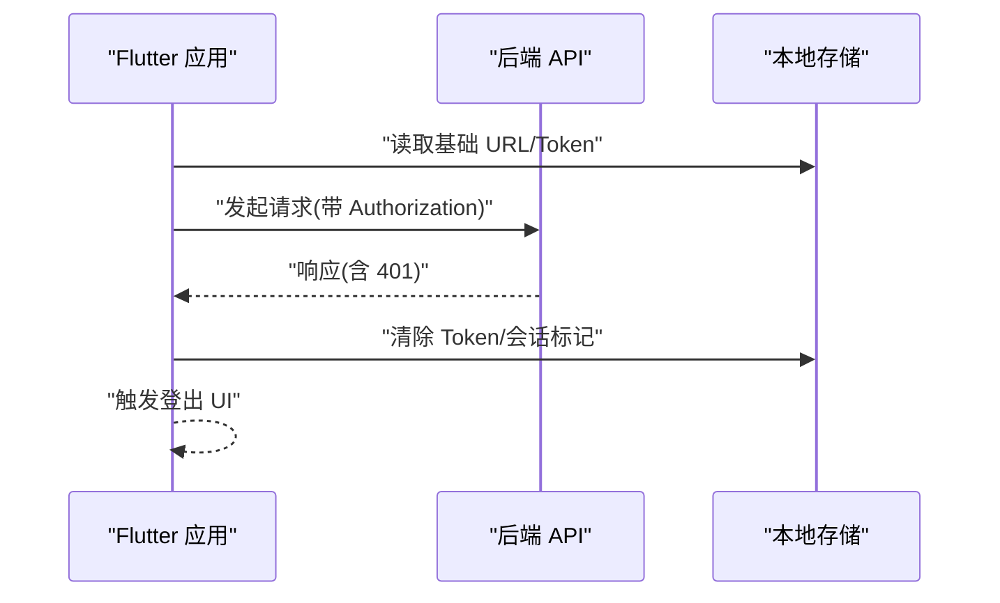
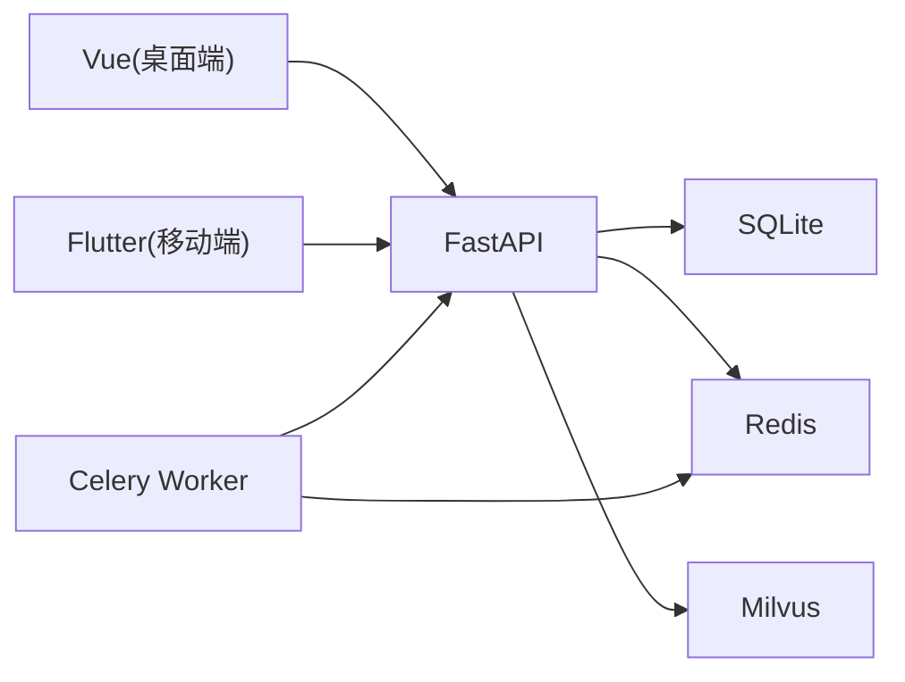

# 整体架构设计

<cite>
**本文档引用的文件**
- [python-backend/app/main.py](file://python-backend/app/main.py)
- [python-backend/app/config.py](file://python-backend/app/config.py)
- [python-backend/app/db.py](file://python-backend/app/db.py)
- [python-backend/app/models.py](file://python-backend/app/models.py)
- [python-backend/app/handlers/vector.py](file://python-backend/app/handlers/vector.py)
- [python-backend/app/handlers/vector_store.py](file://python-backend/app/handlers/vector_store.py)
- [python-backend/app/handlers/clustering.py](file://python-backend/app/handlers/clustering.py)
- [python-backend/app/celery_app.py](file://python-backend/app/celery_app.py)
- [python-backend/app/tasks/ai_tasks.py](file://python-backend/app/tasks/ai_tasks.py)
- [rss-desktop/src/main.ts](file://rss-desktop/src/main.ts)
- [rss-desktop/src/api/client.ts](file://rss-desktop/src/api/client.ts)
- [rss-desktop/electron/main.ts](file://rss-desktop/electron/main.ts)
- [tan_rss_mobile/lib/main.dart](file://tan_rss_mobile/lib/main.dart)
- [tan_rss_mobile/lib/core/api/api_client.dart](file://tan_rss_mobile/lib/core/api/api_client.dart)
</cite>

## 目录
1. [简介](#简介)
2. [项目结构](#项目结构)
3. [核心组件](#核心组件)
4. [架构总览](#架构总览)
5. [详细组件分析](#详细组件分析)
6. [依赖关系分析](#依赖关系分析)
7. [性能考量](#性能考量)
8. [故障排查指南](#故障排查指南)
9. [结论](#结论)
10. [附录](#附录)

## 简介
本文件为 Tan RSS Reader 的整体架构设计文档，面向后端 API 服务、桌面端客户端、移动端客户端以及向量数据库的微服务化分层设计。系统通过明确的系统边界与职责分离，实现前端三层（桌面端、移动端、Web端）与后端 API 服务的解耦；通过 HTTP REST API、任务队列与本地 IPC 通信实现组件间协作；通过可扩展的数据模型与向量检索能力支撑 AI 增强功能。

## 项目结构
项目采用多模块并行的组织方式：
- 后端 Python FastAPI 服务：提供 REST API、任务调度与向量检索能力
- 桌面端 Electron 应用：内嵌后端服务并提供本地 IPC 与系统集成
- 移动端 Flutter 应用：跨平台客户端，通过 HTTP 与后端交互
- 向量数据库：基于 Milvus 的嵌入向量检索与聚类分析

图表来源
- [python-backend/app/main.py:28-62](file://python-backend/app/main.py#L28-L62)
- [python-backend/app/db.py:24-25](file://python-backend/app/db.py#L24-L25)
- [python-backend/app/handlers/vector_store.py:18-54](file://python-backend/app/handlers/vector_store.py#L18-L54)
- [python-backend/app/celery_app.py:7-22](file://python-backend/app/celery_app.py#L7-L22)
- [rss-desktop/electron/main.ts:44-51](file://rss-desktop/electron/main.ts#L44-L51)

章节来源
- [python-backend/app/main.py:28-62](file://python-backend/app/main.py#L28-L62)
- [rss-desktop/electron/main.ts:44-51](file://rss-desktop/electron/main.ts#L44-L51)

## 核心组件
- 后端 API 服务（FastAPI）
  - 提供统一 REST 接口，包含认证、订阅、条目、AI、向量检索等路由
  - 启动时初始化数据库表结构与配置，并启动任务调度器
- 数据层（SQLite + SQLAlchemy ORM）
  - 定义 Feed、Entry、User、Channel、AI 配置等核心实体模型
  - 支持异步会话与自动建表迁移
- 任务系统（Celery + Redis）
  - 批量质量评分、向量化入库等后台任务
- 向量检索（Milvus + 嵌入模型）
  - 提供向量连接、搜索、索引构建与聚类分析
- 桌面端（Electron）
  - 内置后端服务生命周期管理、健康检查与 IPC 通信
- 移动端（Flutter）
  - 通过 Dio/HttpClient 发起 REST 请求，处理鉴权与会话状态

章节来源
- [python-backend/app/main.py:64-98](file://python-backend/app/main.py#L64-L98)
- [python-backend/app/models.py:7-228](file://python-backend/app/models.py#L7-L228)
- [python-backend/app/db.py:11-25](file://python-backend/app/db.py#L11-L25)
- [python-backend/app/celery_app.py:7-22](file://python-backend/app/celery_app.py#L7-L22)
- [python-backend/app/handlers/vector_store.py:18-54](file://python-backend/app/handlers/vector_store.py#L18-L54)
- [rss-desktop/electron/main.ts:197-273](file://rss-desktop/electron/main.ts#L197-L273)
- [tan_rss_mobile/lib/core/api/api_client.dart:19-42](file://tan_rss_mobile/lib/core/api/api_client.dart#L19-L42)

## 架构总览
系统采用“前端三层 + 后端 API 服务”的分层架构，后端通过 REST API 对外提供能力，内部通过 Celery 任务队列与 Milvus 向量库协同工作，实现 RSS 内容的采集、存储、检索与 AI 增强。

图表来源
- [python-backend/app/main.py:44-62](file://python-backend/app/main.py#L44-L62)
- [python-backend/app/handlers/vector.py:38-111](file://python-backend/app/handlers/vector.py#L38-L111)
- [python-backend/app/tasks/ai_tasks.py:16-87](file://python-backend/app/tasks/ai_tasks.py#L16-L87)
- [python-backend/app/handlers/vector_store.py:130-178](file://python-backend/app/handlers/vector_store.py#L130-L178)

## 详细组件分析

### 后端 API 服务（FastAPI）
- 路由组织：统一前缀 /api，按领域拆分路由模块（认证、订阅、条目、向量、AI 等）
- 中间件：全局 CORS 允许跨域访问
- 生命周期：启动时创建数据库表、加载应用与 AI 配置，启动任务调度器；关闭时停止调度器

图表来源
- [python-backend/app/main.py:44-62](file://python-backend/app/main.py#L44-L62)
- [python-backend/app/handlers/vector.py:108-157](file://python-backend/app/handlers/vector.py#L108-L157)
- [python-backend/app/tasks/ai_tasks.py:53-87](file://python-backend/app/tasks/ai_tasks.py#L53-L87)

章节来源
- [python-backend/app/main.py:28-62](file://python-backend/app/main.py#L28-L62)
- [python-backend/app/main.py:64-103](file://python-backend/app/main.py#L64-L103)

### 数据层（SQLite + SQLAlchemy ORM）
- 数据库 URL 自动推断：优先环境变量，其次相对路径下的 SQLite 文件
- 模型覆盖核心业务实体：Feed、Entry、User、Channel、AI 配置等
- 启动时自动建表与字段增强（如新增列）

图表来源
- [python-backend/app/models.py:7-228](file://python-backend/app/models.py#L7-L228)
- [python-backend/app/db.py:11-25](file://python-backend/app/db.py#L11-L25)

章节来源
- [python-backend/app/db.py:11-25](file://python-backend/app/db.py#L11-L25)
- [python-backend/app/models.py:7-228](file://python-backend/app/models.py#L7-L228)

### 向量检索与聚类（Milvus）
- 连接与集合管理：根据配置连接 Milvus，自动创建集合与索引
- 向量操作：添加条目、向量搜索、范围查询
- 聚类分析：基于 DBSCAN 的时间窗口聚类，计算主题代表性条目

图表来源
- [python-backend/app/handlers/vector_store.py:23-91](file://python-backend/app/handlers/vector_store.py#L23-L91)
- [python-backend/app/handlers/vector_store.py:92-128](file://python-backend/app/handlers/vector_store.py#L92-L128)
- [python-backend/app/handlers/vector_store.py:130-178](file://python-backend/app/handlers/vector_store.py#L130-L178)

章节来源
- [python-backend/app/handlers/vector_store.py:18-197](file://python-backend/app/handlers/vector_store.py#L18-L197)
- [python-backend/app/handlers/clustering.py:10-142](file://python-backend/app/handlers/clustering.py#L10-L142)

### 任务系统（Celery + Redis）
- 任务类型：批量质量评分、批量向量化
- 事件循环适配：在 Celery worker 中运行异步协程
- 任务配置：序列化、时区、超时与跟踪

图表来源
- [python-backend/app/celery_app.py:7-22](file://python-backend/app/celery_app.py#L7-L22)
- [python-backend/app/tasks/ai_tasks.py:8-14](file://python-backend/app/tasks/ai_tasks.py#L8-L14)
- [python-backend/app/tasks/ai_tasks.py:16-87](file://python-backend/app/tasks/ai_tasks.py#L16-L87)

章节来源
- [python-backend/app/celery_app.py:1-23](file://python-backend/app/celery_app.py#L1-L23)
- [python-backend/app/tasks/ai_tasks.py:16-87](file://python-backend/app/tasks/ai_tasks.py#L16-L87)

### 桌面端（Electron）
- 后端生命周期：启动/停止内置后端，健康检查，日志落盘
- IPC 通信：系统默认浏览器打开链接等
- 开发/生产模式：开发模式下可复用外部后端，生产模式下自动定位与启动

图表来源
- [rss-desktop/electron/main.ts:197-273](file://rss-desktop/electron/main.ts#L197-L273)
- [rss-desktop/electron/main.ts:44-51](file://rss-desktop/electron/main.ts#L44-L51)
- [rss-desktop/src/api/client.ts:3-6](file://rss-desktop/src/api/client.ts#L3-L6)

章节来源
- [rss-desktop/electron/main.ts:44-132](file://rss-desktop/electron/main.ts#L44-L132)
- [rss-desktop/src/api/client.ts:1-29](file://rss-desktop/src/api/client.ts#L1-L29)

### 移动端（Flutter）
- API 客户端：Dio 配置基础 URL、超时、拦截器
- 鉴权：本地安全存储 Token，401 触发登出回调
- 会话持久化：SharedPreferences 标记登录态

图表来源
- [tan_rss_mobile/lib/core/api/api_client.dart:19-42](file://tan_rss_mobile/lib/core/api/api_client.dart#L19-L42)
- [tan_rss_mobile/lib/main.dart:40-72](file://tan_rss_mobile/lib/main.dart#L40-L72)

章节来源
- [tan_rss_mobile/lib/core/api/api_client.dart:1-71](file://tan_rss_mobile/lib/core/api/api_client.dart#L1-L71)
- [tan_rss_mobile/lib/main.dart:1-153](file://tan_rss_mobile/lib/main.dart#L1-L153)

## 依赖关系分析
- 组件耦合
  - 前端仅依赖后端 REST 接口，耦合度低
  - 后端内部通过 Celery 与 Milvus 解耦，便于横向扩展
- 外部依赖
  - 数据库：SQLite（开发/单机）、可替换为 PostgreSQL
  - 任务队列：Redis（Celery Broker/Backend）
  - 向量库：Milvus（可本地 Lite 或远程部署）
- 配置中心
  - 环境变量与 .env 文件集中管理数据库、Redis、Milvus、AI 服务地址与密钥

图表来源
- [python-backend/app/config.py:41-71](file://python-backend/app/config.py#L41-L71)
- [python-backend/app/db.py:24-25](file://python-backend/app/db.py#L24-L25)
- [python-backend/app/celery_app.py:5-6](file://python-backend/app/celery_app.py#L5-L6)
- [python-backend/app/handlers/vector_store.py:27-47](file://python-backend/app/handlers/vector_store.py#L27-L47)

章节来源
- [python-backend/app/config.py:41-71](file://python-backend/app/config.py#L41-L71)
- [python-backend/app/db.py:24-25](file://python-backend/app/db.py#L24-L25)
- [python-backend/app/celery_app.py:5-6](file://python-backend/app/celery_app.py#L5-L6)

## 性能考量
- 数据库
  - 使用异步 SQLAlchemy 与连接池，减少阻塞
  - 建议在生产环境使用 PostgreSQL 并启用只读副本
- 向量检索
  - Milvus 索引参数（如 IVF_FLAT、nlist）需结合数据规模调优
  - 查询 nprobe 与 Top-K 影响延迟与召回率
- 任务处理
  - Celery 任务拆分批次，避免单次任务耗时过长
  - 为 AI 生成类任务设置较长接收超时
- 前端
  - 桌面端 Electron 使用本地后端可降低网络往返
  - 移动端合理缓存 Token 与基础 URL，减少重复 IO

## 故障排查指南
- 后端未就绪（桌面端）
  - 检查健康检查端点与日志路径，确认后端进程启动与端口占用
  - 关注启动超时与找不到可执行文件的错误提示
- 401 未授权
  - 桌面端：收到 401 触发自定义事件清理本地 Token
  - 移动端：拦截器清除 Token 并触发登出回调
- 向量库连接失败
  - 核对 Milvus 地址、端口与集合名配置
  - 确认向量维度与索引类型一致
- 任务队列堆积
  - 检查 Redis 连通性与队列长度
  - 适当增加 worker 数量与并发度

章节来源
- [rss-desktop/electron/main.ts:93-132](file://rss-desktop/electron/main.ts#L93-L132)
- [rss-desktop/src/api/client.ts:17-26](file://rss-desktop/src/api/client.ts#L17-L26)
- [tan_rss_mobile/lib/core/api/api_client.dart:34-41](file://tan_rss_mobile/lib/core/api/api_client.dart#L34-L41)
- [python-backend/app/handlers/vector_store.py:23-54](file://python-backend/app/handlers/vector_store.py#L23-L54)
- [python-backend/app/celery_app.py:14-22](file://python-backend/app/celery_app.py#L14-L22)

## 结论
Tan RSS Reader 采用清晰的前后端分层与微服务化思想：前端三层通过 HTTP 与后端解耦，后端通过 Celery 与 Milvus 实现可扩展的任务与检索能力。该架构兼顾可扩展性、可维护性与跨平台兼容性，适合在多端场景下持续演进与优化。

## 附录
- 技术选型与权衡
  - 后端：FastAPI 提供高性能与 OpenAPI 支持；Celery + Redis 实现异步任务；SQLite 适合单机/开发；Milvus 提供向量检索能力
  - 桌面端：Electron 内置后端简化部署；IPC 用于系统集成
  - 移动端：Flutter 跨平台；Dio 提供灵活的网络栈与拦截器
- 配置建议
  - 使用 .env 管理敏感配置；生产环境建议将数据库与 Milvus 外部化
  - 为 AI 生成类任务预留充足超时与资源