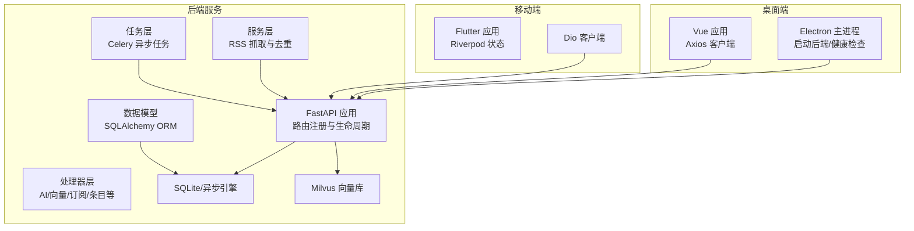
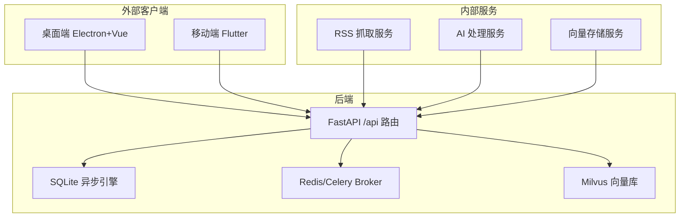
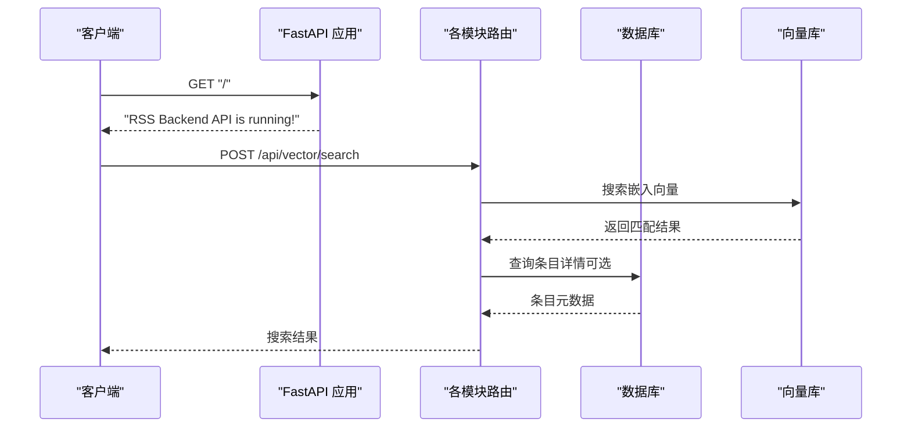
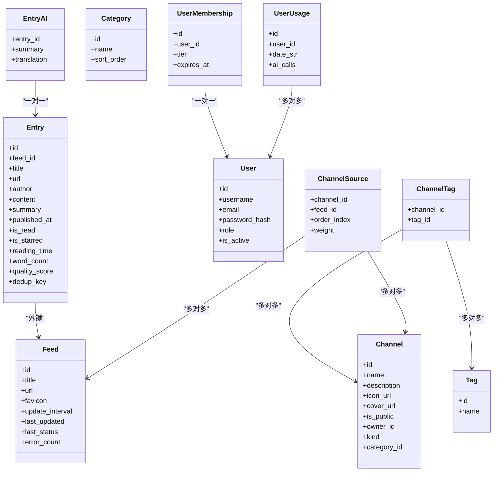
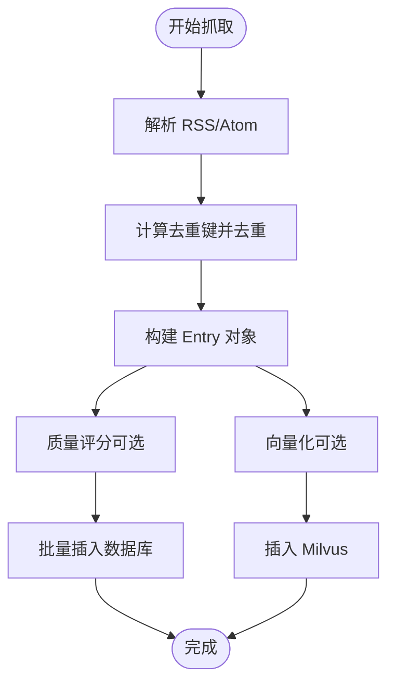
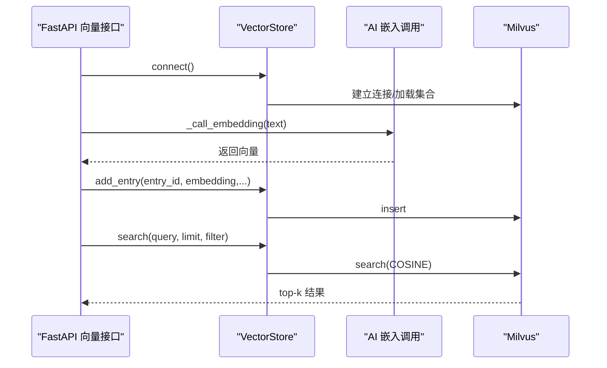
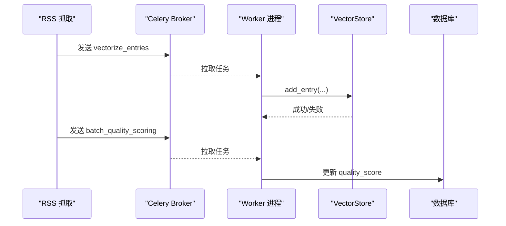
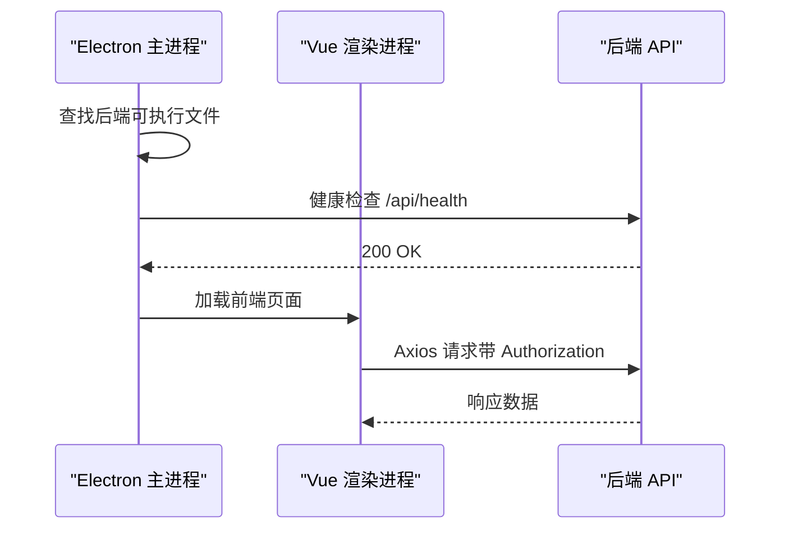
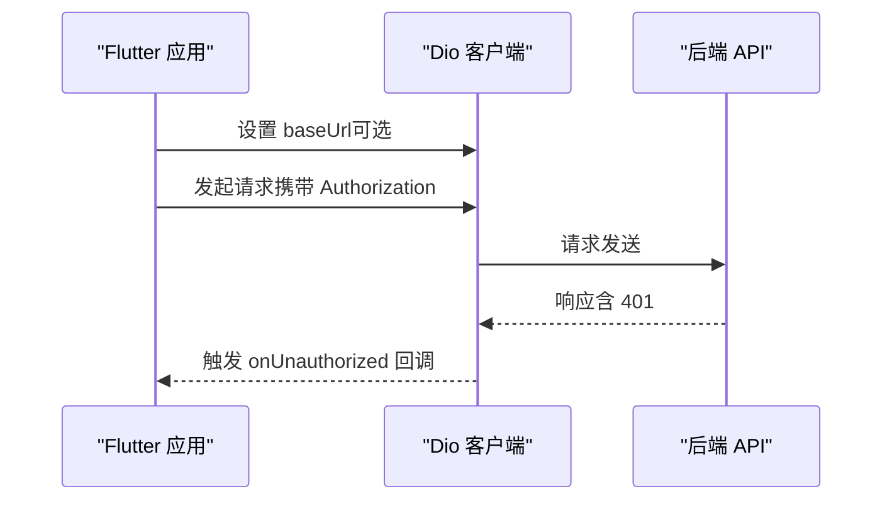
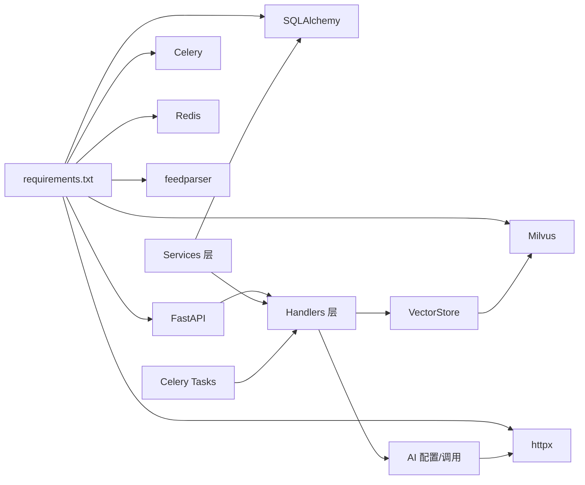

# 系统架构

<cite>
**本文引用的文件**
- [python-backend/app/main.py](file://python-backend/app/main.py)
- [python-backend/app/config.py](file://python-backend/app/config.py)
- [python-backend/app/db.py](file://python-backend/app/db.py)
- [python-backend/app/models.py](file://python-backend/app/models.py)
- [python-backend/app/handlers/vector.py](file://python-backend/app/handlers/vector.py)
- [python-backend/app/handlers/vector_store.py](file://python-backend/app/handlers/vector_store.py)
- [python-backend/app/handlers/ai.py](file://python-backend/app/handlers/ai.py)
- [python-backend/app/services/rss_fetcher.py](file://python-backend/app/services/rss_fetcher.py)
- [python-backend/app/tasks/ai_tasks.py](file://python-backend/app/tasks/ai_tasks.py)
- [python-backend/requirements.txt](file://python-backend/requirements.txt)
- [rss-desktop/electron/main.ts](file://rss-desktop/electron/main.ts)
- [rss-desktop/src/main.ts](file://rss-desktop/src/main.ts)
- [rss-desktop/src/api/client.ts](file://rss-desktop/src/api/client.ts)
- [rss-desktop/package.json](file://rss-desktop/package.json)
- [tan_rss_mobile/lib/main.dart](file://tan_rss_mobile/lib/main.dart)
- [tan_rss_mobile/lib/core/api/api_client.dart](file://tan_rss_mobile/lib/core/api/api_client.dart)
- [tan_rss_mobile/pubspec.yaml](file://tan_rss_mobile/pubspec.yaml)
</cite>

## 目录
1. [引言](#引言)
2. [项目结构](#项目结构)
3. [核心组件](#核心组件)
4. [架构总览](#架构总览)
5. [详细组件分析](#详细组件分析)
6. [依赖分析](#依赖分析)
7. [性能考量](#性能考量)
8. [故障排查指南](#故障排查指南)
9. [结论](#结论)
10. [附录](#附录)

## 引言
本系统为 Tan RSS Reader 的微服务架构文档，面向跨平台 RSS 阅读与智能增强场景，提供统一的后端 API 服务、桌面端 Electron+Vue 客户端、移动端 Flutter 客户端以及 Milvus 向量数据库的协同方案。系统通过 RSS 内容抓取、AI 处理（摘要、翻译、嵌入）、向量索引与检索、前端展示的完整链路，实现语义化搜索与智能推荐。

## 项目结构
系统采用多仓库模块化组织：
- 后端 Python FastAPI：提供 REST API、任务调度、AI 服务集成、向量数据库交互与数据库模型。
- 桌面端 Electron+Vue：基于 Vue 3 + Pinia 的桌面应用，通过 Axios 访问后端 API。
- 移动端 Flutter：基于 Riverpod 状态管理，通过 Dio 访问后端 API，并持久化认证令牌。
- 向量数据库 Milvus：用于嵌入向量的存储、索引与相似度检索。

图表来源
- [python-backend/app/main.py:28-62](file://python-backend/app/main.py#L28-L62)
- [python-backend/app/services/rss_fetcher.py:104-312](file://python-backend/app/services/rss_fetcher.py#L104-L312)
- [python-backend/app/handlers/vector_store.py:18-197](file://python-backend/app/handlers/vector_store.py#L18-L197)
- [rss-desktop/electron/main.ts:449-506](file://rss-desktop/electron/main.ts#L449-L506)
- [rss-desktop/src/api/client.ts:1-29](file://rss-desktop/src/api/client.ts#L1-L29)
- [tan_rss_mobile/lib/core/api/api_client.dart:1-71](file://tan_rss_mobile/lib/core/api/api_client.dart#L1-L71)

章节来源
- [python-backend/app/main.py:28-62](file://python-backend/app/main.py#L28-L62)
- [rss-desktop/electron/main.ts:449-506](file://rss-desktop/electron/main.ts#L449-L506)
- [rss-desktop/src/api/client.ts:1-29](file://rss-desktop/src/api/client.ts#L1-L29)
- [tan_rss_mobile/lib/core/api/api_client.dart:1-71](file://tan_rss_mobile/lib/core/api/api_client.dart#L1-L71)

## 核心组件
- 后端 API 服务（FastAPI）
  - 路由聚合：统一前缀 /api，涵盖认证、订阅、条目、向量、AI、OPML 等模块。
  - 生命周期：启动时创建表结构、迁移字段、初始化 AI 配置与任务调度器；关闭时停止调度器。
- 数据库与模型（SQLAlchemy Async + SQLite）
  - 异步连接与会话管理；定义 Feed、Entry、AI 记录、用户与频道等模型。
- RSS 抓取与去重（服务层）
  - 使用 feedparser 解析，计算去重键，批量插入条目，触发向量化与质量评分任务。
- AI 与向量（处理器层 + Milvus）
  - 提供摘要、翻译、嵌入调用；封装 Milvus 连接、集合创建、插入、查询与搜索。
- 异步任务（Celery + Redis）
  - 批量质量评分与向量化，后台触发，提升吞吐与稳定性。
- 桌面端 Electron+Vue
  - 主进程负责启动/监控后端服务，渲染进程通过 Axios 访问后端 API。
- 移动端 Flutter
  - 通过 Dio 客户端访问后端 API，本地持久化认证令牌与基础地址。

章节来源
- [python-backend/app/main.py:40-103](file://python-backend/app/main.py#L40-L103)
- [python-backend/app/db.py:1-27](file://python-backend/app/db.py#L1-L27)
- [python-backend/app/models.py:1-228](file://python-backend/app/models.py#L1-L228)
- [python-backend/app/services/rss_fetcher.py:104-312](file://python-backend/app/services/rss_fetcher.py#L104-L312)
- [python-backend/app/handlers/ai.py:34-64](file://python-backend/app/handlers/ai.py#L34-L64)
- [python-backend/app/handlers/vector_store.py:18-197](file://python-backend/app/handlers/vector_store.py#L18-L197)
- [python-backend/app/tasks/ai_tasks.py:16-87](file://python-backend/app/tasks/ai_tasks.py#L16-L87)
- [rss-desktop/electron/main.ts:449-506](file://rss-desktop/electron/main.ts#L449-L506)
- [rss-desktop/src/api/client.ts:1-29](file://rss-desktop/src/api/client.ts#L1-L29)
- [tan_rss_mobile/lib/core/api/api_client.dart:1-71](file://tan_rss_mobile/lib/core/api/api_client.dart#L1-L71)

## 架构总览
系统边界与交互关系如下：

图表来源
- [python-backend/app/main.py:44-62](file://python-backend/app/main.py#L44-L62)
- [python-backend/app/services/rss_fetcher.py:283-312](file://python-backend/app/services/rss_fetcher.py#L283-L312)
- [python-backend/app/handlers/vector_store.py:23-54](file://python-backend/app/handlers/vector_store.py#L23-L54)
- [python-backend/requirements.txt:14-17](file://python-backend/requirements.txt#L14-L17)

## 详细组件分析

### 后端 API 服务（FastAPI）
- 路由组织：集中注册图标、任务、OPML、设置、AI、RSSHub、订阅、条目、代理、频道、认证、用户、分类、标签、向量、源包、会员、提示词等模块。
- 生命周期：
  - 启动：创建表结构、迁移字段、读取应用设置、初始化 AI 配置、启动任务调度器。
  - 关闭：停止任务调度器。
- CORS 中间件：允许任意来源、方法与头，便于跨端访问。

图表来源
- [python-backend/app/main.py:40-62](file://python-backend/app/main.py#L40-L62)
- [python-backend/app/handlers/vector.py:108-111](file://python-backend/app/handlers/vector.py#L108-L111)
- [python-backend/app/handlers/vector_store.py:130-178](file://python-backend/app/handlers/vector_store.py#L130-L178)

章节来源
- [python-backend/app/main.py:28-103](file://python-backend/app/main.py#L28-L103)

### 数据库与模型（SQLAlchemy Async + SQLite）
- 异步引擎：根据环境变量或相对路径生成 SQLite URL，默认在 data/rss.db。
- 模型覆盖：Feed、Entry、AI 记录、用户、频道、分类、标签、渠道源、会员与用量等。
- 启动迁移：在启动阶段尝试添加品牌开关、质量分等列，保证数据库演进兼容。

图表来源
- [python-backend/app/db.py:11-25](file://python-backend/app/db.py#L11-L25)
- [python-backend/app/models.py:7-228](file://python-backend/app/models.py#L7-L228)

章节来源
- [python-backend/app/db.py:1-27](file://python-backend/app/db.py#L1-L27)
- [python-backend/app/models.py:1-228](file://python-backend/app/models.py#L1-L228)

### RSS 抓取与去重（服务层）
- 去重策略：规范化 URL、标准化标题与内容哈希，生成固定长度去重键，避免重复入库。
- 内容解析：feedparser 解析，提取标题、作者、摘要、正文、发布时间等。
- 质量评分：基于字数与标题长度的启发式打分，异步提交 Celery 或直接执行。
- 向量化：构造文本内容，截断至合理长度，异步调用 Milvus 插入向量。
- 错误处理：网络/HTTP 错误记录状态与计数，成功后清理错误计数。

图表来源
- [python-backend/app/services/rss_fetcher.py:13-28](file://python-backend/app/services/rss_fetcher.py#L13-L28)
- [python-backend/app/services/rss_fetcher.py:104-312](file://python-backend/app/services/rss_fetcher.py#L104-L312)

章节来源
- [python-backend/app/services/rss_fetcher.py:104-312](file://python-backend/app/services/rss_fetcher.py#L104-L312)

### AI 与向量（处理器层 + Milvus）
- AI 配置：支持摘要、翻译、嵌入服务的 API Key、Base URL、模型名与特性开关；支持按用户与会员等级动态覆盖。
- 向量存储：自动连接 Milvus（支持本地 Lite），创建集合与索引（COSINE/IVF_FLAT），插入/查询/搜索。
- 向量接口：提供连接、聚类、分析、搜索与索引进口，支持按频道过滤与后台任务触发。

图表来源
- [python-backend/app/handlers/vector_store.py:18-197](file://python-backend/app/handlers/vector_store.py#L18-L197)
- [python-backend/app/handlers/ai.py:34-64](file://python-backend/app/handlers/ai.py#L34-L64)
- [python-backend/app/handlers/vector.py:108-111](file://python-backend/app/handlers/vector.py#L108-L111)

章节来源
- [python-backend/app/handlers/vector.py:1-158](file://python-backend/app/handlers/vector.py#L1-L158)
- [python-backend/app/handlers/vector_store.py:18-197](file://python-backend/app/handlers/vector_store.py#L18-L197)
- [python-backend/app/handlers/ai.py:34-64](file://python-backend/app/handlers/ai.py#L34-L64)

### 异步任务（Celery + Redis）
- 任务类型：批量质量评分、批量向量化。
- 触发方式：抓取完成后根据环境变量决定是否使用 Celery，失败时回退到异步任务。
- 任务执行：在独立进程中执行，避免阻塞主请求线程。

图表来源
- [python-backend/app/services/rss_fetcher.py:283-312](file://python-backend/app/services/rss_fetcher.py#L283-L312)
- [python-backend/app/tasks/ai_tasks.py:16-87](file://python-backend/app/tasks/ai_tasks.py#L16-L87)

章节来源
- [python-backend/app/tasks/ai_tasks.py:16-87](file://python-backend/app/tasks/ai_tasks.py#L16-L87)
- [python-backend/app/services/rss_fetcher.py:283-312](file://python-backend/app/services/rss_fetcher.py#L283-L312)

### 桌面端 Electron+Vue
- 主进程职责：启动/监控后端服务，健康检查，日志与错误处理，窗口生命周期管理。
- 渲染进程：Vue 应用，Axios 客户端，自动注入 Bearer Token，401 自动登出事件。
- 开发/生产差异：开发模式下可复用外部后端，生产模式下内置后端可执行文件。

图表来源
- [rss-desktop/electron/main.ts:93-132](file://rss-desktop/electron/main.ts#L93-L132)
- [rss-desktop/electron/main.ts:449-506](file://rss-desktop/electron/main.ts#L449-L506)
- [rss-desktop/src/api/client.ts:1-29](file://rss-desktop/src/api/client.ts#L1-L29)

章节来源
- [rss-desktop/electron/main.ts:449-506](file://rss-desktop/electron/main.ts#L449-L506)
- [rss-desktop/src/api/client.ts:1-29](file://rss-desktop/src/api/client.ts#L1-L29)

### 移动端 Flutter
- 客户端：Dio 拦截器自动注入 Bearer Token，401 回调登出逻辑。
- 配置：默认后端地址可被用户保存，SharedPreferences 记录会话状态。
- 状态管理：Riverpod 提供主题、外观与认证状态管理。

图表来源
- [tan_rss_mobile/lib/core/api/api_client.dart:1-71](file://tan_rss_mobile/lib/core/api/api_client.dart#L1-L71)
- [tan_rss_mobile/lib/main.dart:40-55](file://tan_rss_mobile/lib/main.dart#L40-L55)

章节来源
- [tan_rss_mobile/lib/core/api/api_client.dart:1-71](file://tan_rss_mobile/lib/core/api/api_client.dart#L1-L71)
- [tan_rss_mobile/lib/main.dart:40-55](file://tan_rss_mobile/lib/main.dart#L40-L55)

## 依赖分析
- 技术栈与版本约束：FastAPI、Uvicorn、Pydantic、SQLAlchemy、aiosqlite、Celery、Redis、Milvus、feedparser、httpx 等。
- 外部依赖：Redis 作为 Celery Broker；Milvus 作为向量数据库；SQLite 作为本地持久化存储。
- 组件耦合：处理器层依赖向量存储与 AI 配置；服务层依赖处理器与数据库；桌面/移动端仅依赖 API。

图表来源
- [python-backend/requirements.txt:1-18](file://python-backend/requirements.txt#L1-L18)

章节来源
- [python-backend/requirements.txt:1-18](file://python-backend/requirements.txt#L1-L18)

## 性能考量
- 并发与异步：后端使用 SQLAlchemy Async 与 asyncio，减少阻塞；Milvus 操作通过线程池避免阻塞事件循环。
- 向量检索：Milvus 使用 COSINE 距离与 IVF_FLAT 索引，nprobe 控制召回与延迟权衡。
- 文本截断：向量化与 AI 调用前对输入文本进行截断，避免超长上下文导致的性能与成本问题。
- 任务解耦：质量评分与向量化通过 Celery 异步执行，保障请求响应时间。
- 去重与批处理：抓取阶段进行去重与批处理，降低数据库与 Milvus 写入压力。

## 故障排查指南
- 后端未就绪（桌面端）：检查主进程健康检查 URL 与端口，确认后端进程已启动且返回 200。
- Milvus 连接失败：确认 AI 配置中的 Milvus 地址、端口与集合名；若使用本地 Lite，确认 URI 路径有效。
- 401 未授权：检查客户端是否正确注入 Bearer Token；桌面端与移动端均在拦截器中处理 401。
- 向量检索为空：确认已触发索引任务，且 Milvus 集合已加载；检查查询条件与 nprobe 设置。
- Celery 任务未执行：确认 Redis 正常运行与 USE_CELERY 环境变量；查看 Worker 日志。

章节来源
- [rss-desktop/electron/main.ts:93-132](file://rss-desktop/electron/main.ts#L93-L132)
- [python-backend/app/handlers/vector_store.py:23-54](file://python-backend/app/handlers/vector_store.py#L23-L54)
- [rss-desktop/src/api/client.ts:17-26](file://rss-desktop/src/api/client.ts#L17-L26)
- [tan_rss_mobile/lib/core/api/api_client.dart:34-41](file://tan_rss_mobile/lib/core/api/api_client.dart#L34-L41)

## 结论
本架构以 FastAPI 为核心，结合 Celery 异步任务、SQLite 本地存储与 Milvus 向量检索，形成“RSS 抓取 → AI 处理 → 向量存储 → 前端展示”的闭环。桌面端与移动端通过统一 API 实现跨平台一致体验。技术选型在可扩展性、性能与开发效率之间取得平衡，适合中小规模到中等规模的 RSS 智能增强场景。

## 附录
- 环境变量与配置要点
  - 数据库：支持通过环境变量覆盖数据库 URL。
  - Redis/Celery：默认 Redis 地址，用于任务队列。
  - Milvus：主机、端口与集合名可通过环境变量或 AI 配置覆盖。
  - 后端服务：主机与端口默认绑定，便于本地开发与部署。
- 跨平台与部署建议
  - 桌面端：开发模式复用外部后端，生产模式内置后端可执行文件并进行健康检查。
  - 移动端：默认后端地址可被用户覆盖，建议在发布版中提供配置入口。
  - 向量库：生产环境建议使用远程 Milvus，本地开发可用 Lite；注意集合维度与索引参数。

章节来源
- [python-backend/app/config.py:41-75](file://python-backend/app/config.py#L41-L75)
- [rss-desktop/electron/main.ts:137-192](file://rss-desktop/electron/main.ts#L137-L192)
- [tan_rss_mobile/lib/core/api/api_client.dart:46-48](file://tan_rss_mobile/lib/core/api/api_client.dart#L46-L48)