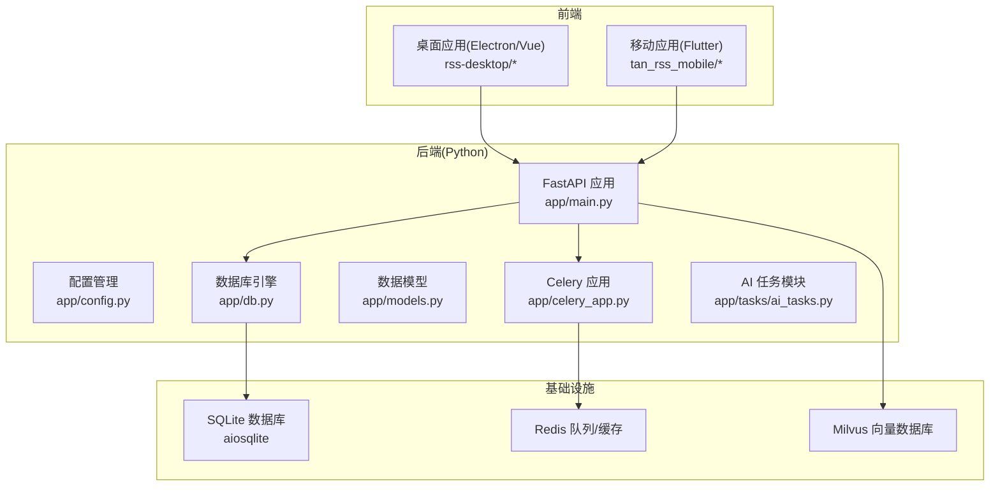
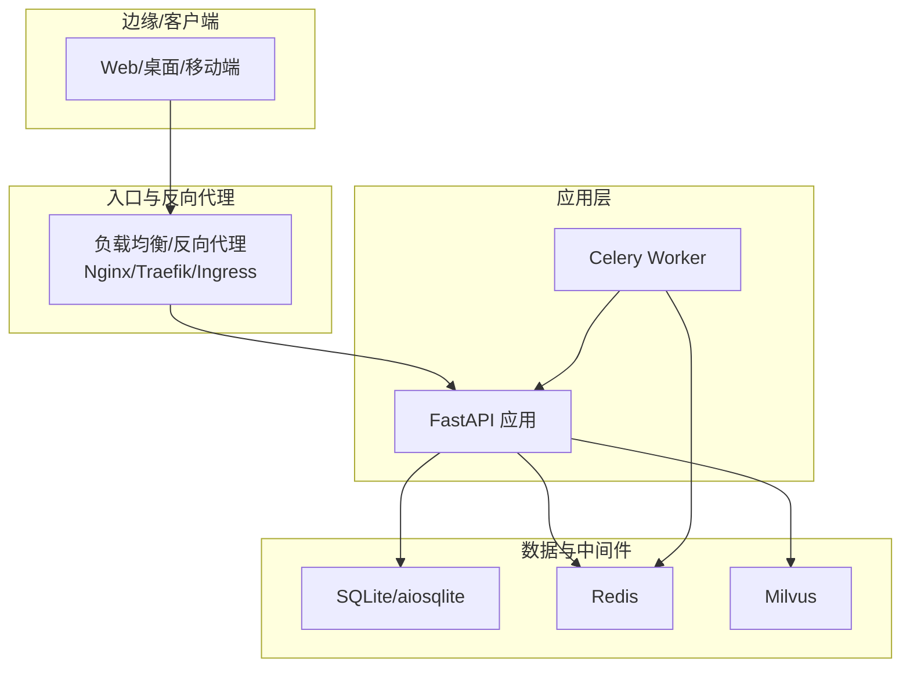
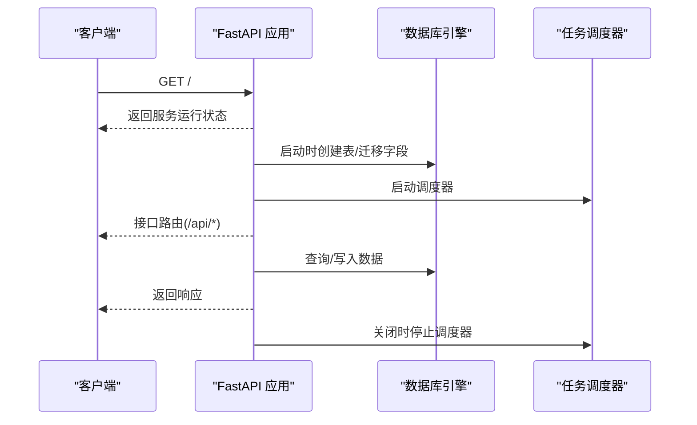
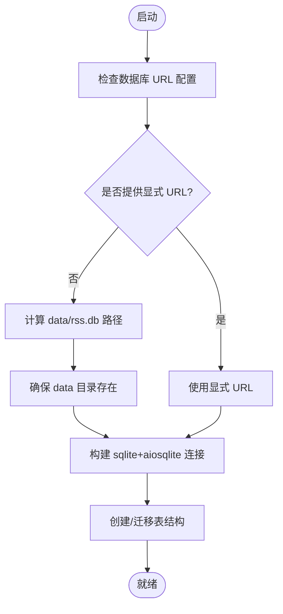
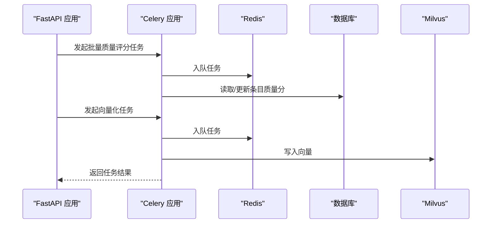
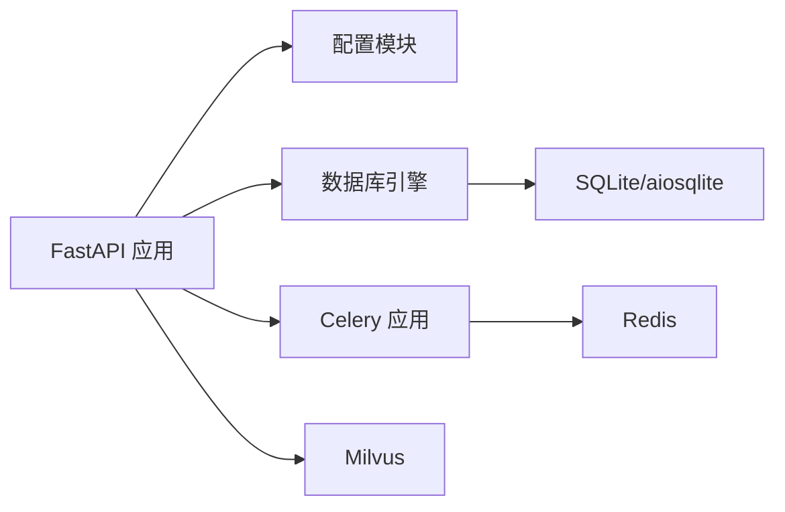

# 部署架构

<cite>
**本文引用的文件**
- [requirements.txt](file://python-backend/requirements.txt)
- [config.py](file://python-backend/app/config.py)
- [main.py](file://python-backend/app/main.py)
- [db.py](file://python-backend/app/db.py)
- [models.py](file://python-backend/app/models.py)
- [celery_app.py](file://python-backend/app/celery_app.py)
- [ai_tasks.py](file://python-backend/app/tasks/ai_tasks.py)
- [start_celery.sh](file://python-backend/scripts/start_celery.sh)
- [start.sh](file://start.sh)
- [start-backend.sh](file://rss-desktop/resources/start-backend.sh)
- [flutter_ci.yml](file://.github/workflows/flutter_ci.yml)
</cite>

## 目录
1. [简介](#简介)
2. [项目结构](#项目结构)
3. [核心组件](#核心组件)
4. [架构总览](#架构总览)
5. [详细组件分析](#详细组件分析)
6. [依赖关系分析](#依赖关系分析)
7. [性能考虑](#性能考虑)
8. [故障排查指南](#故障排查指南)
9. [结论](#结论)
10. [附录](#附录)

## 简介
本文件面向 Tan RSS Reader 的部署与运维，覆盖单机部署、容器化部署与云原生部署三种方案；明确 Python 后端服务的依赖安装、数据库与向量库配置、Celery 任务队列设置；梳理 GitHub Actions 自动化测试与构建流程；给出负载均衡与高可用建议、故障恢复机制、部署架构图、环境配置模板与运维监控要点，并提供不同规模部署的推荐配置与性能调优建议。

## 项目结构
Tan RSS Reader 采用多语言混合架构：后端使用 Python FastAPI 提供 REST API，前端包含桌面应用（Electron/Vue 3）与移动端（Flutter）。后端通过 SQLAlchemy 异步 ORM 访问 SQLite 数据库，使用 Celery + Redis 执行异步任务，向量检索能力通过 Milvus 实现。

图表来源
- [main.py:1-103](file://python-backend/app/main.py#L1-L103)
- [config.py:1-75](file://python-backend/app/config.py#L1-L75)
- [db.py:1-27](file://python-backend/app/db.py#L1-L27)
- [models.py:1-228](file://python-backend/app/models.py#L1-L228)
- [celery_app.py:1-23](file://python-backend/app/celery_app.py#L1-L23)
- [ai_tasks.py:1-87](file://python-backend/app/tasks/ai_tasks.py#L1-L87)

章节来源
- [main.py:1-103](file://python-backend/app/main.py#L1-L103)
- [config.py:1-75](file://python-backend/app/config.py#L1-L75)
- [db.py:1-27](file://python-backend/app/db.py#L1-L27)
- [models.py:1-228](file://python-backend/app/models.py#L1-L228)
- [celery_app.py:1-23](file://python-backend/app/celery_app.py#L1-L23)
- [ai_tasks.py:1-87](file://python-backend/app/tasks/ai_tasks.py#L1-L87)

## 核心组件
- 后端 API 服务：基于 FastAPI，提供认证、订阅源、条目、AI、向量检索等接口路由。
- 数据层：基于 SQLAlchemy 异步引擎连接 SQLite，默认使用相对路径存储于 data/rss.db。
- 任务系统：Celery + Redis，执行批量质量评分与向量化等 AI 后台任务。
- 向量检索：通过 Milvus 连接参数配置，支持条目向量化与检索。
- 启动脚本：提供一键启动后端与前端的脚本，便于本地开发与演示。

章节来源
- [main.py:1-103](file://python-backend/app/main.py#L1-L103)
- [db.py:1-27](file://python-backend/app/db.py#L1-L27)
- [celery_app.py:1-23](file://python-backend/app/celery_app.py#L1-L23)
- [config.py:1-75](file://python-backend/app/config.py#L1-L75)

## 架构总览
下图展示从客户端到后端服务、数据库与任务系统的整体部署拓扑，以及可选的容器化与云原生扩展点。

图表来源
- [main.py:1-103](file://python-backend/app/main.py#L1-L103)
- [db.py:1-27](file://python-backend/app/db.py#L1-L27)
- [celery_app.py:1-23](file://python-backend/app/celery_app.py#L1-L23)
- [config.py:1-75](file://python-backend/app/config.py#L1-L75)

## 详细组件分析

### 组件一：后端 API 服务（FastAPI）
- 路由组织：在主程序中集中注册各类业务路由，统一前缀 /api。
- 启停事件：启动时创建表结构并初始化调度器；关闭时停止调度器。
- CORS：默认允许跨域请求，便于前端访问。
- 配置来源：通过配置模块统一读取环境变量与 .env 文件。

图表来源
- [main.py:1-103](file://python-backend/app/main.py#L1-L103)
- [db.py:1-27](file://python-backend/app/db.py#L1-L27)

章节来源
- [main.py:1-103](file://python-backend/app/main.py#L1-L103)

### 组件二：数据库与模型（SQLAlchemy + SQLite）
- 数据库引擎：异步 SQLAlchemy 引擎，优先使用显式配置的数据库 URL，否则在 data 目录下创建 sqlite+aiosqlite 文件。
- 模型定义：涵盖 Feed、Entry、用户与订阅、标签与频道、AI 相关记录等。
- 初始化：启动时自动建表并尝试添加新字段，保证数据库演进兼容。

图表来源
- [db.py:1-27](file://python-backend/app/db.py#L1-L27)
- [models.py:1-228](file://python-backend/app/models.py#L1-L228)

章节来源
- [db.py:1-27](file://python-backend/app/db.py#L1-L27)
- [models.py:1-228](file://python-backend/app/models.py#L1-L228)

### 组件三：Celery 任务队列与 AI 任务
- Celery 应用：基于 Redis 作为 broker 与 backend，注册 AI 相关任务模块。
- 任务类型：批量质量评分、条目向量化。
- 启动方式：提供独立脚本启动 Celery Worker，支持日志级别配置。

图表来源
- [celery_app.py:1-23](file://python-backend/app/celery_app.py#L1-L23)
- [ai_tasks.py:1-87](file://python-backend/app/tasks/ai_tasks.py#L1-L87)
- [start_celery.sh:1-5](file://python-backend/scripts/start_celery.sh#L1-L5)

章节来源
- [celery_app.py:1-23](file://python-backend/app/celery_app.py#L1-L23)
- [ai_tasks.py:1-87](file://python-backend/app/tasks/ai_tasks.py#L1-L87)
- [start_celery.sh:1-5](file://python-backend/scripts/start_celery.sh#L1-L5)

### 组件四：配置与环境变量
- 配置类：EnvSettings 统一管理数据库、Redis、Milvus、AI 服务、服务器监听地址等。
- 加载机制：支持 .env 文件与环境变量，键名与默认值见配置模块。
- 应用配置：AppSettings 与 AI 配置对象用于运行期行为控制。

章节来源
- [config.py:1-75](file://python-backend/app/config.py#L1-L75)

### 组件五：启动脚本与集成
- 开发启动脚本：一键启动后端（Uvicorn）与前端（Vite），自动创建虚拟环境并安装依赖。
- 桌面应用启动脚本：在生产模式下启动后端与 Rust 后端二进制，便于打包发布。

章节来源
- [start.sh:1-94](file://start.sh#L1-L94)
- [start-backend.sh:1-29](file://rss-desktop/resources/start-backend.sh#L1-L29)

## 依赖关系分析
- 外部依赖：FastAPI、Uvicorn、SQLAlchemy、aiosqlite、Celery、Redis、Milvus、Scikit-learn 等。
- 内部耦合：API 依赖配置模块与数据库引擎；Celery 依赖 Redis；AI 任务依赖数据库与 Milvus。
- 可能的循环依赖：当前代码未发现直接循环导入；Celery 任务通过延迟导入避免循环。

图表来源
- [requirements.txt:1-18](file://python-backend/requirements.txt#L1-L18)
- [main.py:1-103](file://python-backend/app/main.py#L1-L103)
- [db.py:1-27](file://python-backend/app/db.py#L1-L27)
- [celery_app.py:1-23](file://python-backend/app/celery_app.py#L1-L23)
- [config.py:1-75](file://python-backend/app/config.py#L1-L75)

章节来源
- [requirements.txt:1-18](file://python-backend/requirements.txt#L1-L18)
- [main.py:1-103](file://python-backend/app/main.py#L1-L103)
- [db.py:1-27](file://python-backend/app/db.py#L1-L27)
- [celery_app.py:1-23](file://python-backend/app/celery_app.py#L1-L23)
- [config.py:1-75](file://python-backend/app/config.py#L1-L75)

## 性能考虑
- 数据库性能
  - 使用异步 SQLAlchemy 与 aiosqlite，适合中小规模并发；如需更高吞吐，建议迁移到 PostgreSQL 并启用连接池。
  - 对高频查询字段建立索引（如条目 feed_id、去重键等），减少扫描开销。
- 任务队列性能
  - Celery 使用 Redis 作为 broker/backend，建议独立部署 Redis 并开启持久化与合理内存上限。
  - 任务超时与序列化：已设置 JSON 序列化与 UTC 时间与时限，避免长时间任务阻塞队列。
- 向量检索性能
  - Milvus 集群部署时，合理设置副本数与分片，结合倒排索引与向量距离算法优化查询延迟。
- API 性能
  - 生产环境使用 Uvicorn 多工作进程；根据 CPU 核心数设置 workers 数量。
  - 启用 Gzip/Br 压缩与合适的缓存头，降低带宽占用。
- 资源限制
  - Docker/容器编排中为数据库、Redis、Milvus 分配独立资源配额，避免资源争抢。

## 故障排查指南
- 启动失败
  - 检查 Python 版本与虚拟环境是否正确激活；确认端口未被占用。
  - 查看后端日志与前端控制台输出，定位依赖缺失或端口绑定问题。
- 数据库异常
  - 确认 data 目录可写；若迁移失败，检查已有表结构与字段是否存在。
- Celery 任务失败
  - 检查 Redis 连接字符串与网络连通性；查看任务日志中的异常堆栈。
- 向量检索不可用
  - 校验 Milvus 地址、端口与集合名称；确认网络可达与认证配置。
- CI/CD 流水线
  - Flutter 测试与构建任务仅针对移动端；后端测试可在本地或专用流水线中补充。

章节来源
- [start.sh:1-94](file://start.sh#L1-L94)
- [start-backend.sh:1-29](file://rss-desktop/resources/start-backend.sh#L1-L29)
- [main.py:64-103](file://python-backend/app/main.py#L64-L103)
- [celery_app.py:1-23](file://python-backend/app/celery_app.py#L1-L23)
- [config.py:41-75](file://python-backend/app/config.py#L41-L75)
- [flutter_ci.yml:1-43](file://.github/workflows/flutter_ci.yml#L1-L43)

## 结论
Tan RSS Reader 的部署以“单机开发 + 多组件协作”为核心，通过 FastAPI 提供 API、SQLite 存储、Redis/Celery 执行任务、Milvus 支持向量检索。生产部署建议采用容器化与云原生方案，配合独立数据库、Redis 与 Milvus 集群，实现高可用与弹性伸缩。CI/CD 当前聚焦移动端，建议补充后端测试与构建流水线，完善自动化发布。

## 附录

### 部署方案与拓扑

- 单机部署（开发/小规模）
  - 后端：Uvicorn + FastAPI，SQLite，Redis，Milvus 均在本机或同一主机。
  - 启动：使用开发脚本一键启动后端与前端。
  - 适用：个人使用、演示、小团队内测。

- 容器化部署（Docker）
  - 容器编排：后端、数据库、Redis、Milvus 各自容器，通过网络互联。
  - 端口映射：后端对外暴露 API 端口；数据库、Redis、Milvus 按需映射管理端口。
  - 持久化：挂载数据卷至 SQLite、Milvus 数据目录与 Redis 持久化目录。
  - 优势：隔离性强、易于复制与回滚。

- 云原生部署（Kubernetes）
  - 资源对象：Deployment（后端）、StatefulSet（数据库/Milvus）、Service（暴露 API）、ConfigMap/Secret（配置与密钥）。
  - 负载均衡：Ingress/NLB 暴露 API；后端多副本水平扩展。
  - 存储：PersistentVolume（数据库与 Milvus）；Redis 使用集群版或托管服务。
  - 监控：Prometheus/Grafana + 日志采集（ELK/Fluentd）。

### CI/CD 流程（当前）
- 触发条件：推送 main 分支或拉取请求。
- 步骤：检出代码、安装 Java 与 Flutter、分析代码、运行测试、构建 APK。
- 建议：增加后端测试与构建步骤，完善制品归档与发布流程。

章节来源
- [flutter_ci.yml:1-43](file://.github/workflows/flutter_ci.yml#L1-L43)

### 负载均衡与高可用
- 负载均衡：Nginx/Traefik/Ingress 将请求分发至后端多个副本。
- 高可用：后端多实例；数据库使用主从或托管高可用；Redis 使用哨兵/集群；Milvus 使用副本与分片。
- 故障恢复：健康检查失败自动摘除；任务队列重试与死信队列；数据库备份与回滚演练。

### 环境配置模板
- 数据库
  - PY_BACKEND_DB_URL：显式指定数据库 URL（优先级高于默认 SQLite 路径）
- Redis/Celery
  - REDIS_URL 或 env_settings.redis_url：Redis 连接串
- 向量数据库（Milvus）
  - milvus_host、milvus_port、milvus_collection：向量库连接参数
- AI 服务
  - aurora_ai_api_key、aurora_ai_base_url、aurora_ai_model、aurora_ai_embedding_model：默认 AI 服务配置
- 服务器
  - host、port：后端监听地址与端口

章节来源
- [config.py:41-75](file://python-backend/app/config.py#L41-L75)

### 运维监控方案
- 指标采集：后端接口耗时、错误率、并发数；数据库慢查询；Redis 队列长度；Milvus 查询延迟与命中率。
- 日志：后端访问日志、错误日志；Celery 任务日志；数据库与中间件日志。
- 告警：阈值告警（错误率、延迟、队列堆积、磁盘空间）；健康检查失败自动告警。
- 可视化：Grafana 仪表盘展示关键指标；Kibana/Elasticsearch 查看日志。

### 不同规模部署推荐配置
- 小规模（单机/小型办公）
  - 后端：1-2 个 Uvicorn 工作进程；SQLite；单实例 Redis/Milvus
  - 网络：NAT/反代 + 域名；内网访问
- 中规模（团队/中小企业）
  - 后端：3-5 个工作进程；数据库/Redis/Milvus 单实例或轻量集群
  - 网络：Nginx/Ingress；TLS；限流与 WAF
- 大规模（企业/公有云）
  - 后端：水平扩展至多副本；数据库/Redis/Milvus 集群；CDN 缓存静态资源
  - 网络：全局负载均衡；多可用区容灾；灰度发布与蓝绿部署