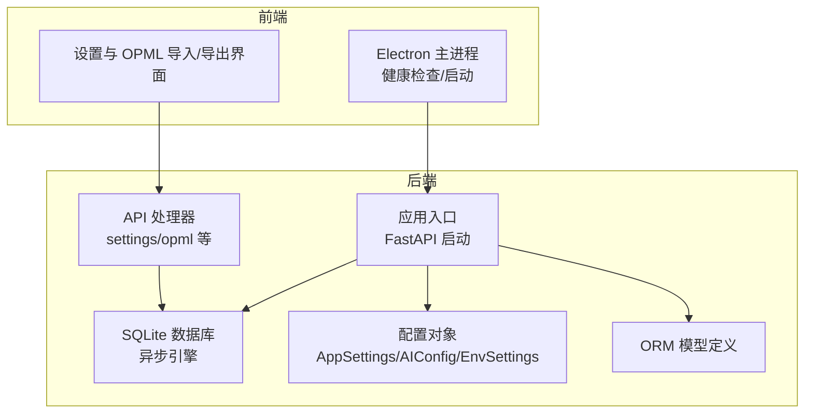
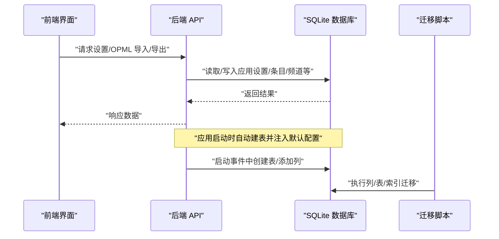
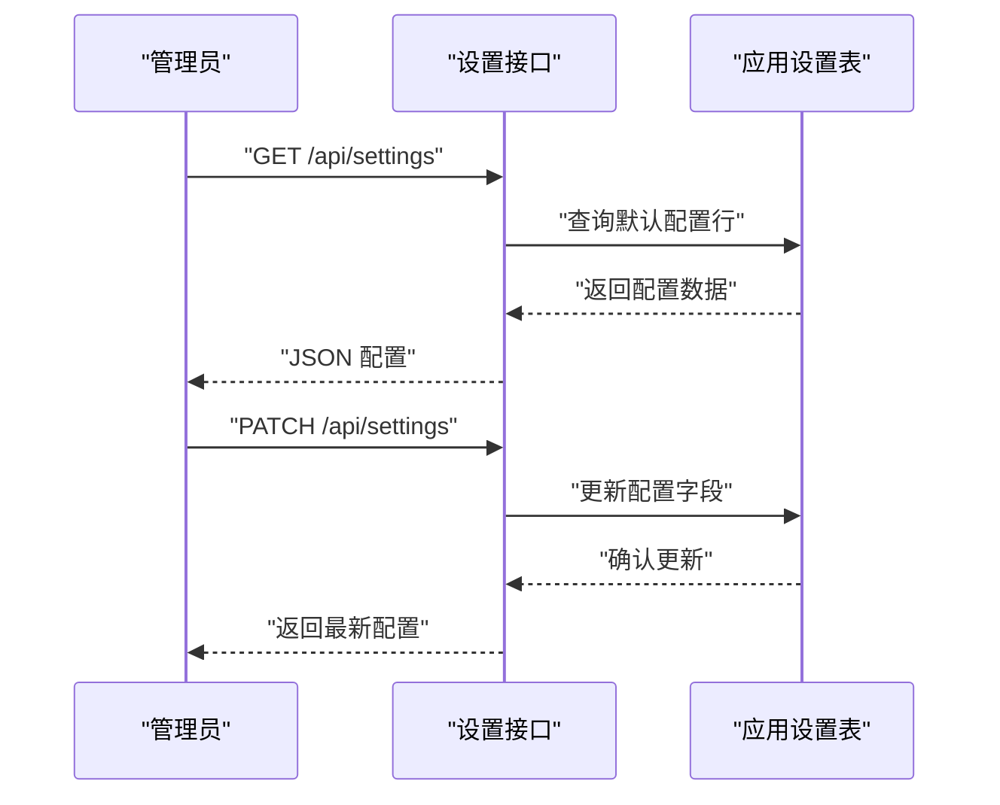
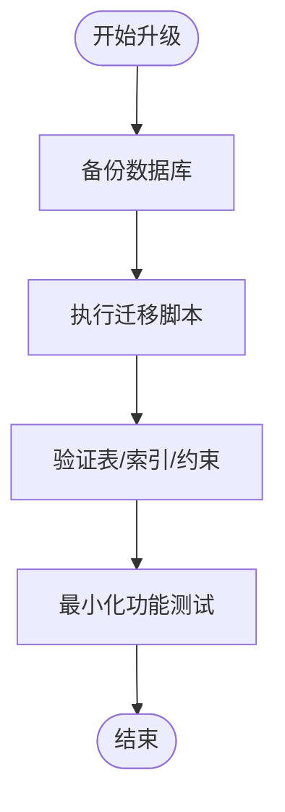
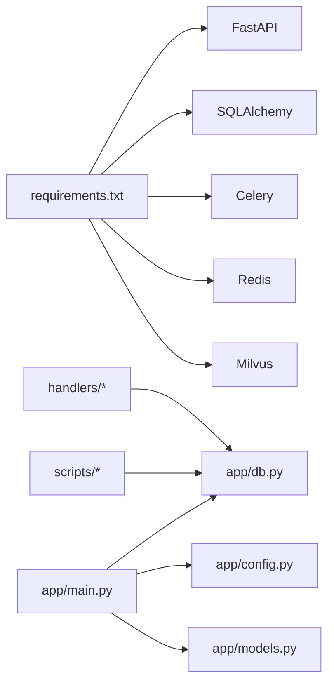

# 备份与恢复

<cite>
**本文引用的文件**
- [python-backend/app/db.py](file://python-backend/app/db.py)
- [python-backend/app/config.py](file://python-backend/app/config.py)
- [python-backend/app/main.py](file://python-backend/app/main.py)
- [python-backend/app/models.py](file://python-backend/app/models.py)
- [python-backend/app/handlers/settings.py](file://python-backend/app/handlers/settings.py)
- [python-backend/app/handlers/opml.py](file://python-backend/app/handlers/opml.py)
- [python-backend/update_schema.py](file://python-backend/update_schema.py)
- [python-backend/scripts/migrate_groups_to_channels.py](file://python-backend/scripts/migrate_groups_to_channels.py)
- [python-backend/scripts/update_channel_name_constraint.py](file://python-backend/scripts/update_channel_name_constraint.py)
- [python-backend/requirements.txt](file://python-backend/requirements.txt)
- [rss-desktop/electron/main.ts](file://rss-desktop/electron/main.ts)
</cite>

## 目录
1. [简介](#简介)
2. [项目结构](#项目结构)
3. [核心组件](#核心组件)
4. [架构总览](#架构总览)
5. [详细组件分析](#详细组件分析)
6. [依赖分析](#依赖分析)
7. [性能考虑](#性能考虑)
8. [故障排查指南](#故障排查指南)
9. [结论](#结论)
10. [附录](#附录)

## 简介
本文件面向 Tan RSS Reader 的备份与恢复体系，围绕数据库备份策略（全量/增量/频率）、配置备份（应用配置、用户设置、系统参数）、数据迁移（版本升级与兼容性）、灾难恢复（RTO/RPO/业务连续性）、备份验证与测试、以及备份存储位置、加密传输与长期归档策略进行系统化说明。文档基于仓库现有代码与脚本进行分析与建议，帮助读者建立可操作、可验证、可持续的备份与恢复实践。

## 项目结构
本项目采用“后端（FastAPI）+ 前端（Electron/Vue/Flutter）”的多端架构。与备份恢复直接相关的核心位置如下：
- 后端数据库：SQLite（异步 SQLAlchemy 引擎），位于后端工程内，随应用启动自动创建表与默认配置。
- 应用配置：通过 Pydantic 设置类集中管理，部分参数在运行时从数据库表读取并注入全局配置对象。
- 数据迁移：提供脚本以适配数据库结构变更，确保版本升级时的数据一致性。
- 前端集成：桌面端 Electron 主进程负责后端健康检查与启动，前端界面提供 OPML 导入/导出能力，间接支撑数据备份与恢复场景。

图表来源
- [python-backend/app/db.py:11-22](file://python-backend/app/db.py#L11-L22)
- [python-backend/app/config.py:5-75](file://python-backend/app/config.py#L5-L75)
- [python-backend/app/main.py:64-99](file://python-backend/app/main.py#L64-L99)
- [python-backend/app/models.py:1-228](file://python-backend/app/models.py#L1-L228)
- [python-backend/app/handlers/settings.py:20-87](file://python-backend/app/handlers/settings.py#L20-L87)
- [python-backend/app/handlers/opml.py:43-199](file://python-backend/app/handlers/opml.py#L43-L199)
- [rss-desktop/electron/main.ts:39-77](file://rss-desktop/electron/main.ts#L39-L77)

章节来源
- [python-backend/app/db.py:11-22](file://python-backend/app/db.py#L11-L22)
- [python-backend/app/config.py:5-75](file://python-backend/app/config.py#L5-L75)
- [python-backend/app/main.py:64-99](file://python-backend/app/main.py#L64-L99)
- [python-backend/app/models.py:1-228](file://python-backend/app/models.py#L1-L228)
- [python-backend/app/handlers/settings.py:20-87](file://python-backend/app/handlers/settings.py#L20-L87)
- [python-backend/app/handlers/opml.py:43-199](file://python-backend/app/handlers/opml.py#L43-L199)
- [rss-desktop/electron/main.ts:39-77](file://rss-desktop/electron/main.ts#L39-L77)

## 核心组件
- 数据库与连接
  - 使用异步 SQLAlchemy 引擎连接本地 SQLite 数据库；数据库路径由环境变量或相对路径推导生成，首次访问会自动创建目录与数据库文件。
- 配置系统
  - 运行时配置来自数据库表（如应用设置表）与环境配置（.env）合并；部分 AI 服务配置也持久化于数据库表。
- 数据模型
  - 定义了应用设置、AI 配置、条目、频道、分类、标签、订阅等核心实体，是备份与恢复的对象基础。
- 处理器接口
  - 提供设置查询/更新、OPML 导入/导出等接口，这些接口直接作用于数据库，是备份与恢复验证的关键入口。
- 数据迁移脚本
  - 提供列扩展、表创建、索引重建、约束调整等迁移逻辑，体现版本升级时的数据兼容性处理思路。
- 前端集成
  - Electron 主进程负责后端健康检查与启动；前端界面提供 OPML 导入/导出，便于用户侧进行数据备份与恢复。

章节来源
- [python-backend/app/db.py:11-22](file://python-backend/app/db.py#L11-L22)
- [python-backend/app/config.py:5-75](file://python-backend/app/config.py#L5-L75)
- [python-backend/app/models.py:82-125](file://python-backend/app/models.py#L82-L125)
- [python-backend/app/handlers/settings.py:20-87](file://python-backend/app/handlers/settings.py#L20-L87)
- [python-backend/app/handlers/opml.py:43-199](file://python-backend/app/handlers/opml.py#L43-L199)
- [python-backend/scripts/migrate_groups_to_channels.py:27-209](file://python-backend/scripts/migrate_groups_to_channels.py#L27-L209)
- [rss-desktop/electron/main.ts:39-77](file://rss-desktop/electron/main.ts#L39-L77)

## 架构总览
下图展示备份与恢复相关的关键交互：应用启动时创建数据库与默认配置；设置与 OPML 接口直接读写数据库；迁移脚本在版本升级时维护结构兼容；前端通过 OPML 实现用户侧数据导出与导入。

图表来源
- [python-backend/app/main.py:64-99](file://python-backend/app/main.py#L64-L99)
- [python-backend/app/handlers/settings.py:20-87](file://python-backend/app/handlers/settings.py#L20-L87)
- [python-backend/app/handlers/opml.py:43-199](file://python-backend/app/handlers/opml.py#L43-L199)
- [python-backend/update_schema.py:13-22](file://python-backend/update_schema.py#L13-L22)
- [python-backend/scripts/migrate_groups_to_channels.py:27-209](file://python-backend/scripts/migrate_groups_to_channels.py#L27-L209)

## 详细组件分析

### 数据库备份策略
- 全量备份
  - 建议在系统空闲时段对 SQLite 数据库文件进行一次性复制，确保一致性。可结合应用关闭或数据库事务提交后进行。
  - 备份对象：数据库文件（含所有表与索引）。
- 增量备份
  - SQLite 不具备原生命增备能力，可通过以下方式模拟：
    - 基于 WAL/回滚日志的文件级增量（需数据库处于 WAL 模式且具备相应权限）。
    - 基于时间戳或变更标记的逻辑增量（需在业务层引入变更追踪，当前仓库未见此类实现）。
- 备份频率
  - 建议：每日全量 + 每小时增量（若采用 WAL/文件级增量）；紧急变更后即时备份。
- 备份校验
  - 使用 SQLite 工具验证文件完整性与一致性；恢复后执行最小化查询验证关键表可用性。

章节来源
- [python-backend/app/db.py:11-22](file://python-backend/app/db.py#L11-L22)
- [python-backend/app/main.py:64-99](file://python-backend/app/main.py#L64-L99)

### 配置备份方法
- 应用配置
  - 通过设置接口读取/更新应用设置表，该表承载运行时配置项。备份即导出该表内容。
- 用户设置
  - 用户相关设置（如订阅、频道、标签等）均在数据库中持久化，备份即备份数据库。
- 系统参数
  - 环境配置（.env）中的数据库连接、AI 服务地址、Redis/Milvus 等参数属于系统参数，应单独备份 .env 文件。
- OPML 导出/导入
  - OPML 导出接口可作为用户侧配置备份手段；导入接口可用于恢复用户订阅与组织信息。

图表来源
- [python-backend/app/handlers/settings.py:20-87](file://python-backend/app/handlers/settings.py#L20-L87)
- [python-backend/app/models.py:82-96](file://python-backend/app/models.py#L82-L96)

章节来源
- [python-backend/app/handlers/settings.py:20-87](file://python-backend/app/handlers/settings.py#L20-L87)
- [python-backend/app/models.py:82-96](file://python-backend/app/models.py#L82-L96)
- [python-backend/app/handlers/opml.py:173-199](file://python-backend/app/handlers/opml.py#L173-L199)

### 数据迁移方案
- 版本升级与兼容性
  - 提供列扩展、表创建、索引重建、约束调整等脚本，确保数据库结构演进过程中的兼容性。
  - 迁移脚本示例：
    - 列扩展：向现有表添加新列并设置默认值。
    - 表创建：按需创建新表并建立索引。
    - 约束调整：对表结构进行约束与索引的重建与优化。
- 迁移流程建议
  - 升级前：执行数据库备份。
  - 升级中：顺序执行迁移脚本，逐个验证。
  - 升级后：执行最小化查询验证关键表与索引状态。

图表来源
- [python-backend/update_schema.py:24-130](file://python-backend/update_schema.py#L24-L130)
- [python-backend/scripts/migrate_groups_to_channels.py:27-209](file://python-backend/scripts/migrate_groups_to_channels.py#L27-L209)
- [python-backend/scripts/update_channel_name_constraint.py:46-101](file://python-backend/scripts/update_channel_name_constraint.py#L46-L101)

章节来源
- [python-backend/update_schema.py:24-130](file://python-backend/update_schema.py#L24-L130)
- [python-backend/scripts/migrate_groups_to_channels.py:27-209](file://python-backend/scripts/migrate_groups_to_channels.py#L27-L209)
- [python-backend/scripts/update_channel_name_constraint.py:46-101](file://python-backend/scripts/update_channel_name_constraint.py#L46-L101)

### 灾难恢复计划（RTO/RPO/业务连续性）
- RTO（恢复时间目标）
  - 建议：单机部署下 RTO ≤ 1 小时；通过自动化脚本与容器编排可进一步缩短。
- RPO（恢复点目标）
  - 建议：RPO ≤ 15 分钟；结合 WAL/文件级增量与定时全量备份实现。
- 业务连续性
  - 前端 Electron 主进程负责后端健康检查与启动，确保服务可用性；建议配合外部监控与告警机制。

章节来源
- [rss-desktop/electron/main.ts:39-77](file://rss-desktop/electron/main.ts#L39-L77)

### 备份验证与测试流程
- 备份完整性检查
  - 使用 SQLite 工具验证数据库文件完整性；对导出的 OPML 进行解析校验。
- 恢复演练
  - 在隔离环境中还原备份，执行最小化查询与关键接口调用，验证数据可用性与一致性。
- 回归测试
  - 对设置接口、OPML 导入/导出、核心数据表读写进行回归测试。

章节来源
- [python-backend/app/handlers/opml.py:43-199](file://python-backend/app/handlers/opml.py#L43-L199)
- [python-backend/app/handlers/settings.py:20-87](file://python-backend/app/handlers/settings.py#L20-L87)

### 存储位置、加密传输与长期归档
- 存储位置
  - 建议将数据库文件与 .env 放置于受控的备份卷或对象存储桶；分离日志与数据库文件。
- 加密传输
  - 通过 HTTPS/隧道传输备份文件；在传输链路两端启用 TLS。
- 长期归档
  - 采用分层存储策略：热备（近线）、温备（标准）、冷备（离线/归档）；定期轮换与抽样验证。

## 依赖分析
- 外部依赖
  - 后端依赖包括 FastAPI、SQLAlchemy、Celery、Redis、Milvus 等；这些组件与备份策略无直接耦合，但会影响整体可用性与恢复窗口。
- 内部依赖
  - 应用启动时创建数据库表并注入默认配置；设置与 OPML 接口直接依赖数据库；迁移脚本独立于运行时，仅在升级时执行。

图表来源
- [python-backend/requirements.txt:1-18](file://python-backend/requirements.txt#L1-L18)
- [python-backend/app/main.py:64-99](file://python-backend/app/main.py#L64-L99)
- [python-backend/app/db.py:11-22](file://python-backend/app/db.py#L11-L22)
- [python-backend/app/config.py:5-75](file://python-backend/app/config.py#L5-L75)
- [python-backend/app/models.py:1-228](file://python-backend/app/models.py#L1-L228)

章节来源
- [python-backend/requirements.txt:1-18](file://python-backend/requirements.txt#L1-L18)
- [python-backend/app/main.py:64-99](file://python-backend/app/main.py#L64-L99)
- [python-backend/app/db.py:11-22](file://python-backend/app/db.py#L11-L22)
- [python-backend/app/config.py:5-75](file://python-backend/app/config.py#L5-L75)
- [python-backend/app/models.py:1-228](file://python-backend/app/models.py#L1-L228)

## 性能考虑
- 备份窗口
  - 在低峰时段执行全量备份；对 WAL/文件级增量进行限速与并发控制。
- 恢复速度
  - 优先采用本地 SSD 存储；对大数据库采用分片/并行恢复策略。
- 迁移性能
  - 迁移脚本应批量提交、分段处理；对大表索引重建采用在线/离线策略。

## 故障排查指南
- 数据库无法启动
  - 检查数据库文件是否存在与权限；确认路径由环境变量或相对路径正确推导。
- 设置接口异常
  - 核对应用设置表是否已初始化；检查字段映射与类型。
- OPML 导入失败
  - 检查 OPML 内容格式与编码；确认目标表存在且无唯一约束冲突。
- 迁移脚本报错
  - 查看具体错误信息，确认数据库连接、表结构与权限；必要时回滚并重试。

章节来源
- [python-backend/app/db.py:11-22](file://python-backend/app/db.py#L11-L22)
- [python-backend/app/handlers/settings.py:20-87](file://python-backend/app/handlers/settings.py#L20-L87)
- [python-backend/app/handlers/opml.py:43-199](file://python-backend/app/handlers/opml.py#L43-L199)
- [python-backend/update_schema.py:24-130](file://python-backend/update_schema.py#L24-L130)

## 结论
本项目以 SQLite 为核心存储，通过设置与 OPML 接口实现配置与数据的可导出/导入，辅以迁移脚本保障版本升级的兼容性。建议结合文件级全量与增量备份、严格的备份验证与恢复演练、以及加密与分层归档策略，构建完善的备份与恢复体系，满足 RTO/RPO 要求并保障业务连续性。

## 附录
- 关键接口与文件定位
  - 设置接口：[python-backend/app/handlers/settings.py:20-87](file://python-backend/app/handlers/settings.py#L20-L87)
  - OPML 导入/导出：[python-backend/app/handlers/opml.py:43-199](file://python-backend/app/handlers/opml.py#L43-L199)
  - 数据库连接与建表：[python-backend/app/db.py:11-22](file://python-backend/app/db.py#L11-22), [python-backend/app/main.py:64-99](file://python-backend/app/main.py#L64-L99)
  - 迁移脚本集合：[python-backend/update_schema.py:24-130](file://python-backend/update_schema.py#L24-L130), [python-backend/scripts/migrate_groups_to_channels.py:27-209](file://python-backend/scripts/migrate_groups_to_channels.py#L27-L209), [python-backend/scripts/update_channel_name_constraint.py:46-101](file://python-backend/scripts/update_channel_name_constraint.py#L46-L101)
  - 环境配置：[python-backend/app/config.py:5-75](file://python-backend/app/config.py#L5-L75)
  - 前端健康检查：[rss-desktop/electron/main.ts:39-77](file://rss-desktop/electron/main.ts#L39-L77)