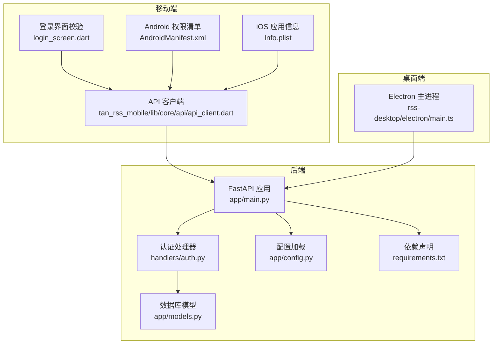
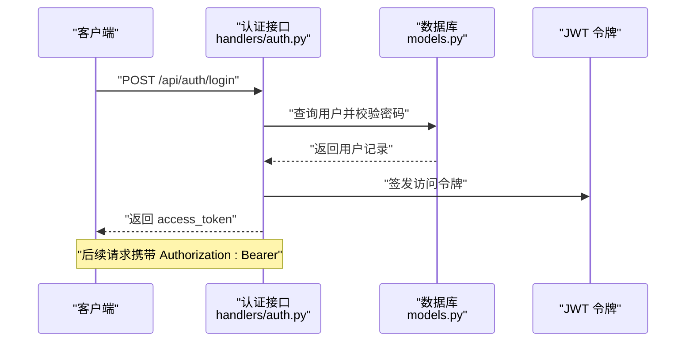
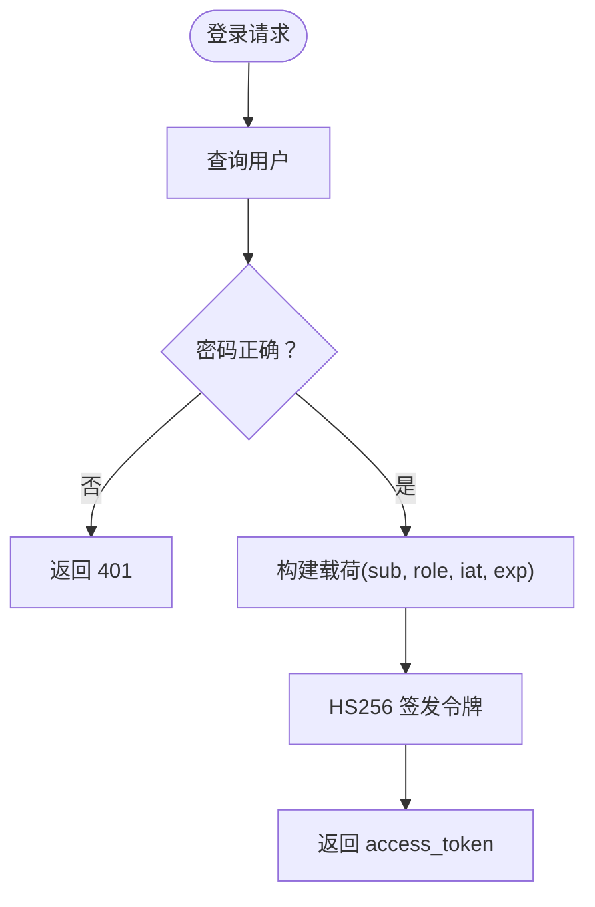
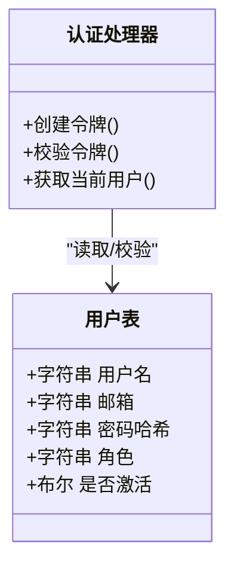
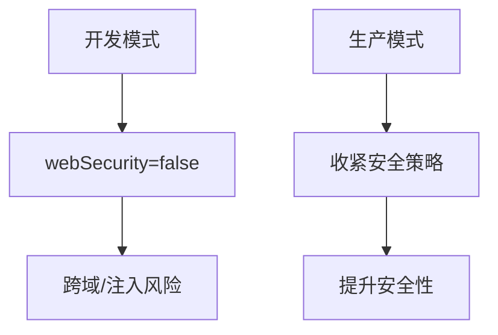
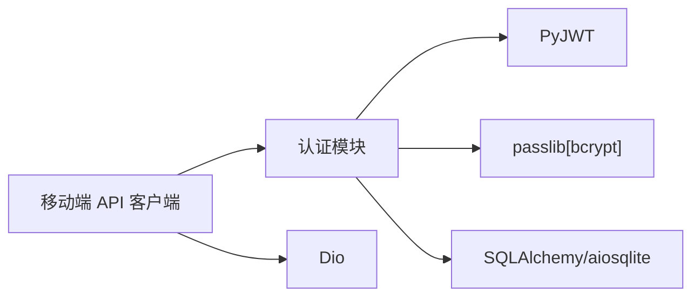

# 安全配置

<cite>
**本文档引用的文件**
- [python-backend/app/handlers/auth.py](file://python-backend/app/handlers/auth.py)
- [python-backend/app/main.py](file://python-backend/app/main.py)
- [python-backend/app/config.py](file://python-backend/app/config.py)
- [python-backend/app/models.py](file://python-backend/app/models.py)
- [python-backend/requirements.txt](file://python-backend/requirements.txt)
- [tan_rss_mobile/lib/core/api/api_client.dart](file://tan_rss_mobile/lib/core/api/api_client.dart)
- [tan_rss_mobile/lib/features/auth/presentation/login_screen.dart](file://tan_rss_mobile/lib/features/auth/presentation/login_screen.dart)
- [rss-desktop/electron/main.ts](file://rss-desktop/electron/main.ts)
- [tan_rss_mobile/android/app/src/main/AndroidManifest.xml](file://tan_rss_mobile/android/app/src/main/AndroidManifest.xml)
- [tan_rss_mobile/ios/Runner/Info.plist](file://tan_rss_mobile/ios/Runner/Info.plist)
</cite>

## 目录
1. [简介](#简介)
2. [项目结构](#项目结构)
3. [核心组件](#核心组件)
4. [架构总览](#架构总览)
5. [详细组件分析](#详细组件分析)
6. [依赖关系分析](#依赖关系分析)
7. [性能考虑](#性能考虑)
8. [故障排查指南](#故障排查指南)
9. [结论](#结论)
10. [附录](#附录)

## 简介
本文件面向 Tan RSS Reader 的安全配置体系，聚焦后端认证与授权、会话与令牌管理、密码策略、客户端安全、以及部署侧的网络与传输安全要点。当前仓库实现以 FastAPI 后端配合 JWT 令牌为核心认证方式，并在移动端与桌面端具备基础的安全交互能力。由于项目未包含完整的 SSL/TLS、HSTS、防火墙与审计日志等企业级安全设施，本文在“建议”部分给出可落地的加固方案与最佳实践。

## 项目结构
后端采用 Python + FastAPI 构建，认证模块位于 handlers/auth.py；全局配置通过 pydantic-settings 从 .env 加载；数据库模型定义于 models.py；移动端与桌面端分别在各自平台的清单与入口文件中体现网络与安全权限。

**图表来源**
- [python-backend/app/main.py:28-62](file://python-backend/app/main.py#L28-L62)
- [python-backend/app/handlers/auth.py:16-27](file://python-backend/app/handlers/auth.py#L16-L27)
- [python-backend/app/config.py:41-71](file://python-backend/app/config.py#L41-L71)
- [python-backend/app/models.py:168-177](file://python-backend/app/models.py#L168-L177)
- [python-backend/requirements.txt:1-18](file://python-backend/requirements.txt#L1-18)
- [tan_rss_mobile/lib/core/api/api_client.dart:15-42](file://tan_rss_mobile/lib/core/api/api_client.dart#L15-L42)
- [tan_rss_mobile/lib/features/auth/presentation/login_screen.dart:14-47](file://tan_rss_mobile/lib/features/auth/presentation/login_screen.dart#L14-L47)
- [rss-desktop/electron/main.ts:313-329](file://rss-desktop/electron/main.ts#L313-L329)
- [tan_rss_mobile/android/app/src/main/AndroidManifest.xml:1-50](file://tan_rss_mobile/android/app/src/main/AndroidManifest.xml#L1-L50)
- [tan_rss_mobile/ios/Runner/Info.plist:1-71](file://tan_rss_mobile/ios/Runner/Info.plist#L1-L71)

**章节来源**
- [python-backend/app/main.py:28-62](file://python-backend/app/main.py#L28-L62)
- [python-backend/app/handlers/auth.py:16-27](file://python-backend/app/handlers/auth.py#L16-L27)
- [python-backend/app/config.py:41-71](file://python-backend/app/config.py#L41-L71)
- [python-backend/app/models.py:168-177](file://python-backend/app/models.py#L168-L177)
- [python-backend/requirements.txt:1-18](file://python-backend/requirements.txt#L1-L18)
- [tan_rss_mobile/lib/core/api/api_client.dart:15-42](file://tan_rss_mobile/lib/core/api/api_client.dart#L15-L42)
- [tan_rss_mobile/lib/features/auth/presentation/login_screen.dart:14-47](file://tan_rss_mobile/lib/features/auth/presentation/login_screen.dart#L14-L47)
- [rss-desktop/electron/main.ts:313-329](file://rss-desktop/electron/main.ts#L313-L329)
- [tan_rss_mobile/android/app/src/main/AndroidManifest.xml:1-50](file://tan_rss_mobile/android/app/src/main/AndroidManifest.xml#L1-L50)
- [tan_rss_mobile/ios/Runner/Info.plist:1-71](file://tan_rss_mobile/ios/Runner/Info.plist#L1-L71)

## 核心组件
- 认证与令牌
  - 使用 HS256 的 JWT 作为访问令牌，密钥与过期时间来自环境变量。
  - 登录成功后签发令牌，接口层通过 Authorization: Bearer 校验。
  - 密码采用 bcrypt 哈希存储。
- 会话与角色
  - 无服务端会话状态；基于令牌的无状态认证。
  - 提供管理员权限校验与可选用户解析。
- 客户端交互
  - 移动端通过拦截器自动附加 Bearer 令牌。
  - 桌面端 Electron 主进程在开发模式下放宽安全设置，生产需收紧。
- 数据模型
  - 用户表包含用户名、邮箱、密码哈希、角色与激活状态字段。

**章节来源**
- [python-backend/app/handlers/auth.py:22-23](file://python-backend/app/handlers/auth.py#L22-L23)
- [python-backend/app/handlers/auth.py:76-79](file://python-backend/app/handlers/auth.py#L76-L79)
- [python-backend/app/handlers/auth.py:91-104](file://python-backend/app/handlers/auth.py#L91-L104)
- [python-backend/app/handlers/auth.py:106-109](file://python-backend/app/handlers/auth.py#L106-L109)
- [python-backend/app/handlers/auth.py:166-173](file://python-backend/app/handlers/auth.py#L166-L173)
- [python-backend/app/handlers/auth.py:81-89](file://python-backend/app/handlers/auth.py#L81-L89)
- [tan_rss_mobile/lib/core/api/api_client.dart:26-41](file://tan_rss_mobile/lib/core/api/api_client.dart#L26-L41)
- [rss-desktop/electron/main.ts:320-328](file://rss-desktop/electron/main.ts#L320-L328)
- [python-backend/app/models.py:168-177](file://python-backend/app/models.py#L168-L177)

## 架构总览
后端通过 FastAPI 提供 REST 接口，认证模块负责注册、登录与令牌签发；移动端与桌面端通过各自的客户端与入口配置与后端交互。当前未见服务端中间件实现 CORS 白名单、CSRF、速率限制、审计日志等安全中间件。

**图表来源**
- [python-backend/app/handlers/auth.py:166-173](file://python-backend/app/handlers/auth.py#L166-L173)
- [python-backend/app/handlers/auth.py:81-89](file://python-backend/app/handlers/auth.py#L81-L89)
- [python-backend/app/models.py:168-177](file://python-backend/app/models.py#L168-L177)

**章节来源**
- [python-backend/app/handlers/auth.py:166-173](file://python-backend/app/handlers/auth.py#L166-L173)
- [python-backend/app/handlers/auth.py:81-89](file://python-backend/app/handlers/auth.py#L81-L89)
- [python-backend/app/models.py:168-177](file://python-backend/app/models.py#L168-L177)

## 详细组件分析

### 认证与令牌配置
- 令牌密钥与过期
  - 密钥来源于环境变量，未设置则使用开发默认值。
  - 默认过期时间为 14 天（分钟），可通过环境变量覆盖。
- 令牌签发与校验
  - 使用 HS256 算法，载荷包含 sub、role、iat、exp。
  - 接口通过 Header 中的 Bearer 字段提取并解码验证。
- 密码策略
  - 注册请求对用户名与密码长度进行基本校验。
  - 密码使用 bcrypt 存储，未见密码复杂度与历史版本限制策略。

**图表来源**
- [python-backend/app/handlers/auth.py:166-173](file://python-backend/app/handlers/auth.py#L166-L173)
- [python-backend/app/handlers/auth.py:76-79](file://python-backend/app/handlers/auth.py#L76-L79)
- [python-backend/app/handlers/auth.py:81-89](file://python-backend/app/handlers/auth.py#L81-L89)

**章节来源**
- [python-backend/app/handlers/auth.py:22-23](file://python-backend/app/handlers/auth.py#L22-L23)
- [python-backend/app/handlers/auth.py:76-79](file://python-backend/app/handlers/auth.py#L76-L79)
- [python-backend/app/handlers/auth.py:91-104](file://python-backend/app/handlers/auth.py#L91-L104)
- [python-backend/app/handlers/auth.py:166-173](file://python-backend/app/handlers/auth.py#L166-L173)
- [python-backend/app/handlers/auth.py:29-48](file://python-backend/app/handlers/auth.py#L29-L48)
- [python-backend/app/handlers/auth.py:81-89](file://python-backend/app/handlers/auth.py#L81-L89)

### 会话管理与安全 Cookie
- 会话模型
  - 服务端无会话状态，采用无状态令牌模型。
  - 未见并发登录控制、会话超时与安全 Cookie 设置（HttpOnly、SameSite、Secure）。
- 客户端存储
  - 移动端使用安全存储保存令牌，拦截器自动注入 Authorization 头。
  - 桌面端开发模式下 webSecurity 关闭，存在安全风险。

**图表来源**
- [python-backend/app/models.py:168-177](file://python-backend/app/models.py#L168-L177)
- [python-backend/app/handlers/auth.py:76-79](file://python-backend/app/handlers/auth.py#L76-L79)
- [python-backend/app/handlers/auth.py:91-104](file://python-backend/app/handlers/auth.py#L91-L104)

**章节来源**
- [python-backend/app/models.py:168-177](file://python-backend/app/models.py#L168-L177)
- [tan_rss_mobile/lib/core/api/api_client.dart:26-41](file://tan_rss_mobile/lib/core/api/api_client.dart#L26-L41)
- [rss-desktop/electron/main.ts:320-328](file://rss-desktop/electron/main.ts#L320-L328)

### SSL/TLS 与传输安全
- 当前实现
  - 移动端登录界面支持 http/https 地址输入校验。
  - 未见服务端 TLS/HTTPS 配置与 HSTS 头设置。
- 建议
  - 使用反向代理（如 Nginx/Caddy）启用 HTTPS、选择现代加密套件、开启 HSTS。
  - 对移动端强制仅允许 https，移除明文流量开关。

**图表来源**
- [tan_rss_mobile/lib/features/auth/presentation/login_screen.dart:202-234](file://tan_rss_mobile/lib/features/auth/presentation/login_screen.dart#L202-L234)
- [rss-desktop/electron/main.ts:320-328](file://rss-desktop/electron/main.ts#L320-L328)

**章节来源**
- [tan_rss_mobile/lib/features/auth/presentation/login_screen.dart:202-234](file://tan_rss_mobile/lib/features/auth/presentation/login_screen.dart#L202-L234)
- [rss-desktop/electron/main.ts:320-328](file://rss-desktop/electron/main.ts#L320-L328)

### 防火墙与网络访问控制
- 当前实现
  - 未见服务端防火墙规则、IP 白名单、端口管理与代理配置。
- 建议
  - 仅开放必要端口（如反向代理端口），其余端口限制内网访问。
  - 在反向代理层启用速率限制、来源 IP 限制与 WAF。

**章节来源**
- [python-backend/app/config.py:63-66](file://python-backend/app/config.py#L63-L66)

### 密码策略与合规
- 现状
  - 注册请求对用户名与密码长度进行基础校验；密码使用 bcrypt 存储。
  - 未见密码复杂度、过期策略、历史密码限制与账户锁定策略。
- 建议
  - 引入密码强度规则（长度、字符集、历史不可用）。
  - 实施密码过期与到期提醒、多因素认证（MFA）。
  - 记录登录与敏感操作审计日志，满足合规要求。

**章节来源**
- [python-backend/app/handlers/auth.py:29-48](file://python-backend/app/handlers/auth.py#L29-L48)
- [python-backend/app/handlers/auth.py:81-89](file://python-backend/app/handlers/auth.py#L81-L89)

### 安全审计与合规
- 现状
  - 未见统一审计日志中间件或持久化存储。
- 建议
  - 在 FastAPI 中间件层记录登录、权限变更、关键 API 访问等事件。
  - 结合 SIEM/日志平台进行集中分析与告警。

**章节来源**
- [python-backend/app/main.py:28-62](file://python-backend/app/main.py#L28-L62)

## 依赖关系分析
- 认证依赖
  - PyJWT 用于令牌签发与解码；passlib[bcrypt] 用于密码哈希。
  - SQLAlchemy 与 aiosqlite 用于异步数据库访问。
- 客户端依赖
  - 移动端使用 Dio 发起请求，拦截器处理 401 并清理令牌。

**图表来源**
- [python-backend/requirements.txt:11-12](file://python-backend/requirements.txt#L11-L12)
- [python-backend/requirements.txt:5-6](file://python-backend/requirements.txt#L5-L6)
- [tan_rss_mobile/lib/core/api/api_client.dart:15-42](file://tan_rss_mobile/lib/core/api/api_client.dart#L15-L42)

**章节来源**
- [python-backend/requirements.txt:1-18](file://python-backend/requirements.txt#L1-L18)
- [tan_rss_mobile/lib/core/api/api_client.dart:15-42](file://tan_rss_mobile/lib/core/api/api_client.dart#L15-L42)

## 性能考虑
- 令牌验证为内存计算，开销极低。
- bcrypt 哈希成本参数可调，平衡安全与性能。
- 建议在网关层引入缓存与限流，降低后端压力。

[本节为通用建议，无需特定文件来源]

## 故障排查指南
- 401 未授权
  - 检查 Authorization 头格式是否为 Bearer。
  - 确认令牌未过期、密钥一致。
- 密码校验失败
  - 确认 bcrypt 哈希过程未被篡改。
- CORS 问题
  - 当前后端允许任意来源，生产需限制白名单。
- 桌面端开发模式风险
  - webSecurity 关闭会放宽安全限制，发布版应收紧。

**章节来源**
- [python-backend/app/handlers/auth.py:91-104](file://python-backend/app/handlers/auth.py#L91-L104)
- [python-backend/app/handlers/auth.py:81-89](file://python-backend/app/handlers/auth.py#L81-L89)
- [python-backend/app/main.py:30-36](file://python-backend/app/main.py#L30-L36)
- [rss-desktop/electron/main.ts:320-328](file://rss-desktop/electron/main.ts#L320-L328)

## 结论
当前实现提供了基础的 JWT 无状态认证与 bcrypt 密码存储，移动端与桌面端具备基本的安全交互能力。为满足生产级安全与合规要求，建议补充：TLS/HTTPS 与 HSTS、严格的 CORS 白名单、速率限制与 WAF、审计日志、密码复杂度与历史策略、以及桌面端生产模式下的安全收紧。

[本节为总结，无需特定文件来源]

## 附录
- 环境变量参考
  - 认证密钥与过期时间：AURORA_AUTH_SECRET、AURORA_AUTH_EXPIRE_MINUTES
  - 服务器监听：host、port
- 客户端安全要点
  - 强制 https，避免明文传输。
  - 令牌存储使用平台安全存储，避免明文落盘。

**章节来源**
- [python-backend/app/config.py:41-71](file://python-backend/app/config.py#L41-L71)
- [tan_rss_mobile/lib/features/auth/presentation/login_screen.dart:202-234](file://tan_rss_mobile/lib/features/auth/presentation/login_screen.dart#L202-L234)
- [tan_rss_mobile/android/app/src/main/AndroidManifest.xml:9](file://tan_rss_mobile/android/app/src/main/AndroidManifest.xml#L9)
- [tan_rss_mobile/ios/Runner/Info.plist:1-71](file://tan_rss_mobile/ios/Runner/Info.plist#L1-L71)