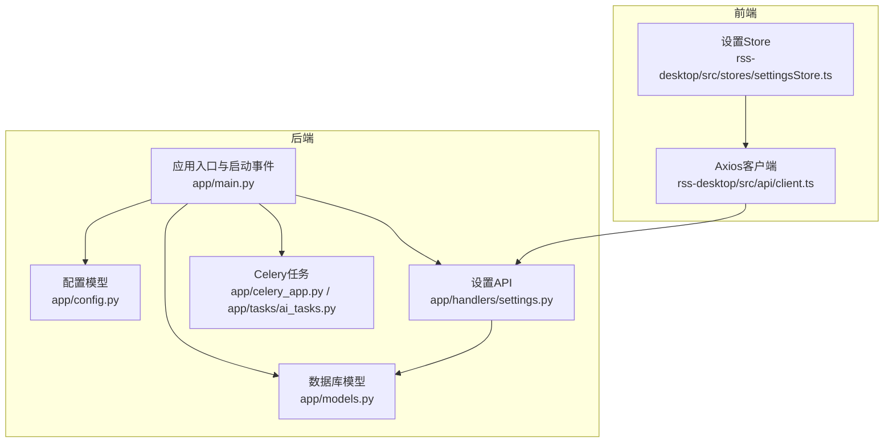
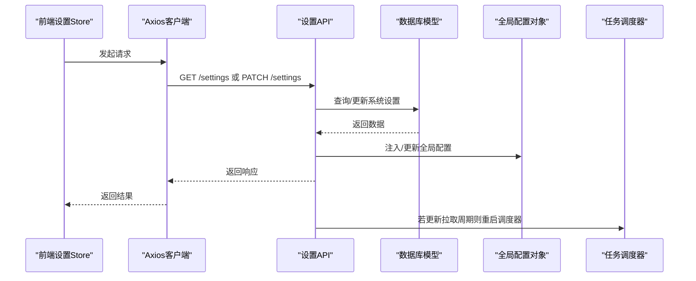
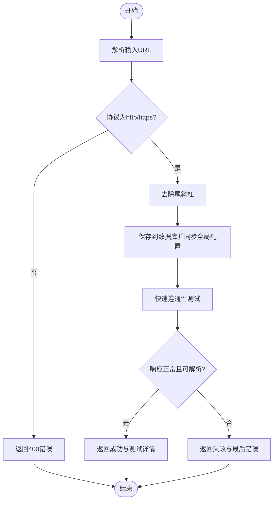
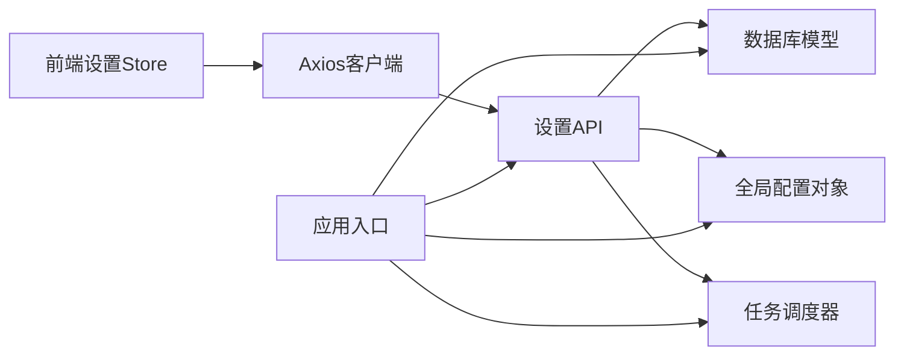

# 应用配置管理

<cite>
**本文引用的文件**
- [python-backend/app/config.py](file://python-backend/app/config.py)
- [python-backend/app/handlers/settings.py](file://python-backend/app/handlers/settings.py)
- [python-backend/app/models.py](file://python-backend/app/models.py)
- [python-backend/app/main.py](file://python-backend/app/main.py)
- [rss-desktop/src/stores/settingsStore.ts](file://rss-desktop/src/stores/settingsStore.ts)
- [rss-desktop/src/api/client.ts](file://rss-desktop/src/api/client.ts)
- [python-backend/app/celery_app.py](file://python-backend/app/celery_app.py)
- [python-backend/app/tasks/ai_tasks.py](file://python-backend/app/tasks/ai_tasks.py)
</cite>

## 目录
1. [简介](#简介)
2. [项目结构](#项目结构)
3. [核心组件](#核心组件)
4. [架构总览](#架构总览)
5. [详细组件分析](#详细组件分析)
6. [依赖分析](#依赖分析)
7. [性能考虑](#性能考虑)
8. [故障排查指南](#故障排查指南)
9. [结论](#结论)
10. [附录](#附录)

## 简介
本文件面向 Tan RSS Reader 的配置管理，系统性阐述配置文件结构与配置项定义、默认值与环境变量覆盖机制、配置验证规则；详解系统设置 API 的使用方式（GET /settings、PATCH /settings）以及 RSSHub URL 配置管理（校验、连通性测试与错误处理）；说明配置热更新机制（重启策略与状态同步）；给出配置备份与恢复建议（导出/导入思路）；并提供最佳实践与常见问题解决方案。

## 项目结构
配置管理涉及后端 FastAPI 应用、数据库模型、前端 Pinia Store 与 Axios 客户端等多层协作：
- 后端配置模型与环境变量加载：定义应用配置类与环境配置类，并在启动时初始化全局配置对象。
- 数据库模型：持久化系统设置与 AI 配置。
- 设置 API：提供系统设置读取与更新、RSSHub URL 读取与写入、快速连通性测试。
- 前端设置 Store：负责本地偏好与系统设置的合并、乐观更新与回滚。
- 启动事件：在应用启动时从数据库加载系统设置到全局配置对象，并启动定时任务调度器。

**图表来源**
- [python-backend/app/config.py:1-75](file://python-backend/app/config.py#L1-L75)
- [python-backend/app/models.py:82-96](file://python-backend/app/models.py#L82-L96)
- [python-backend/app/handlers/settings.py:20-161](file://python-backend/app/handlers/settings.py#L20-L161)
- [python-backend/app/main.py:64-103](file://python-backend/app/main.py#L64-L103)
- [python-backend/app/celery_app.py:1-23](file://python-backend/app/celery_app.py#L1-L23)
- [python-backend/app/tasks/ai_tasks.py:1-87](file://python-backend/app/tasks/ai_tasks.py#L1-L87)
- [rss-desktop/src/api/client.ts:1-29](file://rss-desktop/src/api/client.ts#L1-L29)
- [rss-desktop/src/stores/settingsStore.ts:1-202](file://rss-desktop/src/stores/settingsStore.ts#L1-L202)

**章节来源**
- [python-backend/app/config.py:1-75](file://python-backend/app/config.py#L1-L75)
- [python-backend/app/models.py:82-96](file://python-backend/app/models.py#L82-L96)
- [python-backend/app/handlers/settings.py:20-161](file://python-backend/app/handlers/settings.py#L20-L161)
- [python-backend/app/main.py:64-103](file://python-backend/app/main.py#L64-L103)
- [rss-desktop/src/api/client.ts:1-29](file://rss-desktop/src/api/client.ts#L1-L29)
- [rss-desktop/src/stores/settingsStore.ts:1-202](file://rss-desktop/src/stores/settingsStore.ts#L1-L202)

## 核心组件
- 配置模型与默认值
  - 应用配置类包含拉取周期、分页数、日期筛选、时间字段、摘要展示、标题翻译上限、翻译显示模式、RSSHub URL、品牌展示开关等键值。
  - 环境配置类通过 Pydantic Settings 自动从 .env 或环境变量加载数据库、Redis/Celery、向量库 Milvus、AI 服务、后端主机与端口等外部依赖参数。
- 数据库模型
  - 系统设置表记录上述应用配置项及时间戳。
  - AI 配置表记录各类 AI 服务的密钥、基础地址、模型名与功能开关、向量库参数等。
- 设置 API
  - GET /settings：首次访问时若不存在默认行则按默认值创建并返回当前系统设置；随后将返回值注入全局配置对象。
  - PATCH /settings：仅允许管理员更新系统设置；更新后将返回最新系统设置并同步至全局配置对象；若更新了拉取周期，触发任务调度器重启。
  - GET /settings/rsshub-url：返回当前 RSSHub URL。
  - POST /settings/rsshub-url：校验 URL 协议与格式，去除尾部斜杠，保存到数据库并同步到全局配置。
  - POST /settings/test-rsshub-quick：对候选路由进行快速连通性测试，返回成功/失败、响应时间、条目数量等。
- 前端设置 Store
  - 优先使用本地存储合并默认值；尝试获取远程系统设置并合并；支持乐观更新与回滚；仅当涉及系统设置字段时调用后端 API。
- 启动与热更新
  - 应用启动时从数据库加载系统设置到全局配置对象，并启动任务调度器；更新系统设置后同步至全局配置对象，必要时重启调度器。

**章节来源**
- [python-backend/app/config.py:5-75](file://python-backend/app/config.py#L5-L75)
- [python-backend/app/models.py:82-124](file://python-backend/app/models.py#L82-L124)
- [python-backend/app/handlers/settings.py:20-161](file://python-backend/app/handlers/settings.py#L20-L161)
- [rss-desktop/src/stores/settingsStore.ts:25-202](file://rss-desktop/src/stores/settingsStore.ts#L25-L202)
- [python-backend/app/main.py:64-98](file://python-backend/app/main.py#L64-L98)

## 架构总览
下图展示了配置管理在系统中的交互路径：前端通过 Axios 调用后端设置 API，后端读写数据库模型，同时维护全局配置对象并在需要时重启任务调度器。

**图表来源**
- [rss-desktop/src/stores/settingsStore.ts:60-108](file://rss-desktop/src/stores/settingsStore.ts#L60-L108)
- [rss-desktop/src/api/client.ts:1-29](file://rss-desktop/src/api/client.ts#L1-L29)
- [python-backend/app/handlers/settings.py:20-87](file://python-backend/app/handlers/settings.py#L20-L87)
- [python-backend/app/models.py:82-96](file://python-backend/app/models.py#L82-L96)
- [python-backend/app/main.py:80-98](file://python-backend/app/main.py#L80-L98)

## 详细组件分析

### 配置模型与默认值
- 应用配置类字段与默认值
  - 拉取周期（分钟）、每页条数、启用日期筛选、默认日期范围、时间字段、显示摘要、最大自动标题翻译数、翻译显示模式、品牌展示开关、RSSHub URL。
- 环境配置类字段与默认值
  - 数据库连接串、Redis/Celery 连接串、Milvus 主机/端口/集合名、Aurora AI 服务密钥/基础地址/模型名、后端主机与端口。
- 默认值来源
  - 应用配置类直接提供 Python 层默认值；环境配置类通过 Pydantic Settings 自动从 .env 或环境变量加载，未提供的项采用类中默认值。

**章节来源**
- [python-backend/app/config.py:5-75](file://python-backend/app/config.py#L5-L75)

### 数据库模型与持久化
- 系统设置表
  - 字段与默认值与应用配置类一致，新增创建/更新时间戳。
- AI 配置表
  - 包含三类 AI 服务（摘要/翻译/嵌入）的密钥、基础地址、模型名与“是否具备密钥”标记，以及功能开关、向量库参数、翻译语言等。

**章节来源**
- [python-backend/app/models.py:82-124](file://python-backend/app/models.py#L82-L124)

### 系统设置 API 使用说明
- GET /settings
  - 请求：无体。
  - 响应：系统设置字典（包含拉取周期、分页数、日期筛选、默认日期范围、时间字段、摘要展示、标题翻译上限、翻译显示模式、品牌展示开关、RSSHub URL）。
  - 行为：若数据库不存在默认行则按默认值创建；随后将返回值注入全局配置对象。
- PATCH /settings
  - 请求：仅允许管理员；payload 为系统设置字段的部分更新。
  - 响应：返回最新系统设置字典。
  - 行为：更新数据库对应字段并同步至全局配置对象；若更新了拉取周期，触发任务调度器重启。
- GET /settings/rsshub-url
  - 请求：无体。
  - 响应：返回当前 RSSHub URL。
- POST /settings/rsshub-url
  - 请求：JSON，包含 rsshub_url 字段。
  - 校验：必须为字符串，协议需为 http 或 https，去除尾部斜杠。
  - 响应：返回成功标志与最终 URL。
  - 行为：保存到数据库并同步至全局配置对象。
- POST /settings/test-rsshub-quick
  - 请求：无体。
  - 行为：对候选路由进行快速连通性测试，返回成功/失败、响应时间、条目数量、RSS 标题等信息。

**章节来源**
- [python-backend/app/handlers/settings.py:20-161](file://python-backend/app/handlers/settings.py#L20-L161)

### 前端设置 Store 与状态同步
- 本地偏好与系统设置合并
  - 本地存储键：翻译显示模式、品牌展示开关、摘要展示、日期筛选开关、默认日期范围、主题。
  - 与系统设置合并：系统设置包括拉取周期、分页数、RSSHub URL、标题翻译上限。
- 乐观更新与回滚
  - 仅当包含系统设置字段时调用后端 API；失败时回滚系统设置部分，本地设置保持不变。
- 主题切换
  - 切换主题后写入本地存储并更新 DOM 类名。

**章节来源**
- [rss-desktop/src/stores/settingsStore.ts:25-202](file://rss-desktop/src/stores/settingsStore.ts#L25-L202)

### 启动流程与热更新机制
- 启动事件
  - 创建数据库表与列（如新增 branding_toggle、entries.quality_score、ai_configs.auto_quality_scoring），从数据库加载系统设置到全局配置对象，并初始化 AI 配置与启动任务调度器。
- 热更新
  - PATCH /settings 更新系统设置后，将返回值注入全局配置对象；若更新了拉取周期，重启任务调度器以应用新周期。
- 任务调度器
  - 基于 Celery，使用 Redis 作为 Broker/Backend；在应用启动时启动，在关闭时停止。

**章节来源**
- [python-backend/app/main.py:64-103](file://python-backend/app/main.py#L64-L103)
- [python-backend/app/celery_app.py:1-23](file://python-backend/app/celery_app.py#L1-L23)
- [python-backend/app/tasks/ai_tasks.py:1-87](file://python-backend/app/tasks/ai_tasks.py#L1-L87)

### RSSHub URL 配置管理
- URL 验证
  - 协议必须为 http 或 https；去除尾部斜杠。
- 连接测试
  - 快速测试多个候选路由，异步发起请求，解析 RSS 内容，统计响应时间与条目数量。
- 错误处理
  - 对网络异常与 HTTP 错误进行捕获并返回最后一次错误信息。

**图表来源**
- [python-backend/app/handlers/settings.py:97-161](file://python-backend/app/handlers/settings.py#L97-L161)

**章节来源**
- [python-backend/app/handlers/settings.py:97-161](file://python-backend/app/handlers/settings.py#L97-L161)

## 依赖分析
- 组件耦合
  - 后端设置 API 依赖数据库模型与全局配置对象；前端 Store 依赖 Axios 客户端与本地存储。
- 外部依赖
  - Redis/Celery 用于任务调度；SQLite/SQLAlchemy 用于持久化；httpx 用于 RSSHub 连通性测试。
- 可能的循环依赖
  - 当前模块间为单向依赖，未发现循环依赖迹象。

**图表来源**
- [rss-desktop/src/stores/settingsStore.ts:1-202](file://rss-desktop/src/stores/settingsStore.ts#L1-L202)
- [rss-desktop/src/api/client.ts:1-29](file://rss-desktop/src/api/client.ts#L1-L29)
- [python-backend/app/handlers/settings.py:1-161](file://python-backend/app/handlers/settings.py#L1-L161)
- [python-backend/app/models.py:1-228](file://python-backend/app/models.py#L1-L228)
- [python-backend/app/main.py:1-103](file://python-backend/app/main.py#L1-L103)

**章节来源**
- [python-backend/app/handlers/settings.py:1-161](file://python-backend/app/handlers/settings.py#L1-L161)
- [python-backend/app/models.py:1-228](file://python-backend/app/models.py#L1-L228)
- [python-backend/app/main.py:1-103](file://python-backend/app/main.py#L1-L103)

## 性能考虑
- 前端乐观更新
  - 在调用后端 API 前先更新本地状态，减少等待时间；若后端失败则回滚，提升用户体验。
- 后端批量更新
  - PATCH /settings 仅更新传入字段，避免全量覆盖；数据库事务保证一致性。
- 任务调度器重启
  - 仅在拉取周期变更时重启，避免频繁重启造成资源浪费。
- 连通性测试
  - 快速测试多个候选路由，遇到可用即返回，降低平均等待时间。

[本节为通用指导，无需特定文件引用]

## 故障排查指南
- 无法获取系统设置
  - 检查后端 /settings 是否可达；确认前端 Axios baseURL 与认证头是否正确。
- 更新系统设置失败
  - 确认当前用户具有管理员权限；检查后端返回状态码；前端 Store 会在 403 时提示无权修改。
- RSSHub URL 不生效
  - 确认 URL 协议为 http/https；确保未包含尾斜杠；使用快速测试接口验证连通性。
- 任务未按新周期执行
  - 确认 PATCH /settings 已返回最新拉取周期；检查任务调度器是否已重启。
- 向量库连接失败
  - 检查 Milvus 地址、端口与集合名；确认网络连通性。

**章节来源**
- [rss-desktop/src/api/client.ts:1-29](file://rss-desktop/src/api/client.ts#L1-L29)
- [rss-desktop/src/stores/settingsStore.ts:164-178](file://rss-desktop/src/stores/settingsStore.ts#L164-L178)
- [python-backend/app/handlers/settings.py:97-161](file://python-backend/app/handlers/settings.py#L97-L161)
- [python-backend/app/main.py:96-98](file://python-backend/app/main.py#L96-L98)

## 结论
本配置管理体系通过“前端 Store + 后端 API + 数据库 + 全局配置对象”的协同，实现了系统设置的持久化、验证与热更新；RSSHub URL 提供了严格的校验与快速连通性测试能力；Celery 任务调度器在配置变更后可按需重启，确保策略生效。建议在生产环境中结合备份与恢复策略，保障配置安全。

[本节为总结，无需特定文件引用]

## 附录

### 配置项定义与默认值对照
- 应用配置类字段
  - 拉取周期（分钟）、每页条数、启用日期筛选、默认日期范围、时间字段、显示摘要、最大自动标题翻译数、翻译显示模式、品牌展示开关、RSSHub URL。
- 环境配置类字段
  - 数据库连接串、Redis/Celery 连接串、Milvus 主机/端口/集合名、AI 服务密钥/基础地址/模型名、后端主机与端口。
- 数据库默认值
  - 系统设置表与 AI 配置表的默认值与上述配置类一致。

**章节来源**
- [python-backend/app/config.py:5-75](file://python-backend/app/config.py#L5-L75)
- [python-backend/app/models.py:82-124](file://python-backend/app/models.py#L82-L124)

### 系统设置 API 请求与响应规范
- GET /settings
  - 请求：无体。
  - 响应：系统设置字典。
- PATCH /settings
  - 请求：系统设置字段的部分更新。
  - 响应：最新系统设置字典。
- GET /settings/rsshub-url
  - 请求：无体。
  - 响应：当前 RSSHub URL。
- POST /settings/rsshub-url
  - 请求：JSON，包含 rsshub_url。
  - 响应：成功标志与最终 URL。
- POST /settings/test-rsshub-quick
  - 请求：无体。
  - 响应：成功/失败、响应时间、条目数量、RSS 标题等。

**章节来源**
- [python-backend/app/handlers/settings.py:20-161](file://python-backend/app/handlers/settings.py#L20-L161)

### 配置热更新与重启策略
- 启动时加载
  - 应用启动时从数据库加载系统设置到全局配置对象，并启动任务调度器。
- 运行时更新
  - PATCH /settings 更新系统设置后同步至全局配置对象；若更新了拉取周期，重启任务调度器。
- 关闭时清理
  - 应用关闭时停止任务调度器。

**章节来源**
- [python-backend/app/main.py:64-103](file://python-backend/app/main.py#L64-L103)
- [python-backend/app/handlers/settings.py:84-87](file://python-backend/app/handlers/settings.py#L84-L87)

### 配置备份与恢复策略（建议）
- 导出
  - 通过 GET /settings 获取当前系统设置，保存为 JSON 文件。
- 导入
  - 使用 PATCH /settings 批量写入系统设置；对于 RSSHub URL，使用 POST /settings/rsshub-url。
- 注意
  - 导入前建议先校验字段类型与范围；导入后验证任务调度器是否按新周期运行。

[本节为通用指导，无需特定文件引用]

### 最佳实践
- 仅管理员可更新系统设置，避免误操作。
- 更新拉取周期后，观察任务调度器是否按新周期执行。
- 使用快速测试接口验证 RSSHub URL 连通性与稳定性。
- 前端 Store 仅在涉及系统设置字段时调用后端 API，减少不必要的网络开销。

[本节为通用指导，无需特定文件引用]