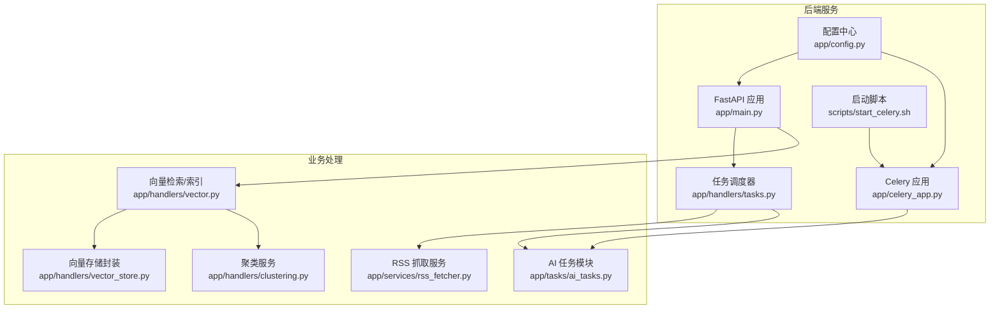
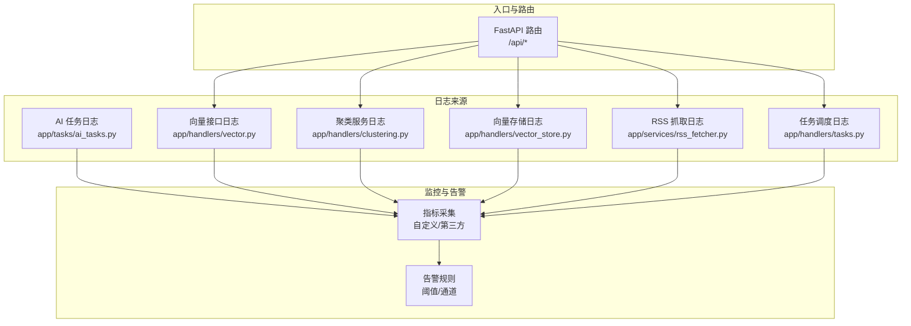
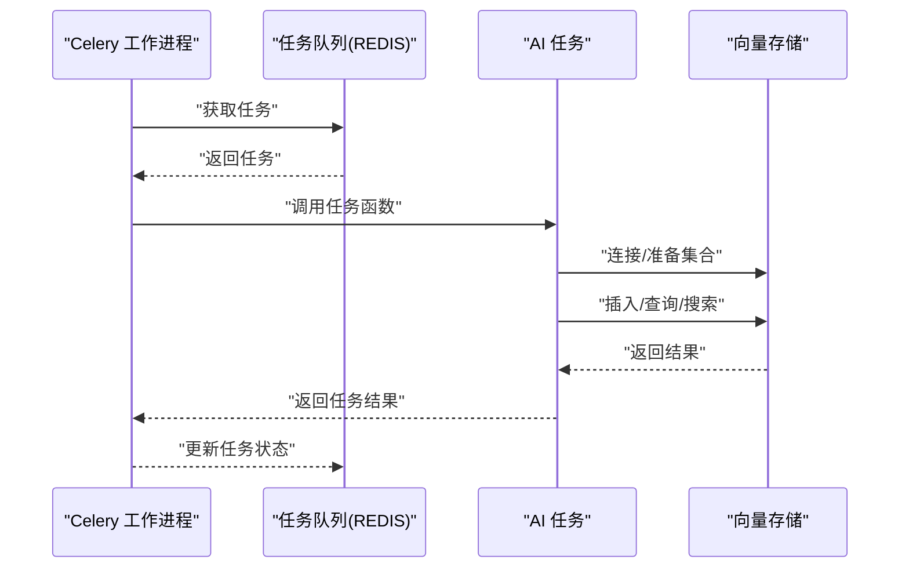
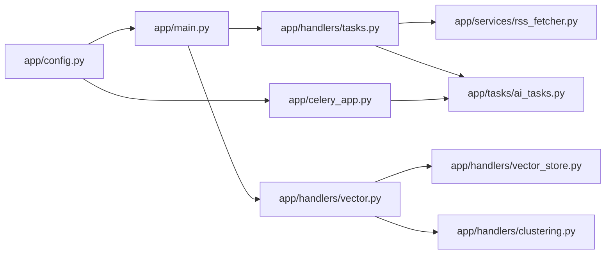

# 日志与监控

<cite>
**本文引用的文件**
- [python-backend/app/celery_app.py](file://python-backend/app/celery_app.py)
- [python-backend/app/config.py](file://python-backend/app/config.py)
- [python-backend/app/main.py](file://python-backend/app/main.py)
- [python-backend/app/handlers/tasks.py](file://python-backend/app/handlers/tasks.py)
- [python-backend/app/handlers/clustering.py](file://python-backend/app/handlers/clustering.py)
- [python-backend/app/handlers/vector.py](file://python-backend/app/handlers/vector.py)
- [python-backend/app/handlers/vector_store.py](file://python-backend/app/handlers/vector_store.py)
- [python-backend/app/services/rss_fetcher.py](file://python-backend/app/services/rss_fetcher.py)
- [python-backend/app/tasks/ai_tasks.py](file://python-backend/app/tasks/ai_tasks.py)
- [python-backend/scripts/start_celery.sh](file://python-backend/scripts/start_celery.sh)
- [python-backend/scripts/vectorize_history.py](file://python-backend/scripts/vectorize_history.py)
</cite>

## 目录
1. [简介](#简介)
2. [项目结构](#项目结构)
3. [核心组件](#核心组件)
4. [架构总览](#架构总览)
5. [详细组件分析](#详细组件分析)
6. [依赖分析](#依赖分析)
7. [性能考虑](#性能考虑)
8. [故障排查指南](#故障排查指南)
9. [结论](#结论)
10. [附录](#附录)

## 简介
本文件面向 Tan RSS Reader 的日志与监控体系，聚焦以下目标：
- 日志配置与日志级别：解释 DEBUG、INFO、WARNING、ERROR 在各模块中的使用场景与输出格式。
- 日志轮转策略：结合现有启动脚本与日志输出位置，给出可落地的轮转方案建议（文件大小限制、保留天数、压缩策略）。
- 性能监控指标：定义请求响应时间、内存使用率、CPU 负载、数据库连接数等关键指标，并说明采集与呈现方式。
- Celery 任务监控：覆盖任务队列状态、执行成功率、失败重试机制与可观测性实践。
- 监控告警配置：提供阈值设定、告警渠道与通知策略的实施建议。
- 日志分析工具与故障排查：指导如何利用现有日志与工具进行问题定位。

## 项目结构
后端采用 Python + FastAPI + APScheduler + Celery + Milvus 向量存储的组合。日志在多个模块中通过标准库 logging 使用；Celery 任务通过独立脚本启动并以 JSON 序列化传输；任务调度器在应用启动时初始化并在关闭时停止。

图表来源
- [python-backend/app/main.py:1-103](file://python-backend/app/main.py#L1-L103)
- [python-backend/app/config.py:1-75](file://python-backend/app/config.py#L1-L75)
- [python-backend/app/handlers/tasks.py:1-276](file://python-backend/app/handlers/tasks.py#L1-L276)
- [python-backend/app/celery_app.py:1-23](file://python-backend/app/celery_app.py#L1-L23)
- [python-backend/scripts/start_celery.sh:1-5](file://python-backend/scripts/start_celery.sh#L1-L5)

章节来源
- [python-backend/app/main.py:1-103](file://python-backend/app/main.py#L1-L103)
- [python-backend/app/config.py:1-75](file://python-backend/app/config.py#L1-L75)
- [python-backend/app/handlers/tasks.py:1-276](file://python-backend/app/handlers/tasks.py#L1-L276)
- [python-backend/app/celery_app.py:1-23](file://python-backend/app/celery_app.py#L1-L23)
- [python-backend/scripts/start_celery.sh:1-5](file://python-backend/scripts/start_celery.sh#L1-L5)

## 核心组件
- 配置中心：集中管理数据库、Redis/Celery、Milvus、AI 服务等外部依赖的地址与凭据。
- 任务调度器：基于 APScheduler 的周期性任务，负责 RSS 刷新、质量评分、健康检查等。
- Celery 应用：定义任务序列化、时区、超时、跟踪等参数，承载异步任务。
- 向量检索与存储：封装 Milvus 连接、集合准备、插入、查询、搜索等操作。
- 日志记录：在各业务模块中使用 logging 记录 INFO/ERROR/WARNING 等信息，便于问题追踪与审计。

章节来源
- [python-backend/app/config.py:41-75](file://python-backend/app/config.py#L41-L75)
- [python-backend/app/handlers/tasks.py:57-230](file://python-backend/app/handlers/tasks.py#L57-L230)
- [python-backend/app/celery_app.py:7-22](file://python-backend/app/celery_app.py#L7-L22)
- [python-backend/app/handlers/vector_store.py:18-197](file://python-backend/app/handlers/vector_store.py#L18-L197)

## 架构总览
下图展示日志与监控在系统中的分布与交互路径。

图表来源
- [python-backend/app/handlers/vector.py:15-158](file://python-backend/app/handlers/vector.py#L15-L158)
- [python-backend/app/handlers/clustering.py:8-142](file://python-backend/app/handlers/clustering.py#L8-L142)
- [python-backend/app/handlers/vector_store.py:16-197](file://python-backend/app/handlers/vector_store.py#L16-L197)
- [python-backend/app/services/rss_fetcher.py:11-312](file://python-backend/app/services/rss_fetcher.py#L11-L312)
- [python-backend/app/handlers/tasks.py:27-276](file://python-backend/app/handlers/tasks.py#L27-L276)
- [python-backend/app/tasks/ai_tasks.py:6-87](file://python-backend/app/tasks/ai_tasks.py#L6-L87)

## 详细组件分析

### 日志配置与日志级别
- 日志模块分布
  - 向量接口与检索：记录连接、索引进度、搜索结果等信息。
  - 聚类服务：记录查询向量、聚类过程与结果统计。
  - 向量存储封装：记录连接、集合准备、插入、查询、搜索错误。
  - RSS 抓取：记录抓取耗时、去重、新增条目数量等。
  - 任务调度：记录任务执行开始/结束、成功/失败计数、历史记录。
  - AI 任务：记录批量质量评分、向量化进度与异常。
- 日志级别使用场景
  - DEBUG：开发调试阶段用于细粒度流程追踪（当前仓库未显式设置，可通过启动参数或脚本调整）。
  - INFO：常规运行状态、进度统计、成功完成的操作。
  - WARNING：跳过处理（如无内容条目）、并发控制提示等。
  - ERROR：连接失败、查询异常、写入失败、网络错误等。
- 输出格式
  - 启动脚本默认使用 info 级别输出到标准输出。
  - 历史脚本示例展示了带时间戳、级别与消息的标准格式。

章节来源
- [python-backend/app/handlers/vector.py:15-158](file://python-backend/app/handlers/vector.py#L15-L158)
- [python-backend/app/handlers/clustering.py:8-142](file://python-backend/app/handlers/clustering.py#L8-L142)
- [python-backend/app/handlers/vector_store.py:16-197](file://python-backend/app/handlers/vector_store.py#L16-L197)
- [python-backend/app/services/rss_fetcher.py:11-312](file://python-backend/app/services/rss_fetcher.py#L11-L312)
- [python-backend/app/handlers/tasks.py:27-276](file://python-backend/app/handlers/tasks.py#L27-L276)
- [python-backend/app/tasks/ai_tasks.py:6-87](file://python-backend/app/tasks/ai_tasks.py#L6-L87)
- [python-backend/scripts/start_celery.sh:4](file://python-backend/scripts/start_celery.sh#L4)
- [python-backend/scripts/vectorize_history.py:18-23](file://python-backend/scripts/vectorize_history.py#L18-L23)

### 日志轮转策略
- 当前现状
  - Celery 工作进程通过启动脚本输出到标准输出，未见内置轮转配置。
  - 历史脚本示例使用 basicConfig 设置了基础格式，但未启用轮转。
- 推荐策略（建议）
  - 文件大小限制：单文件 100–500 MB。
  - 保留天数：7–30 天，按需延长。
  - 压缩策略：保留压缩后的旧日志以便归档。
  - 实施方式：使用系统级日志守护（如 systemd journald、rsyslog 或 logrotate），将标准输出重定向至轮转文件。
- 注意事项
  - 确保日志目录权限与磁盘空间充足。
  - 对敏感字段避免在日志中打印明文。

章节来源
- [python-backend/scripts/start_celery.sh:4](file://python-backend/scripts/start_celery.sh#L4)
- [python-backend/scripts/vectorize_history.py:18-23](file://python-backend/scripts/vectorize_history.py#L18-L23)

### 性能监控指标定义
- 请求响应时间
  - 定义：从收到请求到返回响应的总耗时（毫秒）。
  - 采集点：FastAPI 路由层可扩展中间件埋点；RSS 抓取模块已计算单次抓取耗时并封装为结果对象。
- 内存使用率
  - 定义：进程常驻集大小/峰值内存占用。
  - 采集方式：通过系统监控工具（如 psutil、Prometheus Node Exporter）或容器运行时指标。
- CPU 负载
  - 定义：用户态+内核态 CPU 时间占比。
  - 采集方式：系统级指标或容器资源指标。
- 数据库连接数
  - 定义：SQLAlchemy 引擎当前活跃连接数。
  - 采集方式：引擎状态查询或数据库侧连接数视图。
- 向量存储性能
  - 定义：Milvus 搜索耗时、插入吞吐、集合规模。
  - 采集方式：向量存储封装内部可扩展埋点，或 Milvus 自身指标。

章节来源
- [python-backend/app/services/rss_fetcher.py:29-44](file://python-backend/app/services/rss_fetcher.py#L29-L44)

### Celery 任务监控
- 任务配置
  - 序列化：JSON。
  - 时区：UTC。
  - 超时：任务最大运行时间限制。
  - 启动命令：通过脚本以 info 级别启动工作进程。
- 任务类型
  - 批量质量评分：对条目进行 AI 质量打分并持久化。
  - 向量化：将新条目文本生成向量并写入 Milvus。
- 监控要点
  - 队列状态：任务积压、执行耗时、失败重试次数。
  - 成功率：成功/失败计数与最近失败原因。
  - 重试机制：当前未见自动重试配置，可在任务装饰器中启用重试与退避策略。
- 可观测性建议
  - 使用 Redis 作为结果后端，定期读取任务状态。
  - 结合任务元数据（开始/结束时间、输入参数）进行审计与回放。

图表来源
- [python-backend/app/celery_app.py:7-22](file://python-backend/app/celery_app.py#L7-L22)
- [python-backend/app/tasks/ai_tasks.py:16-51](file://python-backend/app/tasks/ai_tasks.py#L16-L51)
- [python-backend/app/tasks/ai_tasks.py:53-87](file://python-backend/app/tasks/ai_tasks.py#L53-L87)
- [python-backend/app/handlers/vector_store.py:23-54](file://python-backend/app/handlers/vector_store.py#L23-L54)

章节来源
- [python-backend/app/celery_app.py:7-22](file://python-backend/app/celery_app.py#L7-L22)
- [python-backend/app/tasks/ai_tasks.py:16-87](file://python-backend/app/tasks/ai_tasks.py#L16-L87)
- [python-backend/scripts/start_celery.sh:4](file://python-backend/scripts/start_celery.sh#L4)

### 监控告警配置
- 阈值建议
  - 请求响应时间：P95 超过 2 秒；P99 超过 5 秒。
  - 错误率：每分钟错误请求数超过阈值。
  - 数据库连接数：超过最大连接池上限 80%。
  - Celery 失败率：连续失败比例超过 5%。
  - 向量存储：Milvus 连接失败、搜索耗时异常。
- 告警渠道
  - 邮件、企业微信、钉钉机器人、Slack。
- 通知策略
  - 分级告警：Warning/Alert/Critical。
  - 降噪：同类型告警合并发送、静默窗口。

[本节为通用配置建议，不直接分析具体源码文件]

### 日志分析工具与故障排查
- 日志分析工具
  - ELK/EFK：收集、解析、检索与可视化。
  - Loki + Promtail：轻量级日志聚合与告警。
  - Splunk/Graylog：企业级日志平台。
- 故障排查步骤
  - 快速定位：根据 ERROR/WARNING 关键字筛选，结合时间窗与模块名过滤。
  - 根因分析：串联任务 ID、请求 ID、数据库事务 ID，复现最小化场景。
  - 性能瓶颈：对比请求响应时间与数据库/向量存储耗时，识别慢点。
  - 重试与补偿：对失败任务进行重试与人工干预，确保幂等性。

[本节为通用实践建议，不直接分析具体源码文件]

## 依赖分析
- 组件耦合
  - FastAPI 应用依赖配置中心与任务调度器；任务调度器依赖 RSS 抓取与 AI 任务模块；Celery 应用依赖任务模块；向量接口依赖向量存储封装与聚类服务。
- 外部依赖
  - Redis：Celery 代理与后端。
  - Milvus：向量检索与存储。
  - APScheduler：周期性任务调度。
- 循环依赖
  - 未发现直接循环导入；模块间通过函数调用与实例注入解耦。

图表来源
- [python-backend/app/main.py:1-103](file://python-backend/app/main.py#L1-L103)
- [python-backend/app/handlers/tasks.py:1-276](file://python-backend/app/handlers/tasks.py#L1-L276)
- [python-backend/app/handlers/vector.py:1-158](file://python-backend/app/handlers/vector.py#L1-L158)
- [python-backend/app/handlers/vector_store.py:1-197](file://python-backend/app/handlers/vector_store.py#L1-L197)
- [python-backend/app/services/rss_fetcher.py:1-312](file://python-backend/app/services/rss_fetcher.py#L1-L312)
- [python-backend/app/tasks/ai_tasks.py:1-87](file://python-backend/app/tasks/ai_tasks.py#L1-L87)
- [python-backend/app/celery_app.py:1-23](file://python-backend/app/celery_app.py#L1-L23)
- [python-backend/app/config.py:1-75](file://python-backend/app/config.py#L1-L75)

章节来源
- [python-backend/app/main.py:1-103](file://python-backend/app/main.py#L1-L103)
- [python-backend/app/handlers/tasks.py:1-276](file://python-backend/app/handlers/tasks.py#L1-L276)
- [python-backend/app/handlers/vector.py:1-158](file://python-backend/app/handlers/vector.py#L1-L158)
- [python-backend/app/handlers/vector_store.py:1-197](file://python-backend/app/handlers/vector_store.py#L1-L197)
- [python-backend/app/services/rss_fetcher.py:1-312](file://python-backend/app/services/rss_fetcher.py#L1-L312)
- [python-backend/app/tasks/ai_tasks.py:1-87](file://python-backend/app/tasks/ai_tasks.py#L1-L87)
- [python-backend/app/celery_app.py:1-23](file://python-backend/app/celery_app.py#L1-L23)
- [python-backend/app/config.py:1-75](file://python-backend/app/config.py#L1-L75)

## 性能考虑
- 日志开销
  - INFO/ERROR 级别日志对性能影响较小；在高并发场景建议减少高频微日志输出。
- 数据库与向量存储
  - 控制批量大小与并发度，避免触发限流或连接池耗尽。
- 任务执行
  - 为长耗时任务设置合理超时与重试；对幂等性任务支持重复执行。
- 监控指标
  - 仅采集必要指标，避免额外 IO 压力；对高频指标进行采样或聚合。

[本节提供通用指导，不直接分析具体源码文件]

## 故障排查指南
- 常见问题定位
  - Celery 无法连接 Redis：检查 REDIS_URL 与网络连通性。
  - Milvus 连接失败：确认主机、端口与集合存在性。
  - 任务失败：查看任务日志与最近一次错误描述。
- 快速恢复
  - 重启 Celery 工作进程与 FastAPI 应用。
  - 清理异常队列并重放失败任务。
- 预防措施
  - 为关键任务添加重试与死信队列。
  - 对外部服务调用增加超时与熔断保护。

章节来源
- [python-backend/app/config.py:41-75](file://python-backend/app/config.py#L41-L75)
- [python-backend/app/handlers/vector_store.py:30-54](file://python-backend/app/handlers/vector_store.py#L30-L54)
- [python-backend/app/tasks/ai_tasks.py:40-49](file://python-backend/app/tasks/ai_tasks.py#L40-L49)

## 结论
本项目在日志与监控方面具备良好的模块化基础：日志覆盖主要业务链路，Celery 任务与任务调度器清晰分离。建议下一步完善以下方面：
- 明确日志级别策略与轮转配置，确保生产可用。
- 补充性能指标采集与可视化，建立告警闭环。
- 为 Celery 任务增加重试与监控面板，提升可观测性。
- 提供日志分析工具使用指南与故障排查手册，降低运维成本。

[本节为总结性内容，不直接分析具体源码文件]

## 附录
- 启动与运行
  - Celery 工作进程：通过脚本以 info 级别启动。
  - FastAPI 应用：包含 CORS 中间件与多路由注册，启动时初始化数据库与调度器。
- 关键路径参考
  - 任务调度器启动与停止：在应用生命周期事件中调用。
  - 向量存储连接与集合准备：在首次使用时自动完成。

章节来源
- [python-backend/scripts/start_celery.sh:1-5](file://python-backend/scripts/start_celery.sh#L1-L5)
- [python-backend/app/main.py:64-103](file://python-backend/app/main.py#L64-L103)
- [python-backend/app/handlers/vector_store.py:23-54](file://python-backend/app/handlers/vector_store.py#L23-L54)