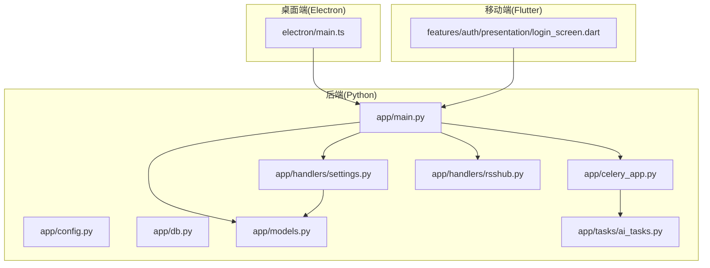
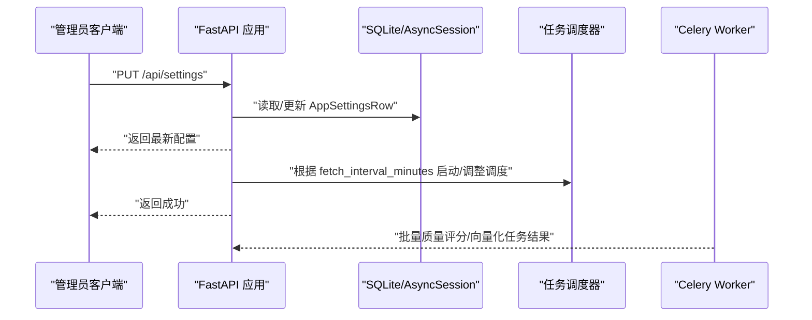
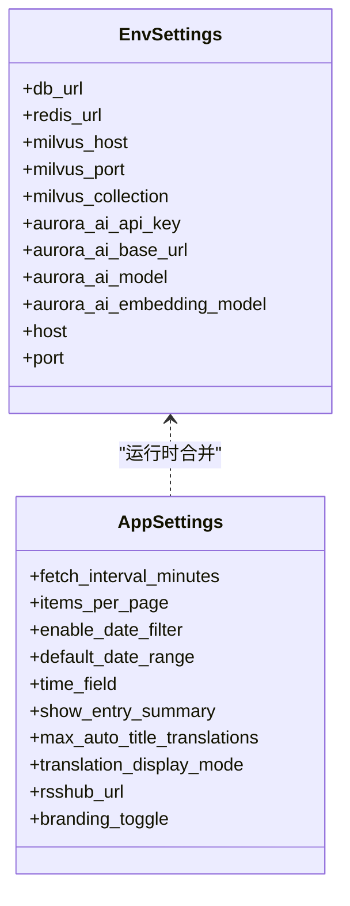
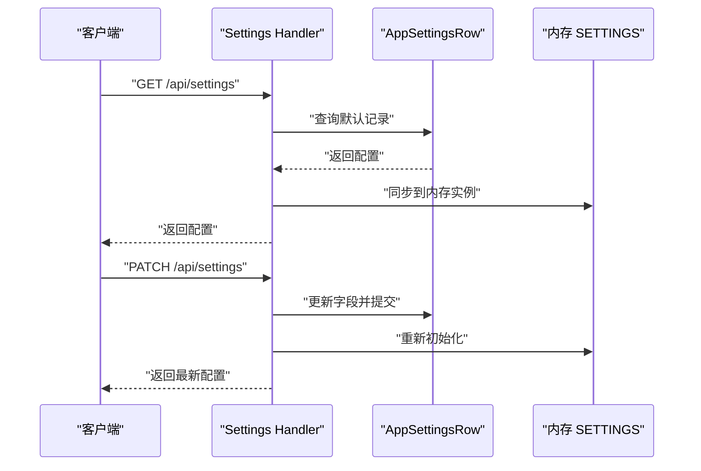
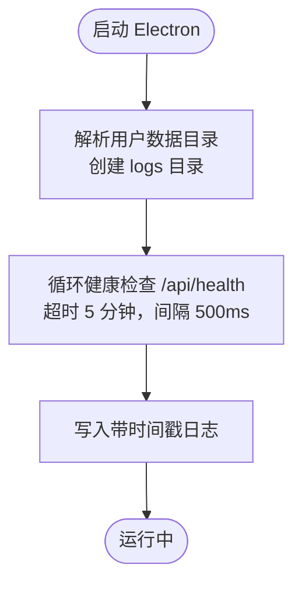
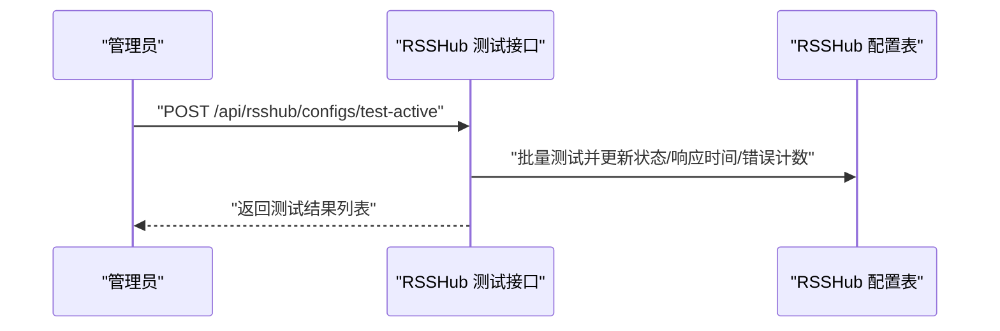
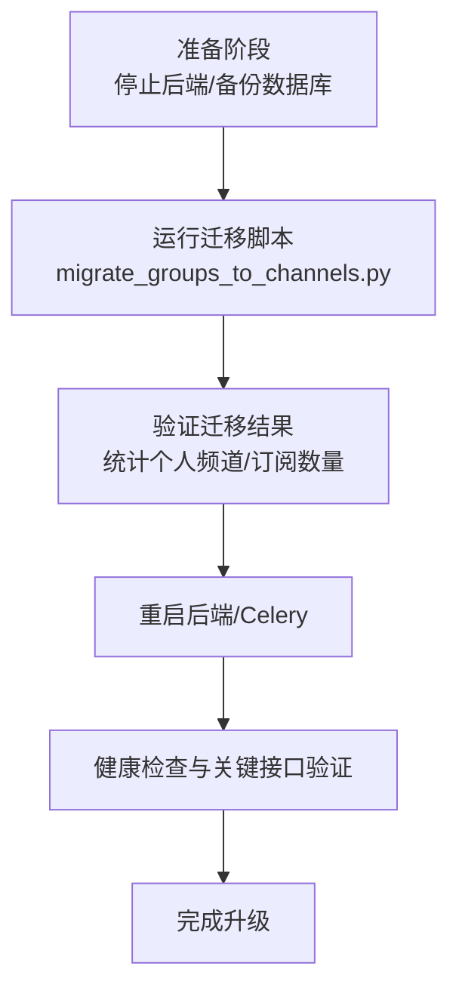
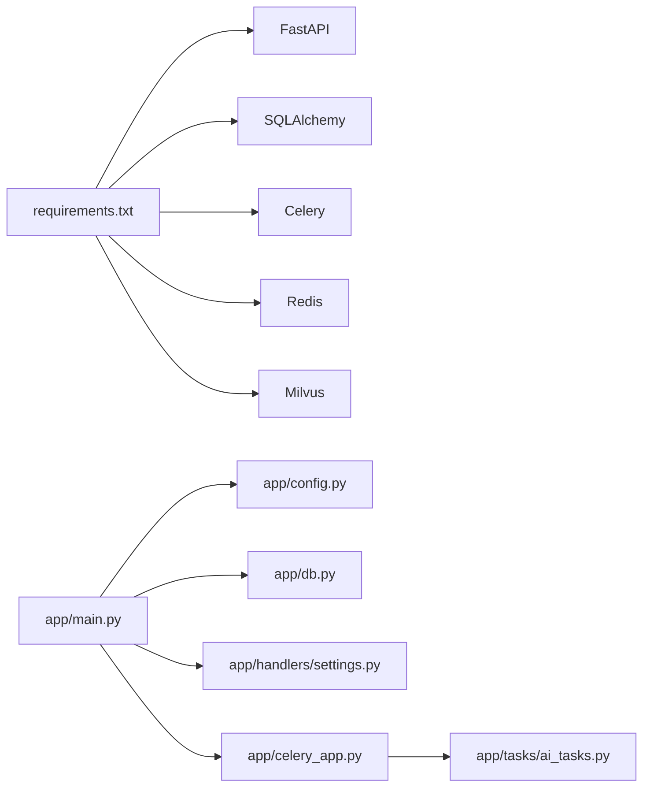

# 系统配置与管理

<cite>
**本文引用的文件**
- [config.py](file://python-backend/app/config.py)
- [main.py](file://python-backend/app/main.py)
- [settings.py](file://python-backend/app/handlers/settings.py)
- [db.py](file://python-backend/app/db.py)
- [models.py](file://python-backend/app/models.py)
- [celery_app.py](file://python-backend/app/celery_app.py)
- [ai_tasks.py](file://python-backend/app/tasks/ai_tasks.py)
- [rsshub.py](file://python-backend/app/handlers/rsshub.py)
- [start_celery.sh](file://python-backend/scripts/start_celery.sh)
- [main.ts](file://rss-desktop/electron/main.ts)
- [login_screen.dart](file://tan_rss_mobile/lib/features/auth/presentation/login_screen.dart)
- [migrate_groups_to_channels.py](file://python-backend/scripts/migrate_groups_to_channels.py)
- [requirements.txt](file://python-backend/requirements.txt)
</cite>

## 目录
1. [引言](#引言)
2. [项目结构](#项目结构)
3. [核心组件](#核心组件)
4. [架构总览](#架构总览)
5. [详细组件分析](#详细组件分析)
6. [依赖分析](#依赖分析)
7. [性能考虑](#性能考虑)
8. [故障排查指南](#故障排查指南)
9. [结论](#结论)
10. [附录](#附录)

## 引言
本文件面向 Tan RSS Reader 的系统配置与管理，围绕以下主题展开：配置文件结构与环境变量管理、动态配置更新机制、系统设置（全局配置、用户偏好、功能开关）、日志管理、性能监控与指标收集、安全配置（含 SSL 与防火墙建议）、备份恢复与数据迁移、版本升级流程，以及运维监控、健康检查与故障诊断工具。内容以仓库现有实现为基础，结合可操作的最佳实践进行说明。

## 项目结构
系统采用前后端分离架构：
- Python 后端（FastAPI）：负责业务逻辑、配置管理、任务调度、AI 能力与向量检索集成。
- 桌面端（Electron）：负责本地后端进程启动、健康检查与日志落盘。
- 移动端（Flutter Riverpod）：负责用户配置持久化（如服务器地址）与 UI 表现。

**图表来源**
- [main.ts:39-118](file://rss-desktop/electron/main.ts#L39-L118)
- [login_screen.dart:40-47](file://tan_rss_mobile/lib/features/auth/presentation/login_screen.dart#L40-L47)
- [config.py:1-75](file://python-backend/app/config.py#L1-L75)
- [main.py:1-103](file://python-backend/app/main.py#L1-L103)
- [db.py:1-27](file://python-backend/app/db.py#L1-L27)
- [models.py:82-125](file://python-backend/app/models.py#L82-L125)
- [settings.py:1-161](file://python-backend/app/handlers/settings.py#L1-L161)
- [celery_app.py:1-23](file://python-backend/app/celery_app.py#L1-L23)
- [ai_tasks.py:1-87](file://python-backend/app/tasks/ai_tasks.py#L1-L87)
- [rsshub.py:68-222](file://python-backend/app/handlers/rsshub.py#L68-L222)

**章节来源**
- [main.py:1-103](file://python-backend/app/main.py#L1-L103)
- [config.py:1-75](file://python-backend/app/config.py#L1-L75)
- [db.py:1-27](file://python-backend/app/db.py#L1-L27)
- [models.py:82-125](file://python-backend/app/models.py#L82-L125)
- [settings.py:1-161](file://python-backend/app/handlers/settings.py#L1-L161)
- [celery_app.py:1-23](file://python-backend/app/celery_app.py#L1-L23)
- [ai_tasks.py:1-87](file://python-backend/app/tasks/ai_tasks.py#L1-L87)
- [rsshub.py:68-222](file://python-backend/app/handlers/rsshub.py#L68-L222)
- [main.ts:39-118](file://rss-desktop/electron/main.ts#L39-L118)
- [login_screen.dart:40-47](file://tan_rss_mobile/lib/features/auth/presentation/login_screen.dart#L40-L47)

## 核心组件
- 配置模型与环境变量
  - 应用配置模型：集中定义全局参数（如抓取间隔、分页大小、日期筛选、默认时间字段、摘要显示、翻译语言、RSSHub 地址、品牌开关等）。
  - 环境配置模型：统一从 .env 或环境变量加载数据库、Redis/Celery、向量库 Milvus、AI 服务、后端主机与端口等外部依赖。
- 数据层与持久化
  - 使用 SQLAlchemy ORM 定义应用设置表与 AI 配置表，并在启动时进行必要的列扩展与初始化。
- 设置管理 API
  - 提供获取与更新全局设置的接口；支持 RSSHub 地址测试与快速连通性验证。
- 任务与调度
  - Celery 作为异步任务队列，配合 APScheduler 在后端启动时运行定时任务；AI 批量质量评分与向量化任务通过 Celery 执行。
- 健康检查与日志
  - 桌面端 Electron 进程负责后端健康检查与日志落盘；移动端负责基础配置持久化。

**章节来源**
- [config.py:5-75](file://python-backend/app/config.py#L5-L75)
- [models.py:82-125](file://python-backend/app/models.py#L82-L125)
- [settings.py:20-161](file://python-backend/app/handlers/settings.py#L20-L161)
- [celery_app.py:1-23](file://python-backend/app/celery_app.py#L1-L23)
- [ai_tasks.py:16-87](file://python-backend/app/tasks/ai_tasks.py#L16-L87)
- [main.ts:93-118](file://rss-desktop/electron/main.ts#L93-L118)

## 架构总览
系统配置与管理涉及“配置模型—环境变量—数据库持久化—API 动态更新—任务执行—健康检查”的闭环。

**图表来源**
- [settings.py:58-87](file://python-backend/app/handlers/settings.py#L58-L87)
- [main.py:64-98](file://python-backend/app/main.py#L64-L98)
- [celery_app.py:14-22](file://python-backend/app/celery_app.py#L14-L22)
- [ai_tasks.py:16-51](file://python-backend/app/tasks/ai_tasks.py#L16-L51)

## 详细组件分析

### 配置系统与环境变量管理
- 配置模型
  - AppSettings：定义应用行为参数（如抓取周期、分页、日期过滤、摘要显示、翻译语言、RSSHub 默认地址、品牌开关等）。
  - EnvSettings：从 .env 或环境变量加载数据库连接、Redis/Celery、Milvus、AI 服务、后端监听地址等。
- 加载顺序与优先级
  - 环境变量覆盖 .env；若未提供则使用默认值。
- 启动时合并
  - 后端启动时读取数据库中的 AppSettingsRow，默认记录 id 为 "default"，并同步到内存 SETTINGS 实例，确保运行期一致。

**图表来源**
- [config.py:5-75](file://python-backend/app/config.py#L5-L75)

**章节来源**
- [config.py:41-75](file://python-backend/app/config.py#L41-L75)
- [main.py:64-98](file://python-backend/app/main.py#L64-L98)

### 系统设置管理（全局配置、用户偏好、功能开关）
- 全局配置
  - 通过 /api/settings 获取与更新 AppSettingsRow；更新后立即同步到内存 SETTINGS。
  - 支持 RSSHub 地址测试（快速连通性与响应条目数统计），保障上游可用性。
- 用户偏好与功能开关
  - 用户偏好可通过前端存储（移动端示例中对服务器地址的持久化）与后端会员体系（订阅等级、当日调用次数）间接影响体验。
  - 功能开关（如自动摘要、自动翻译、自动标题翻译、自动质量评分）在 AI 配置表中维护，影响 AI 任务行为。

**图表来源**
- [settings.py:20-87](file://python-backend/app/handlers/settings.py#L20-L87)
- [models.py:82-96](file://python-backend/app/models.py#L82-L96)

**章节来源**
- [settings.py:20-161](file://python-backend/app/handlers/settings.py#L20-L161)
- [models.py:82-125](file://python-backend/app/models.py#L82-L125)

### 日志管理系统
- 桌面端日志
  - Electron 主进程在用户数据目录创建 logs 子目录，将带时间戳的日志追加写入文件，便于离线排障。
  - 健康检查循环每 500ms 检查后端 /api/health，超时延长至 5 分钟以适配慢盘或首次初始化场景。
- 后端日志
  - Celery 任务中使用标准日志模块记录错误与进度信息，便于定位批量处理问题。
- 建议
  - 结合系统日志轮转策略（如 logrotate）控制磁盘占用。
  - 对生产环境启用更细粒度的日志级别与结构化输出。

**图表来源**
- [main.ts:79-118](file://rss-desktop/electron/main.ts#L79-L118)

**章节来源**
- [main.ts:68-118](file://rss-desktop/electron/main.ts#L68-L118)
- [ai_tasks.py:2-6](file://python-backend/app/tasks/ai_tasks.py#L2-L6)

### 性能监控与指标收集
- 关键指标
  - RSSHub 连接质量：响应时间、错误计数、活跃状态。
  - AI 调用统计：按用户维度记录当日调用次数，结合会员等级限制。
  - 批处理任务：批量质量评分与向量化任务的处理数量与耗时。
- 监控与告警
  - RSSHub 配置测试接口可返回响应时间与条目数，用于评估上游性能。
  - 会员状态接口返回当日调用量，可用于限流与告警阈值设定。
- 性能分析
  - 批处理任务在 Celery 中执行，可通过任务跟踪与结果后端观测执行时延与失败率。

**图表来源**
- [rsshub.py:68-102](file://python-backend/app/handlers/rsshub.py#L68-L102)

**章节来源**
- [rsshub.py:68-222](file://python-backend/app/handlers/rsshub.py#L68-L222)
- [ai_tasks.py:16-51](file://python-backend/app/tasks/ai_tasks.py#L16-L51)

### 安全配置、SSL 证书管理与防火墙设置
- 认证与授权
  - 设置管理接口要求管理员权限，确保敏感配置变更受控。
- 传输安全
  - 建议在反向代理层启用 HTTPS 并配置强密码套件与 TLS 版本策略。
  - 对外暴露的 RSSHub 服务应使用可信证书，避免中间人攻击。
- 网络隔离
  - 将数据库、Redis、Milvus 与后端服务置于内网或受限子网，仅开放必要端口。
  - 防火墙规则最小化放行：后端 API、Celery Broker、数据库端口、向量库端口。
- 密钥与凭证
  - 使用环境变量或密钥管理服务注入敏感信息，避免硬编码于代码或仓库。

**章节来源**
- [settings.py:11-12](file://python-backend/app/handlers/settings.py#L11-L12)
- [config.py:41-75](file://python-backend/app/config.py#L41-L75)

### 备份恢复策略、数据迁移与版本升级
- 备份
  - SQLite 数据库存放于 data 目录，建议定期复制该文件进行备份。
  - 备份前停止后端进程，确保一致性。
- 恢复
  - 停止后端，替换备份文件，启动后端验证数据库连接与表结构。
- 数据迁移
  - 提供从旧模型（Feed.category → Channel/Subscription）的迁移脚本，包含步骤拆解与校验逻辑。
  - 迁移完成后建议删除旧列并在后续版本中清理历史索引。
- 版本升级
  - 升级前先备份数据库；执行 schema 变更与迁移脚本；重启后端与 Celery；验证健康检查与关键接口。

**图表来源**
- [migrate_groups_to_channels.py:27-209](file://python-backend/scripts/migrate_groups_to_channels.py#L27-L209)

**章节来源**
- [db.py:11-22](file://python-backend/app/db.py#L11-L22)
- [migrate_groups_to_channels.py:27-209](file://python-backend/scripts/migrate_groups_to_channels.py#L27-L209)

### 运维监控、健康检查与故障诊断
- 健康检查
  - 桌面端 Electron 循环访问 /api/health，超时与重试策略保证初次启动与慢盘场景下的稳定性。
- 故障诊断
  - 查看桌面端日志文件定位后端启动与连接问题。
  - 检查 Celery 日志与任务队列状态，确认批量任务是否正常执行。
  - 使用设置管理 API 的 RSSHub 快速测试接口验证上游连通性与性能。

**章节来源**
- [main.ts:93-118](file://rss-desktop/electron/main.ts#L93-L118)
- [ai_tasks.py:2-6](file://python-backend/app/tasks/ai_tasks.py#L2-L6)
- [settings.py:119-161](file://python-backend/app/handlers/settings.py#L119-L161)

## 依赖分析
- 外部依赖
  - FastAPI、SQLAlchemy、Celery、Redis、Milvus、feedparser、httpx 等。
- 内部耦合
  - main.py 依赖配置与数据库初始化，设置处理器依赖数据库模型与调度器。
  - Celery 任务依赖数据库会话与 AI/向量能力模块。

**图表来源**
- [requirements.txt:1-18](file://python-backend/requirements.txt#L1-L18)
- [main.py:1-103](file://python-backend/app/main.py#L1-L103)
- [config.py:1-75](file://python-backend/app/config.py#L1-L75)
- [db.py:1-27](file://python-backend/app/db.py#L1-L27)
- [settings.py:1-161](file://python-backend/app/handlers/settings.py#L1-L161)
- [celery_app.py:1-23](file://python-backend/app/celery_app.py#L1-L23)
- [ai_tasks.py:1-87](file://python-backend/app/tasks/ai_tasks.py#L1-L87)

**章节来源**
- [requirements.txt:1-18](file://python-backend/requirements.txt#L1-L18)
- [main.py:1-103](file://python-backend/app/main.py#L1-L103)

## 性能考虑
- 数据库
  - 使用 SQLite 适合单机部署；高并发场景建议迁移到 PostgreSQL/MySQL 并启用连接池。
- 任务执行
  - 批处理任务设置最大执行时间与结果序列化策略，避免长时间阻塞。
- 网络
  - RSSHub 测试接口设置合理超时与重试，减少无效等待。
- 缓存与索引
  - 适当增加数据库索引（如 entries.dedup_key、channels.owner_id、subscriptions.user_id）提升查询性能。

[本节为通用指导，无需列出具体文件来源]

## 故障排查指南
- 后端无法启动
  - 检查 .env 或环境变量中的数据库、Redis、Milvus 地址是否正确。
  - 查看桌面端日志文件定位健康检查失败原因。
- 设置更新不生效
  - 确认 /api/settings 返回值与内存 SETTINGS 已同步；检查数据库默认记录是否存在。
- Celery 任务失败
  - 查看 Celery 日志与任务结果后端，确认 Broker/Backend 配置与网络连通性。
- RSSHub 不可用
  - 使用 /api/settings/test-rsshub-quick 或 /api/rsshub/configs/test 接口验证连通性与响应时间。

**章节来源**
- [main.ts:93-118](file://rss-desktop/electron/main.ts#L93-L118)
- [settings.py:58-87](file://python-backend/app/handlers/settings.py#L58-L87)
- [ai_tasks.py:16-51](file://python-backend/app/tasks/ai_tasks.py#L16-L51)
- [rsshub.py:185-222](file://python-backend/app/handlers/rsshub.py#L185-L222)

## 结论
本系统通过“配置模型 + 环境变量 + 数据库持久化 + API 动态更新 + 任务执行 + 健康检查”的闭环实现了灵活而可控的配置与管理能力。建议在生产环境中完善日志轮转、传输加密、网络隔离与密钥管理，并建立标准化的备份恢复与版本升级流程，以确保系统的稳定性与可维护性。

## 附录
- 配置项清单（基于现有实现）
  - 应用配置：抓取间隔、分页大小、日期过滤、默认时间字段、摘要显示、标题翻译上限、翻译展示模式、RSSHub 地址、品牌开关。
  - 环境配置：数据库 URL、Redis/Celery URL、Milvus 主机/端口/集合名、AI 服务密钥与基础地址、后端监听地址。
  - AI 配置：摘要/翻译/嵌入服务的密钥、基础地址、模型名、功能开关（自动摘要、自动翻译、自动标题翻译、自动质量评分、翻译语言）。

**章节来源**
- [config.py:5-75](file://python-backend/app/config.py#L5-L75)
- [models.py:82-125](file://python-backend/app/models.py#L82-L125)
- [settings.py:20-87](file://python-backend/app/handlers/settings.py#L20-L87)