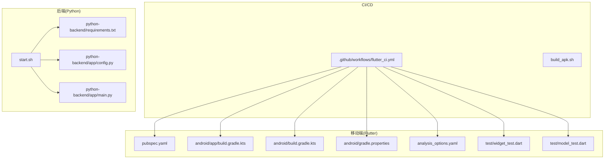
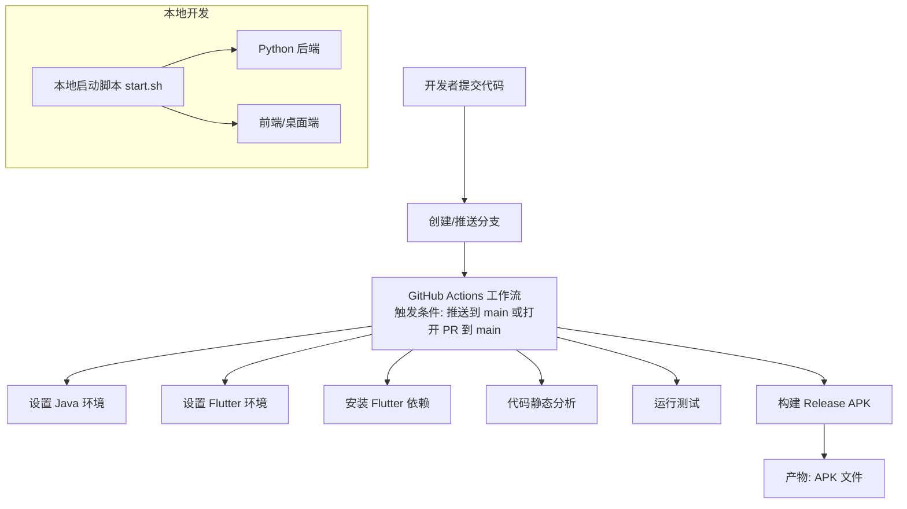
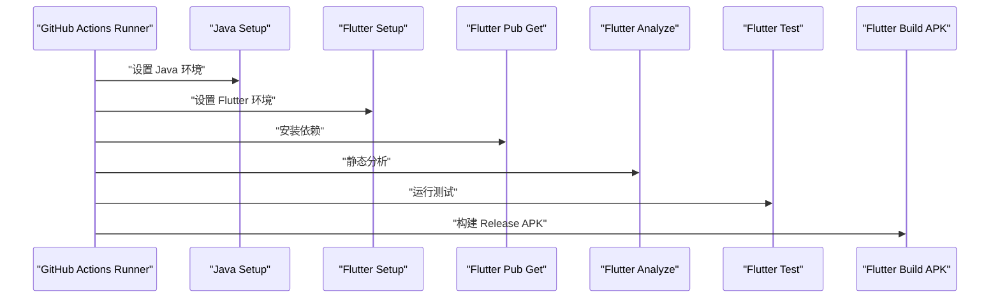
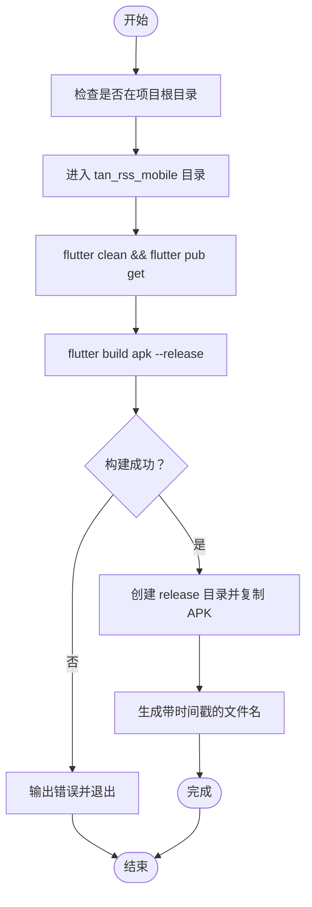
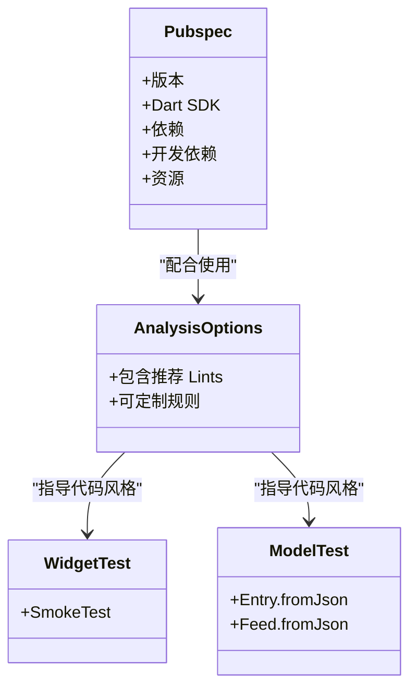
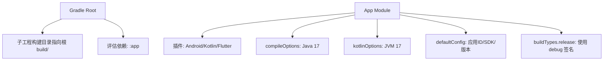
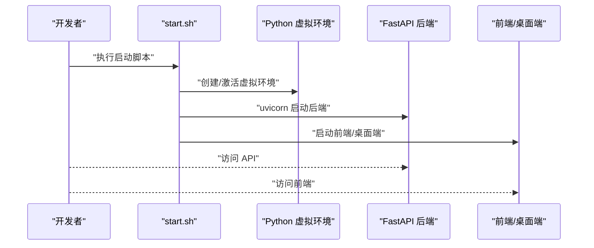
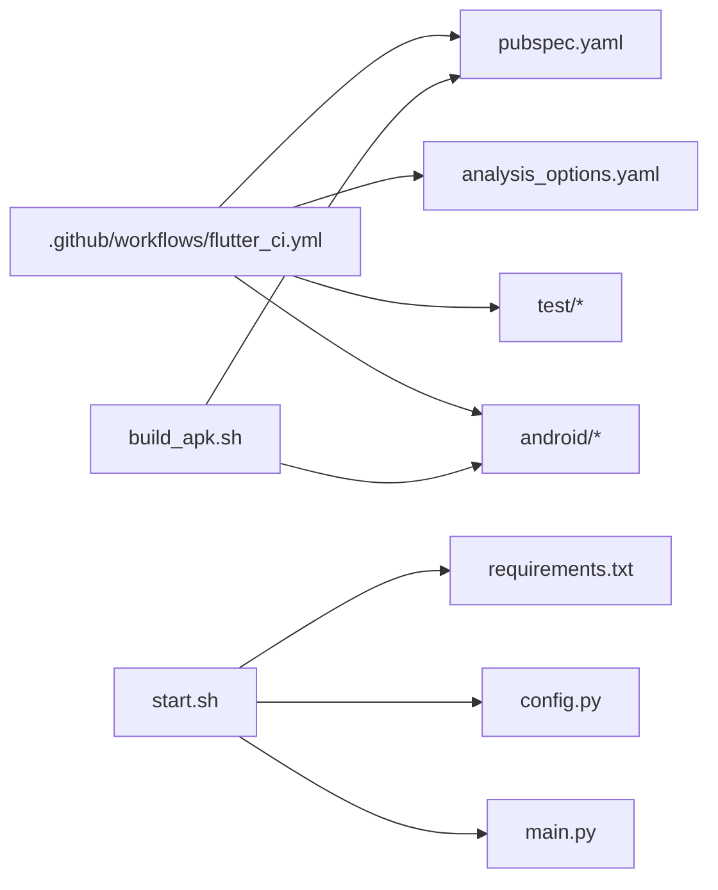

# CI/CD流水线

<cite>
**本文引用的文件**
- [.github/workflows/flutter_ci.yml](file://.github/workflows/flutter_ci.yml)
- [build_apk.sh](file://build_apk.sh)
- [tan_rss_mobile/pubspec.yaml](file://tan_rss_mobile/pubspec.yaml)
- [tan_rss_mobile/android/app/build.gradle.kts](file://tan_rss_mobile/android/app/build.gradle.kts)
- [tan_rss_mobile/android/build.gradle.kts](file://tan_rss_mobile/android/build.gradle.kts)
- [tan_rss_mobile/analysis_options.yaml](file://tan_rss_mobile/analysis_options.yaml)
- [tan_rss_mobile/test/widget_test.dart](file://tan_rss_mobile/test/widget_test.dart)
- [tan_rss_mobile/test/model_test.dart](file://tan_rss_mobile/test/model_test.dart)
- [python-backend/requirements.txt](file://python-backend/requirements.txt)
- [python-backend/app/main.py](file://python-backend/app/main.py)
- [python-backend/app/config.py](file://python-backend/app/config.py)
- [start.sh](file://start.sh)
- [tan_rss_mobile/android/gradle.properties](file://tan_rss_mobile/android/gradle.properties)
</cite>

## 目录
1. [简介](#简介)
2. [项目结构](#项目结构)
3. [核心组件](#核心组件)
4. [架构总览](#架构总览)
5. [详细组件分析](#详细组件分析)
6. [依赖关系分析](#依赖关系分析)
7. [性能考虑](#性能考虑)
8. [故障排查指南](#故障排查指南)
9. [结论](#结论)
10. [附录](#附录)

## 简介
本文件为 Tan RSS Reader 的 CI/CD 流水线文档，聚焦于 GitHub Actions 的 Flutter CI 工作流、自动化测试与 APK 构建，同时覆盖持续集成最佳实践（代码检查、单元测试、集成测试）、自动化部署流程（构建参数、环境变量管理、发布策略）、分支管理与版本控制、发布周期、流水线监控与日志分析、以及本地开发环境与 CI 环境的差异配置。文档内容严格基于仓库现有文件进行梳理与总结。

## 项目结构
本项目采用多模块结构：
- 移动端：Flutter 应用位于 tan_rss_mobile，包含 Android/iOS/Linux/macOS/Windows/Web 平台支持。
- 桌面端：基于 Electron/Vue 的桌面应用位于 rss-desktop。
- 后端：Python FastAPI 应用位于 python-backend，提供 REST API、定时任务与向量检索等能力。
- CI/CD：GitHub Actions 工作流位于 .github/workflows/flutter_ci.yml；另有本地一键构建脚本 build_apk.sh。

图表来源
- [.github/workflows/flutter_ci.yml:1-43](file://.github/workflows/flutter_ci.yml#L1-L43)
- [build_apk.sh:1-71](file://build_apk.sh#L1-L71)
- [tan_rss_mobile/pubspec.yaml:1-112](file://tan_rss_mobile/pubspec.yaml#L1-L112)
- [tan_rss_mobile/android/app/build.gradle.kts:1-45](file://tan_rss_mobile/android/app/build.gradle.kts#L1-L45)
- [tan_rss_mobile/android/build.gradle.kts:1-25](file://tan_rss_mobile/android/build.gradle.kts#L1-L25)
- [tan_rss_mobile/analysis_options.yaml:1-29](file://tan_rss_mobile/analysis_options.yaml#L1-L29)
- [tan_rss_mobile/test/widget_test.dart:1-17](file://tan_rss_mobile/test/widget_test.dart#L1-L17)
- [tan_rss_mobile/test/model_test.dart:1-43](file://tan_rss_mobile/test/model_test.dart#L1-L43)
- [python-backend/requirements.txt:1-18](file://python-backend/requirements.txt#L1-L18)
- [python-backend/app/config.py:1-75](file://python-backend/app/config.py#L1-L75)
- [python-backend/app/main.py:1-103](file://python-backend/app/main.py#L1-L103)
- [start.sh:1-94](file://start.sh#L1-L94)

章节来源
- [.github/workflows/flutter_ci.yml:1-43](file://.github/workflows/flutter_ci.yml#L1-L43)
- [build_apk.sh:1-71](file://build_apk.sh#L1-L71)
- [tan_rss_mobile/pubspec.yaml:1-112](file://tan_rss_mobile/pubspec.yaml#L1-L112)
- [tan_rss_mobile/android/app/build.gradle.kts:1-45](file://tan_rss_mobile/android/app/build.gradle.kts#L1-L45)
- [tan_rss_mobile/android/build.gradle.kts:1-25](file://tan_rss_mobile/android/build.gradle.kts#L1-L25)
- [tan_rss_mobile/analysis_options.yaml:1-29](file://tan_rss_mobile/analysis_options.yaml#L1-L29)
- [tan_rss_mobile/test/widget_test.dart:1-17](file://tan_rss_mobile/test/widget_test.dart#L1-L17)
- [tan_rss_mobile/test/model_test.dart:1-43](file://tan_rss_mobile/test/model_test.dart#L1-L43)
- [python-backend/requirements.txt:1-18](file://python-backend/requirements.txt#L1-L18)
- [python-backend/app/config.py:1-75](file://python-backend/app/config.py#L1-L75)
- [python-backend/app/main.py:1-103](file://python-backend/app/main.py#L1-L103)
- [start.sh:1-94](file://start.sh#L1-L94)

## 核心组件
- GitHub Actions Flutter CI 工作流：负责在推送与拉取请求到主分支时，执行 Java/Flutter 环境准备、依赖安装、代码静态分析、测试与 APK 构建。
- 本地一键构建脚本：提供与 CI 等价的本地构建流程，便于开发者快速验证。
- Flutter 项目配置：版本号、依赖、分析规则、测试用例与 Android 构建配置。
- Python 后端配置：FastAPI 应用、CORS、路由注册、数据库初始化与定时任务调度，以及环境变量加载。

章节来源
- [.github/workflows/flutter_ci.yml:1-43](file://.github/workflows/flutter_ci.yml#L1-L43)
- [build_apk.sh:1-71](file://build_apk.sh#L1-L71)
- [tan_rss_mobile/pubspec.yaml:1-112](file://tan_rss_mobile/pubspec.yaml#L1-L112)
- [tan_rss_mobile/analysis_options.yaml:1-29](file://tan_rss_mobile/analysis_options.yaml#L1-L29)
- [tan_rss_mobile/test/widget_test.dart:1-17](file://tan_rss_mobile/test/widget_test.dart#L1-L17)
- [tan_rss_mobile/test/model_test.dart:1-43](file://tan_rss_mobile/test/model_test.dart#L1-L43)
- [python-backend/app/main.py:1-103](file://python-backend/app/main.py#L1-L103)
- [python-backend/app/config.py:1-75](file://python-backend/app/config.py#L1-L75)

## 架构总览
下图展示 CI/CD 在整体系统中的位置与交互：

图表来源
- [.github/workflows/flutter_ci.yml:1-43](file://.github/workflows/flutter_ci.yml#L1-L43)
- [start.sh:1-94](file://start.sh#L1-L94)
- [python-backend/app/main.py:1-103](file://python-backend/app/main.py#L1-L103)

## 详细组件分析

### GitHub Actions 工作流（Flutter CI）
- 触发条件：仅在推送到 main 分支或针对 main 分支发起 Pull Request 时触发。
- 步骤概览：
  - 检出代码
  - 设置 Java（Zulu 发行版，版本 17）
  - 设置 Flutter（稳定通道，固定版本）
  - 在移动端目录执行依赖安装
  - 代码静态分析
  - 运行测试
  - 构建 Release APK

图表来源
- [.github/workflows/flutter_ci.yml:1-43](file://.github/workflows/flutter_ci.yml#L1-L43)

章节来源
- [.github/workflows/flutter_ci.yml:1-43](file://.github/workflows/flutter_ci.yml#L1-L43)

### 本地一键构建脚本（APK）
- 功能：在本地执行与 CI 等价的清理、依赖安装、构建与产物拷贝流程，并生成带时间戳的 APK 文件名，输出到项目根目录 release/ 目录。
- 关键点：确保在项目根目录执行；构建成功后复制产物；失败时返回非零退出码。

图表来源
- [build_apk.sh:1-71](file://build_apk.sh#L1-L71)

章节来源
- [build_apk.sh:1-71](file://build_apk.sh#L1-L71)

### Flutter 项目配置与测试
- 版本与依赖：pubspec.yaml 定义了应用版本、Dart SDK 版本、生产与开发依赖，以及图标生成与资源清单。
- 代码质量：analysis_options.yaml 引入 Flutter 推荐 Lints，确保一致的代码风格与质量基线。
- 测试用例：
  - widget_test.dart：基础 Widget 渲染冒烟测试。
  - model_test.dart：模型 JSON 解析正确性测试（如 Entry、Feed）。

图表来源
- [tan_rss_mobile/pubspec.yaml:1-112](file://tan_rss_mobile/pubspec.yaml#L1-L112)
- [tan_rss_mobile/analysis_options.yaml:1-29](file://tan_rss_mobile/analysis_options.yaml#L1-L29)
- [tan_rss_mobile/test/widget_test.dart:1-17](file://tan_rss_mobile/test/widget_test.dart#L1-L17)
- [tan_rss_mobile/test/model_test.dart:1-43](file://tan_rss_mobile/test/model_test.dart#L1-L43)

章节来源
- [tan_rss_mobile/pubspec.yaml:1-112](file://tan_rss_mobile/pubspec.yaml#L1-L112)
- [tan_rss_mobile/analysis_options.yaml:1-29](file://tan_rss_mobile/analysis_options.yaml#L1-L29)
- [tan_rss_mobile/test/widget_test.dart:1-17](file://tan_rss_mobile/test/widget_test.dart#L1-L17)
- [tan_rss_mobile/test/model_test.dart:1-43](file://tan_rss_mobile/test/model_test.dart#L1-L43)

### Android 构建配置
- Gradle 插件与编译选项：启用 Kotlin、Flutter Gradle 插件，设置 Java 17 兼容。
- 应用 ID、最小/目标 SDK、版本号由 Flutter 变量注入。
- 构建类型：Release 使用调试签名配置以便直接运行。

图表来源
- [tan_rss_mobile/android/build.gradle.kts:1-25](file://tan_rss_mobile/android/build.gradle.kts#L1-L25)
- [tan_rss_mobile/android/app/build.gradle.kts:1-45](file://tan_rss_mobile/android/app/build.gradle.kts#L1-L45)

章节来源
- [tan_rss_mobile/android/build.gradle.kts:1-25](file://tan_rss_mobile/android/build.gradle.kts#L1-L25)
- [tan_rss_mobile/android/app/build.gradle.kts:1-45](file://tan_rss_mobile/android/app/build.gradle.kts#L1-L45)
- [tan_rss_mobile/android/gradle.properties:1-3](file://tan_rss_mobile/android/gradle.properties#L1-L3)

### Python 后端与本地启动
- 后端：FastAPI 应用，注册多个路由模块，启动时创建数据库表并初始化配置与定时任务。
- 环境配置：通过 pydantic-settings 从 .env 或环境变量加载数据库、Redis、Milvus、AI 服务等配置。
- 本地启动：start.sh 自动创建/激活虚拟环境、安装依赖、启动后端与前端，并监听 Ctrl+C 停止。

图表来源
- [start.sh:1-94](file://start.sh#L1-L94)
- [python-backend/app/main.py:1-103](file://python-backend/app/main.py#L1-L103)
- [python-backend/app/config.py:1-75](file://python-backend/app/config.py#L1-L75)

章节来源
- [start.sh:1-94](file://start.sh#L1-L94)
- [python-backend/app/main.py:1-103](file://python-backend/app/main.py#L1-L103)
- [python-backend/app/config.py:1-75](file://python-backend/app/config.py#L1-L75)

## 依赖关系分析
- CI 对 Flutter 项目的耦合度高：工作流步骤直接依赖 pubspec.yaml 中的版本与依赖声明、analysis_options.yaml 的 Lint 规则、测试用例与 Android 构建配置。
- 本地构建脚本与 CI 等价：均调用 flutter build apk --release，产物命名与目录结构一致。
- 后端依赖：requirements.txt 定义后端运行所需库；config.py 提供统一的环境变量加载机制。

图表来源
- [.github/workflows/flutter_ci.yml:1-43](file://.github/workflows/flutter_ci.yml#L1-L43)
- [build_apk.sh:1-71](file://build_apk.sh#L1-L71)
- [tan_rss_mobile/pubspec.yaml:1-112](file://tan_rss_mobile/pubspec.yaml#L1-L112)
- [tan_rss_mobile/analysis_options.yaml:1-29](file://tan_rss_mobile/analysis_options.yaml#L1-L29)
- [tan_rss_mobile/test/widget_test.dart:1-17](file://tan_rss_mobile/test/widget_test.dart#L1-L17)
- [tan_rss_mobile/test/model_test.dart:1-43](file://tan_rss_mobile/test/model_test.dart#L1-L43)
- [tan_rss_mobile/android/app/build.gradle.kts:1-45](file://tan_rss_mobile/android/app/build.gradle.kts#L1-L45)
- [start.sh:1-94](file://start.sh#L1-L94)
- [python-backend/requirements.txt:1-18](file://python-backend/requirements.txt#L1-L18)
- [python-backend/app/config.py:1-75](file://python-backend/app/config.py#L1-L75)
- [python-backend/app/main.py:1-103](file://python-backend/app/main.py#L1-L103)

章节来源
- [.github/workflows/flutter_ci.yml:1-43](file://.github/workflows/flutter_ci.yml#L1-L43)
- [build_apk.sh:1-71](file://build_apk.sh#L1-L71)
- [tan_rss_mobile/pubspec.yaml:1-112](file://tan_rss_mobile/pubspec.yaml#L1-L112)
- [tan_rss_mobile/analysis_options.yaml:1-29](file://tan_rss_mobile/analysis_options.yaml#L1-L29)
- [tan_rss_mobile/test/widget_test.dart:1-17](file://tan_rss_mobile/test/widget_test.dart#L1-L17)
- [tan_rss_mobile/test/model_test.dart:1-43](file://tan_rss_mobile/test/model_test.dart#L1-L43)
- [tan_rss_mobile/android/app/build.gradle.kts:1-45](file://tan_rss_mobile/android/app/build.gradle.kts#L1-L45)
- [start.sh:1-94](file://start.sh#L1-L94)
- [python-backend/requirements.txt:1-18](file://python-backend/requirements.txt#L1-L18)
- [python-backend/app/config.py:1-75](file://python-backend/app/config.py#L1-L75)
- [python-backend/app/main.py:1-103](file://python-backend/app/main.py#L1-L103)

## 性能考虑
- CI 并行与缓存：当前工作流未显式配置缓存，建议在后续优化中引入 Gradle 缓存与 Flutter 依赖缓存，缩短构建时间。
- 内存与并发：Gradle JVM 参数已在 Android 层配置，CI 环境可按需调整 runner 资源或使用专用 runner。
- 测试覆盖率：建议逐步扩展测试覆盖面，结合 UI 测试与集成测试，提升稳定性与回归防护能力。
- 产物管理：APK 产物可上传为工作流附件或制品，便于审计与回溯。

## 故障排查指南
- CI 失败定位
  - 代码分析失败：检查 analysis_options.yaml 的 Lint 规则与代码风格问题。
  - 测试失败：根据测试输出定位具体用例与断言失败点。
  - 构建失败：确认 Flutter 版本与 Java 版本匹配，Gradle 配置正确。
- 本地与 CI 差异
  - 环境变量：后端配置通过 pydantic-settings 从 .env 或环境变量加载，CI 中应通过仓库机密或环境变量注入。
  - 依赖安装：CI 使用 flutter pub get，本地使用 flutter pub；确保 pubspec.yaml 与锁文件一致。
  - 构建产物：CI 与本地脚本均生成 APK，注意产物路径与命名规范。
- 日志与监控
  - GitHub Actions 工作流日志包含每个步骤的输出，建议在关键步骤添加注释与阶段性输出，便于定位问题。
  - 后端可通过 uvicorn 的日志级别与中间件记录请求链路，辅助排查 API 问题。

章节来源
- [.github/workflows/flutter_ci.yml:1-43](file://.github/workflows/flutter_ci.yml#L1-L43)
- [tan_rss_mobile/analysis_options.yaml:1-29](file://tan_rss_mobile/analysis_options.yaml#L1-L29)
- [tan_rss_mobile/test/widget_test.dart:1-17](file://tan_rss_mobile/test/widget_test.dart#L1-L17)
- [tan_rss_mobile/test/model_test.dart:1-43](file://tan_rss_mobile/test/model_test.dart#L1-L43)
- [python-backend/app/config.py:1-75](file://python-backend/app/config.py#L1-L75)
- [start.sh:1-94](file://start.sh#L1-L94)

## 结论
本项目的 CI/CD 流水线围绕 Flutter 移动端构建展开，具备完整的代码检查、测试与 APK 构建流程。建议后续在以下方面持续改进：引入缓存、完善测试矩阵、统一环境变量管理、规范制品归档与发布策略，并建立更完善的监控与告警机制，以支撑更稳定的持续交付。

## 附录

### 分支管理与版本控制
- 触发分支：当前工作流仅在 main 分支推送与 PR 到 main 时触发，建议在团队内约定分支保护规则与 PR 合并策略。
- 版本号：Flutter 项目在 pubspec.yaml 中维护版本号与构建号，建议遵循语义化版本管理并在发布前更新版本。

章节来源
- [.github/workflows/flutter_ci.yml:1-43](file://.github/workflows/flutter_ci.yml#L1-L43)
- [tan_rss_mobile/pubspec.yaml:1-112](file://tan_rss_mobile/pubspec.yaml#L1-L112)

### 发布策略与制品管理
- 制品：APK 构建产物位于 Flutter 默认输出目录，本地脚本将其复制到 release/ 并带时间戳命名。
- 建议：在 CI 中将 APK 作为工作流附件或制品上传，便于下载与审计；对 Release 版本可增加签名与校验步骤。

章节来源
- [build_apk.sh:1-71](file://build_apk.sh#L1-L71)
- [.github/workflows/flutter_ci.yml:40-42](file://.github/workflows/flutter_ci.yml#L40-L42)

### 本地开发与 CI 环境差异
- 工具链版本：CI 固定 Flutter 与 Java 版本，本地需保持一致以避免不一致行为。
- 依赖安装：CI 使用 flutter pub get，本地亦应使用相同命令；若存在锁文件差异，需同步。
- 构建配置：Gradle 与 Android 配置在 CI 与本地一致，注意 Gradle JVM 参数与 Android SDK 环境变量。

章节来源
- [.github/workflows/flutter_ci.yml:16-26](file://.github/workflows/flutter_ci.yml#L16-L26)
- [tan_rss_mobile/android/gradle.properties:1-3](file://tan_rss_mobile/android/gradle.properties#L1-L3)
- [start.sh:1-94](file://start.sh#L1-L94)