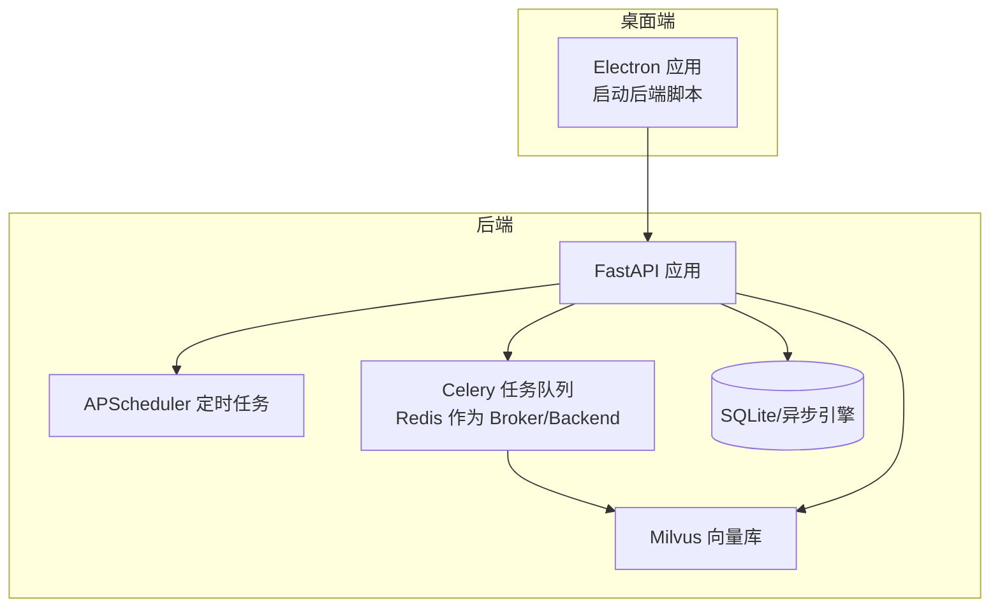
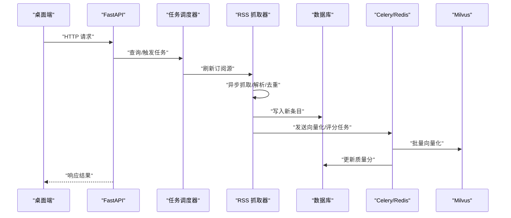
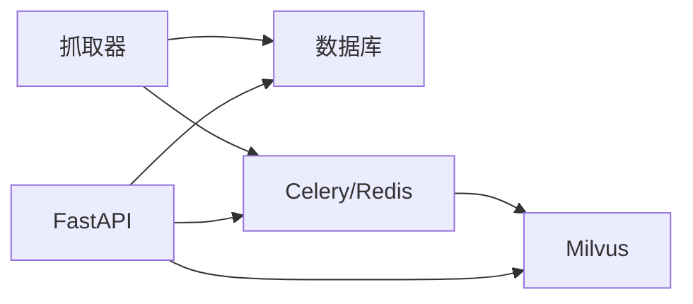

# 监控告警

<cite>
**本文引用的文件**
- [python-backend/app/main.py](file://python-backend/app/main.py)
- [python-backend/app/config.py](file://python-backend/app/config.py)
- [python-backend/app/db.py](file://python-backend/app/db.py)
- [python-backend/app/handlers/tasks.py](file://python-backend/app/handlers/tasks.py)
- [python-backend/app/services/rss_fetcher.py](file://python-backend/app/services/rss_fetcher.py)
- [python-backend/app/handlers/ai.py](file://python-backend/app/handlers/ai.py)
- [python-backend/app/tasks/ai_tasks.py](file://python-backend/app/tasks/ai_tasks.py)
- [python-backend/app/handlers/vector_store.py](file://python-backend/app/handlers/vector_store.py)
- [python-backend/app/celery_app.py](file://python-backend/app/celery_app.py)
- [python-backend/requirements.txt](file://python-backend/requirements.txt)
- [rss-desktop/resources/start-backend.sh](file://rss-desktop/resources/start-backend.sh)
</cite>

## 目录
1. [简介](#简介)
2. [项目结构](#项目结构)
3. [核心组件](#核心组件)
4. [架构总览](#架构总览)
5. [详细组件分析](#详细组件分析)
6. [依赖分析](#依赖分析)
7. [性能考量](#性能考量)
8. [故障排查指南](#故障排查指南)
9. [结论](#结论)
10. [附录](#附录)

## 简介
本文件面向 Tan RSS Reader 的后端与周边系统，提供一套完整的监控告警方案。内容涵盖应用监控指标（API 响应时间、错误率、并发连接数、内存使用）、基础设施监控（服务器资源、网络延迟、磁盘空间）、业务指标监控（用户活跃度、内容抓取成功率、AI 处理效率）、告警规则配置（阈值、级别、通知渠道）、日志收集与分析（结构化日志、错误追踪、性能分析）、监控仪表板设计与关键指标展示，以及故障排查流程与应急响应预案。

## 项目结构
后端采用 FastAPI + SQLAlchemy 异步 ORM + APScheduler 定时任务 + Celery/Redis 异步队列 + Milvus 向量数据库的组合。桌面端通过脚本启动后端服务并代理到本地 FastAPI 实例。RSS 抓取与 AI 处理在异步路径中执行，部分处理可下沉至 Celery 任务以降低主请求路径压力。

图示来源
- [python-backend/app/main.py:1-103](file://python-backend/app/main.py#L1-L103)
- [python-backend/app/handlers/tasks.py:57-176](file://python-backend/app/handlers/tasks.py#L57-L176)
- [python-backend/app/celery_app.py:1-23](file://python-backend/app/celery_app.py#L1-L23)
- [python-backend/app/db.py:1-27](file://python-backend/app/db.py#L1-L27)
- [python-backend/app/handlers/vector_store.py:18-54](file://python-backend/app/handlers/vector_store.py#L18-L54)
- [rss-desktop/resources/start-backend.sh:1-29](file://rss-desktop/resources/start-backend.sh#L1-L29)

章节来源
- [python-backend/app/main.py:1-103](file://python-backend/app/main.py#L1-L103)
- [rss-desktop/resources/start-backend.sh:1-29](file://rss-desktop/resources/start-backend.sh#L1-L29)

## 核心组件
- 应用入口与路由：FastAPI 应用注册各类处理器路由，提供健康检查与任务调度接口。
- 配置中心：集中管理数据库、Redis、Milvus、AI 服务等外部依赖的地址与凭据。
- 数据层：异步 SQLite 引擎，支持任务历史与运行状态持久化。
- 定时任务：APScheduler 调度 RSS 刷新、图标清理、健康检查、质量评分等任务。
- 抓取器：异步 HTTP 客户端抓取 RSS/Atom，解析去重，计算基础质量分，触发向量化与质量评分任务。
- AI 处理：封装 AI 服务调用、流式输出、嵌入生成、趋势分析等能力；支持用户级配置与配额记录。
- Celery 队列：批量质量评分与向量化下沉至 Celery，提高吞吐与稳定性。
- 向量存储：Milvus 封装连接、集合初始化、插入与检索。

章节来源
- [python-backend/app/main.py:1-103](file://python-backend/app/main.py#L1-L103)
- [python-backend/app/config.py:41-75](file://python-backend/app/config.py#L41-L75)
- [python-backend/app/db.py:1-27](file://python-backend/app/db.py#L1-L27)
- [python-backend/app/handlers/tasks.py:57-176](file://python-backend/app/handlers/tasks.py#L57-L176)
- [python-backend/app/services/rss_fetcher.py:104-312](file://python-backend/app/services/rss_fetcher.py#L104-L312)
- [python-backend/app/handlers/ai.py:34-64](file://python-backend/app/handlers/ai.py#L34-L64)
- [python-backend/app/tasks/ai_tasks.py:16-87](file://python-backend/app/tasks/ai_tasks.py#L16-L87)
- [python-backend/app/handlers/vector_store.py:18-54](file://python-backend/app/handlers/vector_store.py#L18-L54)
- [python-backend/app/celery_app.py:1-23](file://python-backend/app/celery_app.py#L1-L23)

## 架构总览
下图展示从桌面端发起请求到后端处理、数据库与向量库交互的关键路径，以及定时任务与 Celery 的位置。

图示来源
- [python-backend/app/main.py:44-62](file://python-backend/app/main.py#L44-L62)
- [python-backend/app/handlers/tasks.py:77-97](file://python-backend/app/handlers/tasks.py#L77-L97)
- [python-backend/app/services/rss_fetcher.py:104-312](file://python-backend/app/services/rss_fetcher.py#L104-L312)
- [python-backend/app/tasks/ai_tasks.py:16-51](file://python-backend/app/tasks/ai_tasks.py#L16-L51)
- [python-backend/app/handlers/vector_store.py:92-128](file://python-backend/app/handlers/vector_store.py#L92-L128)

## 详细组件分析

### 应用监控指标
- API 响应时间
  - 采集点：各路由处理函数（如任务执行、健康检查）记录开始/结束时间，计算耗时。
  - 关键路径：任务手动执行、健康检查、AI 总线调用等。
  - 指标建议：P50/P90/P95 响应时间、每路由耗时分布。
- 错误率
  - 采集点：HTTP 异常、网络错误、解析失败、AI 服务错误、向量库异常。
  - 关键路径：抓取器网络请求、AI 接口调用、Celery 任务执行。
  - 指标建议：4xx/5xx 错误率、按路由/错误类型分桶。
- 并发连接数
  - 采集点：uvicorn 进程并发连接、数据库连接池、Redis 连接数、Milvus 连接。
  - 关键路径：FastAPI 启动参数、数据库会话、Celery worker 数量。
  - 指标建议：并发请求数、数据库活跃连接、队列积压。
- 内存使用
  - 采集点：进程 RSS、GC 统计、向量批处理内存峰值。
  - 关键路径：批量向量化、批量质量评分、抓取器内存占用。
  - 指标建议：RSS 抓取峰值、向量批处理峰值、进程常驻内存。

章节来源
- [python-backend/app/handlers/tasks.py:27-33](file://python-backend/app/handlers/tasks.py#L27-L33)
- [python-backend/app/handlers/tasks.py:178-228](file://python-backend/app/handlers/tasks.py#L178-L228)
- [python-backend/app/services/rss_fetcher.py:127-144](file://python-backend/app/services/rss_fetcher.py#L127-L144)
- [python-backend/app/handlers/ai.py:194-228](file://python-backend/app/handlers/ai.py#L194-L228)
- [python-backend/app/tasks/ai_tasks.py:16-51](file://python-backend/app/tasks/ai_tasks.py#L16-L51)
- [python-backend/app/handlers/vector_store.py:92-128](file://python-backend/app/handlers/vector_store.py#L92-L128)

### 基础设施监控
- 服务器资源
  - CPU 使用率、内存使用、磁盘 IO、网络带宽。
  - 采集点：系统级监控（如 Node Exporter）。
- 网络延迟
  - 抓取目标站点延迟、AI 服务延迟、Milvus 连接延迟。
  - 采集点：抓取器返回的响应时间、AI 调用耗时、Milvus 查询耗时。
- 磁盘空间
  - SQLite 数据库文件大小、向量库数据目录、日志目录。
  - 采集点：文件系统监控。

章节来源
- [python-backend/app/services/rss_fetcher.py:307-311](file://python-backend/app/services/rss_fetcher.py#L307-L311)
- [python-backend/app/handlers/ai.py:603-614](file://python-backend/app/handlers/ai.py#L603-L614)
- [python-backend/app/handlers/vector_store.py:130-178](file://python-backend/app/handlers/vector_store.py#L130-L178)

### 业务指标监控
- 用户活跃度
  - 指标：日活跃用户(DAU)、月活跃用户(MAU)、登录次数、阅读时长。
  - 采集点：用户表、阅读行为埋点（需前端配合）。
- 内容抓取成功率
  - 指标：抓取成功数/总尝试数、解析失败率、重复跳过率。
  - 采集点：抓取器返回结果、Feed 表状态字段。
- AI 处理效率
  - 指标：平均响应时间、吞吐量、错误率、向量维度一致性、召回率。
  - 采集点：AI 调用耗时、向量入库/查询耗时、Celery 任务耗时。

章节来源
- [python-backend/app/services/rss_fetcher.py:146-144](file://python-backend/app/services/rss_fetcher.py#L146-L144)
- [python-backend/app/handlers/ai.py:194-228](file://python-backend/app/handlers/ai.py#L194-L228)
- [python-backend/app/tasks/ai_tasks.py:16-51](file://python-backend/app/tasks/ai_tasks.py#L16-L51)
- [python-backend/app/handlers/vector_store.py:130-178](file://python-backend/app/handlers/vector_store.py#L130-L178)

### 告警规则配置
- 阈值设定
  - API 响应时间：P95 > 2 秒；P99 > 5 秒。
  - 错误率：全局 5xx ≥ 1%/5 分钟；单路由 429/502 ≥ 0.5%/5 分钟。
  - 并发连接：uvicorn 并发 > 500；数据库活跃连接 > 80%；队列积压 > 100。
  - 内存：进程 RSS > 预设上限；向量批处理峰值 > 预设上限。
  - 抓取成功率：连续 3 次 < 60%。
  - AI 处理：平均响应 > 30 秒；向量维度异常（非 1024）≥ 5%。
- 告警级别
  - P0：服务不可用、大规模错误、内存溢出。
  - P1：关键功能降级、高错误率、队列积压。
  - P2：性能退化、成功率下降、延迟上升。
- 通知渠道
  - 邮件、IM 机器人、电话（仅 P0）。

章节来源
- [python-backend/app/services/rss_fetcher.py:307-311](file://python-backend/app/services/rss_fetcher.py#L307-L311)
- [python-backend/app/handlers/tasks.py:178-228](file://python-backend/app/handlers/tasks.py#L178-L228)
- [python-backend/app/handlers/ai.py:194-228](file://python-backend/app/handlers/ai.py#L194-L228)

### 日志收集与分析
- 结构化日志
  - 字段：时间戳、级别、模块、消息、请求 ID、用户 ID、路由、耗时、状态码、错误详情。
  - 输出：stdout/stderr + 文件轮转。
- 错误追踪
  - 关键异常：网络请求异常、AI 服务限流/错误、Milvus 连接失败、数据库事务失败。
- 性能分析
  - 关键链路：抓取器耗时、AI 调用耗时、向量入库/查询耗时、任务调度耗时。
- 工具建议
  - 日志采集：Fluent Bit/Fluentd/Vector；存储：ELK/ClickHouse/Loki。
  - 分布式追踪：OpenTelemetry（需在关键路径注入 span）。

章节来源
- [python-backend/app/services/rss_fetcher.py:127-144](file://python-backend/app/services/rss_fetcher.py#L127-L144)
- [python-backend/app/handlers/ai.py:194-228](file://python-backend/app/handlers/ai.py#L194-L228)
- [python-backend/app/tasks/ai_tasks.py:40-49](file://python-backend/app/tasks/ai_tasks.py#L40-L49)
- [python-backend/app/handlers/vector_store.py:51-53](file://python-backend/app/handlers/vector_store.py#L51-L53)

### 监控仪表板设计
- 首页概览
  - 全局健康状态、请求速率、错误率、P95 延迟、并发连接、内存使用、磁盘使用。
- 后端健康
  - uvicorn 进程存活、任务调度器运行状态、数据库连接池、Redis 连接数、Milvus 连接。
- 抓取与 AI
  - 抓取成功率、平均耗时、失败原因分布；AI 平均耗时、错误率、限流次数；向量入库/查询耗时。
- 业务看板
  - DAU/MAU、阅读时长、新增条目、质量分分布、用户配额使用。

章节来源
- [python-backend/app/handlers/tasks.py:273-275](file://python-backend/app/handlers/tasks.py#L273-L275)
- [python-backend/app/handlers/tasks.py:260-263](file://python-backend/app/handlers/tasks.py#L260-L263)
- [python-backend/app/services/rss_fetcher.py:307-311](file://python-backend/app/services/rss_fetcher.py#L307-L311)
- [python-backend/app/handlers/ai.py:603-614](file://python-backend/app/handlers/ai.py#L603-L614)

## 依赖分析
- 组件耦合
  - 抓取器与数据库耦合紧密，负责写入新条目并触发后续任务。
  - AI 处理与 Milvus/嵌入模型耦合，存在外部依赖风险。
  - Celery 与 Redis 耦合，承担批处理任务。
- 外部依赖
  - 数据库：SQLite（异步），需关注文件锁与并发写入。
  - 缓存/队列：Redis，需监控连接与任务积压。
  - 向量库：Milvus，需监控连接、索引与查询性能。
- 循环依赖
  - 当前未发现循环导入；任务调度器与抓取器通过会话传递解耦。

图示来源
- [python-backend/app/services/rss_fetcher.py:282-305](file://python-backend/app/services/rss_fetcher.py#L282-L305)
- [python-backend/app/tasks/ai_tasks.py:16-51](file://python-backend/app/tasks/ai_tasks.py#L16-L51)
- [python-backend/app/handlers/vector_store.py:18-54](file://python-backend/app/handlers/vector_store.py#L18-L54)
- [python-backend/app/celery_app.py:1-23](file://python-backend/app/celery_app.py#L1-L23)

章节来源
- [python-backend/app/services/rss_fetcher.py:282-305](file://python-backend/app/services/rss_fetcher.py#L282-L305)
- [python-backend/app/tasks/ai_tasks.py:16-51](file://python-backend/app/tasks/ai_tasks.py#L16-L51)
- [python-backend/app/handlers/vector_store.py:18-54](file://python-backend/app/handlers/vector_store.py#L18-L54)
- [python-backend/app/celery_app.py:1-23](file://python-backend/app/celery_app.py#L1-L23)

## 性能考量
- 抓取性能
  - 批量去重与写入：控制单批条目数量，避免超大事务。
  - 异步客户端超时与重试：合理设置超时与指数退避。
- AI 处理
  - 流式输出与限流：避免一次性大量并发请求导致限流。
  - 嵌入维度校验：确保维度一致性，减少 Milvus 插入失败。
- 向量库
  - 索引参数与 nprobe：平衡召回率与查询延迟。
  - 批量插入与幂等：先查重再插入，避免重复向量。
- 队列与并发
  - Celery worker 数量与任务粒度：避免单任务过长阻塞。
  - uvicorn workers：根据 CPU 核心数与 I/O 特性调整。

章节来源
- [python-backend/app/services/rss_fetcher.py:104-312](file://python-backend/app/services/rss_fetcher.py#L104-L312)
- [python-backend/app/handlers/ai.py:194-228](file://python-backend/app/handlers/ai.py#L194-L228)
- [python-backend/app/handlers/vector_store.py:130-178](file://python-backend/app/handlers/vector_store.py#L130-L178)
- [python-backend/app/tasks/ai_tasks.py:16-51](file://python-backend/app/tasks/ai_tasks.py#L16-L51)

## 故障排查指南
- 快速定位
  - 查看健康接口与任务调度器状态，确认服务是否正常。
  - 检查抓取器返回的错误类型（网络/HTTP/解析）。
  - 观察 AI 服务返回状态与限流信息。
- 常见问题
  - 抓取失败：检查目标站点可达性、User-Agent、重定向策略。
  - AI 限流：增加重试间隔、降低并发、切换可用密钥。
  - 向量库异常：检查 Milvus 连接、索引状态、维度一致性。
  - 队列积压：扩容 Celery worker、优化任务粒度。
- 应急响应
  - 临时禁用高风险任务（如批量评分/向量化）。
  - 降级 AI 功能，启用本地嵌入或关闭自动评分。
  - 回滚最近变更，恢复默认配置。

章节来源
- [python-backend/app/handlers/tasks.py:273-275](file://python-backend/app/handlers/tasks.py#L273-L275)
- [python-backend/app/handlers/tasks.py:260-263](file://python-backend/app/handlers/tasks.py#L260-L263)
- [python-backend/app/services/rss_fetcher.py:127-144](file://python-backend/app/services/rss_fetcher.py#L127-L144)
- [python-backend/app/handlers/ai.py:203-213](file://python-backend/app/handlers/ai.py#L203-L213)
- [python-backend/app/handlers/vector_store.py:51-53](file://python-backend/app/handlers/vector_store.py#L51-L53)

## 结论
通过在关键路径埋点、建立完善的告警与日志体系、设计合理的仪表板与应急流程，可以有效保障 Tan RSS Reader 的稳定性与可运维性。建议优先落地应用与基础设施监控，逐步扩展到业务指标与用户体验指标，持续迭代告警阈值与响应预案。

## 附录

### 启动与部署相关
- 后端启动脚本：桌面端通过脚本启动 uvicorn 并守护进程，便于集成与调试。
- 环境变量：数据库 URL、Redis URL、AI 服务地址与密钥、Milvus 地址等。

章节来源
- [rss-desktop/resources/start-backend.sh:11-25](file://rss-desktop/resources/start-backend.sh#L11-L25)
- [python-backend/app/config.py:41-75](file://python-backend/app/config.py#L41-L75)
- [python-backend/app/db.py:11-22](file://python-backend/app/db.py#L11-L22)