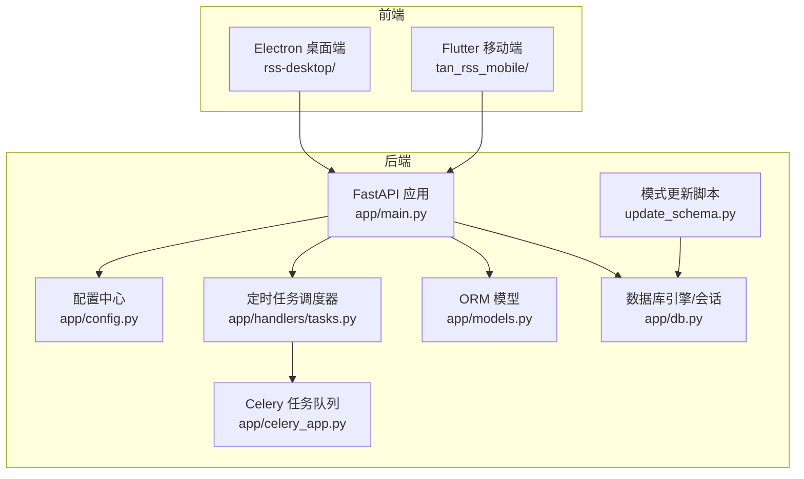
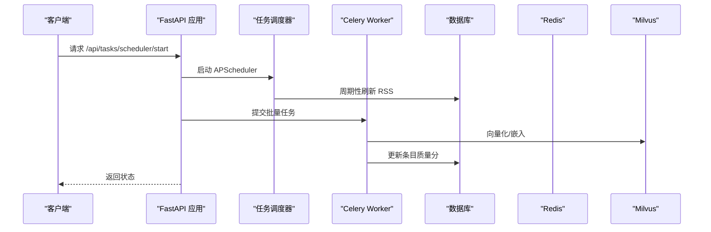
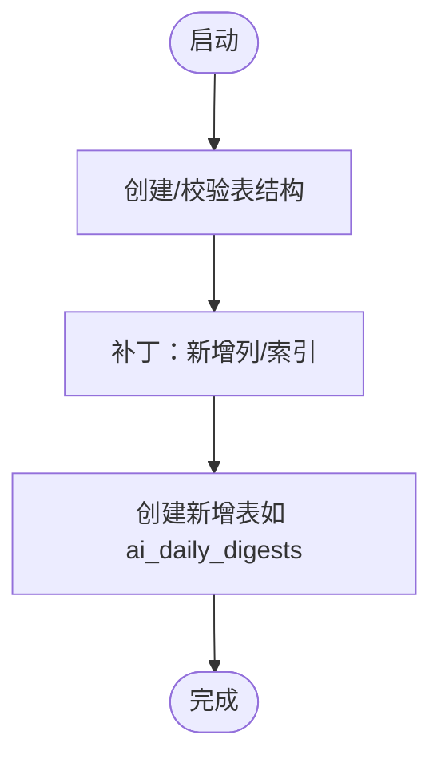
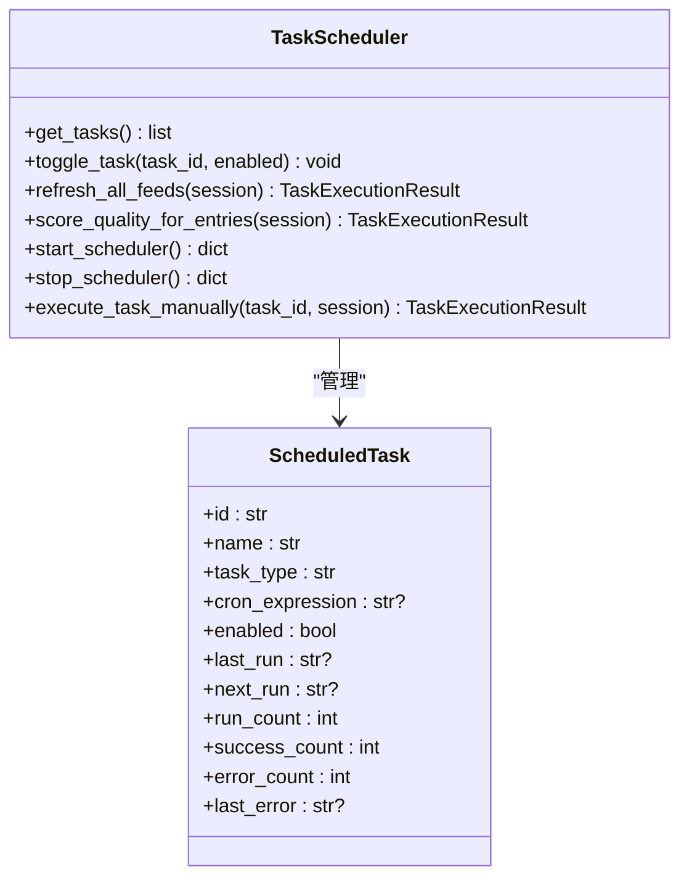
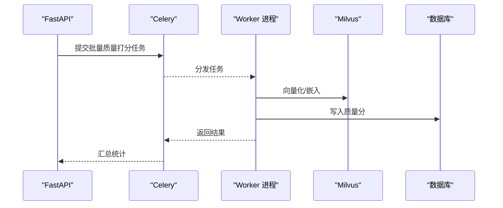
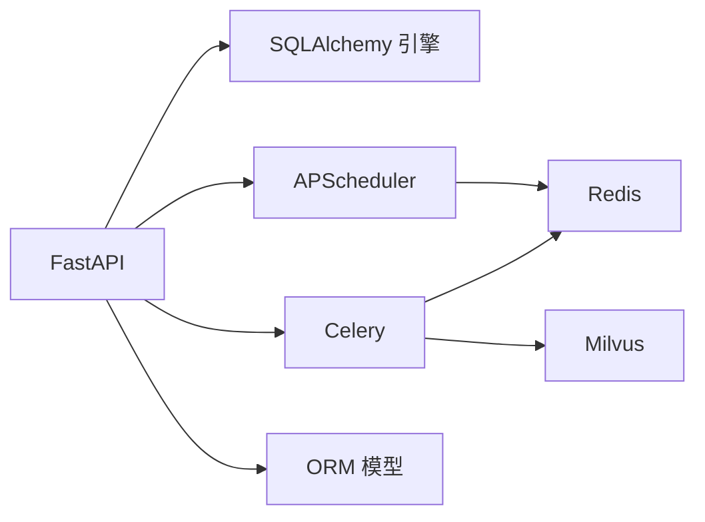

# 运维操作

<cite>
**本文引用的文件**
- [python-backend/app/db.py](file://python-backend/app/db.py)
- [python-backend/app/config.py](file://python-backend/app/config.py)
- [python-backend/app/main.py](file://python-backend/app/main.py)
- [python-backend/app/models.py](file://python-backend/app/models.py)
- [python-backend/app/celery_app.py](file://python-backend/app/celery_app.py)
- [python-backend/app/tasks/ai_tasks.py](file://python-backend/app/tasks/ai_tasks.py)
- [python-backend/app/handlers/tasks.py](file://python-backend/app/handlers/tasks.py)
- [python-backend/update_schema.py](file://python-backend/update_schema.py)
- [python-backend/scripts/start_celery.sh](file://python-backend/scripts/start_celery.sh)
- [python-backend/requirements.txt](file://python-backend/requirements.txt)
- [start.sh](file://start.sh)
- [build_apk.sh](file://build_apk.sh)
- [todo.md](file://todo.md)
</cite>

## 目录
1. [简介](#简介)
2. [项目结构](#项目结构)
3. [核心组件](#核心组件)
4. [架构总览](#架构总览)
5. [详细组件分析](#详细组件分析)
6. [依赖分析](#依赖分析)
7. [性能考虑](#性能考虑)
8. [故障排查指南](#故障排查指南)
9. [结论](#结论)
10. [附录](#附录)

## 简介
本运维文档面向 Tan RSS Reader 的后端与桌面端运行环境，聚焦以下运维主题：
- 日常运维：数据库维护、缓存与队列清理、健康检查与日志轮转
- 数据备份与恢复：全量备份、增量变更处理、恢复流程
- 升级与回滚：版本发布、回退策略、兼容性检查
- 用户数据管理：用户迁移、数据清理、隐私保护
- 性能优化：查询优化、索引与分区、资源配置
- 安全加固：访问控制、数据加密、漏洞修复
- 运维工具与自动化：启动脚本、Celery 任务队列、构建脚本

## 项目结构
后端采用 Python + FastAPI + SQLAlchemy（异步）+ APScheduler + Celery 架构；数据库默认使用 SQLite（本地开发/演示场景），生产可替换为外部数据库；前端包含 Electron 桌面端与 Flutter 移动端。

图表来源
- [python-backend/app/main.py:1-103](file://python-backend/app/main.py#L1-L103)
- [python-backend/app/config.py:1-75](file://python-backend/app/config.py#L1-L75)
- [python-backend/app/db.py:1-27](file://python-backend/app/db.py#L1-L27)
- [python-backend/app/models.py:1-228](file://python-backend/app/models.py#L1-L228)
- [python-backend/app/handlers/tasks.py:1-276](file://python-backend/app/handlers/tasks.py#L1-L276)
- [python-backend/app/celery_app.py:1-23](file://python-backend/app/celery_app.py#L1-L23)
- [python-backend/update_schema.py:1-136](file://python-backend/update_schema.py#L1-L136)

章节来源
- [python-backend/app/main.py:1-103](file://python-backend/app/main.py#L1-L103)
- [python-backend/app/config.py:1-75](file://python-backend/app/config.py#L1-L75)
- [python-backend/app/db.py:1-27](file://python-backend/app/db.py#L1-L27)
- [python-backend/app/models.py:1-228](file://python-backend/app/models.py#L1-L228)
- [python-backend/app/handlers/tasks.py:1-276](file://python-backend/app/handlers/tasks.py#L1-L276)
- [python-backend/app/celery_app.py:1-23](file://python-backend/app/celery_app.py#L1-L23)
- [python-backend/update_schema.py:1-136](file://python-backend/update_schema.py#L1-L136)

## 核心组件
- 数据库与会话：基于 SQLAlchemy 异步引擎，默认 SQLite，支持通过环境变量切换外部数据库。
- 配置中心：集中管理数据库、Redis/Celery、向量库 Milvus、AI 服务等外部依赖。
- 定时任务：基于 APScheduler 的周期任务（RSS 刷新、图标清理、健康检查、质量打分）。
- 任务队列：Celery + Redis，执行批量 AI 打分与向量化任务。
- 模式更新：独立脚本负责表结构补丁与索引创建，保证数据库演进。

章节来源
- [python-backend/app/db.py:1-27](file://python-backend/app/db.py#L1-L27)
- [python-backend/app/config.py:41-75](file://python-backend/app/config.py#L41-L75)
- [python-backend/app/handlers/tasks.py:57-177](file://python-backend/app/handlers/tasks.py#L57-L177)
- [python-backend/app/celery_app.py:1-23](file://python-backend/app/celery_app.py#L1-L23)
- [python-backend/update_schema.py:1-136](file://python-backend/update_schema.py#L1-L136)

## 架构总览
后端通过 FastAPI 提供 REST API，内部依赖数据库、Redis/Celery、Milvus 向量库。定时任务负责周期性数据刷新与质量打分；Celery 任务负责批量 AI 处理与向量化。

图表来源
- [python-backend/app/main.py:64-103](file://python-backend/app/main.py#L64-L103)
- [python-backend/app/handlers/tasks.py:143-177](file://python-backend/app/handlers/tasks.py#L143-L177)
- [python-backend/app/tasks/ai_tasks.py:16-87](file://python-backend/app/tasks/ai_tasks.py#L16-L87)
- [python-backend/app/celery_app.py:1-23](file://python-backend/app/celery_app.py#L1-L23)

## 详细组件分析

### 数据库与模式管理
- 默认 SQLite：数据库路径由脚本动态解析，确保在不同工作目录下一致。
- 模式初始化：应用启动时创建表并尝试添加新列；独立脚本负责列与索引补丁及新增表。
- 生产建议：生产环境建议使用 PostgreSQL/MySQL 并开启连接池与只读副本；对 entries、ai_daily_digests 等高频表建立合适索引。

图表来源
- [python-backend/app/main.py:66-98](file://python-backend/app/main.py#L66-L98)
- [python-backend/update_schema.py:24-136](file://python-backend/update_schema.py#L24-L136)

章节来源
- [python-backend/app/db.py:11-27](file://python-backend/app/db.py#L11-L27)
- [python-backend/app/main.py:66-98](file://python-backend/app/main.py#L66-L98)
- [python-backend/update_schema.py:13-136](file://python-backend/update_schema.py#L13-L136)

### 定时任务与健康检查
- 任务类型：RSS 刷新、图标清理、健康检查、AI 质量打分。
- 调度策略：基于 APScheduler 的间隔触发；RSS 刷新间隔来自应用设置。
- 手动执行：提供接口手动触发任务并记录历史结果。

图表来源
- [python-backend/app/handlers/tasks.py:57-230](file://python-backend/app/handlers/tasks.py#L57-L230)

章节来源
- [python-backend/app/handlers/tasks.py:57-276](file://python-backend/app/handlers/tasks.py#L57-L276)

### Celery 任务与向量存储
- 任务类型：批量质量打分、批量向量化。
- 连接：通过 Redis 作为 Broker/Backend；向量存储通过 Milvus 客户端连接。
- 错误处理：单条失败不影响整体任务提交；日志记录错误原因。

图表来源
- [python-backend/app/tasks/ai_tasks.py:16-87](file://python-backend/app/tasks/ai_tasks.py#L16-L87)
- [python-backend/app/celery_app.py:1-23](file://python-backend/app/celery_app.py#L1-L23)

章节来源
- [python-backend/app/tasks/ai_tasks.py:1-87](file://python-backend/app/tasks/ai_tasks.py#L1-L87)
- [python-backend/app/celery_app.py:1-23](file://python-backend/app/celery_app.py#L1-L23)

### 配置与部署
- 环境变量：数据库 URL、Redis、Milvus、AI 服务地址与密钥、监听地址与端口。
- 启动方式：提供后端启动脚本；Celery 通过独立脚本启动；桌面端提供启动脚本。
- 依赖：后端依赖 FastAPI、SQLAlchemy、Celery、Redis、Milvus 等。

章节来源
- [python-backend/app/config.py:41-75](file://python-backend/app/config.py#L41-L75)
- [python-backend/requirements.txt:1-18](file://python-backend/requirements.txt#L1-L18)
- [python-backend/scripts/start_celery.sh:1-5](file://python-backend/scripts/start_celery.sh#L1-L5)
- [start.sh](file://start.sh)

## 依赖分析
- 组件耦合：定时任务依赖数据库与外部服务；Celery 任务依赖 Redis 与 Milvus；模型定义贯穿应用各层。
- 外部依赖：Redis、Milvus、数据库（默认 SQLite，可替换）。
- 潜在风险：SQLite 在高并发写入场景受限；Celery 与 Redis 连接异常会影响批处理；向量库连通性影响检索。

图表来源
- [python-backend/app/main.py:1-103](file://python-backend/app/main.py#L1-L103)
- [python-backend/app/handlers/tasks.py:143-177](file://python-backend/app/handlers/tasks.py#L143-L177)
- [python-backend/app/celery_app.py:1-23](file://python-backend/app/celery_app.py#L1-L23)
- [python-backend/app/models.py:1-228](file://python-backend/app/models.py#L1-L228)

章节来源
- [python-backend/app/main.py:1-103](file://python-backend/app/main.py#L1-L103)
- [python-backend/app/handlers/tasks.py:143-177](file://python-backend/app/handlers/tasks.py#L143-L177)
- [python-backend/app/celery_app.py:1-23](file://python-backend/app/celery_app.py#L1-L23)
- [python-backend/app/models.py:1-228](file://python-backend/app/models.py#L1-L228)

## 性能考虑
- 查询优化
  - 为高频查询字段建立索引：entries.feed_id、entries.dedup_key、ai_daily_digests.user_id/date_str、user_usages.date_str 等。
  - 控制分页大小与时间范围，避免全表扫描。
- 索引与分区
  - 对 entries/publish 时间与去重键建立复合索引，减少重复内容处理成本。
  - 若迁移到关系型数据库，可按日期分区 entries 表以提升归档与清理效率。
- 资源配置
  - Celery worker 数量与并发需结合 CPU 与内存资源评估；限制单任务超时时间防止阻塞。
  - Redis 内存与持久化策略需与任务吞吐匹配。
  - Milvus 连接池与副本配置影响向量化与检索延迟。

[本节为通用指导，无需特定文件引用]

## 故障排查指南
- 健康检查
  - 通过 /api/health 获取基础健康状态；若返回异常，检查数据库连接与外部服务可达性。
- 定时任务
  - 通过 /api/tasks/scheduler/status 查看调度器状态；必要时 /api/tasks/scheduler/start 启动。
  - 手动执行任务：/api/tasks/{task_id}，查看历史记录定位失败原因。
- Celery 任务
  - 检查 Redis 连接；确认 Celery worker 正常运行；查看任务日志定位失败条目。
- 数据库
  - 如出现列缺失或索引问题，先运行模式更新脚本；确认 SQLite 文件权限与磁盘空间充足。

章节来源
- [python-backend/app/handlers/tasks.py:273-276](file://python-backend/app/handlers/tasks.py#L273-L276)
- [python-backend/app/handlers/tasks.py:260-271](file://python-backend/app/handlers/tasks.py#L260-L271)
- [python-backend/app/handlers/tasks.py:241-247](file://python-backend/app/handlers/tasks.py#L241-L247)
- [python-backend/update_schema.py:24-136](file://python-backend/update_schema.py#L24-L136)

## 结论
Tan RSS Reader 后端具备完善的定时任务与任务队列能力，适合在本地或小规模生产环境中运行。建议在生产中替换数据库、启用 Redis/Milvus 高可用、完善监控与日志轮转，并制定标准化的备份与回滚流程以保障业务连续性。

[本节为总结，无需特定文件引用]

## 附录

### 日常运维任务
- 数据库维护
  - 检查 SQLite 文件大小与磁盘空间；定期运行模式更新脚本以补齐索引与列。
  - 如迁移到外部数据库，开启连接池、慢查询日志与备份策略。
- 缓存与队列清理
  - 清理过期的 Celery 结果与 Redis 中的临时键；监控队列积压。
- 日志轮转
  - 使用系统日志轮转工具（如 logrotate）对后端与 Celery 日志进行轮转与压缩。

[本节为通用指导，无需特定文件引用]

### 数据备份与恢复
- 全量备份
  - SQLite：直接复制数据库文件；建议在关闭服务后执行。
  - 外部数据库：使用官方备份工具（如 pg_dump/mysql/mongodump）执行全量导出。
- 增量备份
  - SQLite：基于 WAL/归档日志的增量策略；或定期快照。
  - 外部数据库：开启二进制日志/变更流，按时间窗口导出增量。
- 恢复流程
  - 停止服务 → 恢复数据库文件/导入备份 → 运行模式更新脚本 → 启动服务 → 验证健康检查与关键功能。

[本节为通用指导，无需特定文件引用]

### 系统升级与回滚
- 版本发布
  - 后端：更新依赖与代码 → 运行模式更新脚本 → 启动服务 → 健康检查。
  - 前端：打包 Electron/Flutter → 发布渠道 → 客户端拉取新版本。
- 回滚机制
  - 快速回滚：保留上一版本二进制与配置 → 回退数据库（如需要） → 启动旧版本。
  - 渐进式回滚：灰度发布，逐步回退。
- 兼容性检查
  - 数据库模式变更需幂等；对外部服务（Redis/Milvus）版本进行兼容性验证。

[本节为通用指导，无需特定文件引用]

### 用户数据管理
- 用户迁移
  - 导出用户表与关联数据 → 在目标环境重建表结构 → 导入数据 → 校验完整性。
- 数据清理
  - 清理无效图标记录（已禁用）；按时间范围清理过期 AI 摘要与使用统计。
- 隐私保护
  - 对用户邮箱等敏感字段进行脱敏或加密存储；删除用户数据时遵循最小化原则。

[本节为通用指导，无需特定文件引用]

### 安全加固
- 访问控制
  - 限制 API 源地址与方法；在网关层启用速率限制与 WAF。
- 数据加密
  - 传输加密：TLS；静态加密：数据库文件加密（SQLite 加密扩展）。
- 漏洞修复
  - 定期更新依赖与系统内核；对第三方组件进行安全扫描与补丁管理。

[本节为通用指导，无需特定文件引用]

### 运维工具与自动化
- 启动与停止
  - 后端：使用启动脚本启动 API 服务；Celery 使用独立脚本启动 worker。
  - 桌面端：使用提供的启动脚本运行 Electron 应用。
- 构建脚本
  - Android APK 构建脚本可用于自动化打包。
- 监控与告警
  - 集成指标采集（CPU/内存/数据库连接数/队列长度）与日志聚合平台。

章节来源
- [python-backend/scripts/start_celery.sh:1-5](file://python-backend/scripts/start_celery.sh#L1-L5)
- [start.sh](file://start.sh)
- [build_apk.sh](file://build_apk.sh)