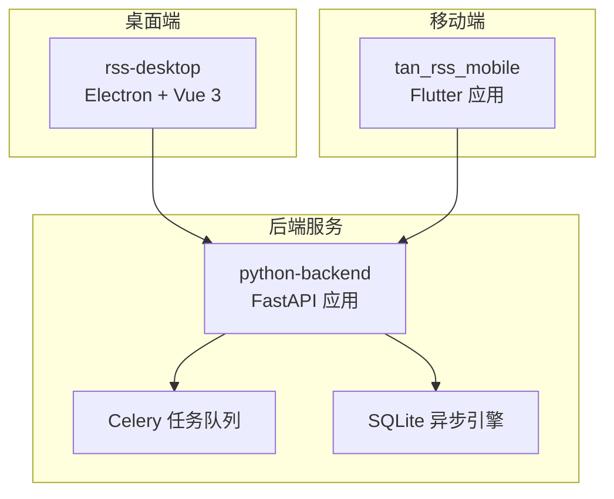
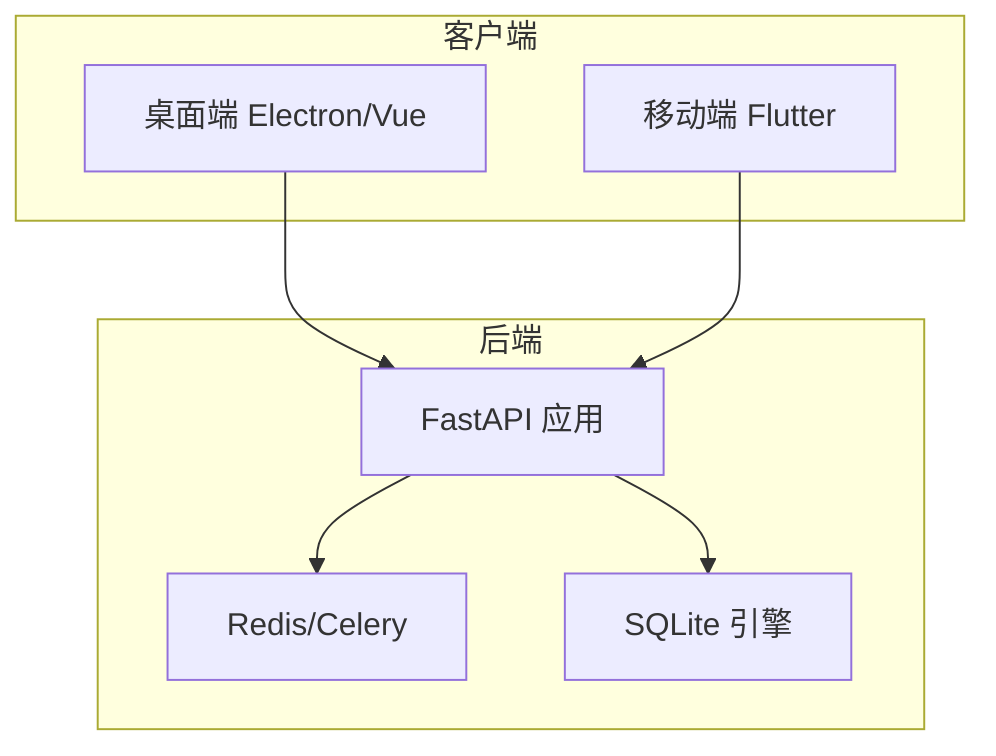
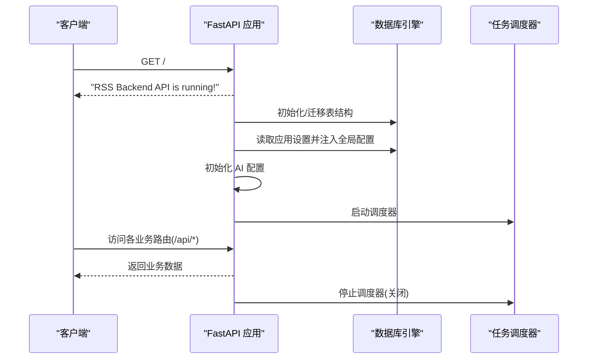
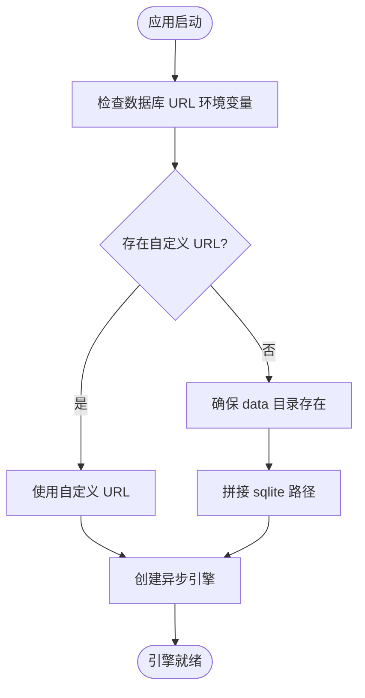
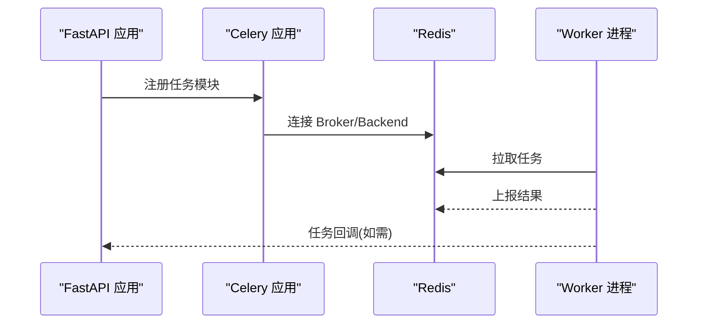
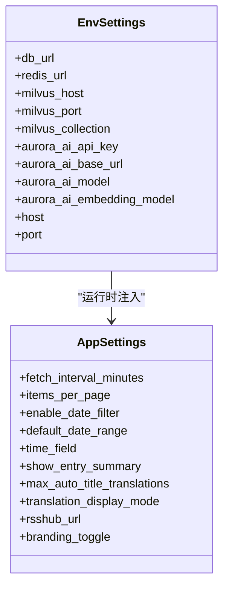
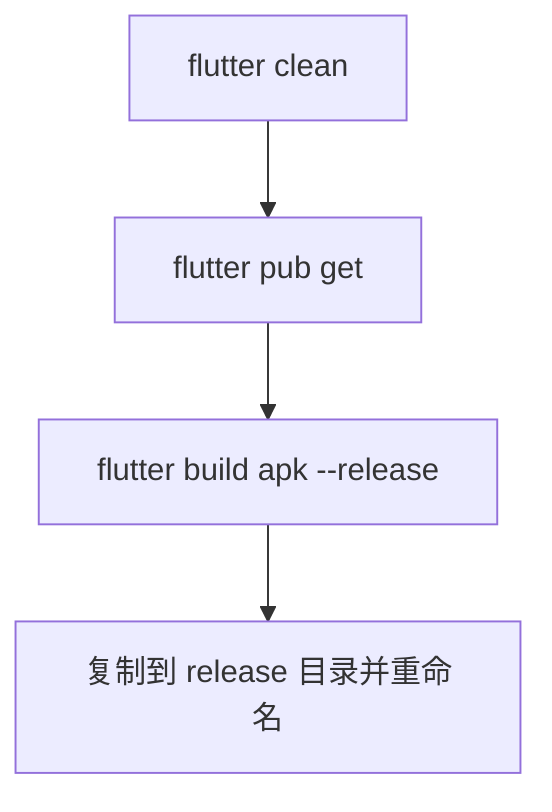
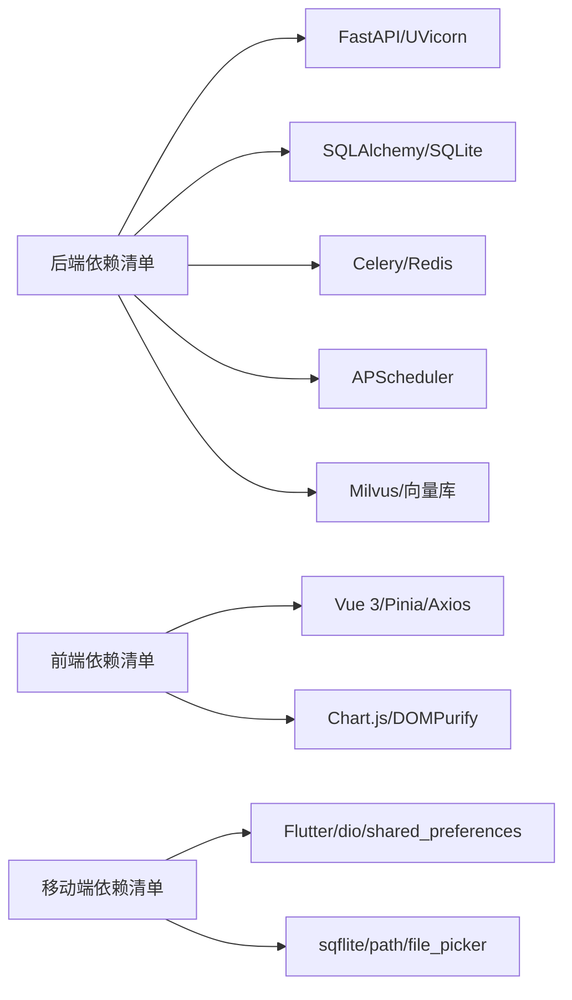
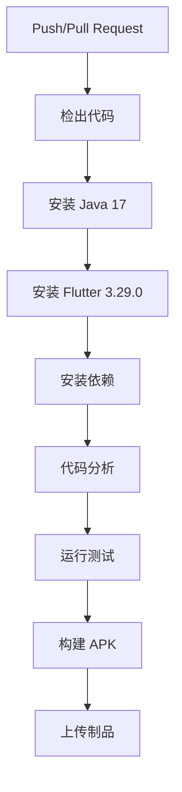

# 部署与运维

<cite>
**本文引用的文件**
- [.github/workflows/flutter_ci.yml](file://.github/workflows/flutter_ci.yml)
- [python-backend/requirements.txt](file://python-backend/requirements.txt)
- [python-backend/app/main.py](file://python-backend/app/main.py)
- [python-backend/app/config.py](file://python-backend/app/config.py)
- [python-backend/app/db.py](file://python-backend/app/db.py)
- [python-backend/app/models.py](file://python-backend/app/models.py)
- [python-backend/app/celery_app.py](file://python-backend/app/celery_app.py)
- [python-backend/scripts/start_celery.sh](file://python-backend/scripts/start_celery.sh)
- [rss-desktop/package.json](file://rss-desktop/package.json)
- [tan_rss_mobile/pubspec.yaml](file://tan_rss_mobile/pubspec.yaml)
- [start.sh](file://start.sh)
- [build_apk.sh](file://build_apk.sh)
</cite>

## 目录
1. [简介](#简介)
2. [项目结构](#项目结构)
3. [核心组件](#核心组件)
4. [架构总览](#架构总览)
5. [详细组件分析](#详细组件分析)
6. [依赖关系分析](#依赖关系分析)
7. [性能考虑](#性能考虑)
8. [故障排查指南](#故障排查指南)
9. [结论](#结论)
10. [附录](#附录)

## 简介
本文件面向 Tan RSS Reader 的部署与运维团队，系统性阐述 CI/CD 流程、部署架构、环境管理、监控告警、备份与灾备、性能调优、资源优化与容量规划，以及运维工具与应急响应流程。内容基于仓库中的实际代码与脚本进行分析与提炼，确保可操作、可落地。

## 项目结构
本项目由三部分组成：
- 后端服务（Python/FastAPI）：提供 REST API、任务调度与数据库访问。
- 桌面端（Electron/Vue 3）：桌面跨平台客户端，通过 npm 脚本管理开发与打包。
- 移动端（Flutter）：Android/iOS/Web 平台应用，使用 Flutter 工具链构建。

图示来源
- [python-backend/app/main.py:1-103](file://python-backend/app/main.py#L1-L103)
- [python-backend/app/db.py:1-27](file://python-backend/app/db.py#L1-L27)
- [python-backend/app/celery_app.py:1-23](file://python-backend/app/celery_app.py#L1-L23)
- [rss-desktop/package.json:1-81](file://rss-desktop/package.json#L1-L81)
- [tan_rss_mobile/pubspec.yaml:1-112](file://tan_rss_mobile/pubspec.yaml#L1-L112)

章节来源
- [python-backend/app/main.py:1-103](file://python-backend/app/main.py#L1-L103)
- [rss-desktop/package.json:1-81](file://rss-desktop/package.json#L1-L81)
- [tan_rss_mobile/pubspec.yaml:1-112](file://tan_rss_mobile/pubspec.yaml#L1-L112)

## 核心组件
- 后端 API 服务：基于 FastAPI，统一挂载多个业务路由，并在启动时初始化数据库与定时任务。
- 数据层：使用 SQLAlchemy 异步引擎，默认 SQLite 存储于项目 data 目录，支持通过环境变量覆盖数据库连接。
- 任务系统：Celery + Redis 作为消息中间件与结果存储，支持后台 AI 处理等异步任务。
- 配置体系：通过 pydantic-settings 从 .env 或环境变量加载，集中管理数据库、Redis、向量库与服务监听参数。
- 桌面端：Vite + Electron 开发与打包，提供多平台可执行程序与 Web 预览。
- 移动端：Flutter 工程，支持 Android/iOS/Web，提供一键打包脚本。

章节来源
- [python-backend/app/main.py:1-103](file://python-backend/app/main.py#L1-L103)
- [python-backend/app/db.py:1-27](file://python-backend/app/db.py#L1-L27)
- [python-backend/app/celery_app.py:1-23](file://python-backend/app/celery_app.py#L1-L23)
- [python-backend/app/config.py:1-75](file://python-backend/app/config.py#L1-L75)
- [rss-desktop/package.json:1-81](file://rss-desktop/package.json#L1-L81)
- [tan_rss_mobile/pubspec.yaml:1-112](file://tan_rss_mobile/pubspec.yaml#L1-L112)

## 架构总览
整体采用“后端 API + 任务队列 + 数据库”的三层架构，桌面端与移动端通过 HTTP 接口访问后端；任务队列承载 AI 相关的异步处理。

图示来源
- [python-backend/app/main.py:1-103](file://python-backend/app/main.py#L1-L103)
- [python-backend/app/celery_app.py:1-23](file://python-backend/app/celery_app.py#L1-L23)
- [python-backend/app/db.py:1-27](file://python-backend/app/db.py#L1-L27)

## 详细组件分析

### 后端 API 服务（FastAPI）
- 路由组织：集中注册各类业务路由前缀为 /api，便于统一管理与扩展。
- 启动事件：在启动时创建表结构、迁移字段、加载应用设置、初始化 AI 配置与任务调度器。
- 关闭事件：优雅停止任务调度器，避免任务中断。
- CORS：全局启用宽松 CORS，便于前端直连。

图示来源
- [python-backend/app/main.py:40-103](file://python-backend/app/main.py#L40-L103)

章节来源
- [python-backend/app/main.py:1-103](file://python-backend/app/main.py#L1-L103)

### 数据层（SQLAlchemy 异步引擎 + SQLite）
- 默认 SQLite：若未显式配置数据库 URL，则在项目 data 目录下创建 rss.db。
- 支持覆盖：可通过环境变量提供自定义数据库 URL。
- 异步会话：使用异步引擎与会话，提升并发读写效率。

图示来源
- [python-backend/app/db.py:11-27](file://python-backend/app/db.py#L11-L27)

章节来源
- [python-backend/app/db.py:1-27](file://python-backend/app/db.py#L1-L27)

### 任务系统（Celery + Redis）
- 任务队列：基于 Redis 作为 broker 与 backend，序列化格式为 JSON。
- 超时与跟踪：启用 UTC 时间、任务超时限制、启动跟踪。
- 启动脚本：提供简单脚本直接启动 Celery worker。

图示来源
- [python-backend/app/celery_app.py:1-23](file://python-backend/app/celery_app.py#L1-L23)
- [python-backend/scripts/start_celery.sh:1-5](file://python-backend/scripts/start_celery.sh#L1-L5)

章节来源
- [python-backend/app/celery_app.py:1-23](file://python-backend/app/celery_app.py#L1-L23)
- [python-backend/scripts/start_celery.sh:1-5](file://python-backend/scripts/start_celery.sh#L1-L5)

### 配置体系（pydantic-settings）
- 环境变量优先：从 .env 或系统环境变量加载数据库、Redis、向量库与服务监听参数。
- 结构化模型：将 AI 服务、功能开关、向量库参数分层建模，便于维护与扩展。
- 默认值：提供合理默认值，降低首次部署成本。

图示来源
- [python-backend/app/config.py:41-75](file://python-backend/app/config.py#L41-L75)

章节来源
- [python-backend/app/config.py:1-75](file://python-backend/app/config.py#L1-L75)

### 桌面端（Electron/Vue 3）
- 开发脚本：提供前端开发、Electron 开发与打包命令。
- 构建产物：支持 Web 预览与多平台打包。

图示来源
- [rss-desktop/package.json:41-81](file://rss-desktop/package.json#L41-L81)

章节来源
- [rss-desktop/package.json:1-81](file://rss-desktop/package.json#L1-L81)

### 移动端（Flutter）
- 依赖与构建：使用 Flutter 工具链，提供一键构建 APK 的脚本。
- 资源与图标：通过 pubspec.yaml 管理依赖与应用图标配置。

图示来源
- [build_apk.sh:34-71](file://build_apk.sh#L34-L71)
- [tan_rss_mobile/pubspec.yaml:30-112](file://tan_rss_mobile/pubspec.yaml#L30-L112)

章节来源
- [build_apk.sh:1-71](file://build_apk.sh#L1-L71)
- [tan_rss_mobile/pubspec.yaml:1-112](file://tan_rss_mobile/pubspec.yaml#L1-L112)

## 依赖关系分析
- 后端依赖：FastAPI、SQLAlchemy 异步、Celery、Redis、向量库（Milvus）、任务调度（APScheduler）等。
- 前端依赖：Vue 3、Pinia、Axios、Chart.js 等。
- 移动端依赖：Flutter 生态、dio、shared_preferences、sqflite 等。

图示来源
- [python-backend/requirements.txt:1-18](file://python-backend/requirements.txt#L1-L18)
- [rss-desktop/package.json:55-78](file://rss-desktop/package.json#L55-L78)
- [tan_rss_mobile/pubspec.yaml:30-52](file://tan_rss_mobile/pubspec.yaml#L30-L52)

章节来源
- [python-backend/requirements.txt:1-18](file://python-backend/requirements.txt#L1-L18)
- [rss-desktop/package.json:1-81](file://rss-desktop/package.json#L1-L81)
- [tan_rss_mobile/pubspec.yaml:1-112](file://tan_rss_mobile/pubspec.yaml#L1-L112)

## 性能考虑
- 数据库性能
  - 使用异步引擎与连接池，减少阻塞。
  - 对高频查询字段建立索引（如 entries 表的 dedup_key 字段）。
  - 控制分页大小与默认拉取间隔，避免一次性加载过多数据。
- 任务系统
  - 合理设置任务超时与跟踪，避免长时间占用资源。
  - 将耗时任务放入 Celery 队列，避免阻塞主 API。
- 缓存与网络
  - 利用 Redis 作为任务结果缓存，减少重复计算。
  - 向量检索建议结合 Milvus 的索引与分区策略，控制查询维度与 TopK。
- 前端性能
  - 按需加载组件与路由，减少首屏体积。
  - 图表与富文本渲染使用懒加载与虚拟滚动。

## 故障排查指南
- 后端无法启动
  - 检查数据库 URL 是否正确，确认 data 目录权限。
  - 查看启动日志，确认端口占用与 CORS 配置。
- 任务队列无响应
  - 确认 Redis 可达性与连接字符串。
  - 使用脚本启动 Celery worker，观察日志。
- 移动端构建失败
  - 确保 Flutter SDK 与 Android/iOS 工具链完整。
  - 清理缓存后重新构建，检查签名与版本号。
- 桌面端开发异常
  - 检查 Node.js 与 pnpm 版本，清理 node_modules 后重装依赖。

章节来源
- [python-backend/app/db.py:11-27](file://python-backend/app/db.py#L11-L27)
- [python-backend/app/celery_app.py:1-23](file://python-backend/app/celery_app.py#L1-L23)
- [python-backend/scripts/start_celery.sh:1-5](file://python-backend/scripts/start_celery.sh#L1-L5)
- [build_apk.sh:34-71](file://build_apk.sh#L34-L71)
- [rss-desktop/package.json:37-40](file://rss-desktop/package.json#L37-L40)

## 结论
本项目采用轻量级、易部署的架构，后端以 FastAPI + SQLite + Celery 为核心，前端与移动端通过 HTTP 接口访问。建议在生产环境中引入容器化与负载均衡、完善监控与告警、制定备份与灾备策略，并持续优化任务与数据库性能，以支撑稳定高效的运营。

## 附录

### CI/CD 流程配置
- GitHub Actions 工作流
  - 触发条件：对 main 分支的推送与拉取请求。
  - 步骤：检出代码、安装 Java 与 Flutter、安装依赖、静态分析、运行测试、构建 APK。
- 建议增强
  - 添加后端 Python 测试与覆盖率报告。
  - 增加 Docker 构建与镜像推送步骤。
  - 将 APK 上传为工作流 Artifacts，便于下载与归档。

图示来源
- [.github/workflows/flutter_ci.yml:1-43](file://.github/workflows/flutter_ci.yml#L1-L43)

章节来源
- [.github/workflows/flutter_ci.yml:1-43](file://.github/workflows/flutter_ci.yml#L1-L43)

### 部署架构与高可用
- 单机部署
  - 使用启动脚本一键启动后端与前端，适合本地开发与小规模测试。
- 生产部署
  - 建议使用容器编排（如 Docker Compose/Kubernetes），分离后端、Redis、数据库与反向代理。
  - 前端与后端通过 Nginx/LB 暴露，实现健康检查与灰度发布。
  - 数据库与 Redis 建议使用独立实例或托管服务，开启备份与只读副本。

章节来源
- [start.sh:1-94](file://start.sh#L1-L94)
- [python-backend/app/main.py:28-62](file://python-backend/app/main.py#L28-L62)

### 环境管理（开发/测试/生产）
- 开发环境
  - 默认 SQLite 与本地 Redis，便于快速迭代。
- 测试环境
  - 使用独立数据库与 Redis 实例，模拟生产配置。
- 生产环境
  - 使用托管数据库与 Redis，严格区分密钥与连接串，启用 TLS 与最小权限。

章节来源
- [python-backend/app/config.py:41-75](file://python-backend/app/config.py#L41-L75)
- [python-backend/app/db.py:11-27](file://python-backend/app/db.py#L11-L27)

### 监控与告警
- 应用监控
  - 后端：暴露健康检查端点，记录请求耗时与错误码。
  - 任务队列：监控任务积压、失败率与 Worker 健康。
- 基础设施监控
  - CPU、内存、磁盘、网络与 Redis/数据库连接数。
- 业务指标
  - 用户活跃、文章抓取成功率、AI 调用次数与耗时、向量检索命中率。

[本节为通用运维建议，无需特定文件引用]

### 备份策略与灾备
- 数据备份
  - SQLite：定期复制 data 目录或导出 SQL。
  - Redis：开启 RDB/AOF，定期快照与同步。
  - 向量库：遵循 Milvus 的备份与恢复流程。
- 灾难恢复
  - 制定恢复时间目标（RTO）与恢复点目标（RPO）。
  - 定期演练恢复流程，验证备份完整性。

[本节为通用运维建议，无需特定文件引用]

### 容量规划与资源优化
- 估算规则
  - 根据用户数、文章数量与 AI 调用量，预估数据库与 Redis 容量。
  - 任务队列长度与并发 Worker 数应与 CPU/内存匹配。
- 优化手段
  - 数据库索引与查询优化、连接池大小调整。
  - 任务批量化与去重，避免重复计算。
  - 前端资源压缩与 CDN 加速。

[本节为通用运维建议，无需特定文件引用]

### 运维工具与应急响应
- 常用工具
  - 日志收集：ELK/Fluent Bit
  - 监控：Prometheus/Grafana
  - 配置管理：Ansible/Terraform
- 应急响应
  - 快速定位问题：查看后端与 Celery 日志、数据库慢查询。
  - 回滚策略：蓝绿/金丝雀发布，保留上一版本镜像。
  - 通知机制：Slack/邮件告警，明确升级窗口与责任人。

[本节为通用运维建议，无需特定文件引用]