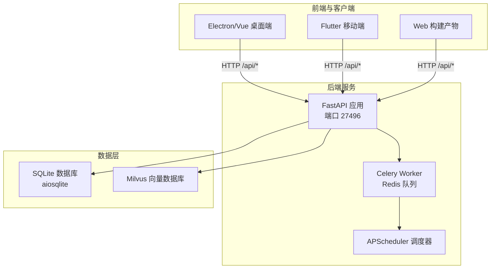
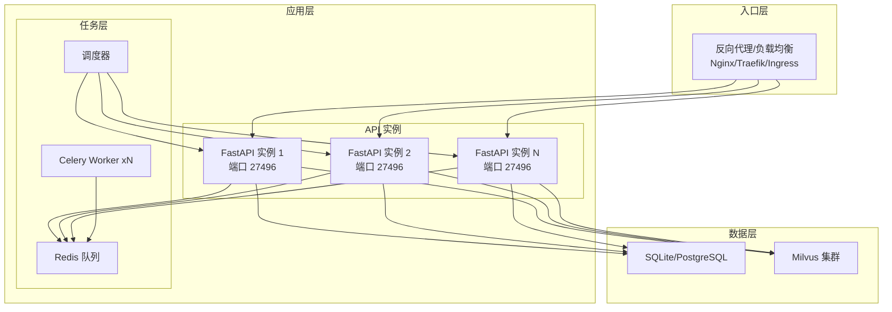
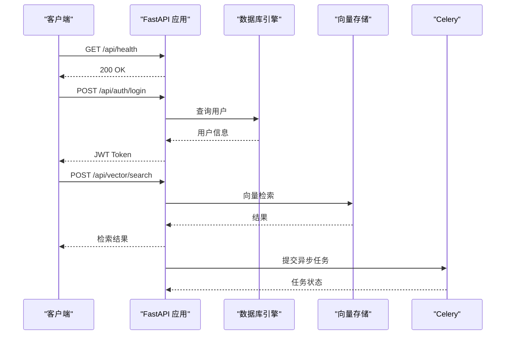
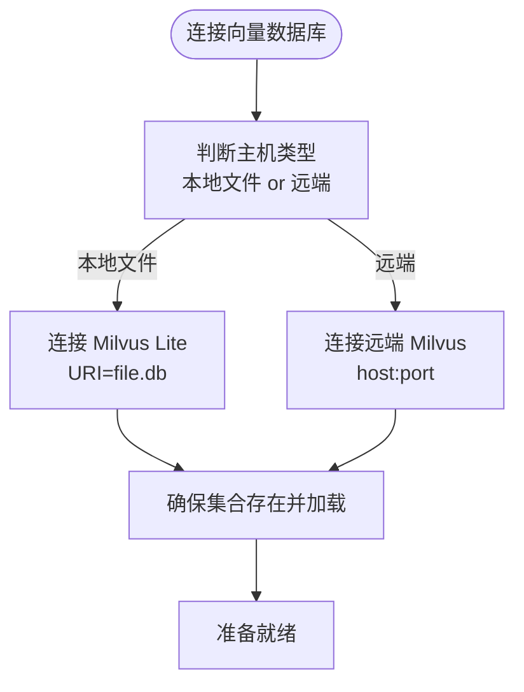
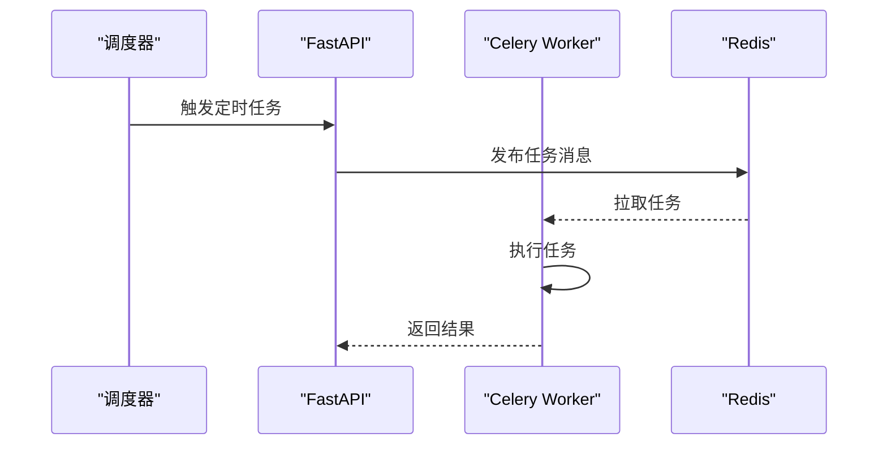
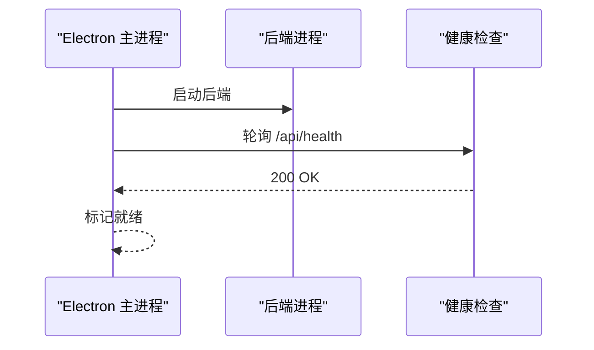
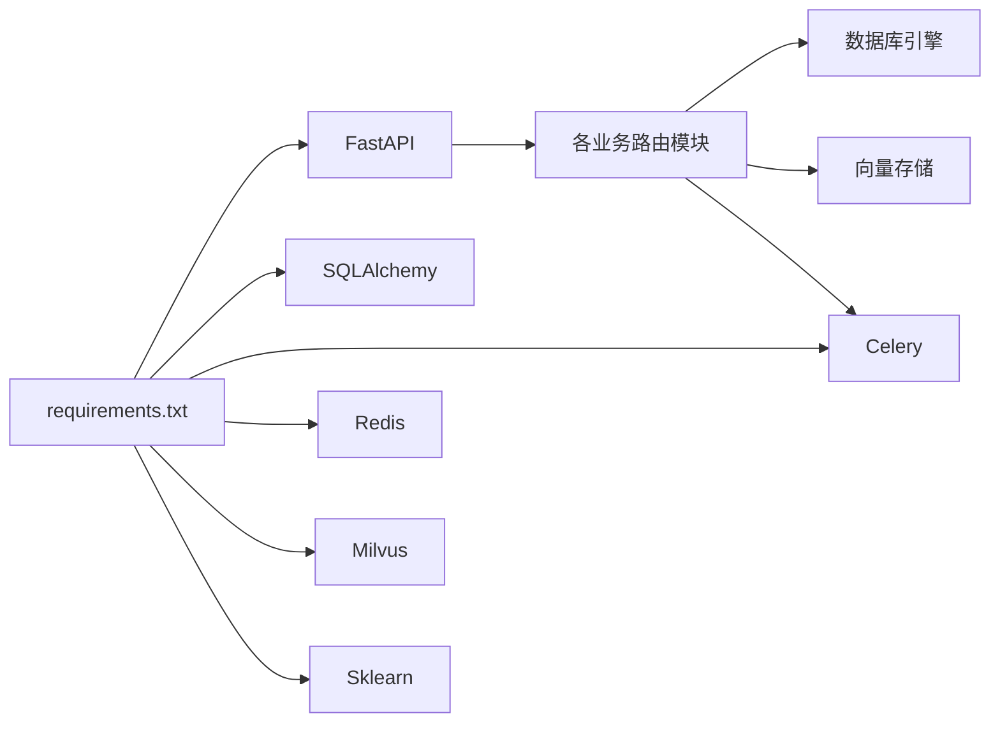

# 部署架构

<cite>
**本文引用的文件**
- [python-backend/requirements.txt](file://python-backend/requirements.txt)
- [python-backend/app/main.py](file://python-backend/app/main.py)
- [python-backend/app/config.py](file://python-backend/app/config.py)
- [python-backend/app/db.py](file://python-backend/app/db.py)
- [python-backend/app/models.py](file://python-backend/app/models.py)
- [python-backend/app/celery_app.py](file://python-backend/app/celery_app.py)
- [python-backend/app/handlers/vector_store.py](file://python-backend/app/handlers/vector_store.py)
- [python-backend/app/handlers/clustering.py](file://python-backend/app/handlers/clustering.py)
- [python-backend/scripts/start_celery.sh](file://python-backend/scripts/start_celery.sh)
- [rss-desktop/package.json](file://rss-desktop/package.json)
- [rss-desktop/resources/start-backend.sh](file://rss-desktop/resources/start-backend.sh)
- [rss-desktop/electron/main.ts](file://rss-desktop/electron/main.ts)
- [start.sh](file://start.sh)
</cite>

## 目录
1. [简介](#简介)
2. [项目结构](#项目结构)
3. [核心组件](#核心组件)
4. [架构总览](#架构总览)
5. [详细组件分析](#详细组件分析)
6. [依赖关系分析](#依赖关系分析)
7. [性能与容量规划](#性能与容量规划)
8. [故障排查指南](#故障排查指南)
9. [结论](#结论)
10. [附录](#附录)

## 简介
本文件面向 Tan RSS Reader 的部署与运维团队，系统化阐述整体部署拓扑、容器化与编排方案、负载均衡与高可用设计、环境隔离策略以及资源分配与性能调优建议。文档基于仓库中的现有实现进行分析，并给出可落地的部署建议。

## 项目结构
项目采用多端并行的架构：后端 Python/FastAPI 提供 API 与任务调度；桌面端 Electron/Vue 作为客户端；移动端 Flutter 支持多平台；向量数据库 Milvus 用于语义检索与聚类；Redis/Celery 用于异步任务队列。

图表来源
- [python-backend/app/main.py:28-62](file://python-backend/app/main.py#L28-L62)
- [python-backend/app/db.py:24-25](file://python-backend/app/db.py#L24-L25)
- [python-backend/app/config.py:41-71](file://python-backend/app/config.py#L41-L71)
- [python-backend/app/celery_app.py:5-22](file://python-backend/app/celery_app.py#L5-L22)
- [rss-desktop/electron/main.ts:45-51](file://rss-desktop/electron/main.ts#L45-L51)

章节来源
- [python-backend/app/main.py:28-62](file://python-backend/app/main.py#L28-L62)
- [python-backend/app/db.py:24-25](file://python-backend/app/db.py#L24-L25)
- [python-backend/app/config.py:41-71](file://python-backend/app/config.py#L41-L71)
- [python-backend/app/celery_app.py:5-22](file://python-backend/app/celery_app.py#L5-L22)
- [rss-desktop/electron/main.ts:45-51](file://rss-desktop/electron/main.ts#L45-L51)

## 核心组件
- 后端 API 服务（FastAPI）
  - 路由前缀统一为 /api，包含认证、订阅源、条目、向量检索、AI 配置等模块。
  - 启动时自动创建表结构并初始化调度器与 AI 配置。
- 数据库
  - 默认使用 SQLite（aiosqlite），支持通过环境变量指定自定义连接串。
- 向量数据库
  - 通过 Milvus SDK 连接，支持本地 Milvus Lite 或远端 Milvus 集群。
- 异步任务
  - Celery + Redis，配合 APScheduler 执行定时任务。
- 前端与客户端
  - 桌面端 Electron/Vue，内置后端进程管理与健康检查。
  - 移动端 Flutter，负责跨平台展示与交互。
  - Web 构建产物由 Vite 提供，可独立部署。

章节来源
- [python-backend/app/main.py:44-62](file://python-backend/app/main.py#L44-L62)
- [python-backend/app/db.py:11-22](file://python-backend/app/db.py#L11-L22)
- [python-backend/app/config.py:29-39](file://python-backend/app/config.py#L29-L39)
- [python-backend/app/handlers/vector_store.py:18-51](file://python-backend/app/handlers/vector_store.py#L18-L51)
- [python-backend/app/celery_app.py:5-22](file://python-backend/app/celery_app.py#L5-L22)
- [rss-desktop/electron/main.ts:45-51](file://rss-desktop/electron/main.ts#L45-L51)

## 架构总览
下图展示了生产环境的典型拓扑：反向代理/负载均衡前置，后端 API 多实例横向扩展，数据库与向量数据库独立部署，Celery Worker 与调度器解耦。

图表来源
- [python-backend/app/main.py:28-62](file://python-backend/app/main.py#L28-L62)
- [python-backend/app/config.py:49-55](file://python-backend/app/config.py#L49-L55)
- [python-backend/app/celery_app.py:5-22](file://python-backend/app/celery_app.py#L5-L22)

## 详细组件分析

### 后端 API 服务（FastAPI）
- 路由组织
  - 所有路由均以前缀 /api 组织，涵盖认证、订阅源、条目、向量检索、AI 配置、OPML 导入导出、RSSHub、代理、分类、标签、用户、订阅、会员、提示词等。
- 启动与关闭事件
  - 启动时创建数据库表并尝试迁移字段；加载应用设置与 AI 配置；启动调度器。
  - 关闭时停止调度器。
- CORS
  - 允许任意来源、方法与头，便于前端调试与跨域访问。

图表来源
- [python-backend/app/main.py:40-103](file://python-backend/app/main.py#L40-L103)
- [python-backend/app/db.py:24-25](file://python-backend/app/db.py#L24-L25)
- [python-backend/app/handlers/vector_store.py:92-178](file://python-backend/app/handlers/vector_store.py#L92-L178)
- [python-backend/app/celery_app.py:5-22](file://python-backend/app/celery_app.py#L5-L22)

章节来源
- [python-backend/app/main.py:28-62](file://python-backend/app/main.py#L28-L62)
- [python-backend/app/main.py:64-103](file://python-backend/app/main.py#L64-L103)

### 数据库与向量数据库
- 数据库
  - 默认使用 SQLite（aiosqlite），支持通过环境变量覆盖连接串；数据目录位于后端工程内 data/rss.db。
- 向量数据库
  - 通过 Milvus SDK 连接，支持本地 Milvus Lite（文件路径）或远端集群；集合名称可配置；默认维度 1024，索引类型 IVF_FLAT。
  - 提供插入、查询与相似度检索能力，支持去重与批量写入。

图表来源
- [python-backend/app/handlers/vector_store.py:23-51](file://python-backend/app/handlers/vector_store.py#L23-L51)
- [python-backend/app/handlers/vector_store.py:55-88](file://python-backend/app/handlers/vector_store.py#L55-L88)

章节来源
- [python-backend/app/db.py:11-22](file://python-backend/app/db.py#L11-L22)
- [python-backend/app/models.py:7-39](file://python-backend/app/models.py#L7-L39)
- [python-backend/app/handlers/vector_store.py:18-196](file://python-backend/app/handlers/vector_store.py#L18-L196)

### 异步任务与调度
- Celery
  - 使用 Redis 作为消息中间件，序列化格式为 JSON；启用 UTC 与时限控制。
- 调度器
  - 内置 APScheduler，管理定时任务（如 RSS 刷新、图标清理、健康检查、质量评分）。

图表来源
- [python-backend/app/celery_app.py:5-22](file://python-backend/app/celery_app.py#L5-L22)
- [python-backend/app/handlers/tasks.py:57-75](file://python-backend/app/handlers/tasks.py#L57-L75)

章节来源
- [python-backend/app/celery_app.py:5-22](file://python-backend/app/celery_app.py#L5-L22)
- [python-backend/scripts/start_celery.sh:1-4](file://python-backend/scripts/start_celery.sh#L1-L4)
- [python-backend/app/handlers/tasks.py:57-75](file://python-backend/app/handlers/tasks.py#L57-L75)

### 前端与桌面端
- 桌面端 Electron/Vue
  - 内置后端进程管理，支持开发模式与打包模式；健康检查路径为 /api/health，超时与轮询间隔可配置。
- Web 构建
  - Vite 提供开发与生产构建，脚本中包含 dev:frontend、build、preview 等命令。
- 移动端 Flutter
  - 通过 pubspec.yaml 管理依赖，支持多平台构建与发布。

图表来源
- [rss-desktop/electron/main.ts:45-51](file://rss-desktop/electron/main.ts#L45-L51)
- [rss-desktop/electron/main.ts:211-257](file://rss-desktop/electron/main.ts#L211-L257)
- [rss-desktop/resources/start-backend.sh:19-25](file://rss-desktop/resources/start-backend.sh#L19-L25)

章节来源
- [rss-desktop/electron/main.ts:45-51](file://rss-desktop/electron/main.ts#L45-L51)
- [rss-desktop/electron/main.ts:211-257](file://rss-desktop/electron/main.ts#L211-L257)
- [rss-desktop/package.json:41-54](file://rss-desktop/package.json#L41-L54)
- [rss-desktop/resources/start-backend.sh:19-25](file://rss-desktop/resources/start-backend.sh#L19-L25)

## 依赖关系分析
- 外部依赖
  - FastAPI、Uvicorn、SQLAlchemy、aiosqlite、PyJWT、passlib、Celery、Redis、Milvus SDK、sklearn、APScheduler、httpx、feedparser 等。
- 内部模块
  - 路由模块、服务模块、任务模块、工具模块、配置模块、数据库模型与向量存储模块。

图表来源
- [python-backend/requirements.txt:1-18](file://python-backend/requirements.txt#L1-L18)
- [python-backend/app/main.py:44-62](file://python-backend/app/main.py#L44-L62)
- [python-backend/app/db.py:24-25](file://python-backend/app/db.py#L24-L25)
- [python-backend/app/handlers/vector_store.py:18-51](file://python-backend/app/handlers/vector_store.py#L18-L51)
- [python-backend/app/celery_app.py:5-22](file://python-backend/app/celery_app.py#L5-L22)

章节来源
- [python-backend/requirements.txt:1-18](file://python-backend/requirements.txt#L1-L18)
- [python-backend/app/main.py:44-62](file://python-backend/app/main.py#L44-L62)

## 性能与容量规划
- 数据库
  - SQLite 适合单机与小规模场景；若并发较高或数据量大，建议迁移到 PostgreSQL 并启用连接池与只读副本。
- 向量数据库
  - Milvus 集群需根据向量维度与数据量评估索引参数与副本数；建议对高频查询字段建立合适索引并开启负载均衡。
- 任务与队列
  - Celery Worker 数量应与 CPU 核数匹配；Redis 需预留足够内存并开启持久化；监控任务积压与执行时延。
- API 实例
  - 使用 Uvicorn 多进程/多工作进程部署；根据请求峰值与响应时间调整 workers 与 threads；开启 gzip/静态资源缓存。
- 缓存与压缩
  - 对热点接口启用缓存；静态资源走 CDN；启用 HTTP/2 与 Brotli 压缩。
- 监控与日志
  - 采集指标（QPS、P95/P99、错误率、队列长度、数据库连接数、Milvus 查询耗时）；集中化日志与链路追踪。

[本节为通用指导，不直接分析具体文件，故无“章节来源”]

## 故障排查指南
- 后端无法启动
  - 检查端口占用与权限；确认虚拟环境与依赖安装；查看启动脚本输出。
- 数据库连接异常
  - 核对数据库 URL 环境变量；确认 SQLite 文件路径与权限；检查连接池配置。
- 向量检索失败
  - 确认 Milvus 地址与端口；检查集合是否存在并已加载；验证嵌入维度与索引参数。
- Celery 任务堆积
  - 增加 Worker 数量；优化任务执行逻辑；检查 Redis 可用性与网络延迟。
- 健康检查失败
  - 桌面端健康检查路径为 /api/health；检查后端是否正常监听与路由注册。

章节来源
- [start.sh:33-58](file://start.sh#L33-L58)
- [python-backend/app/db.py:11-22](file://python-backend/app/db.py#L11-L22)
- [python-backend/app/handlers/vector_store.py:23-51](file://python-backend/app/handlers/vector_store.py#L23-L51)
- [python-backend/app/celery_app.py:5-22](file://python-backend/app/celery_app.py#L5-L22)
- [rss-desktop/electron/main.ts:45-51](file://rss-desktop/electron/main.ts#L45-L51)

## 结论
Tan RSS Reader 的部署架构以 FastAPI 为核心，结合 SQLite、Milvus 与 Redis/Celery 形成轻量而功能完备的后端生态。生产部署建议采用反向代理/负载均衡、多实例横向扩展、独立数据库与向量数据库、完善的监控与告警体系，并针对不同环境制定隔离策略与容量规划，以保障稳定性与可扩展性。

[本节为总结性内容，不直接分析具体文件，故无“章节来源”]

## 附录

### 容器化与编排（建议方案）
- 镜像构建
  - 后端：基于 Python 3.11+，安装 requirements.txt，暴露端口 27496，设置 WORKDIR 与 ENTRYPOINT。
  - 前端：基于 Node 18+，安装依赖并构建，使用 Nginx 提供静态资源服务。
  - 任务：Celery Worker 作为独立容器，共享 Redis。
- 服务编排
  - 使用 Docker Compose 或 Kubernetes；定义后端 API、Celery Worker、Redis、Milvus、数据库、反向代理等服务。
  - 为 Milvus 与数据库挂载持久卷；为后端设置健康检查与重启策略。
- 服务发现
  - 使用服务名访问（如 http://backend:27496），Kubernetes 中通过 Service 与 Ingress 暴露。
- 配置管理
  - 使用环境变量注入数据库 URL、Redis URL、Milvus 地址、AI 服务密钥等；敏感信息使用 Secret。

[本节为概念性建议，不直接分析具体文件，故无“章节来源”]

### 负载均衡与 SSL 终止
- 反向代理
  - Nginx/Traefik/Ingress 前置，分发到多个后端实例；启用会话亲和或无状态设计。
- SSL 终止
  - 在反向代理层启用 HTTPS，证书由 ACME 或自有证书管理；后端保持 HTTP。
- 健康检查
  - 探测 /api/health；设置探针超时与重试；异常实例自动摘除。

[本节为概念性建议，不直接分析具体文件，故无“章节来源”]

### 高可用与故障转移
- 多节点部署
  - 后端多实例水平扩展；数据库使用主从复制或托管服务；Milvus 使用副本与分片。
- 故障转移
  - 反向代理层自动切换；Celery Worker 动态扩容；Redis 使用哨兵或集群。
- 数据同步
  - 订阅源与条目数据通过数据库同步；向量数据通过 Milvus 集群同步；任务队列保证幂等。

[本节为概念性建议，不直接分析具体文件，故无“章节来源”]

### 环境隔离策略
- 开发环境
  - 单机部署，SQLite + 本地 Milvus Lite + 本地 Redis；禁用 CORS 限制以便调试。
- 测试环境
  - 小规模集群，独立数据库与 Milvus；启用基本监控与日志。
- 生产环境
  - 多可用区部署，数据库与 Milvus 集群化；反向代理 + 负载均衡；严格的访问控制与审计日志。

[本节为概念性建议，不直接分析具体文件，故无“章节来源”]