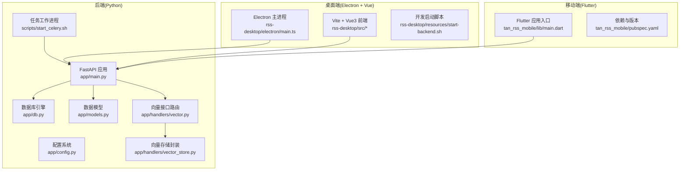
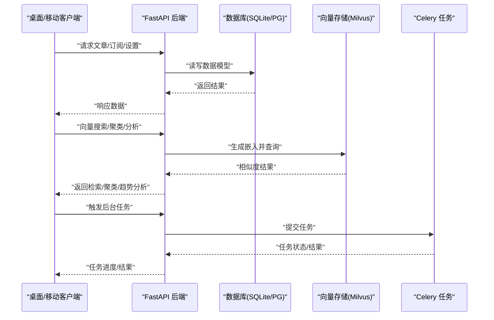
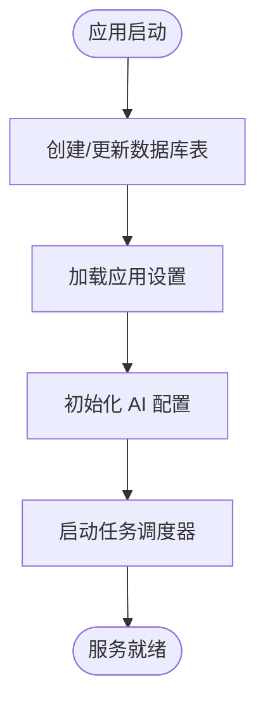
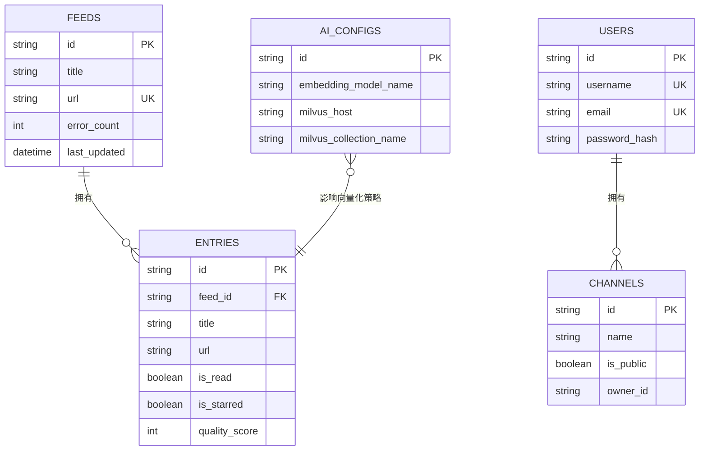
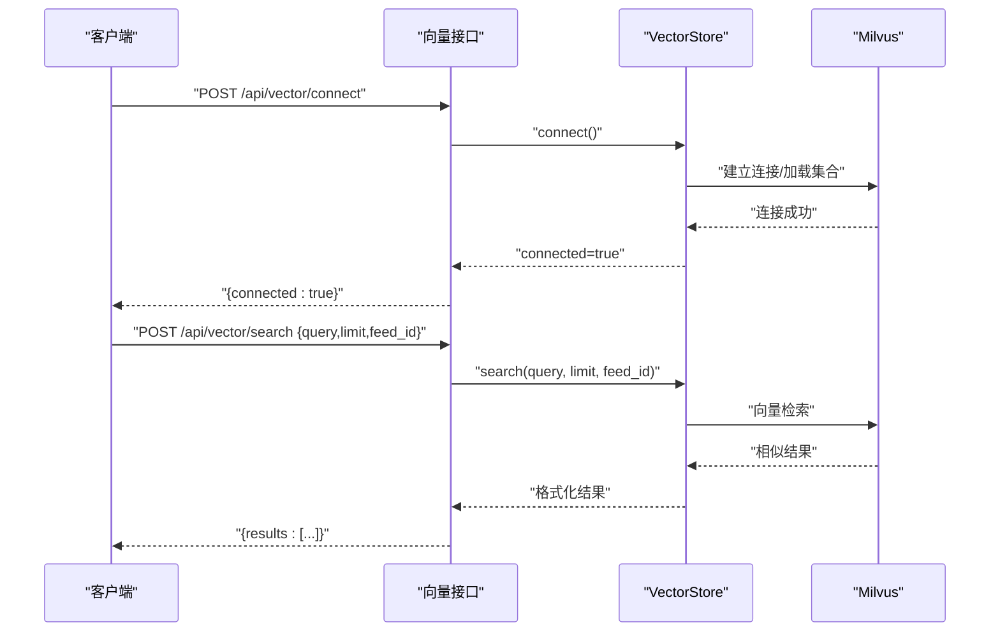
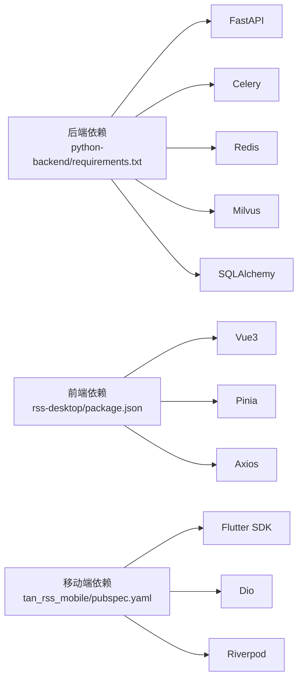

# 快速开始指南

<cite>
**本文引用的文件**
- [start.sh](file://start.sh)
- [python-backend/requirements.txt](file://python-backend/requirements.txt)
- [python-backend/app/config.py](file://python-backend/app/config.py)
- [python-backend/app/main.py](file://python-backend/app/main.py)
- [python-backend/app/db.py](file://python-backend/app/db.py)
- [python-backend/app/models.py](file://python-backend/app/models.py)
- [python-backend/app/handlers/vector.py](file://python-backend/app/handlers/vector.py)
- [python-backend/app/handlers/vector_store.py](file://python-backend/app/handlers/vector_store.py)
- [python-backend/scripts/start_celery.sh](file://python-backend/scripts/start_celery.sh)
- [python-backend/update_schema.py](file://python-backend/update_schema.py)
- [rss-desktop/package.json](file://rss-desktop/package.json)
- [rss-desktop/resources/start-backend.sh](file://rss-desktop/resources/start-backend.sh)
- [tan_rss_mobile/pubspec.yaml](file://tan_rss_mobile/pubspec.yaml)
</cite>

## 目录
1. [简介](#简介)
2. [项目结构](#项目结构)
3. [核心组件](#核心组件)
4. [架构总览](#架构总览)
5. [详细组件分析](#详细组件分析)
6. [依赖关系分析](#依赖关系分析)
7. [性能考虑](#性能考虑)
8. [故障排除指南](#故障排除指南)
9. [结论](#结论)
10. [附录](#附录)

## 简介
本指南面向新开发者，帮助你在最短时间内完成 Tan RSS Reader 的本地开发与运行。你将获得完整的环境准备清单（Python 3.8+、Node.js、Flutter SDK、PostgreSQL、Milvus）、项目克隆与依赖安装步骤、数据库初始化命令、开发环境启动流程（后端 API、桌面端 Electron/Vue、移动端 Flutter），以及生产部署与 Docker 化建议。

## 项目结构
该项目采用多模块组织方式：
- 后端：基于 Python 3 的 FastAPI 应用，使用 SQLAlchemy 异步 ORM、Celery 任务队列、Redis/Celery 作为消息中间件、SQLite 默认存储、Milvus 向量检索。
- 桌面端：基于 Electron + Vue 3 的跨平台桌面应用，提供开发与打包脚本。
- 移动端：基于 Flutter 的跨平台移动应用，支持 Android/iOS/Web/Windows/macOS/Linux 等多端构建。

图表来源
- [python-backend/app/main.py:1-103](file://python-backend/app/main.py#L1-L103)
- [python-backend/app/config.py:1-75](file://python-backend/app/config.py#L1-L75)
- [python-backend/app/db.py:1-27](file://python-backend/app/db.py#L1-L27)
- [python-backend/app/models.py:1-228](file://python-backend/app/models.py#L1-L228)
- [python-backend/app/handlers/vector.py:1-158](file://python-backend/app/handlers/vector.py#L1-L158)
- [python-backend/app/handlers/vector_store.py:1-197](file://python-backend/app/handlers/vector_store.py#L1-L197)
- [rss-desktop/resources/start-backend.sh:1-29](file://rss-desktop/resources/start-backend.sh#L1-L29)
- [tan_rss_mobile/pubspec.yaml:1-112](file://tan_rss_mobile/pubspec.yaml#L1-L112)

章节来源
- [python-backend/app/main.py:1-103](file://python-backend/app/main.py#L1-L103)
- [rss-desktop/package.json:1-81](file://rss-desktop/package.json#L1-L81)
- [tan_rss_mobile/pubspec.yaml:1-112](file://tan_rss_mobile/pubspec.yaml#L1-L112)

## 核心组件
- 后端 API 服务：基于 FastAPI，提供认证、订阅源、文章、向量检索、AI 功能等路由；启动时自动创建表并初始化设置。
- 数据库与模型：默认使用 SQLite（异步驱动），可通过环境变量切换为 PostgreSQL；模型覆盖 Feed、Entry、User、Channel、AI 配置等。
- 向量检索：封装 Milvus（或 Milvus Lite），提供连接、索引、搜索、聚类分析等能力。
- 任务系统：Celery 工作进程负责异步任务调度。
- 桌面端：Electron 主进程 + Vue3 前端，提供开发与打包脚本；可独立启动后端或通过资源脚本启动。
- 移动端：Flutter 应用，使用 pubspec 管理依赖与版本。

章节来源
- [python-backend/app/main.py:1-103](file://python-backend/app/main.py#L1-L103)
- [python-backend/app/db.py:1-27](file://python-backend/app/db.py#L1-L27)
- [python-backend/app/models.py:1-228](file://python-backend/app/models.py#L1-L228)
- [python-backend/app/handlers/vector_store.py:1-197](file://python-backend/app/handlers/vector_store.py#L1-L197)
- [python-backend/scripts/start_celery.sh:1-5](file://python-backend/scripts/start_celery.sh#L1-L5)
- [rss-desktop/resources/start-backend.sh:1-29](file://rss-desktop/resources/start-backend.sh#L1-L29)
- [tan_rss_mobile/pubspec.yaml:1-112](file://tan_rss_mobile/pubspec.yaml#L1-L112)

## 架构总览
下图展示从客户端到后端的典型交互路径，包括向量检索与 AI 分析链路。

图表来源
- [python-backend/app/main.py:1-103](file://python-backend/app/main.py#L1-L103)
- [python-backend/app/handlers/vector.py:1-158](file://python-backend/app/handlers/vector.py#L1-L158)
- [python-backend/app/handlers/vector_store.py:1-197](file://python-backend/app/handlers/vector_store.py#L1-L197)
- [python-backend/scripts/start_celery.sh:1-5](file://python-backend/scripts/start_celery.sh#L1-L5)

## 详细组件分析

### 后端 API 服务（FastAPI）
- 路由组织：所有业务路由在主程序中集中注册，包含认证、订阅、文章、向量、AI、OPML 等。
- 启动流程：启动时创建数据库表并尝试添加新字段；读取应用设置并初始化 AI 配置与任务调度器。
- 配置来源：统一从环境变量或 .env 加载，支持数据库、Redis/Milvus、AI 服务、服务器监听地址等。

图表来源
- [python-backend/app/main.py:64-98](file://python-backend/app/main.py#L64-L98)
- [python-backend/app/config.py:41-71](file://python-backend/app/config.py#L41-L71)

章节来源
- [python-backend/app/main.py:1-103](file://python-backend/app/main.py#L1-L103)
- [python-backend/app/config.py:1-75](file://python-backend/app/config.py#L1-L75)

### 数据库与模型
- 默认 SQLite：通过异步引擎连接本地 SQLite 文件，便于开发与演示。
- 可选 PostgreSQL：通过环境变量指定连接字符串即可切换。
- 表结构：涵盖 Feed、Entry、User、Channel、AI 配置、订阅关系等，支持扩展字段迁移。

图表来源
- [python-backend/app/models.py:7-228](file://python-backend/app/models.py#L7-L228)
- [python-backend/app/db.py:1-27](file://python-backend/app/db.py#L1-L27)

章节来源
- [python-backend/app/db.py:1-27](file://python-backend/app/db.py#L1-L27)
- [python-backend/app/models.py:1-228](file://python-backend/app/models.py#L1-L228)

### 向量检索与聚类
- 连接 Milvus：支持远程 Milvus 或本地 Milvus Lite（.db 文件）。
- 索引与搜索：自动创建集合、建立索引；支持按 feed 过滤与相似度检索。
- 聚类分析：对选定条目生成时间线与趋势分析。

图表来源
- [python-backend/app/handlers/vector.py:38-111](file://python-backend/app/handlers/vector.py#L38-L111)
- [python-backend/app/handlers/vector_store.py:23-178](file://python-backend/app/handlers/vector_store.py#L23-L178)

章节来源
- [python-backend/app/handlers/vector.py:1-158](file://python-backend/app/handlers/vector.py#L1-L158)
- [python-backend/app/handlers/vector_store.py:1-197](file://python-backend/app/handlers/vector_store.py#L1-L197)

### 任务系统（Celery）
- 启动方式：通过脚本设置 PYTHONPATH 并启动 Celery 工作进程。
- 用途：处理定时任务、异步任务（如向量索引、批量处理）。

章节来源
- [python-backend/scripts/start_celery.sh:1-5](file://python-backend/scripts/start_celery.sh#L1-L5)

### 桌面端（Electron + Vue）
- 开发脚本：提供独立启动后端与前端的脚本，便于联调。
- 生产脚本：资源脚本可启动本地后端并以生产模式运行 Rust 后端（若存在）。

章节来源
- [rss-desktop/package.json:41-54](file://rss-desktop/package.json#L41-L54)
- [rss-desktop/resources/start-backend.sh:1-29](file://rss-desktop/resources/start-backend.sh#L1-L29)

### 移动端（Flutter）
- 依赖与版本：pubspec 管理 Flutter SDK 版本与第三方包。
- 构建：支持多端构建，具体命令可参考 Flutter 文档。

章节来源
- [tan_rss_mobile/pubspec.yaml:21-22](file://tan_rss_mobile/pubspec.yaml#L21-L22)

## 依赖关系分析
- 后端依赖：FastAPI、Uvicorn、SQLAlchemy、Pydantic、Celery、Redis、Milvus、Scikit-learn 等。
- 前端依赖：Vue3、Pinia、Axios、Chart.js、Vue Router 等。
- 移动端依赖：Flutter SDK、dio、shared_preferences、riverpod 等。

图表来源
- [python-backend/requirements.txt:1-18](file://python-backend/requirements.txt#L1-L18)
- [rss-desktop/package.json:55-78](file://rss-desktop/package.json#L55-L78)
- [tan_rss_mobile/pubspec.yaml:30-51](file://tan_rss_mobile/pubspec.yaml#L30-L51)

章节来源
- [python-backend/requirements.txt:1-18](file://python-backend/requirements.txt#L1-L18)
- [rss-desktop/package.json:1-81](file://rss-desktop/package.json#L1-L81)
- [tan_rss_mobile/pubspec.yaml:1-112](file://tan_rss_mobile/pubspec.yaml#L1-L112)

## 性能考虑
- 向量检索：Milvus 索引参数（如 nlist）与 nprobe 影响召回与延迟；建议根据数据规模调整。
- 数据库：SQLite 适合开发测试；生产建议使用 PostgreSQL 并启用连接池与索引优化。
- 任务并发：Celery 工作进程数与队列配置需结合 CPU 与内存资源评估。
- 前端：开发模式使用热重载；生产构建应开启压缩与 Tree-shaking。

## 故障排除指南
- 后端无法启动或端口占用
  - 检查监听端口是否被占用，必要时修改配置或释放端口。
  - 查看启动脚本输出，确认虚拟环境与依赖安装完成。
- 数据库初始化失败
  - 确认数据库 URL 正确；SQLite 文件路径是否存在；权限是否足够。
  - 如需切换为 PostgreSQL，请设置正确的连接字符串并安装对应驱动。
- 向量检索异常
  - 确认 Milvus 服务可用；若使用 Milvus Lite，确认 .db 文件存在且可读。
  - 检查嵌入维度与模型配置是否一致。
- Celery 无响应
  - 确认 Redis 可达；检查 PYTHONPATH 是否包含项目根目录。
- 桌面端无法访问后端
  - 确认后端已启动并监听 0.0.0.0 或本地回环；检查防火墙与端口映射。
- 移动端构建失败
  - 确认 Flutter SDK 版本满足要求；清理缓存后重新安装依赖。

章节来源
- [python-backend/app/config.py:41-71](file://python-backend/app/config.py#L41-L71)
- [python-backend/app/db.py:11-22](file://python-backend/app/db.py#L11-L22)
- [python-backend/app/handlers/vector_store.py:23-54](file://python-backend/app/handlers/vector_store.py#L23-L54)
- [python-backend/scripts/start_celery.sh:1-5](file://python-backend/scripts/start_celery.sh#L1-L5)
- [rss-desktop/resources/start-backend.sh:11-25](file://rss-desktop/resources/start-backend.sh#L11-L25)

## 结论
通过本指南，你可以快速完成环境准备、项目克隆、依赖安装与数据库初始化，并启动后端 API、桌面端与移动端应用。生产部署时请优先考虑 PostgreSQL、Redis、Milvus 的稳定部署与网络连通性，并结合 Celery 实现异步任务解耦。遇到问题时，可依据“故障排除指南”逐项排查。

## 附录

### 环境准备与安装
- Python 3.8+
  - 建议使用 pyenv 或系统自带 Python 3.8+。
- Node.js 与 pnpm
  - 桌面端使用 pnpm，需 Node.js 18+、pnpm 8+。
- Flutter SDK
  - 移动端使用 Flutter SDK，版本在 pubspec 中声明。
- PostgreSQL（可选）
  - 若使用 PostgreSQL，请准备数据库与用户权限，并在后端设置正确的连接字符串。
- Milvus（可选）
  - 支持远程 Milvus 或本地 Milvus Lite；确保网络可达或 .db 文件存在。

章节来源
- [rss-desktop/package.json:37-40](file://rss-desktop/package.json#L37-L40)
- [tan_rss_mobile/pubspec.yaml:21-22](file://tan_rss_mobile/pubspec.yaml#L21-L22)
- [python-backend/requirements.txt:14-14](file://python-backend/requirements.txt#L14-L14)

### 克隆与依赖安装
- 克隆仓库
  - 使用 Git 克隆项目至本地。
- 后端依赖
  - 进入后端目录，创建并激活虚拟环境，安装 requirements.txt。
- 桌面端依赖
  - 进入桌面端目录，使用 pnpm 安装依赖。
- 移动端依赖
  - 进入移动端目录，使用 Flutter 安装依赖。

章节来源
- [start.sh:33-48](file://start.sh#L33-L48)
- [rss-desktop/package.json:68-78](file://rss-desktop/package.json#L68-L78)
- [tan_rss_mobile/pubspec.yaml:53-64](file://tan_rss_mobile/pubspec.yaml#L53-L64)

### 数据库初始化
- 默认 SQLite
  - 启动后端会自动创建表；首次启动可能需要等待。
- 切换 PostgreSQL
  - 设置数据库连接字符串（见配置章节），重启后生效。
- 手动创建表
  - 可执行数据库初始化脚本，创建表并添加必要字段。

章节来源
- [python-backend/app/main.py:64-98](file://python-backend/app/main.py#L64-L98)
- [python-backend/update_schema.py:13-22](file://python-backend/update_schema.py#L13-L22)

### 开发环境启动流程
- 统一启动脚本
  - 使用仓库提供的启动脚本，自动创建虚拟环境、安装依赖并启动后端与前端。
- 分别启动
  - 后端：进入后端目录，激活虚拟环境，启动 Uvicorn。
  - 桌面端：进入桌面端目录，安装依赖后启动前端或 Electron。
  - 移动端：进入移动端目录，安装依赖后运行相应设备模拟器或真机。

章节来源
- [start.sh:30-80](file://start.sh#L30-L80)
- [rss-desktop/resources/start-backend.sh:11-25](file://rss-desktop/resources/start-backend.sh#L11-L25)

### 生产环境部署要点
- 服务器与网络
  - 后端监听 0.0.0.0，开放端口；确保防火墙放行。
- 数据库
  - 推荐 PostgreSQL；配置连接池与备份策略。
- 缓存与任务
  - Redis 作为 Celery broker/结果后端，确保高可用。
- 向量数据库
  - Milvus 部署为集群或单机，确保副本与备份。
- 日志与监控
  - 记录后端日志、任务队列状态与数据库慢查询。

章节来源
- [python-backend/app/config.py:46-66](file://python-backend/app/config.py#L46-L66)
- [python-backend/app/main.py:64-103](file://python-backend/app/main.py#L64-L103)

### Docker 部署简化方案
- 多阶段构建
  - 后端：基于 Python 3.8+ 镜像，复制 requirements.txt 并安装依赖，拷贝代码，暴露端口并启动 Uvicorn。
  - 前端：基于 Node 18+ 镜像，安装 pnpm，构建产物，使用 Nginx 提供静态服务。
  - 移动端：使用 Flutter 官方镜像构建 APK/APK 测试包。
- 外部服务
  - 将 PostgreSQL、Redis、Milvus 作为独立服务或使用容器编排工具（如 docker-compose）统一管理。
- 环境变量
  - 通过环境变量注入数据库 URL、Redis 地址、Milvus 地址、AI 服务密钥等。

章节来源
- [python-backend/requirements.txt:1-18](file://python-backend/requirements.txt#L1-L18)
- [rss-desktop/package.json:41-54](file://rss-desktop/package.json#L41-L54)
- [tan_rss_mobile/pubspec.yaml:1-112](file://tan_rss_mobile/pubspec.yaml#L1-L112)

### 自定义配置选项
- 数据库
  - 通过环境变量设置数据库 URL，支持 SQLite 与 PostgreSQL。
- Milvus
  - 配置主机、端口、集合名；支持本地 Milvus Lite。
- AI 服务
  - 配置摘要、翻译、嵌入模型的 API Key、基础 URL、模型名称与功能开关。
- 服务器
  - 主机与端口可在配置中统一设置。

章节来源
- [python-backend/app/config.py:41-71](file://python-backend/app/config.py#L41-L71)
- [python-backend/app/handlers/vector_store.py:23-54](file://python-backend/app/handlers/vector_store.py#L23-L54)