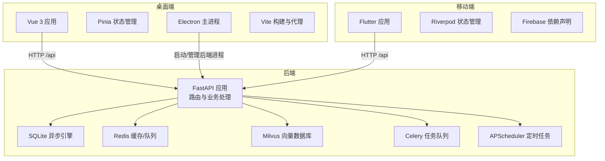
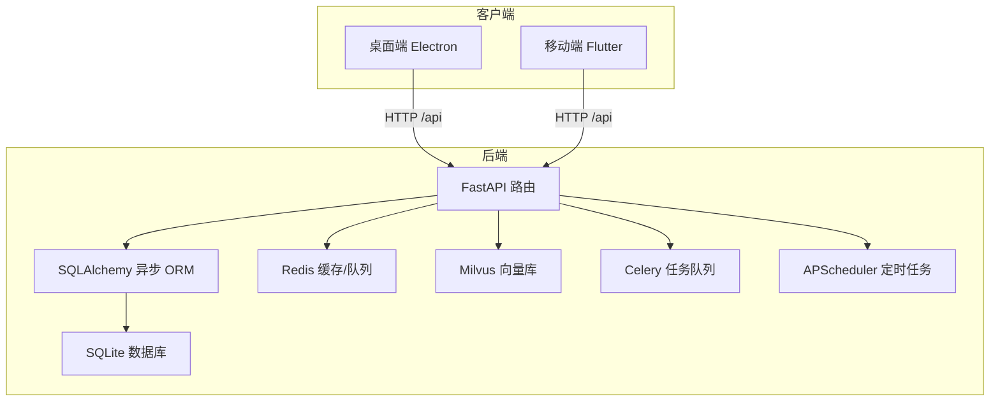
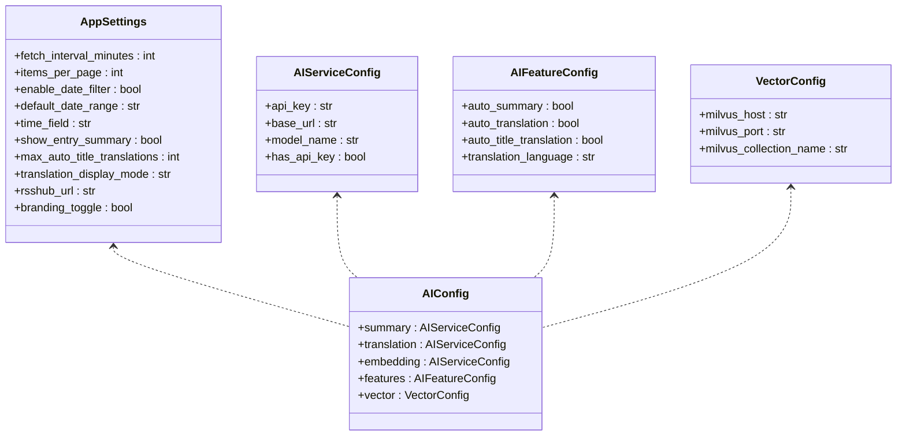
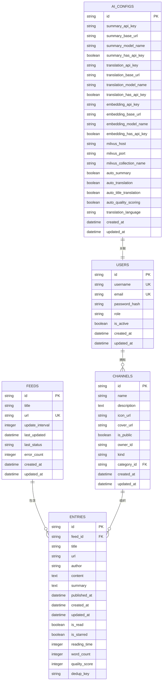
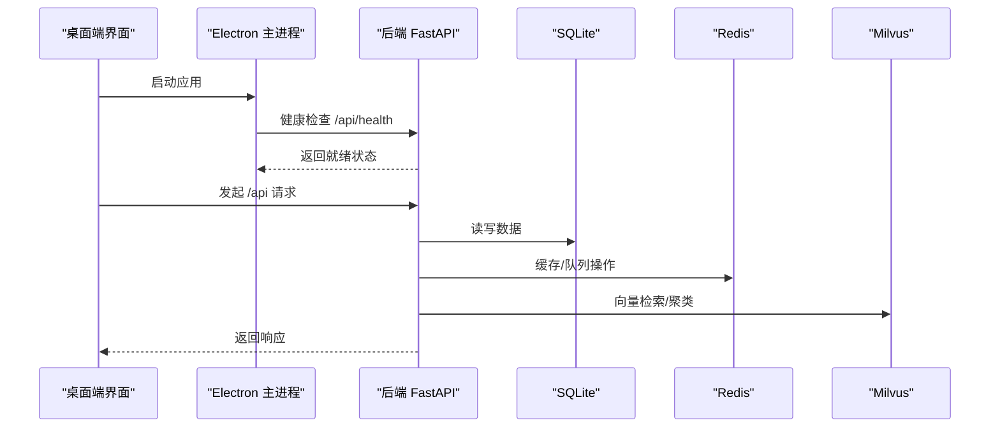
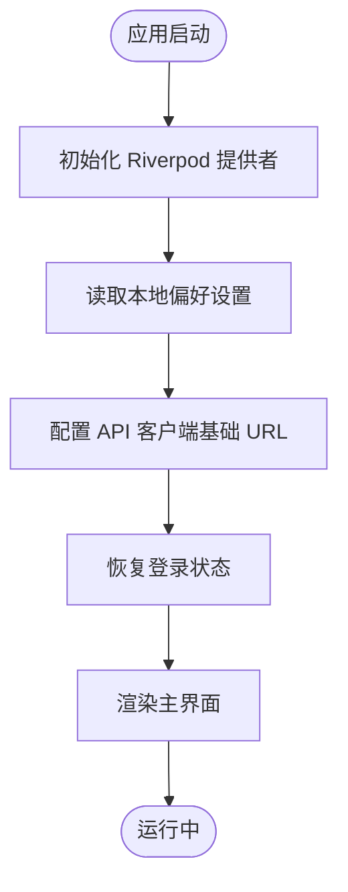
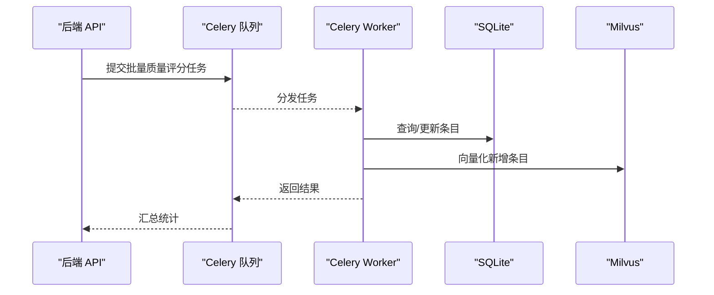
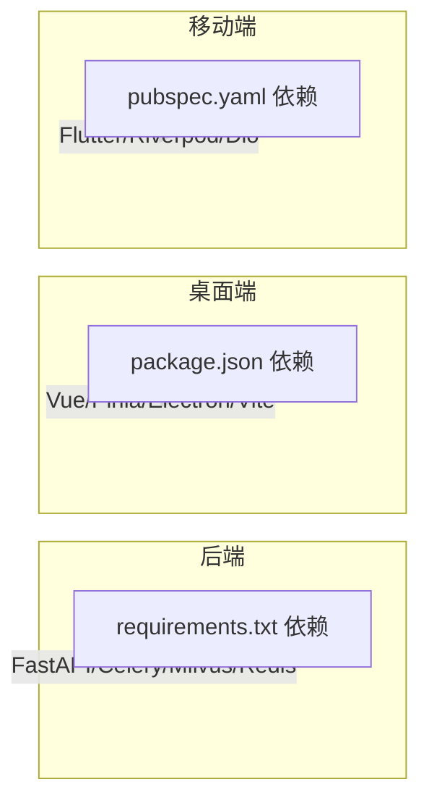

# 技术栈概览

<cite>
**本文档引用的文件**
- [requirements.txt](file://python-backend/requirements.txt)
- [main.py](file://python-backend/app/main.py)
- [config.py](file://python-backend/app/config.py)
- [db.py](file://python-backend/app/db.py)
- [models.py](file://python-backend/app/models.py)
- [celery_app.py](file://python-backend/app/celery_app.py)
- [ai_tasks.py](file://python-backend/app/tasks/ai_tasks.py)
- [vector.py](file://python-backend/app/handlers/vector.py)
- [package.json](file://rss-desktop/package.json)
- [main.ts](file://rss-desktop/src/main.ts)
- [vite.config.ts](file://rss-desktop/vite.config.ts)
- [main.ts](file://rss-desktop/electron/main.ts)
- [pubspec.yaml](file://tan_rss_mobile/pubspec.yaml)
- [main.dart](file://tan_rss_mobile/lib/main.dart)
- [build.gradle.kts](file://tan_rss_mobile/android/app/build.gradle.kts)
</cite>

## 目录
1. [引言](#引言)
2. [项目结构](#项目结构)
3. [核心组件](#核心组件)
4. [架构总览](#架构总览)
5. [详细组件分析](#详细组件分析)
6. [依赖关系分析](#依赖关系分析)
7. [性能考量](#性能考量)
8. [故障排查指南](#故障排查指南)
9. [结论](#结论)
10. [附录](#附录)

## 引言
本文件为 Tan RSS Reader 的技术栈概览文档，面向后端、桌面端、移动端与 AI 服务集成，系统阐述技术选型、架构设计、数据流、处理逻辑、依赖关系与性能优化建议，并提供版本兼容性与升级路径参考。目标是帮助开发者与运维人员快速理解整体技术路线与实现要点。

## 项目结构
项目采用多端分离架构：
- 后端：Python + FastAPI + SQLAlchemy + Celery + APScheduler + Milvus + Redis
- 桌面端：Vue 3 + TypeScript + Pinia + Electron + Vite
- 移动端：Flutter + Dart + Riverpod + Firebase（依赖声明）

图表来源
- [main.py:1-103](file://python-backend/app/main.py#L1-L103)
- [config.py:41-75](file://python-backend/app/config.py#L41-L75)
- [db.py:1-27](file://python-backend/app/db.py#L1-L27)
- [celery_app.py:1-23](file://python-backend/app/celery_app.py#L1-L23)
- [main.ts:1-9](file://rss-desktop/src/main.ts#L1-L9)
- [vite.config.ts:1-55](file://rss-desktop/vite.config.ts#L1-L55)
- [main.ts:1-548](file://rss-desktop/electron/main.ts#L1-L548)
- [pubspec.yaml:1-112](file://tan_rss_mobile/pubspec.yaml#L1-L112)

章节来源
- [main.py:1-103](file://python-backend/app/main.py#L1-L103)
- [config.py:41-75](file://python-backend/app/config.py#L41-L75)
- [db.py:1-27](file://python-backend/app/db.py#L1-L27)
- [celery_app.py:1-23](file://python-backend/app/celery_app.py#L1-L23)
- [main.ts:1-9](file://rss-desktop/src/main.ts#L1-L9)
- [vite.config.ts:1-55](file://rss-desktop/vite.config.ts#L1-L55)
- [main.ts:1-548](file://rss-desktop/electron/main.ts#L1-L548)
- [pubspec.yaml:1-112](file://tan_rss_mobile/pubspec.yaml#L1-L112)

## 核心组件
- 后端框架与路由：基于 FastAPI 提供 REST 接口，统一挂载多模块路由，包含认证、订阅、条目、向量检索、AI 配置等。
- 数据层：SQLAlchemy 异步 ORM，SQLite 作为主数据库；通过 Pydantic 管理应用与 AI 配置。
- 任务与调度：Celery 使用 Redis 作为消息中间件与结果存储；APScheduler 在应用启动时统一管理定时任务。
- 向量检索：Milvus 作为向量数据库，提供向量化检索与聚类分析能力。
- 桌面端：Vue 3 + TypeScript + Pinia + Vite，Electron 主进程负责启动/管理后端服务与窗口生命周期。
- 移动端：Flutter + Riverpod，Android 使用 Gradle Kotlin DSL 配置，iOS/Android 平台构建。

章节来源
- [main.py:1-103](file://python-backend/app/main.py#L1-L103)
- [config.py:1-75](file://python-backend/app/config.py#L1-L75)
- [models.py:1-228](file://python-backend/app/models.py#L1-L228)
- [celery_app.py:1-23](file://python-backend/app/celery_app.py#L1-L23)
- [vector.py:1-158](file://python-backend/app/handlers/vector.py#L1-L158)
- [main.ts:1-9](file://rss-desktop/src/main.ts#L1-L9)
- [vite.config.ts:1-55](file://rss-desktop/vite.config.ts#L1-L55)
- [main.ts:1-548](file://rss-desktop/electron/main.ts#L1-L548)
- [pubspec.yaml:1-112](file://tan_rss_mobile/pubspec.yaml#L1-L112)

## 架构总览
后端采用“API + 异步数据库 + 任务队列 + 向量数据库”的分层设计。桌面端通过 Electron 与后端交互，移动端通过 HTTP 接口访问后端服务。

图表来源
- [main.py:1-103](file://python-backend/app/main.py#L1-L103)
- [db.py:1-27](file://python-backend/app/db.py#L1-L27)
- [config.py:41-75](file://python-backend/app/config.py#L41-L75)
- [celery_app.py:1-23](file://python-backend/app/celery_app.py#L1-L23)
- [vector.py:1-158](file://python-backend/app/handlers/vector.py#L1-L158)

## 详细组件分析

### 后端技术栈与选型
- Python + FastAPI：高性能异步 Web 框架，类型安全与自动生成 OpenAPI 文档，适合构建现代化 API。
- SQLAlchemy：异步 ORM，配合 aiosqlite 实现 SQLite 异步读写，满足本地化与轻量部署需求。
- Celery + Redis：分布式任务队列，异步执行批量质量评分、向量化等耗时任务，提升响应性能。
- APScheduler：应用内定时任务调度，统一在启动/关闭事件中启停，保证资源一致性。
- Milvus：向量数据库，支撑 RSS 条目的语义检索与聚类分析。
- Pydantic + pydantic-settings：强类型配置模型，支持 .env 与环境变量注入，便于多环境管理。

图表来源
- [config.py:5-40](file://python-backend/app/config.py#L5-L40)

章节来源
- [requirements.txt:1-18](file://python-backend/requirements.txt#L1-L18)
- [config.py:1-75](file://python-backend/app/config.py#L1-L75)
- [db.py:1-27](file://python-backend/app/db.py#L1-L27)
- [models.py:1-228](file://python-backend/app/models.py#L1-L228)
- [celery_app.py:1-23](file://python-backend/app/celery_app.py#L1-L23)
- [ai_tasks.py:1-87](file://python-backend/app/tasks/ai_tasks.py#L1-L87)
- [vector.py:1-158](file://python-backend/app/handlers/vector.py#L1-L158)

### 数据库架构与向量检索
- 主数据库：SQLite（异步），通过 SQLAlchemy ORM 管理表结构与迁移。
- 缓存与队列：Redis，Celery 使用其作为 broker 与 backend。
- 向量数据库：Milvus，提供向量检索与聚类分析接口。
- 数据模型覆盖 Feed、Entry、Channel、User、AI 配置、向量索引等核心实体。

图表来源
- [models.py:7-228](file://python-backend/app/models.py#L7-L228)

章节来源
- [db.py:1-27](file://python-backend/app/db.py#L1-L27)
- [models.py:1-228](file://python-backend/app/models.py#L1-L228)
- [vector.py:1-158](file://python-backend/app/handlers/vector.py#L1-L158)

### 桌面端技术栈与选型
- Vue 3 + TypeScript：现代前端框架，类型安全与 Composition API 提升开发效率。
- Pinia：轻量状态管理，替代 Vuex，API 简洁易用。
- Electron：跨平台桌面应用运行时，主进程负责后端进程管理与窗口生命周期。
- Vite：快速构建工具，支持热更新与多环境模式（含 Electron 模式）。
- 代理配置：开发时将 /api 代理至后端服务端口，简化联调。

图表来源
- [main.ts:1-9](file://rss-desktop/src/main.ts#L1-L9)
- [vite.config.ts:1-55](file://rss-desktop/vite.config.ts#L1-L55)
- [main.ts:93-132](file://rss-desktop/electron/main.ts#L93-L132)
- [main.py:1-103](file://python-backend/app/main.py#L1-L103)

章节来源
- [package.json:1-81](file://rss-desktop/package.json#L1-L81)
- [main.ts:1-9](file://rss-desktop/src/main.ts#L1-L9)
- [vite.config.ts:1-55](file://rss-desktop/vite.config.ts#L1-L55)
- [main.ts:1-548](file://rss-desktop/electron/main.ts#L1-L548)

### 移动端技术栈与选型
- Flutter + Dart：跨平台 UI 框架，一套代码适配 iOS/Android/Web/Linux/macOS/Windows。
- Riverpod：现代化状态管理，提供 Provider/Notifier 等能力，便于复杂状态解耦。
- Firebase：在依赖清单中声明，可用于推送、认证、分析等能力扩展。
- Android 构建：Gradle Kotlin DSL，Java 17 兼容，最小 SDK 版本 21。

图表来源
- [main.dart:40-153](file://tan_rss_mobile/lib/main.dart#L40-L153)
- [pubspec.yaml:30-65](file://tan_rss_mobile/pubspec.yaml#L30-L65)
- [build.gradle.kts:1-45](file://tan_rss_mobile/android/app/build.gradle.kts#L1-L45)

章节来源
- [pubspec.yaml:1-112](file://tan_rss_mobile/pubspec.yaml#L1-L112)
- [main.dart:1-153](file://tan_rss_mobile/lib/main.dart#L1-L153)
- [build.gradle.kts:1-45](file://tan_rss_mobile/android/app/build.gradle.kts#L1-L45)

### AI 服务集成与任务编排
- AI 配置：支持多服务配置（如 Aurora AI），通过 Pydantic 模型集中管理。
- 向量检索：提供连接、搜索、聚类与分析接口，结合 Milvus 实现语义检索。
- 批量任务：Celery 异步执行文章质量评分与向量化，避免阻塞主线程。
- 定时任务：APScheduler 在应用启动时统一管理，关闭时清理。

图表来源
- [ai_tasks.py:16-51](file://python-backend/app/tasks/ai_tasks.py#L16-L51)
- [ai_tasks.py:53-87](file://python-backend/app/tasks/ai_tasks.py#L53-L87)
- [vector.py:146-158](file://python-backend/app/handlers/vector.py#L146-L158)
- [celery_app.py:1-23](file://python-backend/app/celery_app.py#L1-L23)

章节来源
- [config.py:17-40](file://python-backend/app/config.py#L17-L40)
- [vector.py:1-158](file://python-backend/app/handlers/vector.py#L1-L158)
- [ai_tasks.py:1-87](file://python-backend/app/tasks/ai_tasks.py#L1-L87)
- [celery_app.py:1-23](file://python-backend/app/celery_app.py#L1-L23)

## 依赖关系分析
- 后端依赖：FastAPI、SQLAlchemy、Celery、APScheduler、Milvus、Redis、Pydantic 等。
- 桌面端依赖：Vue 3、Pinia、Axios、Electron、Vite 等。
- 移动端依赖：Flutter、Riverpod、Dio、shared_preferences 等。

图表来源
- [requirements.txt:1-18](file://python-backend/requirements.txt#L1-L18)
- [package.json:55-78](file://rss-desktop/package.json#L55-L78)
- [pubspec.yaml:30-65](file://tan_rss_mobile/pubspec.yaml#L30-L65)

章节来源
- [requirements.txt:1-18](file://python-backend/requirements.txt#L1-L18)
- [package.json:1-81](file://rss-desktop/package.json#L1-L81)
- [pubspec.yaml:1-112](file://tan_rss_mobile/pubspec.yaml#L1-L112)

## 性能考量
- 异步 I/O：后端使用 SQLAlchemy 异步引擎与 aiosqlite，减少阻塞，提升并发吞吐。
- 任务解耦：Celery 异步执行耗时任务，避免请求链路阻塞，提高响应速度。
- 缓存策略：Redis 用于会话、队列与缓存，降低数据库压力。
- 向量检索：Milvus 支持高维向量相似度检索，结合聚类分析提升信息发现效率。
- 前端性能：Vite 热更新与按需打包，Electron 主进程仅在必要时启动后端，缩短启动时间。

## 故障排查指南
- 后端未就绪：桌面端主进程在启动时进行健康检查，若超时或返回非 2xx，记录日志并提示后端未就绪。
- 数据库初始化：启动时自动创建表结构并尝试迁移字段，异常可忽略以保证兼容性。
- 任务队列：确认 Redis 地址与连接可用，Celery worker 正常运行，任务时间限制与跟踪开启。
- 向量库：Milvus 连接失败时返回连接状态，检查主机、端口与集合名配置。
- 前端代理：开发时确认 /api 代理指向正确后端端口，避免跨域问题。

章节来源
- [main.ts:93-132](file://rss-desktop/electron/main.ts#L93-L132)
- [main.py:64-98](file://python-backend/app/main.py#L64-L98)
- [celery_app.py:14-22](file://python-backend/app/celery_app.py#L14-L22)
- [vector.py:38-41](file://python-backend/app/handlers/vector.py#L38-L41)

## 结论
Tan RSS Reader 采用“后端 API + 异步数据库 + 任务队列 + 向量数据库”的现代化技术栈，结合桌面端 Electron 与移动端 Flutter，形成跨平台一致的用户体验。通过 Pydantic 配置管理、Celery 异步任务与 Milvus 向量检索，系统在性能、可维护性与可扩展性方面取得良好平衡。

## 附录
- 版本兼容性与升级路径（基于仓库现有文件）：
  - Python 与后端依赖：参考 requirements.txt 中版本范围，建议遵循语义化版本并定期升级。
  - 桌面端：Node >= 18、pnpm >= 8，Vue 3、Electron、Vite 版本保持兼容。
  - 移动端：Flutter SDK ^3.11.3，Android 最小 SDK 21，Gradle Kotlin DSL 配置与 Java 17 兼容。
  - 向量与缓存：Milvus 2.4+、Redis 5+、Celery 5.3+、APScheduler 3.10+。

章节来源
- [requirements.txt:1-18](file://python-backend/requirements.txt#L1-L18)
- [package.json:37-40](file://rss-desktop/package.json#L37-L40)
- [pubspec.yaml:21-22](file://tan_rss_mobile/pubspec.yaml#L21-L22)
- [build.gradle.kts:13-20](file://tan_rss_mobile/android/app/build.gradle.kts#L13-L20)