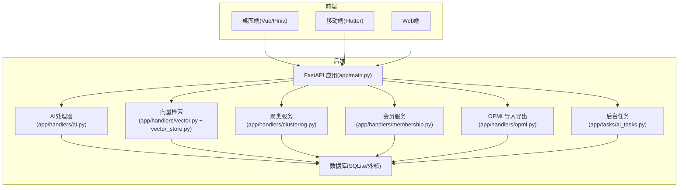
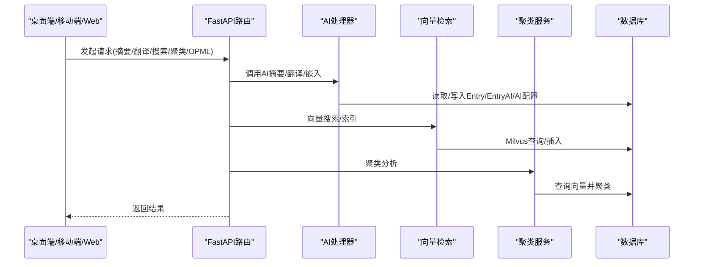
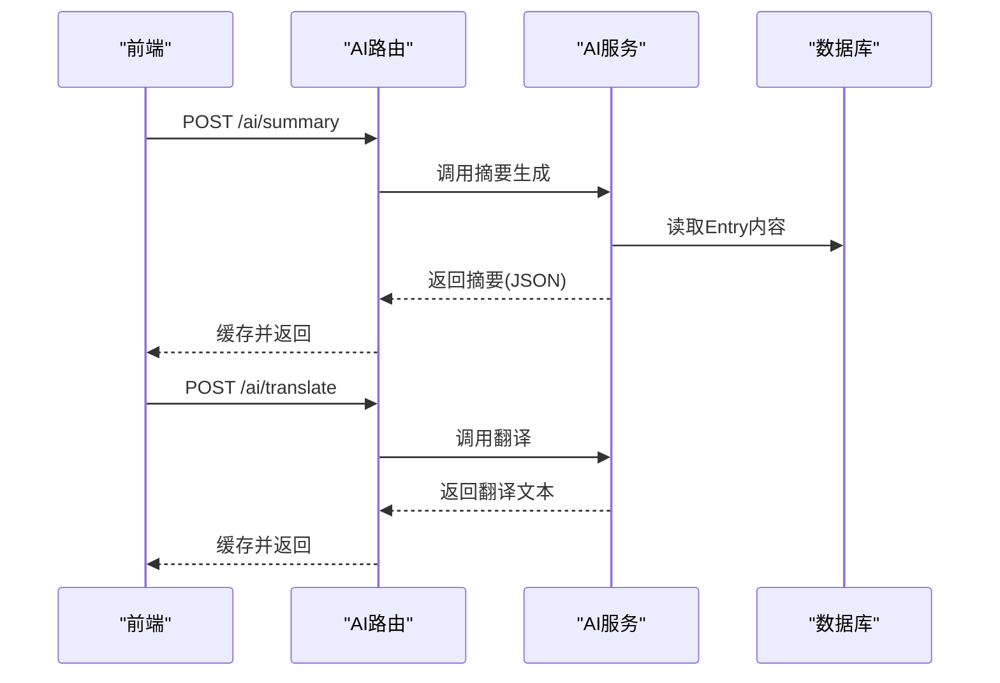
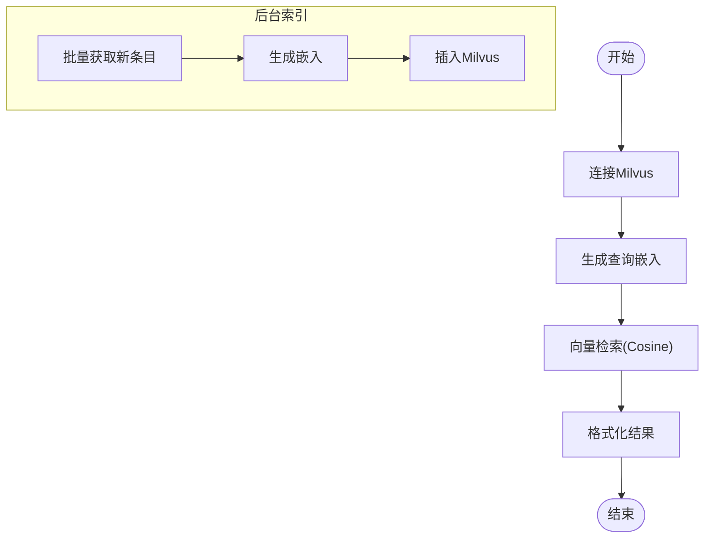
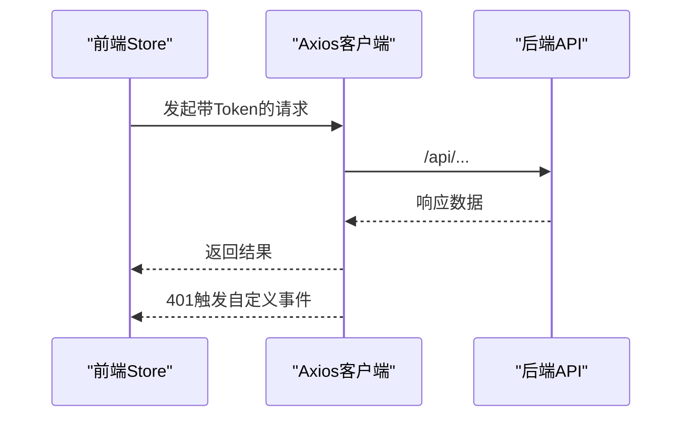
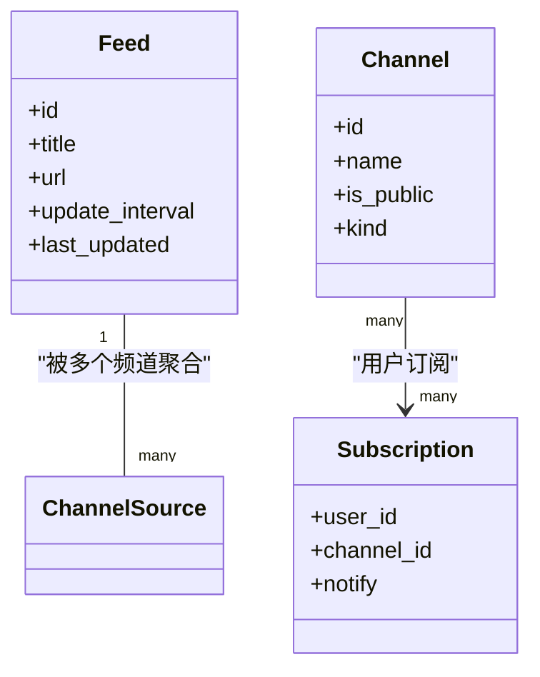
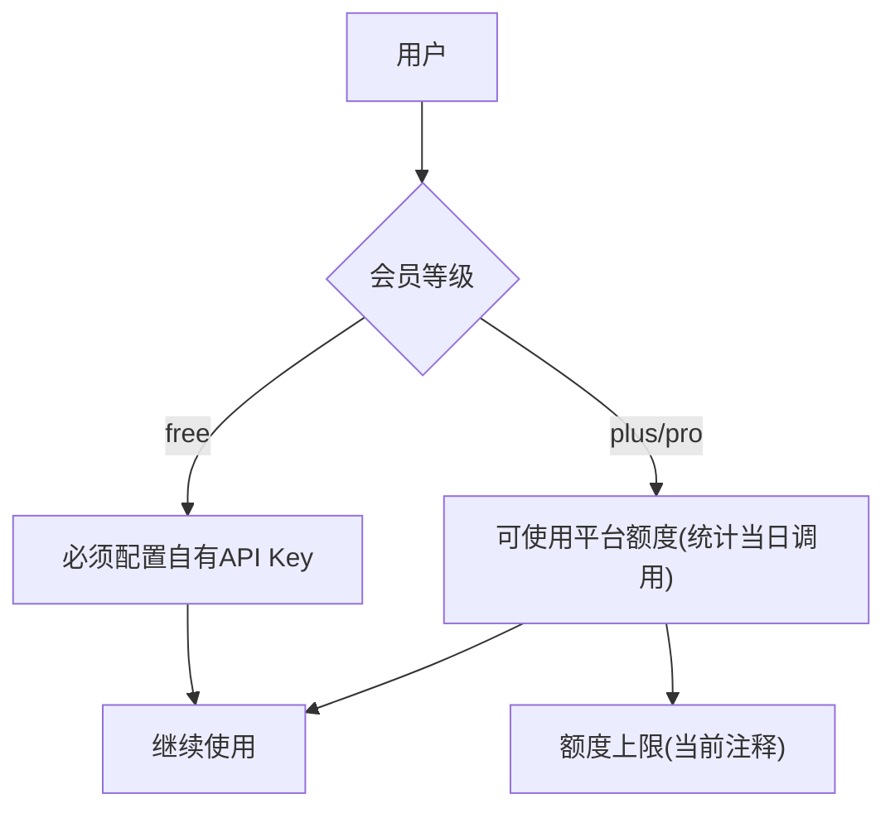
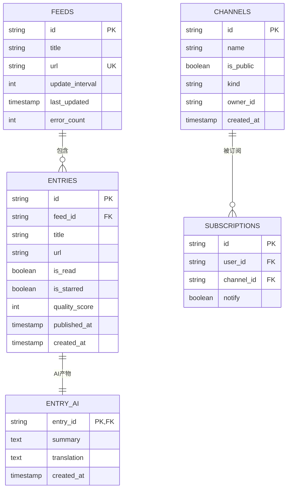
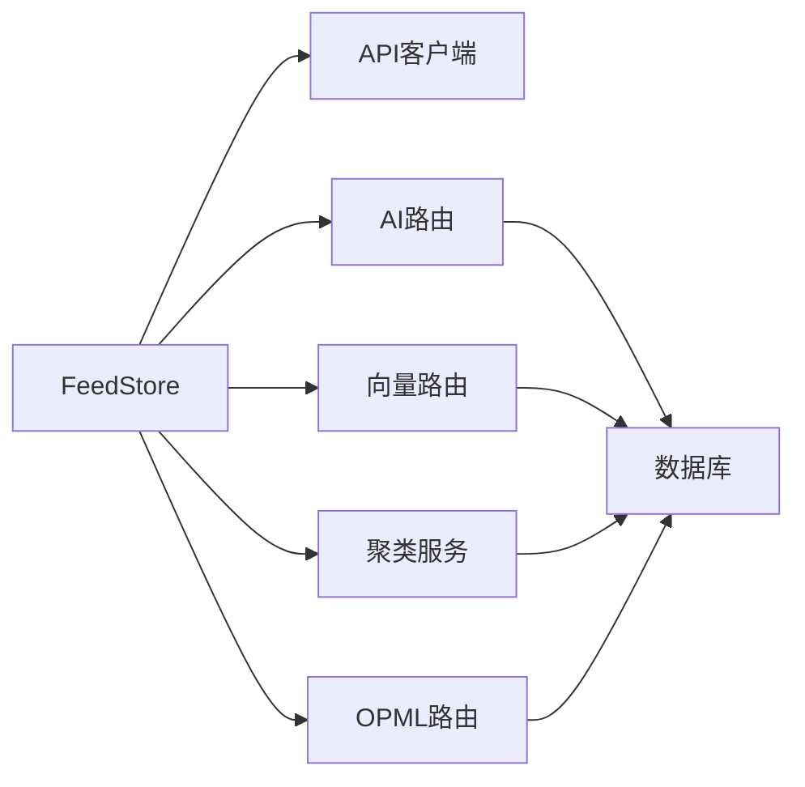

# 核心功能特性

<cite>
**本文引用的文件**
- [python-backend/app/main.py](file://python-backend/app/main.py)
- [python-backend/app/models.py](file://python-backend/app/models.py)
- [python-backend/app/db.py](file://python-backend/app/db.py)
- [python-backend/app/handlers/ai.py](file://python-backend/app/handlers/ai.py)
- [python-backend/app/handlers/vector.py](file://python-backend/app/handlers/vector.py)
- [python-backend/app/handlers/vector_store.py](file://python-backend/app/handlers/vector_store.py)
- [python-backend/app/handlers/clustering.py](file://python-backend/app/handlers/clustering.py)
- [python-backend/app/handlers/membership.py](file://python-backend/app/handlers/membership.py)
- [python-backend/app/handlers/opml.py](file://python-backend/app/handlers/opml.py)
- [python-backend/app/tasks/ai_tasks.py](file://python-backend/app/tasks/ai_tasks.py)
- [rss-desktop/src/api/client.ts](file://rss-desktop/src/api/client.ts)
- [rss-desktop/src/stores/aiStore.ts](file://rss-desktop/src/stores/aiStore.ts)
- [rss-desktop/src/stores/clusteringStore.ts](file://rss-desktop/src/stores/clusteringStore.ts)
- [rss-desktop/src/stores/channelsStore.ts](file://rss-desktop/src/stores/channelsStore.ts)
- [rss-desktop/src/stores/feedStore.ts](file://rss-desktop/src/stores/feedStore.ts)
</cite>

## 目录
1. [引言](#引言)
2. [项目结构](#项目结构)
3. [核心组件](#核心组件)
4. [架构总览](#架构总览)
5. [详细组件分析](#详细组件分析)
6. [依赖分析](#依赖分析)
7. [性能考虑](#性能考虑)
8. [故障排查指南](#故障排查指南)
9. [结论](#结论)
10. [附录](#附录)

## 引言
本文件面向Tan RSS Reader的开发者与用户，系统化梳理其核心功能特性，重点覆盖：
- AI驱动的内容智能处理：智能摘要生成、多语言翻译、内容质量评分
- 向量检索与语义搜索、内容聚类与趋势分析
- 多平台同步：桌面端、移动端、Web端的数据一致性保障
- 个性化策展：基于用户偏好的内容推荐与订阅组织
- 会员体系：差异化功能与服务
- RSS订阅管理、OPML导入导出、频道分类等传统RSS功能的现代化改进
- 具体功能演示与使用场景，帮助快速理解实际价值

## 项目结构
项目采用前后端分离架构：
- 后端：FastAPI + SQLAlchemy（异步）+ Celery任务队列，提供REST API与AI/向量/聚类/会员/OPML等能力
- 前端：Vue 3 + Pinia + Vite（桌面端），Flutter（移动端），以及Web端
- 数据存储：SQLite（本地开发/默认）或外部数据库；Milvus向量数据库用于语义检索

图表来源
- [python-backend/app/main.py:28-62](file://python-backend/app/main.py#L28-L62)
- [python-backend/app/handlers/ai.py:18](file://python-backend/app/handlers/ai.py#L18)
- [python-backend/app/handlers/vector.py:15](file://python-backend/app/handlers/vector.py#L15)
- [python-backend/app/handlers/clustering.py:10](file://python-backend/app/handlers/clustering.py#L10)
- [python-backend/app/handlers/membership.py:12](file://python-backend/app/handlers/membership.py#L12)
- [python-backend/app/handlers/opml.py:13](file://python-backend/app/handlers/opml.py#L13)
- [python-backend/app/tasks/ai_tasks.py:16](file://python-backend/app/tasks/ai_tasks.py#L16)

章节来源
- [python-backend/app/main.py:28-62](file://python-backend/app/main.py#L28-L62)
- [python-backend/app/db.py:1-27](file://python-backend/app/db.py#L1-L27)

## 核心组件
- AI智能处理：摘要生成、翻译、嵌入、趋势分析、质量评分
- 向量检索与聚类：Milvus向量库、DBSCAN聚类、主题提取
- 会员与配额：等级控制、每日调用统计
- 订阅与策展：Feed/Channel/Subscription模型、OPML导入导出
- 前端状态管理：Pinia Store封装API调用、缓存与UI状态

章节来源
- [python-backend/app/models.py:7-228](file://python-backend/app/models.py#L7-L228)
- [python-backend/app/handlers/ai.py:348-504](file://python-backend/app/handlers/ai.py#L348-L504)
- [python-backend/app/handlers/vector_store.py:18-197](file://python-backend/app/handlers/vector_store.py#L18-L197)
- [python-backend/app/handlers/clustering.py:10-142](file://python-backend/app/handlers/clustering.py#L10-L142)
- [python-backend/app/handlers/membership.py:18-57](file://python-backend/app/handlers/membership.py#L18-L57)
- [python-backend/app/handlers/opml.py:43-171](file://python-backend/app/handlers/opml.py#L43-L171)
- [rss-desktop/src/stores/aiStore.ts:61-155](file://rss-desktop/src/stores/aiStore.ts#L61-L155)
- [rss-desktop/src/stores/clusteringStore.ts:49-108](file://rss-desktop/src/stores/clusteringStore.ts#L49-L108)
- [rss-desktop/src/stores/channelsStore.ts:36-362](file://rss-desktop/src/stores/channelsStore.ts#L36-L362)
- [rss-desktop/src/stores/feedStore.ts:7-642](file://rss-desktop/src/stores/feedStore.ts#L7-L642)

## 架构总览
后端通过FastAPI统一暴露REST接口，前端通过Axios客户端发起请求。AI与向量模块通过环境变量与用户配置动态选择服务端点与模型；Celery负责批量质量评分与向量化索引。

图表来源
- [python-backend/app/main.py:44-62](file://python-backend/app/main.py#L44-L62)
- [python-backend/app/handlers/ai.py:616-715](file://python-backend/app/handlers/ai.py#L616-L715)
- [python-backend/app/handlers/vector.py:108-111](file://python-backend/app/handlers/vector.py#L108-L111)
- [python-backend/app/handlers/clustering.py:14-35](file://python-backend/app/handlers/clustering.py#L14-L35)
- [python-backend/app/handlers/opml.py:43-171](file://python-backend/app/handlers/opml.py#L43-L171)

## 详细组件分析

### AI驱动的内容智能处理
- 智能摘要生成
  - 支持结构化JSON输出，包含摘要与关键要点
  - 自动缓存避免重复调用
  - 前端通过Pinia Store封装摘要请求与缓存
- 多语言翻译
  - 支持标题与正文翻译
  - 支持自动标题翻译与全文翻译
  - 前端缓存翻译结果，提升交互体验
- 内容质量评分
  - 后台任务批量评分，支持开关控制
  - 结合会员等级与配额进行调用统计
- 嵌入与趋势分析
  - 通过嵌入模型生成向量，用于语义检索与聚类
  - 基于聚类结果生成趋势分析报告（情感、关键词、摘要）

图表来源
- [python-backend/app/handlers/ai.py:616-715](file://python-backend/app/handlers/ai.py#L616-L715)
- [python-backend/app/handlers/ai.py:717-792](file://python-backend/app/handlers/ai.py#L717-L792)
- [rss-desktop/src/stores/aiStore.ts:61-155](file://rss-desktop/src/stores/aiStore.ts#L61-L155)

章节来源
- [python-backend/app/handlers/ai.py:616-715](file://python-backend/app/handlers/ai.py#L616-L715)
- [python-backend/app/handlers/ai.py:717-792](file://python-backend/app/handlers/ai.py#L717-L792)
- [python-backend/app/tasks/ai_tasks.py:16-51](file://python-backend/app/tasks/ai_tasks.py#L16-L51)
- [rss-desktop/src/stores/aiStore.ts:61-155](file://rss-desktop/src/stores/aiStore.ts#L61-L155)

### 向量检索系统与语义搜索
- Milvus向量存储
  - 动态连接、集合创建与索引构建
  - 支持本地Lite模式与远程实例
- 语义搜索
  - 输入查询文本生成嵌入，Cosine相似度检索
  - 支持按Feed过滤
- 向量索引与后台任务
  - 批量向量化新条目，后台任务异步执行
- 聚类与主题发现
  - DBSCAN聚类、余弦距离、代表性主题提取

图表来源
- [python-backend/app/handlers/vector_store.py:23-91](file://python-backend/app/handlers/vector_store.py#L23-L91)
- [python-backend/app/handlers/vector_store.py:130-178](file://python-backend/app/handlers/vector_store.py#L130-L178)
- [python-backend/app/tasks/ai_tasks.py:53-86](file://python-backend/app/tasks/ai_tasks.py#L53-L86)

章节来源
- [python-backend/app/handlers/vector.py:43-111](file://python-backend/app/handlers/vector.py#L43-L111)
- [python-backend/app/handlers/vector_store.py:18-197](file://python-backend/app/handlers/vector_store.py#L18-L197)
- [python-backend/app/handlers/clustering.py:10-142](file://python-backend/app/handlers/clustering.py#L10-L142)

### 多平台同步机制
- 前端统一通过Axios客户端访问后端API，携带认证Token
- 订阅与条目数据在不同视图（Feed/Channel/分组）下保持一致
- 前端Store维护本地状态与缓存，减少重复请求
- 认证拦截器统一处理401未授权事件，触发登出流程

图表来源
- [rss-desktop/src/api/client.ts:8-26](file://rss-desktop/src/api/client.ts#L8-L26)
- [rss-desktop/src/stores/feedStore.ts:332-403](file://rss-desktop/src/stores/feedStore.ts#L332-L403)

章节来源
- [rss-desktop/src/api/client.ts:1-29](file://rss-desktop/src/api/client.ts#L1-L29)
- [rss-desktop/src/stores/feedStore.ts:7-642](file://rss-desktop/src/stores/feedStore.ts#L7-L642)

### 个性化策展与订阅管理
- 频道与订阅
  - Channel/Subscription模型支持公共/私有频道、标签与分类
  - 用户可订阅/取消订阅，查看我的频道
- 订阅源管理
  - Feed增删改查、分组与未读统计
  - 批量刷新、分组模式与频道模式切换
- OPML导入导出
  - 支持多种格式输入，自动去重与创建单源频道
  - 导出为标准OPML结构

图表来源
- [python-backend/app/models.py:7-228](file://python-backend/app/models.py#L7-L228)

章节来源
- [python-backend/app/models.py:126-228](file://python-backend/app/models.py#L126-L228)
- [python-backend/app/handlers/opml.py:43-171](file://python-backend/app/handlers/opml.py#L43-L171)
- [rss-desktop/src/stores/channelsStore.ts:36-362](file://rss-desktop/src/stores/channelsStore.ts#L36-L362)
- [rss-desktop/src/stores/feedStore.ts:75-403](file://rss-desktop/src/stores/feedStore.ts#L75-L403)

### 会员体系与差异化功能
- 等级与有效期
  - free/plus/pro三档，到期后降级
- 平台额度与配额
  - plus/pro用户可使用平台提供的AI额度，记录当日调用次数
- 免费用户限制
  - 无自有密钥时需升级或自行配置API Key

图表来源
- [python-backend/app/handlers/ai.py:98-171](file://python-backend/app/handlers/ai.py#L98-L171)
- [python-backend/app/handlers/membership.py:28-57](file://python-backend/app/handlers/membership.py#L28-L57)

章节来源
- [python-backend/app/handlers/ai.py:98-171](file://python-backend/app/handlers/ai.py#L98-L171)
- [python-backend/app/handlers/membership.py:18-113](file://python-backend/app/handlers/membership.py#L18-L113)

### 数据模型与表结构
- 关键实体
  - Feed/Entry/EntryAI：RSS源与条目及AI产物
  - Channel/Subscription：频道与订阅关系
  - AIConfigRow/AppSettingsRow/UserMembership/UserUsage：AI配置、应用设置、会员与用量
  - OPML导入涉及Feed/Channel/ChannelSource/Subscription的联动创建
- 字段与约束
  - 外键关联、索引优化（如Entry.dedup_key、Entry.created_at）
  - 时间字段与排序策略（created_at/published_at）

图表来源
- [python-backend/app/models.py:7-228](file://python-backend/app/models.py#L7-L228)

章节来源
- [python-backend/app/models.py:7-228](file://python-backend/app/models.py#L7-L228)

## 依赖分析
- 组件耦合
  - AI模块依赖数据库与外部LLM服务，受会员配置影响
  - 向量模块依赖Milvus与嵌入服务，后台任务解耦索引过程
  - 前端Store通过统一API客户端与后端交互，避免直接耦合具体实现
- 外部依赖
  - Milvus向量数据库、httpx异步HTTP客户端、Celery任务队列
- 循环依赖
  - 当前模块间通过API路由与服务层解耦，未见循环依赖迹象

图表来源
- [rss-desktop/src/stores/feedStore.ts:448-554](file://rss-desktop/src/stores/feedStore.ts#L448-L554)
- [python-backend/app/handlers/vector.py:108-111](file://python-backend/app/handlers/vector.py#L108-L111)
- [python-backend/app/handlers/clustering.py:14-35](file://python-backend/app/handlers/clustering.py#L14-L35)
- [python-backend/app/handlers/opml.py:43-171](file://python-backend/app/handlers/opml.py#L43-L171)

章节来源
- [rss-desktop/src/stores/feedStore.ts:7-642](file://rss-desktop/src/stores/feedStore.ts#L7-L642)
- [python-backend/app/handlers/vector.py:15-111](file://python-backend/app/handlers/vector.py#L15-L111)
- [python-backend/app/handlers/clustering.py:10-142](file://python-backend/app/handlers/clustering.py#L10-L142)
- [python-backend/app/handlers/opml.py:13-171](file://python-backend/app/handlers/opml.py#L13-L171)

## 性能考虑
- 异步与并发
  - 使用httpx异步客户端与async/await，降低IO阻塞
  - 向量检索与聚类使用线程池避免阻塞事件循环
- 批处理与后台任务
  - 批量质量评分与向量化通过Celery后台任务执行，避免请求超时
- 缓存策略
  - 前端Store对摘要/翻译结果进行缓存，减少重复请求
- 向量索引优化
  - Milvus使用IVF_FLAT索引与COSINE度量，nprobe参数可调
- 数据库与索引
  - 为高频查询字段建立索引，如Entry.dedup_key、Entry.created_at

## 故障排查指南
- AI服务不可用/限流
  - 检查AI配置（API Key/Base URL/Model）、网络连通性
  - 观察429重试与错误日志，必要时升级会员等级
- 向量检索异常
  - 确认Milvus连接状态、集合存在与索引加载
  - 检查嵌入维度与模型一致性
- OPML导入失败
  - 确认OPML格式正确，检查重复源与创建单源频道逻辑
- 401未授权
  - 检查Token是否过期或丢失，前端拦截器会触发登出事件

章节来源
- [python-backend/app/handlers/ai.py:173-228](file://python-backend/app/handlers/ai.py#L173-L228)
- [python-backend/app/handlers/vector_store.py:23-54](file://python-backend/app/handlers/vector_store.py#L23-L54)
- [python-backend/app/handlers/opml.py:43-171](file://python-backend/app/handlers/opml.py#L43-L171)
- [rss-desktop/src/api/client.ts:17-26](file://rss-desktop/src/api/client.ts#L17-L26)

## 结论
Tan RSS Reader通过“AI智能处理 + 向量检索与聚类 + 会员差异化 + 订阅策展 + 多平台同步”的组合，实现了从“信息获取”到“智能理解与组织”的全链路升级。后端以FastAPI与Celery构建高可用服务，前端以Pinia Store提供一致的跨端体验。建议在生产环境中：
- 明确AI与向量服务的SLA与容量规划
- 完善监控与告警（AI调用、Milvus健康、Celery队列积压）
- 优化前端缓存策略与离线体验
- 加强OPML导入的校验与回滚机制

## 附录
- 使用场景示例
  - 快速理解长文：点击“生成摘要”，自动缓存摘要与关键要点
  - 多语言阅读：选择目标语言，自动翻译标题与正文
  - 语义检索：在搜索框输入问题或关键词，获得最相关条目
  - 聚类分析：对近期热点话题进行聚类，查看趋势与关键词
  - 订阅管理：通过OPML一键导入，按频道/分组组织内容
  - 会员权益：升级后享受平台额度与更高限额