# 项目介绍与愿景

<cite>
**本文档引用的文件**
- [todo.md](file://todo.md)
- [todo_vip.md](file://todo_vip.md)
- [requirements.txt](file://python-backend/requirements.txt)
- [package.json](file://rss-desktop/package.json)
- [pubspec.yaml](file://tan_rss_mobile/pubspec.yaml)
- [main.py](file://python-backend/app/main.py)
- [models.py](file://python-backend/app/models.py)
- [ai.py](file://python-backend/app/handlers/ai.py)
- [membership.py](file://python-backend/app/handlers/membership.py)
- [prompts.py](file://python-backend/app/handlers/prompts.py)
- [ai_tasks.py](file://python-backend/app/tasks/ai_tasks.py)
- [aiStore.ts](file://rss-desktop/src/stores/aiStore.ts)
- [AppHome.vue](file://rss-desktop/src/views/AppHome.vue)
</cite>

## 目录
1. [引言](#引言)
2. [项目结构](#项目结构)
3. [核心组件](#核心组件)
4. [架构概览](#架构概览)
5. [详细组件分析](#详细组件分析)
6. [依赖关系分析](#依赖关系分析)
7. [性能考虑](#性能考虑)
8. [故障排除指南](#故障排除指南)
9. [结论](#结论)
10. [附录](#附录)

## 引言

Tan RSS Reader 是一个致力于重新定义信息获取和消费方式的AI驱动型RSS阅读应用。该项目的核心使命是通过人工智能技术解决传统RSS阅读器面临的"未读焦虑"问题，为用户提供智能化、个性化的信息消费体验。

### 项目愿景

**打造AI编辑部模式的智能RSS阅读体验**，通过以下核心理念实现：

- **固定篇幅输出**：信息源不再是用户的"待读列表"，而是AI的"线人网络"
- **智能策展**：源越多 → 筛选池越大 → AI挑出的内容质量越高
- **个性化消费**：用户每天阅读的篇幅保持不变（如每天10-15条精选）

### 发展历程

项目从传统RSS阅读器起步，逐步演进为AI驱动的信息消费平台。核心发展历程包括：

1. **基础RSS阅读器阶段**：提供基本的RSS订阅和阅读功能
2. **AI集成阶段**：引入AI摘要、翻译、质量评分等智能功能
3. **商业化转型阶段**：构建会员体系，实现可持续发展模式

### 设计理念

- **用户中心**：解决用户"未读焦虑"的根本问题
- **AI赋能**：利用人工智能技术提升信息筛选和消费效率
- **个性化定制**：支持用户级别的AI配置和功能定制
- **开放生态**：提供Source Packs等分享和推荐机制

### 未来愿景

成为信息时代的智能信息管家，帮助用户从海量信息中筛选有价值的内容，提供真正个性化的信息消费体验。

## 项目结构

Tan RSS Reader采用现代化的全栈架构，包含桌面端、移动端和后端服务三个主要部分：

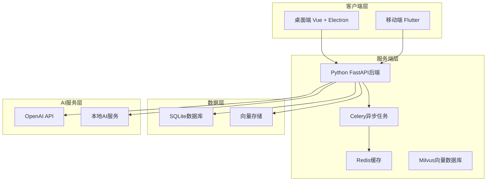

**图表来源**
- [main.py:1-103](file://python-backend/app/main.py#L1-L103)
- [requirements.txt:1-18](file://python-backend/requirements.txt#L1-L18)

### 技术栈概览

**后端技术栈**：
- Python 3.11+ with FastAPI
- SQLAlchemy ORM
- Celery + Redis 异步任务
- Milvus 向量数据库
- APScheduler 定时任务

**前端技术栈**：
- Vue 3 + TypeScript
- Pinia 状态管理
- Electron 跨平台桌面应用
- Flutter 移动端应用

**AI集成**：
- OpenAI API 集成
- 本地AI服务支持
- 向量相似度检索
- 文章质量评分

**章节来源**
- [package.json:1-81](file://rss-desktop/package.json#L1-L81)
- [pubspec.yaml:1-112](file://tan_rss_mobile/pubspec.yaml#L1-L112)
- [requirements.txt:1-18](file://python-backend/requirements.txt#L1-L18)

## 核心组件

### AI智能引擎

AI智能引擎是项目的核心组件，负责处理各种AI相关的功能：

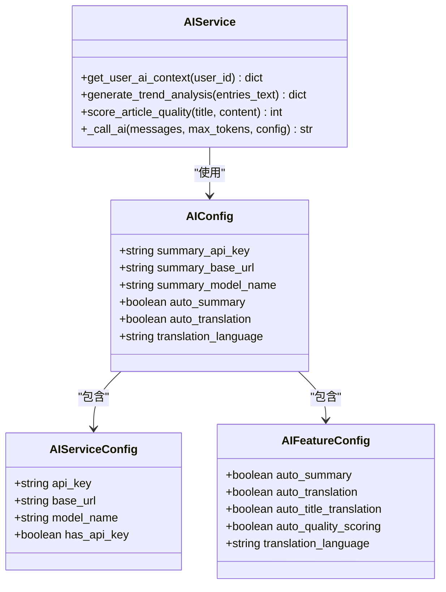

**图表来源**
- [ai.py:66-83](file://python-backend/app/handlers/ai.py#L66-L83)
- [models.py:98-125](file://python-backend/app/models.py#L98-L125)

### 会员管理体系

会员体系是项目商业化的重要组成部分：

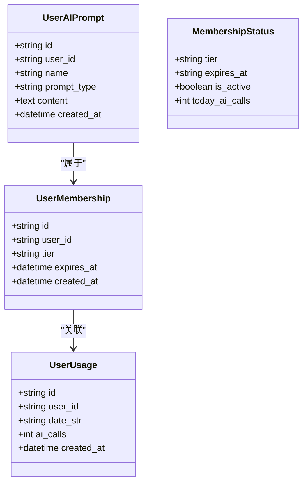

**图表来源**
- [models.py:179-206](file://python-backend/app/models.py#L179-L206)
- [membership.py:18-23](file://python-backend/app/handlers/membership.py#L18-L23)

### 数据模型架构

项目采用清晰的数据模型设计，支持复杂的RSS阅读场景：

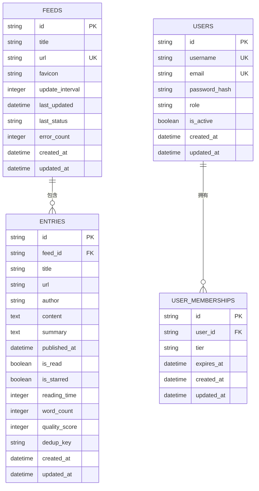

**图表来源**
- [models.py:7-228](file://python-backend/app/models.py#L7-L228)

**章节来源**
- [models.py:1-228](file://python-backend/app/models.py#L1-L228)
- [ai.py:1-800](file://python-backend/app/handlers/ai.py#L1-L800)
- [membership.py:1-113](file://python-backend/app/handlers/membership.py#L1-L113)

## 架构概览

### 整体架构设计

Tan RSS Reader采用分层架构设计，确保系统的可扩展性和可维护性：

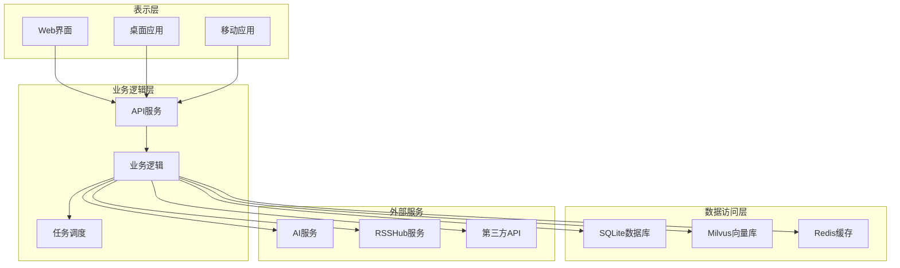

**图表来源**
- [main.py:28-62](file://python-backend/app/main.py#L28-L62)
- [ai.py:1-800](file://python-backend/app/handlers/ai.py#L1-L800)

### AI工作流架构

AI功能通过专门的工作流处理，确保高效和可靠的AI服务：

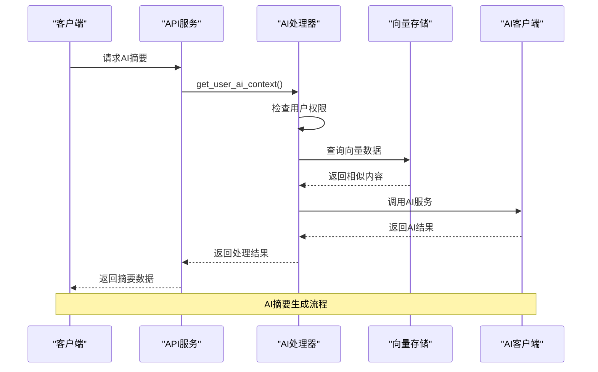

**图表来源**
- [ai.py:98-171](file://python-backend/app/handlers/ai.py#L98-L171)
- [ai_tasks.py:16-51](file://python-backend/app/tasks/ai_tasks.py#L16-L51)

**章节来源**
- [main.py:1-103](file://python-backend/app/main.py#L1-L103)
- [ai.py:1-800](file://python-backend/app/handlers/ai.py#L1-L800)
- [ai_tasks.py:1-87](file://python-backend/app/tasks/ai_tasks.py#L1-L87)

## 详细组件分析

### AI配置管理系统

AI配置管理系统实现了用户级配置分离，支持灵活的AI服务配置：

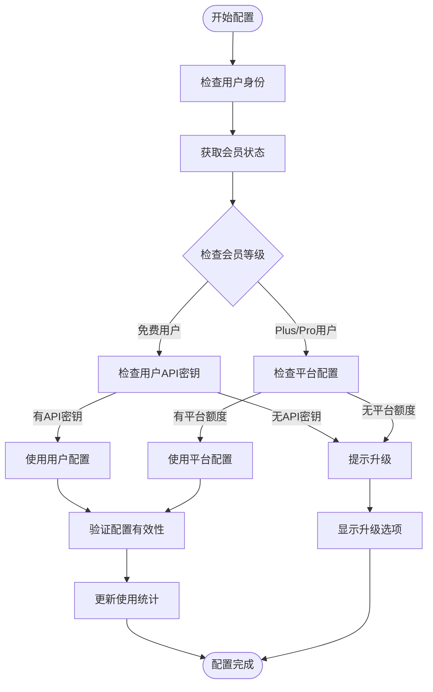

**图表来源**
- [ai.py:98-171](file://python-backend/app/handlers/ai.py#L98-L171)
- [membership.py:28-57](file://python-backend/app/handlers/membership.py#L28-L57)

#### 配置存储结构

系统采用双重配置存储机制：

1. **系统级配置** (`AIConfigRow`)
   - 存储默认AI服务配置
   - 支持管理员全局配置
   - 提供平台级AI服务访问

2. **用户级配置** (`UserAIConfigRow`)
   - 存储用户个人AI配置
   - 支持用户自定义API密钥
   - 实现配置隔离和安全

**章节来源**
- [ai.py:506-596](file://python-backend/app/handlers/ai.py#L506-L596)
- [models.py:98-125](file://python-backend/app/models.py#L98-L125)

### 会员体系设计

会员体系采用两级架构，支持不同的AI服务访问权限：

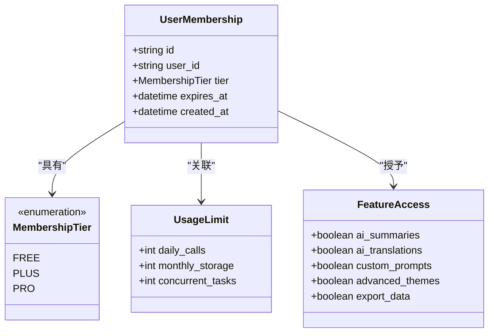

**图表来源**
- [models.py:179-187](file://python-backend/app/models.py#L179-L187)
- [todo_vip.md:8-15](file://todo_vip.md#L8-L15)

#### 会员特权矩阵

| 功能特性 | 免费用户 | Plus会员 | Pro会员 |
|---------|---------|---------|--------|
| AI摘要生成 | ❌ | ✅ | ✅ |
| AI内容翻译 | ❌ | ✅ | ✅ |
| 自定义AI指令 | ❌ | ✅ | ✅ |
| 高级主题定制 | ❌ | ✅ | ✅ |
| 向量搜索 | ❌ | ✅ | ✅ |
| 批量处理 | ❌ | ✅ | ✅ |
| 优先技术支持 | ❌ | ❌ | ✅ |

**章节来源**
- [todo_vip.md:1-31](file://todo_vip.md#L1-L31)
- [membership.py:1-113](file://python-backend/app/handlers/membership.py#L1-L113)

### AI工作流处理

AI工作流通过Celery异步任务实现，支持大规模AI处理：

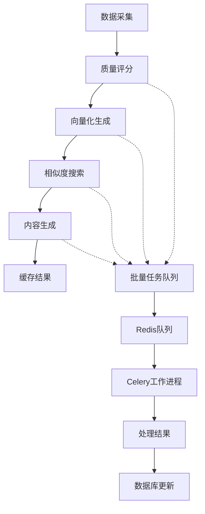

**图表来源**
- [ai_tasks.py:16-87](file://python-backend/app/tasks/ai_tasks.py#L16-L87)

#### 异步任务类型

1. **批量质量评分** (`batch_quality_scoring_task`)
   - 自动为新文章评分质量
   - 支持批量处理提高效率

2. **向量化处理** (`vectorize_entries_task`)
   - 生成文章向量表示
   - 支持相似内容检索

**章节来源**
- [ai_tasks.py:1-87](file://python-backend/app/tasks/ai_tasks.py#L1-L87)

### 前端AI集成

前端通过Pinia状态管理和API交互实现AI功能集成：

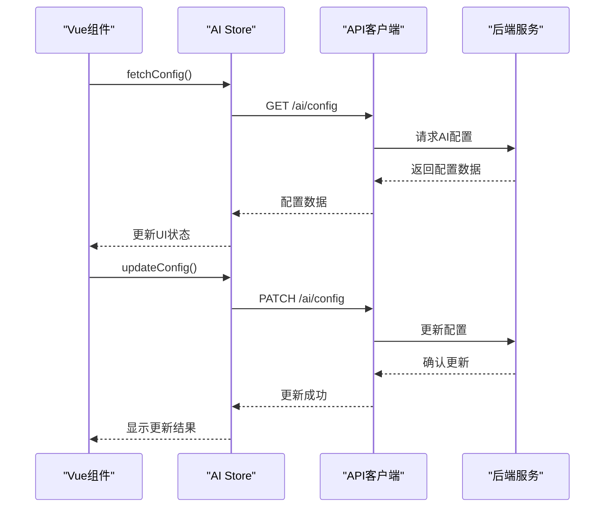

**图表来源**
- [aiStore.ts:67-99](file://rss-desktop/src/stores/aiStore.ts#L67-L99)
- [AppHome.vue:690-705](file://rss-desktop/src/views/AppHome.vue#L690-L705)

**章节来源**
- [aiStore.ts:1-156](file://rss-desktop/src/stores/aiStore.ts#L1-L156)
- [AppHome.vue:1-800](file://rss-desktop/src/views/AppHome.vue#L1-L800)

## 依赖关系分析

### 外部依赖管理

项目采用严格的依赖管理策略，确保系统的稳定性和安全性：

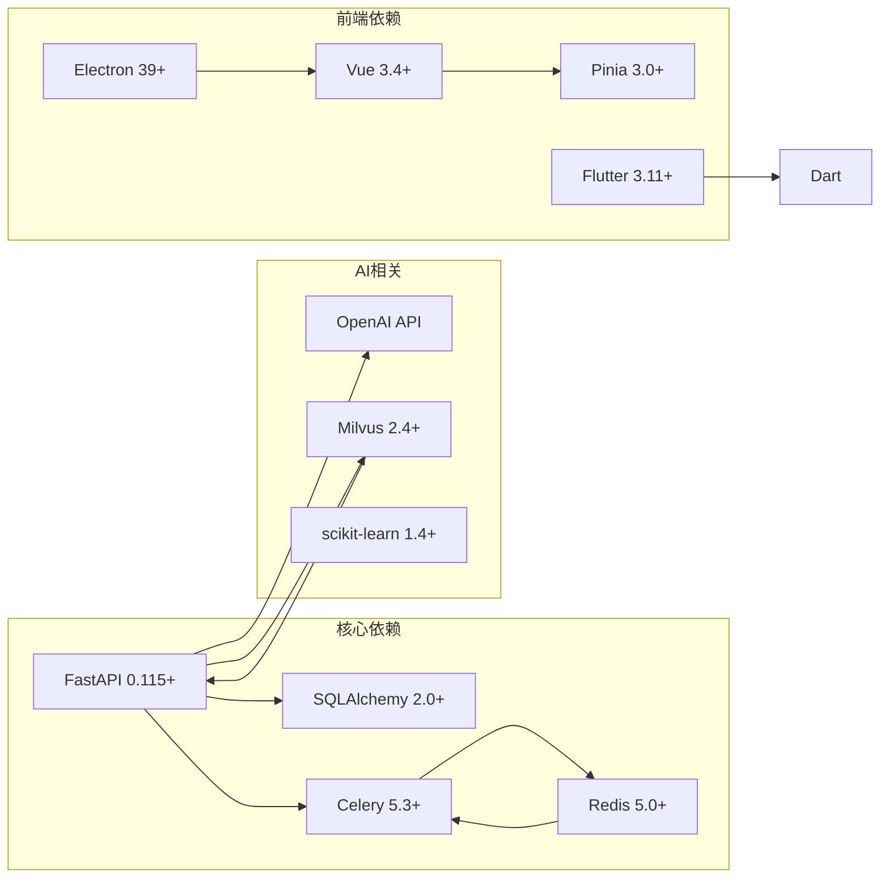

**图表来源**
- [requirements.txt:1-18](file://python-backend/requirements.txt#L1-L18)
- [package.json:55-67](file://rss-desktop/package.json#L55-L67)
- [pubspec.yaml:30-51](file://tan_rss_mobile/pubspec.yaml#L30-L51)

### 内部模块依赖

内部模块之间遵循清晰的依赖层次：

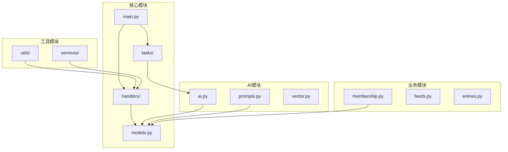

**图表来源**
- [main.py:1-103](file://python-backend/app/main.py#L1-L103)
- [ai.py:1-800](file://python-backend/app/handlers/ai.py#L1-L800)

**章节来源**
- [requirements.txt:1-18](file://python-backend/requirements.txt#L1-L18)
- [main.py:1-103](file://python-backend/app/main.py#L1-L103)

## 性能考虑

### AI服务性能优化

项目在AI服务方面采用了多项性能优化策略：

1. **异步处理**：使用Celery实现AI任务的异步执行
2. **缓存机制**：Redis缓存常用AI结果
3. **批量处理**：支持批量质量评分和向量化处理
4. **连接池管理**：优化AI服务连接复用

### 数据库性能优化

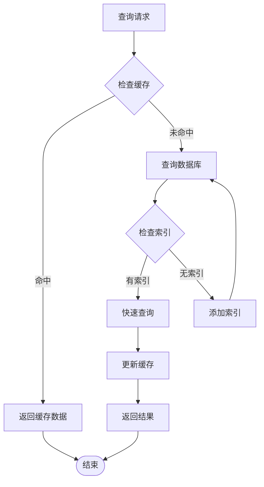

**图表来源**
- [models.py:37-38](file://python-backend/app/models.py#L37-L38)

### 前端性能优化

前端应用采用多种性能优化技术：

1. **虚拟滚动**：处理大量文章列表
2. **懒加载**：延迟加载非关键资源
3. **状态缓存**：缓存用户设置和配置
4. **并发控制**：限制同时进行的AI请求

## 故障排除指南

### 常见问题诊断

#### AI服务连接问题

**症状**：AI摘要或翻译功能无法使用

**诊断步骤**：
1. 检查AI配置是否正确设置
2. 验证API密钥的有效性
3. 确认AI服务的可用性
4. 查看网络连接状态

**解决方案**：
- 更新正确的API密钥
- 检查网络防火墙设置
- 验证AI服务端点可达性

#### 会员权限问题

**症状**：无法访问Plus或Pro功能

**诊断步骤**：
1. 检查会员状态是否有效
2. 验证订阅是否过期
3. 确认功能权限分配

**解决方案**：
- 更新或续费会员订阅
- 联系客服解决权限问题

#### 数据库连接问题

**症状**：应用启动失败或数据访问异常

**诊断步骤**：
1. 检查数据库文件完整性
2. 验证数据库连接参数
3. 查看数据库锁定状态

**解决方案**：
- 重启数据库服务
- 检查磁盘空间
- 修复损坏的数据库文件

**章节来源**
- [ai.py:598-615](file://python-backend/app/handlers/ai.py#L598-L615)
- [membership.py:28-57](file://python-backend/app/handlers/membership.py#L28-L57)

## 结论

Tan RSS Reader项目代表了RSS阅读器发展的新方向，通过AI技术的深度集成，真正解决了用户在信息过载时代的痛点问题。

### 核心价值

1. **解决根本问题**：通过"AI编辑部"模式消除"未读焦虑"
2. **提升信息质量**：AI智能筛选确保用户接触高质量内容
3. **个性化体验**：用户级配置实现真正的个性化定制
4. **可持续发展**：完善的会员体系确保项目长期运营

### 技术优势

- **架构先进**：采用微服务和异步处理架构
- **扩展性强**：模块化设计支持功能快速扩展
- **性能优异**：多层缓存和优化策略确保响应速度
- **安全可靠**：完善的权限控制和数据保护机制

### 发展前景

Tan RSS Reader项目具备成为信息消费领域领导者的潜力，通过持续的技术创新和商业模式优化，将为用户带来更加智能、便捷的信息消费体验。

## 附录

### 快速开始指南

1. **环境准备**：确保Python 3.11+和Node.js 18+
2. **安装依赖**：运行`pip install -r requirements.txt`
3. **启动服务**：执行`uvicorn app.main:app --reload`
4. **访问应用**：打开浏览器访问`http://localhost:8000`

### 开发规范

- 遵循PEP 8编码规范
- 使用TypeScript进行前端开发
- 实施单元测试和集成测试
- 采用Git工作流进行版本控制

### 社区贡献

欢迎社区贡献者参与项目开发，包括但不限于：
- 新功能开发
- Bug修复
- 文档改进
- 翻译贡献