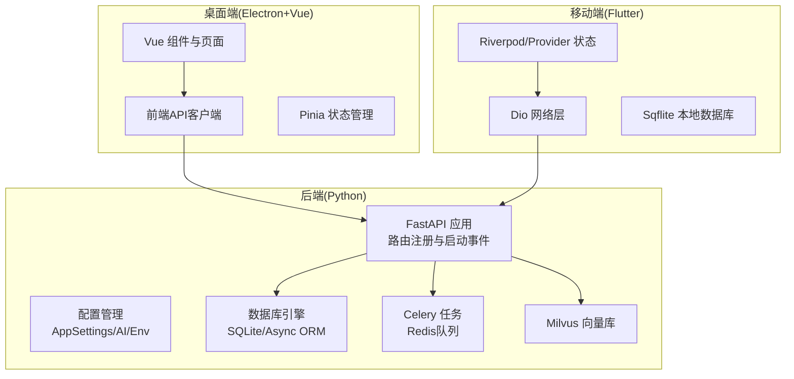
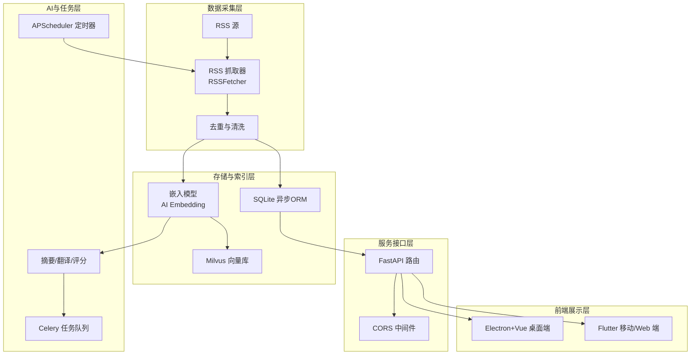
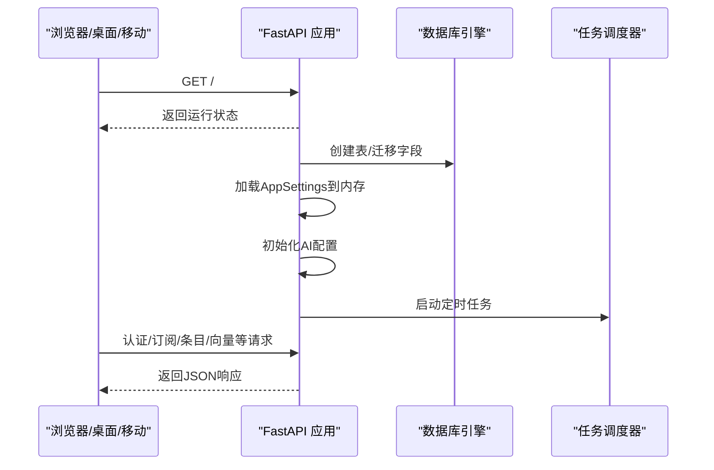
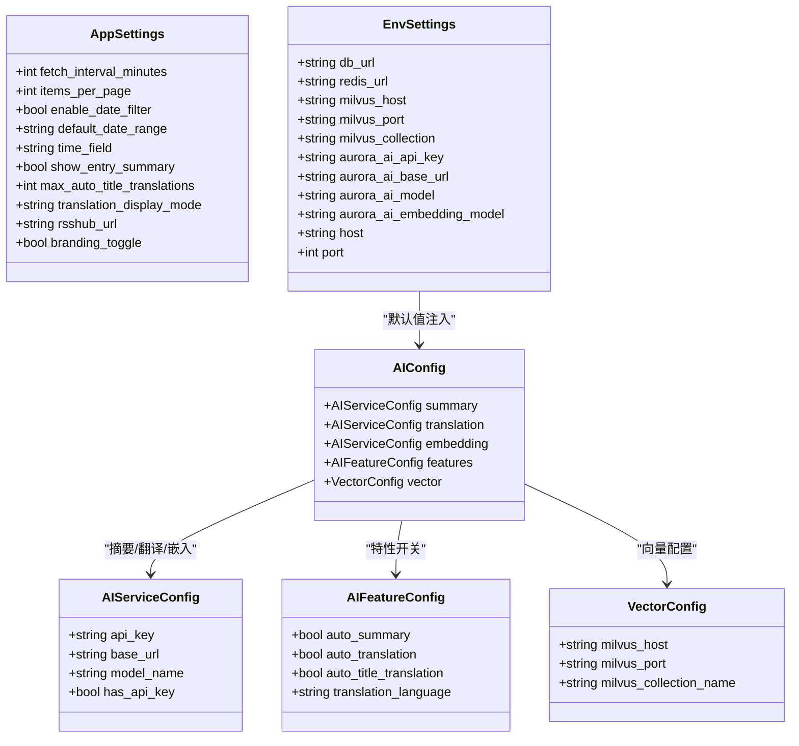
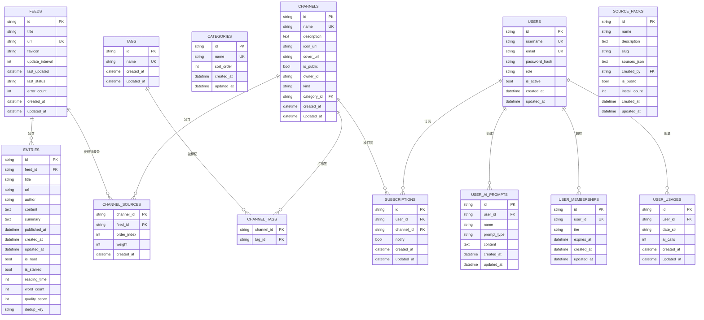
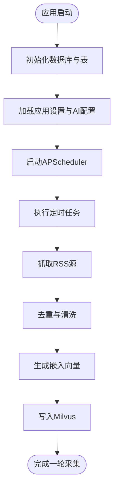
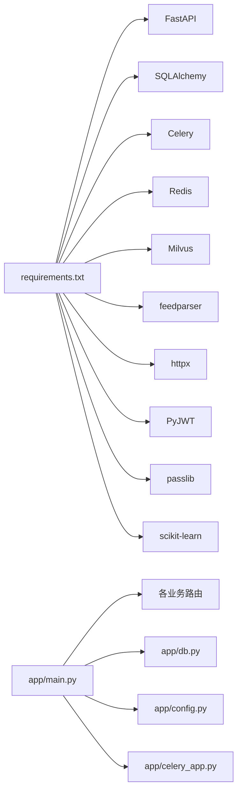

# 项目概述

<cite>
**本文引用的文件**
- [python-backend/app/main.py](file://python-backend/app/main.py)
- [python-backend/app/config.py](file://python-backend/app/config.py)
- [python-backend/app/db.py](file://python-backend/app/db.py)
- [python-backend/app/models.py](file://python-backend/app/models.py)
- [python-backend/app/celery_app.py](file://python-backend/app/celery_app.py)
- [python-backend/requirements.txt](file://python-backend/requirements.txt)
- [rss-desktop/package.json](file://rss-desktop/package.json)
- [tan_rss_mobile/pubspec.yaml](file://tan_rss_mobile/pubspec.yaml)
- [todo.md](file://todo.md)
- [todo_vip.md](file://todo_vip.md)
</cite>

## 目录
1. [引言](#引言)
2. [项目结构](#项目结构)
3. [核心组件](#核心组件)
4. [架构总览](#架构总览)
5. [详细组件分析](#详细组件分析)
6. [依赖关系分析](#依赖关系分析)
7. [性能考量](#性能考量)
8. [故障排查指南](#故障排查指南)
9. [结论](#结论)
10. [附录](#附录)

## 引言
Tan RSS Reader 是一个以“AI编辑部”为核心理念的跨平台 RSS 阅读器，致力于解决传统 RSS 的“未读焦虑”，通过智能聚合、AI摘要生成、向量检索与个性化策展，将海量信息源转化为用户每日固定的高质量阅读体验。项目采用前后端分离架构，后端基于 Python/FastAPI，前端覆盖 Electron+Vue（桌面端）、Flutter（移动端/Web），并内置 Celery 任务队列与 Milvus 向量数据库，形成“采集-清洗-向量化-检索-摘要-翻译”的完整闭环。

本项目的主要价值主张包括：
- 智能内容聚合：以“频道/主题”组织订阅源，支持来源打包与公共推荐。
- AI摘要与翻译：自动对条目进行摘要、标题翻译与全文翻译，支持多语言与显示模式切换。
- 向量检索与个性化策展：基于 Milvus 的向量索引，实现语义检索与相似内容推荐。
- 商业化会员体系：用户级AI配置分离，支持Plus/Pro会员分级与特权管理。

发展历程与定位：
- 当前版本已具备基础采集、条目管理、频道/分类/tag组织、OPML导入导出、代理与图标缓存等能力。
- 规划中的“AI编辑部”模式强调“固定篇幅输出”，通过AI每日简报与“收藏即深度解读”提升信息密度与质量。
- 会员体系将实现用户级AI配置隔离、自定义提示词、高级主题与使用配额管理。

## 项目结构
项目采用多仓库/多工程并行的组织方式：
- 后端（Python/FastAPI）：提供REST API、定时任务调度、AI与向量处理、数据库与Celery队列。
- 桌面端（Electron+Vue）：桌面应用与Web预览，负责UI交互、状态管理与本地资源。
- 移动端（Flutter）：跨平台移动客户端，支持Android/iOS/Web，负责离线缓存与本地数据库。
- 工作流与脚本：GitHub Actions、启动脚本与向量化工具。

图表来源
- [python-backend/app/main.py:28-62](file://python-backend/app/main.py#L28-L62)
- [python-backend/app/config.py:41-75](file://python-backend/app/config.py#L41-L75)
- [python-backend/app/db.py:24-25](file://python-backend/app/db.py#L24-L25)
- [python-backend/app/celery_app.py:7-22](file://python-backend/app/celery_app.py#L7-L22)
- [rss-desktop/package.json:41-54](file://rss-desktop/package.json#L41-L54)
- [tan_rss_mobile/pubspec.yaml:30-51](file://tan_rss_mobile/pubspec.yaml#L30-L51)

章节来源
- [python-backend/app/main.py:1-103](file://python-backend/app/main.py#L1-L103)
- [python-backend/app/config.py:1-75](file://python-backend/app/config.py#L1-L75)
- [python-backend/app/db.py:1-27](file://python-backend/app/db.py#L1-L27)
- [python-backend/app/celery_app.py:1-23](file://python-backend/app/celery_app.py#L1-L23)
- [rss-desktop/package.json:1-81](file://rss-desktop/package.json#L1-L81)
- [tan_rss_mobile/pubspec.yaml:1-112](file://tan_rss_mobile/pubspec.yaml#L1-L112)

## 核心组件
- 后端API与路由：集中注册各类业务路由（认证、订阅、频道、条目、AI、向量、OPML、设置等），统一CORS策略，启动时初始化数据库、AI配置与任务调度器。
- 配置系统：AppSettings（应用参数）、AIConfig（摘要/翻译/嵌入服务）、EnvSettings（外部服务地址/密钥/默认AI服务）、VectorConfig（Milvus连接参数）。
- 数据模型：涵盖Feed/Entry/Channel/Category/Tag/Subscription/User/UserMembership/UserUsage/UserAIPrompt/SourcePack等，支撑订阅管理、用户体系、向量化与会员统计。
- 数据库与引擎：异步SQLAlchemy引擎，默认SQLite，支持自定义DB URL；启动时自动建表与字段迁移。
- 任务系统：Celery基于Redis，包含AI任务模块，支持任务序列化、时区与超时控制。
- 桌面端：Vite+Vue3+Pinia+Vue Router，提供登录、频道、文章阅读、设置、AI摘要等界面。
- 移动端：Flutter生态，使用dio网络、shared_preferences、sqflite、riverpod/provider等，适配多端。

章节来源
- [python-backend/app/main.py:44-62](file://python-backend/app/main.py#L44-L62)
- [python-backend/app/config.py:5-40](file://python-backend/app/config.py#L5-L40)
- [python-backend/app/models.py:7-228](file://python-backend/app/models.py#L7-L228)
- [python-backend/app/db.py:11-25](file://python-backend/app/db.py#L11-L25)
- [python-backend/app/celery_app.py:1-23](file://python-backend/app/celery_app.py#L1-L23)
- [rss-desktop/package.json:55-66](file://rss-desktop/package.json#L55-L66)
- [tan_rss_mobile/pubspec.yaml:30-51](file://tan_rss_mobile/pubspec.yaml#L30-L51)

## 架构总览
整体架构围绕“采集-清洗-向量化-检索-摘要-翻译-展示”闭环展开，后端提供统一API与任务调度，前端负责多端展示与交互。

图表来源
- [python-backend/app/main.py:64-98](file://python-backend/app/main.py#L64-L98)
- [python-backend/app/models.py:21-38](file://python-backend/app/models.py#L21-L38)
- [python-backend/app/config.py:17-39](file://python-backend/app/config.py#L17-L39)
- [python-backend/app/celery_app.py:7-22](file://python-backend/app/celery_app.py#L7-L22)
- [rss-desktop/package.json:41-54](file://rss-desktop/package.json#L41-L54)
- [tan_rss_mobile/pubspec.yaml:30-51](file://tan_rss_mobile/pubspec.yaml#L30-L51)

## 详细组件分析

### 后端API与启动流程
- 路由注册：统一在根路径下挂载各业务模块路由，便于集中管理与扩展。
- 启动事件：创建数据库表、尝试迁移字段、加载应用设置到内存、初始化AI配置、启动任务调度器。
- 关闭事件：停止任务调度器，保证优雅退出。

图表来源
- [python-backend/app/main.py:40-98](file://python-backend/app/main.py#L40-L98)

章节来源
- [python-backend/app/main.py:28-103](file://python-backend/app/main.py#L28-L103)

### 配置系统与环境变量
- AppSettings：控制采集间隔、分页大小、日期筛选、默认时间字段、摘要显示、最大自动标题翻译数、翻译显示模式、RSSHub默认地址等。
- AIConfig：分别管理摘要、翻译、嵌入服务的API Key、Base URL与模型名，以及特性开关（自动摘要/翻译/标题翻译/自动质量评分/翻译语言）与向量配置。
- EnvSettings：从.env或环境变量加载数据库URL、Redis/Milvus连接参数、默认AI服务地址与模型、后端监听地址与端口。

图表来源
- [python-backend/app/config.py:5-75](file://python-backend/app/config.py#L5-L75)

章节来源
- [python-backend/app/config.py:1-75](file://python-backend/app/config.py#L1-L75)

### 数据模型与关系
- 核心实体：Feed（订阅源）、Entry（条目）、EntryAI（条目AI结果）、Channel/Category/Tag/ChannelTag（频道/分类/tag关联）、ChannelSource（频道与订阅源绑定）、Subscription（用户订阅）、User/UserMembership/UserUsage/UserAIPrompt（用户与会员/用量/提示词）、SourcePack（来源打包）。
- 关键字段：条目包含阅读状态、收藏、字数、阅读时长、质量评分、去重键；频道支持公开/私有、拥有者、类型与分类；用户会员包含等级与到期时间；用量按日统计。

图表来源
- [python-backend/app/models.py:7-228](file://python-backend/app/models.py#L7-L228)

章节来源
- [python-backend/app/models.py:1-228](file://python-backend/app/models.py#L1-L228)

### 任务与调度
- Celery：基于Redis作为Broker/Backend，启用JSON序列化与UTC时区，开启任务跟踪与超时控制，包含AI任务模块。
- APScheduler：在启动事件中启动定时器，用于周期性任务（如RSS抓取、向量更新、每日简报等）。

图表来源
- [python-backend/app/main.py:64-98](file://python-backend/app/main.py#L64-L98)
- [python-backend/app/celery_app.py:7-22](file://python-backend/app/celery_app.py#L7-L22)

章节来源
- [python-backend/app/main.py:64-103](file://python-backend/app/main.py#L64-L103)
- [python-backend/app/celery_app.py:1-23](file://python-backend/app/celery_app.py#L1-L23)

### 桌面端与移动端集成
- 桌面端：使用Vite+Vue3+Pinia+Router，提供登录、频道、文章阅读、设置、AI摘要等页面；脚本支持开发、构建与打包。
- 移动端：Flutter生态，使用dio进行HTTP请求，shared_preferences与sqflite进行本地持久化，provider/riverpod进行状态管理；支持多端图标与资源。

章节来源
- [rss-desktop/package.json:41-81](file://rss-desktop/package.json#L41-L81)
- [tan_rss_mobile/pubspec.yaml:30-112](file://tan_rss_mobile/pubspec.yaml#L30-L112)

## 依赖关系分析
- 外部依赖：FastAPI、SQLAlchemy、Celery、Redis、Milvus、feedparser、httpx、PyJWT、passlib、scikit-learn等。
- 内部模块：路由模块化、配置集中化、数据库异步化、任务队列化、向量索引化。

图表来源
- [python-backend/requirements.txt:1-18](file://python-backend/requirements.txt#L1-L18)
- [python-backend/app/main.py:1-27](file://python-backend/app/main.py#L1-L27)
- [python-backend/app/db.py:1-27](file://python-backend/app/db.py#L1-L27)
- [python-backend/app/config.py:1-75](file://python-backend/app/config.py#L1-L75)
- [python-backend/app/celery_app.py:1-23](file://python-backend/app/celery_app.py#L1-L23)

章节来源
- [python-backend/requirements.txt:1-18](file://python-backend/requirements.txt#L1-L18)
- [python-backend/app/main.py:1-27](file://python-backend/app/main.py#L1-L27)

## 性能考量
- 数据库：使用异步SQLAlchemy与SQLite，适合中小规模数据；建议在生产环境评估迁移到PostgreSQL/MySQL并启用连接池。
- 向量检索：Milvus提供高效相似度检索；建议合理设置集合名称、分区与索引参数，避免大规模全表扫描。
- 任务队列：Celery基于Redis，注意队列长度与任务超时；对耗时任务（如批量摘要/翻译）应拆分批次并设置重试。
- 网络与解析：feedparser与httpx组合解析与抓取，建议设置合理的超时与重试策略，避免阻塞主进程。
- 前端渲染：Vue3/Pinia在桌面端表现良好；移动端需关注图片懒加载与HTML渲染性能。

## 故障排查指南
- 后端无法启动
  - 检查数据库URL与数据目录权限；确认SQLite文件可创建。
  - 确认Redis/Milvus可达且配置正确。
- API跨域问题
  - 确认CORS中间件已启用并允许来源。
- 采集失败
  - 查看Feed错误计数与最后状态；检查RSSHub可用性与网络代理。
- 向量检索异常
  - 确认Milvus集合存在且字段映射正确；检查嵌入模型服务连通性。
- 会员与AI配置
  - 用户级AI配置需单独初始化；检查UserMembership与UserUsage记录是否正确。

章节来源
- [python-backend/app/main.py:30-36](file://python-backend/app/main.py#L30-L36)
- [python-backend/app/db.py:11-25](file://python-backend/app/db.py#L11-L25)
- [python-backend/app/config.py:46-65](file://python-backend/app/config.py#L46-L65)

## 结论
Tan RSS Reader 以“AI编辑部”理念重构RSS阅读体验，通过多端协同与AI增强，实现从“信息过载”到“信息密度”的跃迁。后端以FastAPI+Celery+Milvus构建高扩展性基础设施，前端覆盖桌面与移动端，满足跨平台同步与个性化需求。下一步重点在于完善“每日简报”“收藏深度解读”“高信噪比模式”与“Plus/Pro会员体系”，持续优化采集与向量检索性能，提升用户体验与商业化落地能力。

## 附录

### 快速开始指南
- 系统要求
  - 后端：Python 3.10+，Node 18+（桌面端），Flutter SDK，Redis，Milvus。
  - 桌面端：Node 18+，pnpm 8+。
  - 移动端：Flutter 3.10+。
- 安装步骤
  - 后端：安装依赖并启动后端服务，准备数据库与Milvus。
  - 桌面端：安装依赖并运行开发或构建命令。
  - 移动端：安装依赖并运行模拟器或设备调试。
- 基本使用
  - 登录/注册账户，导入OPML，订阅频道，查看每日简报，收藏条目获取深度解读，使用高信噪比模式过滤低质内容。

章节来源
- [python-backend/requirements.txt:1-18](file://python-backend/requirements.txt#L1-L18)
- [rss-desktop/package.json:37-54](file://rss-desktop/package.json#L37-L54)
- [tan_rss_mobile/pubspec.yaml:21-29](file://tan_rss_mobile/pubspec.yaml#L21-L29)

### 产品理念与规划
- AI编辑部模式：固定篇幅输出，AI从海量源中筛选高质量内容，减少未读焦虑。
- 结构化简报：Top Stories、Feed Highlights、Deep Dive三段式输出。
- 收藏即深度解读：收藏触发AI深度研报，包含核心洞察、背景与一句话总结。
- 噪音过滤与智能策展：AI评分/分类剔除低质内容，提供高信噪比模式。
- 来源打包：频道广场支持“大V推荐包/主题精选包”，一键订阅整套源。
- 解耦采集架构：raw_items中间层与去重键保障一致性。

章节来源
- [todo.md:1-26](file://todo.md#L1-L26)

### 商业化会员体系
- 用户级AI配置分离：每个用户独立的AI配置存储与管理，实现配置隔离。
- 会员等级：Plus/Pro两级会员，提供AI模型访问、自定义提示词、高级主题与使用统计。
- 技术实施：权限验证、订阅管理、特权使用统计与高并发稳定性保障。
- 后续规划：Pro会员特权细化与迭代机制。

章节来源
- [todo_vip.md:1-31](file://todo_vip.md#L1-L31)